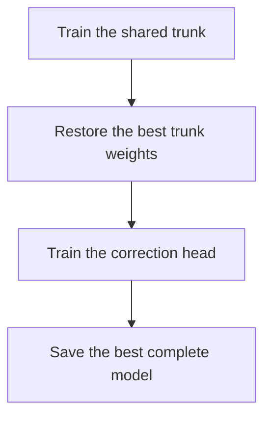
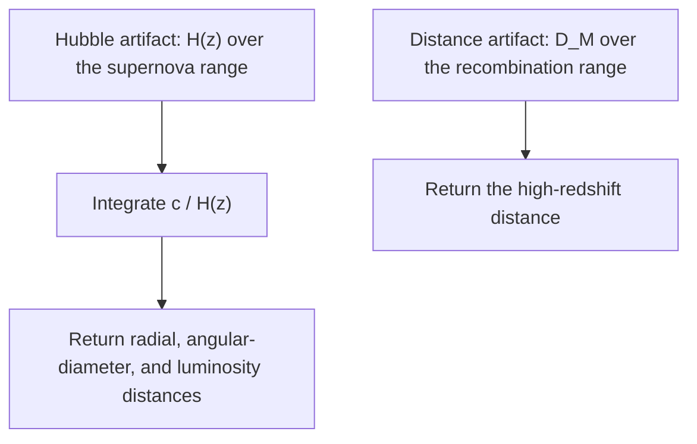
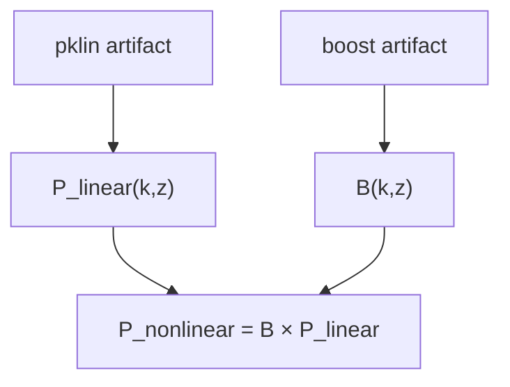
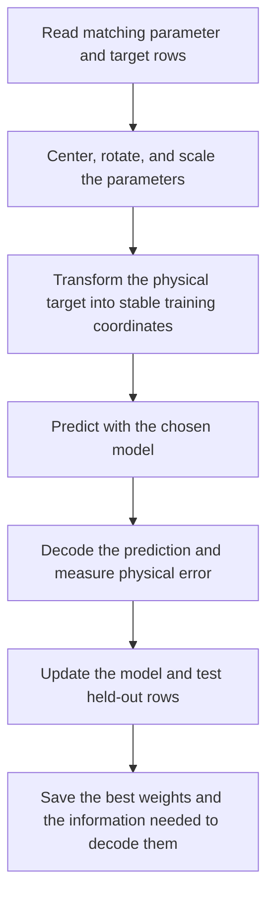

**Warning:** This is the alpha `v0.1` development series. It is not ready for
production inference.

# CoCoA SONIC

**S**imulated **O**bservables for **N**umerical **I**nference in **C**osmology

<p align="center">
  
</p>

CoCoA SONIC fits fast emulators to tables produced by slower cosmology codes.
An emulator is a trained approximation that reproduces an expensive
calculation quickly enough to use inside parameter inference.

Start with one existing training YAML configuration file and one
`*_train_emulator.py` training program.
The five numbered sections below lead to a first saved model. The
[question-led appendices](#faq-appendices) explain the scientific choices and
point to the focused guides that own longer configuration and code material.

Use the folder guide that owns the next task:

| Task | Detailed guide |
|---|---|
| Choose, copy, and edit a training YAML | [`example_yamls/README.md`](example_yamls/README.md) |
| Generate training and validation tables | [`compute_data_vectors/README.md`](compute_data_vectors/README.md) |
| Use saved emulators inside Cobaya | [`cobaya_theory/README.md`](cobaya_theory/README.md) |
| Understand or change the emulator package | [`emulator/README.md`](emulator/README.md) |
| Understand the matter-power starting formulas | [`syren/README.md`](syren/README.md) |
| Use the optional AI development workflow | [`ai/README.md`](ai/README.md) |

## Table of contents

### Main path: get one run working

1. [Install and check the environment](#start-install)
2. [Choose the training program](#start-driver)
3. [Write the smallest useful YAML](#start-yaml)
4. [Run and validate](#start-run)
5. [Read and serve the result](#start-results)

### Common questions raised by developers

- [Appendices about campaigns and GPUs](#appendix-a-running)
  - [How do I run one-off and campaign jobs?](#1-run-it)
  - [How do I define a one-knob sweep?](#sweep-block)
  - [How does multi-GPU packing work?](#multi-gpu)
  - [Which driver belongs to each family?](#drivers-table)
- [Appendices about YAML and model settings](#appendix-b-yaml)
  - [What does a complete YAML contain?](#2-the-yaml-file)
  - [What belongs in `data`?](#3-data)
  - [How do I choose the objective and training controls?](#5-loss)
  - [How do I choose MLP, CNN, or transformer models?](#10-model)
  - [How do I add a PCE base?](#12-pce)
  - [How do I fine-tune or transfer from a saved emulator?](#13-starting-from-a-saved-emulator-fine-tuning--transfer)
- [Appendices about physical families and generating their training data](#appendix-c-families)
  - [How do scalar emulators work?](#14-scalar-derived-parameter-emulators)
  - [How do CMB emulators work?](#15-emulating-cmb-spectra-tt--te--ee--phi-phi)
  - [How do background emulators work?](#16-emulating-the-expansion-history-hz-bao-and-sn-distances)
  - [How do matter-power emulators work?](#17-emulating-the-matter-power-spectrum-hybrid-inference-emul2)
  - [How do I generate the training set?](#18-generating-the-training-set)
- [Appendices about scientific concepts, implementation, and saved artifacts](#appendix-d-concepts)
  - [What scientific problem does the emulator solve?](#conceptual-overview)
  - [How does the pipeline transform files into a saved emulator?](#19-appendix-the-pipeline)
  - [Why is the metric a Mahalanobis chi-square?](#20-appendix-the-chi2-metric-mahalanobis)
  - [What do the activation functions do?](#21-appendix-activation-functions)
  - [Which setting wins when controls collide?](#22-appendix-precedence-when-settings-collide)
  - [How do I script a saved emulator without Cobaya?](#23-appendix-scripting-a-saved-emulator-without-cobaya)
- [Appendices about AI-assisted development](#appendix-e-ai)
  - [How does this repository use AI sessions?](#24-ai-usage)

---

## 1. Install and check the environment <a id="start-install"></a>

CoCoA SONIC normally lives inside a CoCoA installation at
`$ROOTDIR/external_modules/code/emulators_code_v2`. Follow the
[official CoCoA README](https://github.com/CosmoLike/cocoa/blob/main/README.md)
to install, compile, and start CoCoA. Use its instructions to activate the
environment and run `start_cocoa.sh`.

After completing those instructions, `$ROOTDIR` is the top-level CoCoA folder.
Set `D` to this repository and print the options for one training program:

```bash
cd "$ROOTDIR"
D="$ROOTDIR/external_modules/code/emulators_code_v2"
python "$D/cosmic_shear_train_emulator.py" --help
```

The cosmic-shear path also needs the compiled CoCoA/CosmoLike installation.
`--root` selects the project, while the YAML names the CosmoLike dataset files.
Scalar, CMB, background, and matter-power training consume generated tables
directly. CUDA is recommended for full training; validation and many
documentation checks run on CPU.

## 2. Choose the training program <a id="start-driver"></a>

A **driver** is a Python program that trains an emulator. A **family** is one
kind of physical output, such as a CMB spectrum or a matter-power surface.
Choose the row that matches the output in the training files. Each family also
has programs for training-size comparisons, one-setting comparisons, and
automatic searches.

| Goal | Required `data` key | One-run driver |
|---|---|---|
| Cosmic shear / CosmoLike vector | CosmoLike dataset keys | `cosmic_shear_train_emulator.py` |
| Named scalar outputs | `outputs` | `scalar_train_emulator.py` |
| TT, TE, EE, or lensing-potential spectrum | `cmb` | `cmb_train_emulator.py` |
| $H(z)$ or a distance function | `grid` | `baosn_train_emulator.py` |
| $P(k,z)$ or nonlinear boost | `grid2d` | `mps_train_emulator.py` |

The complete command matrix is in
[FAQ A4](#drivers-table). The family-specific input definitions are in
[Appendix C](#appendix-c-families).

## 3. Write the smallest useful YAML <a id="start-yaml"></a>

Copy the closest file from [`example_yamls/`](example_yamls/) into the folder
you will pass as `--fileroot`. Every basic one-run file begins with these two
top-level blocks:

```yaml
data:
  train_dv:     w0wa_takahashi_dvs_train_cs_16.npy
  train_params: w0wa_takahashi_params_train_cs_16.1.txt
  train_covmat: w0wa_takahashi_params_train_cs_16.covmat
  val_dv:       w0wa_takahashi_dvs_train_cs_8.npy
  val_params:   w0wa_takahashi_params_train_cs_8.1.txt
  cosmolike_data_dir: lsst_y1
  cosmolike_dataset:  lsst_y1_M1_GGL0.05.dataset
  param_cuts:
    omegabh2_hi: 0.035
  n_train: 25000
  n_val:   5000
  split_seed: 0

train_args:
  nepochs: 1600
  bs: 256
  loss:
    mode: sqrt
  model:
    name: resmlp
    mlp:
      width: 128
      n_blocks: 4
```

The file names and family sub-block change with the chosen training program.
Each block accepts a fixed list of keys. The program stops at startup if it
finds an unknown key or an incompatible combination. The complete editing reference is
[`example_yamls/README.md`](example_yamls/README.md).

### Linear maps <a id="start-linear"></a>

A linear map is not a standalone model choice. Every model uses learned linear
layers. The `model.mlp` block controls the shared dense part of the model. A
drawing and a fuller explanation are in
[the package model guide](emulator/README.md#faq-model-a1-residual-trunk).

### Residual blocks <a id="start-residual"></a>

Residual blocks let a model learn a correction while preserving the values
that entered the block. Set their number with `model.mlp.n_blocks`. A value of
`0` keeps only the input and output layers; a positive value adds that many
residual blocks between them. The block layout is explained in
[the package model guide](emulator/README.md#faq-model-a1-residual-trunk).

### MLP: `resmlp` <a id="start-mlp"></a>

Use the dense residual trunk by itself for the smallest baseline:

```yaml
train_args:
  model:
    name: resmlp
    mlp:
      width: 128
      n_blocks: 4
```

See the full
[residual-trunk explanation](emulator/README.md#faq-model-a1-residual-trunk).

### CNN correction head: `rescnn` <a id="start-cnn"></a>

Use a convolutional correction when neighboring output coordinates follow a
known physical order:

```yaml
train_args:
  model:
    name: rescnn
    mlp:
      width: 128
      n_blocks: 4
    cnn:
      kernel_size: 11
      n_blocks: 1
      gate_init: 0.1
```

The head's locality, grouping, and remaining switches are in
[the CNN-head explanation](emulator/README.md#faq-model-a3-cnn-head).

### Transformer correction head: `restrf` <a id="start-trf"></a>

Use attention when separated bins or tokens must exchange information:

```yaml
train_args:
  model:
    name: restrf
    mlp:
      width: 128
      n_blocks: 4
    trf:
      n_heads: 2
      n_blocks: 1
      n_mlp_blocks: 2
      gate_init: 0.1
```

Token construction and divisibility rules are in
[the transformer-head explanation](emulator/README.md#faq-model-a4-transformer-head).

### Polynomial base plus neural refiner: `pce` <a id="start-pce"></a>

Add `pce` beside `data` and `train_args` to fit a deterministic polynomial
base before training the chosen neural model as a refiner:

```yaml
pce:
  form: residual
```

The allowed families, ratio/residual rule, fit controls, and exclusions are in
[the PCE YAML guide](example_yamls/README.md#faq-c4-pce).

## 4. Run and validate <a id="start-run"></a>

Run from `$ROOTDIR`. `--root` names the project and its `chains/` output
folder. `--fileroot` normally names the folder holding the YAML, and `--yaml`
is normally a bare filename there; `--yaml` may instead be an absolute path:

```bash
python "$D/cosmic_shear_train_emulator.py" \
  --root projects/lsst_y1/ \
  --fileroot emulators/training_scripts/ \
  --yaml cosmic_shear_train_emulator.yaml \
  --diagnostic diagnostic
```

Treat startup validation errors as configuration failures; do not continue
with partially matched files. During training, inspect the loaded training and
validation row counts, validation loss, and `frac>0.2`. Here, `frac>0.2` is the
fraction of held-out rows whose \(\Delta\chi^2\) error exceeds 0.2.

`--diagnostic NAME` writes a multipage PDF for a one-run driver. Full-size
matter-power diagnostics have an additional computer-RAM warning documented in
[FAQ A1.2](#one-training-run).

## 5. Read and serve the result <a id="start-results"></a>

A successful run chooses one shared base filename under `--root/chains` and
writes two files with that name. Keep the `.h5` and `.emul` files together.
The `.emul` file holds the best saved model weights. The `.h5` file records the
input parameter names, output coordinates, numerical conversions, training
history, and settings needed to load the model correctly.

- To serve it inside Cobaya, copy the theory pattern from
  [FAQ A1.3](#run-the-saved-emulator-in-a-cobaya-mcmc).
- To call it directly from Python, use
  [FAQ D5](#23-appendix-scripting-a-saved-emulator-without-cobaya).
- To compare training sizes, knobs, activations, or Optuna trials, continue
  with [Appendix A](#appendix-a-running).

---

# Common questions raised by developers <a id="faq-appendices"></a>

# Appendices about campaigns and GPUs <a id="appendix-a-running"></a>

## FAQ A1. How do I run one-off and campaign jobs? <a id="1-run-it"></a>

### FAQ A1.1. Where does it run and what do the path flags mean? <a id="setup-where-it-runs-and-the-three-path-flags"></a>

Run every documented training command from `$ROOTDIR`, the top-level CoCoA
folder. The three path options divide the location into visible pieces:

| Option | Meaning |
|---|---|
| `--root` | The project folder below `$ROOTDIR`; its generated arrays and saved artifacts live under `chains/`. |
| `--fileroot` | The folder below that project that contains the editable trainer YAML. |
| `--yaml` | Normally the YAML filename below `--fileroot`; the one-run trainer also accepts an absolute YAML path. |

The complete rules for training arrays, CosmoLike files, and supporting CMB,
background, and matter-power files are in
[the YAML path guide](example_yamls/README.md#faq-d1-paths).

### FAQ A1.2. When should I avoid `--diagnostic`? <a id="one-training-run"></a>

[Run and validate](#start-run) gives the ordinary one-training command.
Adding `--diagnostic NAME` writes a multipage accuracy PDF.

Omit this option for a full-size matter-power run. Its local-linear comparison
fits a simple linear approximation using 40 nearby training cosmologies for
every validation cosmology and output coordinate. At the documented width of
24,522 outputs, gathering those neighbors uses about 3.9 MB per validation row
before the other arrays and least-squares workspace. Ten thousand validation
rows would require about 39 GB of computer RAM for this array alone.

The diagnostics implementation is mapped in the optional
[Python code reference](emulator/CODE_REFERENCE.md#apx-diagnostics). A completed
training writes the matching `.h5` and `.emul` files explained in
[the saved-file guide](cobaya_theory/README.md#faq-a1).

### FAQ A1.3. How do I run the saved emulator in a Cobaya MCMC? <a id="run-the-saved-emulator-in-a-cobaya-mcmc"></a>

Start with the dedicated
[guide to saved emulators in Cobaya](cobaya_theory/README.md). It explains
what an adapter is, how to choose one, how to copy and edit the supplied
Cobaya YAML, and how to check the saved files.

Use this order:

1. Run Cobaya's setup-only check.
2. Evaluate one chosen parameter point.
3. Compare the emulator with held-out validation rows.
4. Only then follow the
   [evaluate-to-MCMC procedure](cobaya_theory/README.md#faq-b8).

The [adapter chooser](cobaya_theory/README.md#choose-adapter) covers cosmic
shear, scalar values, CMB spectra, background quantities, and matter power.
The advanced five-artifact configuration is explained in
[the EMUL2 appendix](cobaya_theory/README.md#faq-c6).

### FAQ A1.4. How do I measure an `N_train` learning curve? <a id="the-n_train-learning-curve"></a>

This driver measures how accuracy changes as the training set grows. It
retrains the same model at several training-set sizes and plots `frac>0.2`
against $N_{\rm train}$. This fraction is the share of held-out rows whose
\(\Delta\chi^2\) error exceeds 0.2. [FAQ D2](#20-appendix-the-chi2-metric-mahalanobis)
defines \(\Delta\chi^2\).

A curve that is still falling at the largest training set says more data may
help. A flat tail points to model capacity instead.

Every sweep point is an independent training, so the driver assigns one
complete training to each GPU. It uses all visible GPUs by default. See
[Multi-GPU execution and packing](#multi-gpu).

```bash
python $D/cosmic_shear_sweep_ntrain_emulator.py \
  --root projects/lsst_y1/ --fileroot emulators/training_scripts/ \
  --yaml cosmic_shear_train_emulator.yaml --n-points 8 --out curve
```

### FAQ A1.5. How do I sweep one knob? <a id="a-one-knob-sweep"></a>

A sweep trains the same model once for every listed value of one setting. Add
a top-level `sweep:` block by following
[the sweep-versus-tuning guide](example_yamls/README.md#faq-c1-sweep-tune),
then run:

```bash
python "$D/cosmic_shear_sweep_hyperparam_emulator.py" \
  --root projects/lsst_y1/ --fileroot emulators/training_scripts/ \
  --yaml cosmic_shear_train_emulator.yaml --out lrsweep
```

### FAQ A1.6. How do I search several hyperparameters? <a id="a-hyperparameter-search"></a>

Tuning asks Optuna, an automatic settings-search package, to choose several
numeric values. The YAML marks only the searched values; ordinary training
still uses each marked value's first entry. Follow
[the sweep-versus-tuning guide](example_yamls/README.md#faq-c1-sweep-tune)
to write those ranges. `--n-trials` limits how many combinations it tries:

```bash
python "$D/cosmic_shear_tune_emulator.py" \
  --root projects/lsst_y1/ --fileroot emulators/training_scripts/ \
  --yaml cosmic_shear_tune_emulator.yaml --n-trials 64
```

### FAQ A1.7. How do I compare activation families? <a id="the-activation-bake-off"></a>

This driver trains the same model once per activation family over a grid of
training sizes, then overlays the learning curves. One family is more
sample-efficient across this grid when its error curve is lower at every
compared training size. Crossing curves give a ranking that depends on the
training-set size. Coincident curves indicate a tie.

```bash
python $D/cosmic_shear_bakeoff_activation_emulator.py \
  --root projects/lsst_y1/ --fileroot emulators/training_scripts/ \
  --yaml cosmic_shear_train_emulator.yaml --out bakeoff
```

The multi-GPU bake-off can wait forever if one parallel training process stops
before reporting a result. Run this command under an external job timeout.
Missing progress from any process means that run and its output table failed.

### FAQ A1.8. How do I pack runs onto one large GPU? <a id="packing-runs-on-one-big-card"></a>

Add `--gpu-pack` to a training-size or one-setting sweep only when several
small runs fit on one large card. Packing is off by default and makes the
individual timings less comparable. [FAQ A3](#multi-gpu) gives the sharing
thresholds and scheduling rules.

### FAQ A1.9. Where do I go after the first command? <a id="where-next"></a>

Use the focused YAML guide to
[choose a starting file](example_yamls/README.md#choose-file),
[edit the copy in a fixed order](example_yamls/README.md#edit-file), and
[understand the top-level blocks](example_yamls/README.md#faq-a2-blocks).
Use [Appendix C](#appendix-c-families) for physical-family rules and
[`emulator/README.md`](emulator/README.md) for the implementation.

### FAQ A2. How do I define the one-knob `sweep:` block? <a name="sweep-block"></a>

The block names one setting below `train_args` by its dotted path and lists
the values to try. Each value receives one complete training at the same
`N_train`.

```yaml
sweep:
  parameter: lr.lr_base
  values:
    - 0.0010
    - 0.0025
    - 0.0063
```

The canonical syntax, legal paths, word-valued results, output tables, and
difference from Optuna tuning are in
[the specialized sweep guide](example_yamls/README.md#faq-c1-sweep-tune).

### FAQ A3. How do multi-GPU execution and packing work? <a name="multi-gpu"></a>

Campaign programs use all visible CUDA devices by default. Use `--n-gpus` to
set a smaller limit. A single GPU or Apple MPS runs one training at a time.
With several GPUs, each parallel process owns one complete training.

| Driver | Jobs | Split across GPUs | Extra flags |
|---|---|---|---|
| `sweep_ntrain` | one training per `N_train` | largest training set first, then the next free GPU | `--gpu-pack` |
| `sweep_hyperparam` | one training per value | GPUs take turns receiving values | `--gpu-pack` |
| `bakeoff_activation` | one learning curve per activation | by activation | |
| `tune` | one automatic-search trial at a time | one process per GPU, all contributing to one search | `--journal` |

#### GPU packing with `--gpu-pack`

`--gpu-pack` lets several small trainings share one large GPU. It is off by
default. The program estimates how much GPU memory each run needs and leaves a
large run alone.

Use packing only when small runs leave most of a large card unused. Leave it
off when timings must be directly comparable, because sharing makes each
individual run slower and noisier.

#### Parallel Optuna

Optuna is the package that chooses settings for an automatic search. It calls
the complete collection of tried settings a **study**. With several GPUs, all
processes contribute to the same study. `--journal FILE` saves that shared
record on disk, and using the same file again resumes it.

Check the logs and the number of completed trials to confirm that a new run did
work. The best trial may still be an older one if none of the new trials was
better.

### FAQ A4. Which driver belongs to each family? <a name="drivers-table"></a>

Use the [driver chooser](example_yamls/README.md#choose-file) to match a
physical result, trainer YAML, and one-run program. Training-size sweeps,
one-setting sweeps, and tuning use the same family prefix: `scalar`, `cmb`,
`baosn`, or `mps`. The complete code-level driver index is in the optional
[Python code reference](emulator/CODE_REFERENCE.md#apx-drivers).

The non-cosmic-shear training-size programs may omit `param_cuts`. When cuts
are present, the same named-column rules choose which rows are allowed and
determine the largest permitted training size. The YAML guide explains the
[cut keys and row order](example_yamls/README.md#faq-e1-data-selection).

---

# Appendices about YAML and model settings <a id="appendix-b-yaml"></a>

The main guide shows the smallest useful training file. This appendix is a
chooser: it explains what each group of settings controls and points to the
guide that owns the full syntax.

## FAQ B1. What does a complete YAML file contain? <a id="2-the-yaml-file"></a>

An ordinary one-run file has two required top-level blocks:

- `data` selects the training and validation rows.
- `train_args` selects the training method and model.

Some jobs add one top-level block beside them:

| Optional block | Purpose |
|---|---|
| `sweep` | Repeat one training with several values of one setting. |
| `pce` | Fit a polynomial base before the neural model. |
| `transfer` | Reuse part of a compatible saved emulator. |

A tuning file may replace a number below `train_args` with
`[default, minimum, maximum, kind]`. Only a `*_tune_emulator.py` program
searches those ranges. Other programs use the first value. A range is not
valid in `data`, `pce`, `transfer`, or `sweep`.

Use the dedicated YAML guide to
[choose a template](example_yamls/README.md#choose-file),
[edit it in a safe order](example_yamls/README.md#edit-file), and
[check every supported block](example_yamls/README.md#faq-a2-blocks).

## FAQ B2. What belongs in `data`? <a id="3-data"></a>

The `data` block answers three questions: which files contain the physical
results and parameters, how many rows belong to training and validation, and
whether this physical family needs an extra grid, covariance, or output list.

The common filenames are `train_dv`, `train_params`, `train_covmat`,
`val_dv`, and `val_params`. Relative names for these files are read from
`$ROOTDIR/<project>/chains`, where `<project>` is the value passed to
`--root`. Row order must match across every partner file.

`n_train` and `n_val` are row counts. `split_seed` makes row selection
repeatable. `ram_frac` limits how much available computer RAM may hold the
selected arrays. Cosmic-shear configurations may also use `param_cuts`;
those cuts are applied before rows are selected.

The full key table, family blocks, cuts, paths, and examples are in
[the data-selection appendix](example_yamls/README.md#faq-e1-data-selection)
and [path appendix](example_yamls/README.md#faq-d1-paths). Instructions for
creating training and validation files are in
[the data-generation guide](compute_data_vectors/README.md).

## FAQ B3. Which training globals control a run? <a id="4-training-globals"></a>

These settings live directly below `train_args`:

| Setting | Plain-language meaning |
|---|---|
| `nepochs` | Maximum number of complete passes through the training rows. |
| `bs` | Number of rows used in one parameter update. |
| `silent` | Hide per-epoch progress when true. |
| `clip` | Limit an unusually large gradient; zero disables the limit. |
| `rewind` | After a learning-rate reduction, return to the best saved training state. |
| `trunk_epochs`, `freeze_trunk` | Select the two-phase schedule in [FAQ B10](#11-two-phase-schedule--the-trunk--head-blocks). |

The complete option table and copyable YAML are in
[the run-controls appendix](example_yamls/README.md#faq-e2-run-controls).

## FAQ B4. How do I choose `loss`? <a id="5-loss"></a>

The loss tells training how strongly to respond to each row's prediction
error. Start with `mode: sqrt`, which reduces the influence of the largest
errors. Use `chi2` only when those rows should receive much stronger
influence.

The three additional modes provide smoother or intermediate choices.
[FAQ D2](#20-appendix-the-chi2-metric-mahalanobis) explains the
underlying scientific error.

See the YAML guide for
[loss syntax and examples](example_yamls/README.md#faq-e3-loss), and the
package guide for
[how loss, trimming, and weights combine](emulator/README.md#faq-training-a1-loss-transforms).

## FAQ B5. How do optimizer, learning rate, and scheduler fit together? <a id="6-optimizer-lr-scheduler"></a>

| Block | Question answered |
|---|---|
| `optimizer` | How are gradients converted into parameter updates? |
| `lr` | What learning rate is used at the start, and how is it bounded? |
| `scheduler` | When should the learning rate become smaller? |

The default optimizer is AdamW. Weight decay applies only to the `.weight`
arrays of learned linear and convolutional layers. Biases, normalization
settings, and activation settings are not decayed. A plateau scheduler watches
the raw median error across held-out validation rows and reduces the learning
rate after the configured patience.

See the YAML guide for
[accepted keys and examples](example_yamls/README.md#faq-e4-parameter-updates)
and the package guide for
[the update order](emulator/README.md#faq-training-a2-parameter-updates).

## FAQ B6. When should I use `trim`? <a id="7-trim"></a>

Trimming temporarily removes a chosen fraction of the largest row errors
before averaging one update. It can stop a few extreme rows from dominating
early training, but it also discards information. Start without it unless
held-out validation shows a clear heavy tail.

The keys and schedule are in
[the trim, focus, and EMA appendix](example_yamls/README.md#faq-e5-trim-focus-ema).

## FAQ B7. When should I use `focus`? <a id="8-focus"></a>

Focus keeps every selected row but smoothly gives more influence to difficult
rows. For row error \(c\), its hardness is \(c/(c+\mathtt{kappa})\); `kappa`
is the error where that hardness equals one half. The scheduled focus exponent
controls how strongly hardness changes the row weight. Unlike trimming, focus
does not remove rows.

See [the trim, focus, and EMA appendix](example_yamls/README.md#faq-e5-trim-focus-ema).

## FAQ B8. How does `ema` stabilize evaluation? <a id="9-ema"></a>

An exponential moving average (EMA) keeps a slowly changing copy of the model
weights. Validation and the final best model may use this smoother copy,
reducing small epoch-to-epoch fluctuations. EMA does not add training data or
repair a poor model choice.

See [the trim, focus, and EMA appendix](example_yamls/README.md#faq-e5-trim-focus-ema).

## FAQ B9. How do I choose and configure `model`? <a id="10-model"></a>

Start with the smallest model that respects the output structure:

| `model.name` | Structure used | Good first use |
|---|---|---|
| `resmlp` | Dense residual network | Baseline for every family. |
| `rescnn` | The same trunk plus a local convolutional correction | Neighboring output coordinates follow a known physical order. |
| `restrf` | The same trunk plus an attention correction | Separated bins or tokens must exchange information. |

A residual block learns a correction while retaining an unchanged skip path.
The shared `mlp` block sets width and depth. A `cnn` or `trf` block
configures only its matching correction head. Startup validation rejects a
head that cannot map the chosen physical output back to physical coordinates.

See the YAML guide for
[copyable model settings](example_yamls/README.md#faq-e6-model-settings) and
the package guide for
[drawings and explanations](emulator/README.md#faq-model-a1-residual-trunk).

## FAQ B10. How does the two-phase `trunk` / `head` schedule work? <a id="11-two-phase-schedule--the-trunk--head-blocks"></a>

A `rescnn` or `restrf` model can be trained in two stages:



`trunk_epochs` limits the first stage. A `trunk:` block may give that
stage its own settings; a `head:` block may do the same for the second.
`freeze_trunk: true` prevents trunk changes during the head stage.
A `resmlp` has no separate head, so phase blocks do not create a hidden
second model.

See the YAML guide for
[the complete example](example_yamls/README.md#faq-e7-two-phase-training) and
the package guide for
[what is restored and saved](emulator/README.md#faq-training-a4-two-phase-training).

## FAQ B11. How do I add a polynomial `pce` base? <a id="12-pce"></a>

A polynomial chaos expansion (PCE) fits a deterministic polynomial
approximation first. The neural model then learns an allowed residual or ratio
correction.

```yaml
pce:
  form: residual
```

The valid order, interaction order, fit mode, target form, and physical-family
combinations are checked at startup. Matter-power runs may also use the Syren
starting formulas described in [`syren/README.md`](syren/README.md).

See the YAML guide for
[the PCE block and restrictions](example_yamls/README.md#faq-c4-pce) and the
package guide for
[the polynomial construction](emulator/README.md#faq-model-a5-pce).

## FAQ B12. How do I start from a saved emulator? <a id="13-starting-from-a-saved-emulator-fine-tuning--transfer"></a>

| Operation | What it reuses | Use it when |
|---|---|---|
| Fine-tuning with `train_args.finetune` | A compatible complete model | Input and output meanings remain the same. |
| Transfer with top-level `transfer` | A compatible saved base plus a learned correction | A related data set has compatible physical output meaning. |

The saved metadata must match the required family, parameter order, geometry,
and model configuration. A run stops when a required item differs. Keep the
source `.h5` and `.emul` files together.

See the YAML guide for
[the decision and both forms](example_yamls/README.md#faq-c2-reuse) and the
package guide for
[which learned parts are reused](emulator/README.md#faq-model-a6-reusing-a-saved-model).

---

# Appendices about physical families and generating their training data <a id="appendix-c-families"></a>

The one-run programs share a training engine, but each physical result has a
different output shape and scientific transformation. This appendix keeps the
facts needed to choose a family. Use the focused guides for file generation,
full YAML, saved-model serving, and package internals.

## FAQ C1. How do scalar (derived-parameter) emulators work? <a id="14-scalar-derived-parameter-emulators"></a>

A scalar emulator predicts a small set of named values, such as `H0`,
`omegam`, or `rdrag`. The inputs and outputs are columns of the same
parameter table. `data.outputs` names the output columns; the covariance-file
header names the inputs. A matching `.paramnames` file is required so columns
are selected by name rather than guessed by position.

Each output is shifted and scaled before training because values such as
\(H_0\) and \(\Omega_m\) have very different numerical sizes. The saved
conversion information reverses that transformation when it returns physical
values.

Scalar outputs have no shared angular, multipole, redshift, or wavenumber
axis. The supported neural model is therefore `resmlp`; `rescnn` and
`restrf` are rejected. A residual PCE base and compatible fine-tuning are
supported.

Use:

- [the scalar YAML explanation](example_yamls/README.md#faq-b1-family-blocks)
  to configure training;
- [the scalar adapter guide](cobaya_theory/README.md#faq-b4) to serve named
  values in Cobaya; and
- [the scalar result contract](cobaya_theory/README.md#faq-c2) to understand
  how several scalar artifacts are combined.

## FAQ C2. How do I emulate CMB TT, TE, EE, or φφ spectra? <a id="15-emulating-cmb-spectra-tt--te--ee--phi-phi"></a>

One CMB artifact predicts one angular power spectrum:

| YAML name | Physical result |
|---|---|
| `tt` | Temperature auto-spectrum \(C_\ell^{TT}\) |
| `te` | Temperature and E-mode cross-spectrum \(C_\ell^{TE}\) |
| `ee` | E-mode auto-spectrum \(C_\ell^{EE}\) |
| `pp` | Lensing-potential spectrum \(C_\ell^{\phi\phi}\) |

The training matrix has one cosmology per row and one retained multipole
\(\ell\) per column. The spectrum dump and covariance file must use the same
multipole grid.

The covariance file is calculated once at a chosen reference cosmology. It
provides the positive error scale used to measure residuals at every
multipole. This is separate from generating the many cosmologies in the
training matrix. The equations, experimental noise assumptions, command, and
file checks are in
[the CMB covariance guide](compute_data_vectors/README.md#faq-a5-cmb-covariance).

TT, TE, and EE may remove the leading dependence on primordial amplitude
\(A_s\) and optical depth \(\tau\). For row \(i\),

$$
f_i=\frac{A_{s,\mathrm{ref}}}{A_{s,i}}
    \exp\!\left[2(\tau_i-\tau_\mathrm{ref})\right].
$$

Training encodes \(f_i C_{i\ell}\), while decoding divides by \(f_i\). Set
`amplitude_law: none` to learn the raw spectrum. The optional roughness term
penalizes rapid changes in prediction error along the multipole axis.

`resmlp`, `rescnn`, and `restrf` are supported because multipoles have
a fixed order. A frozen PCE base and frozen-base transfer require
`amplitude_law: none`. Fine-tuning may retain a compatible amplitude law.

Use:

- [the CMB trainer block](example_yamls/README.md#faq-b1-family-blocks) for
  YAML;
- [the generator guide](compute_data_vectors/README.md#faq-a2-physics-families)
  for spectrum tables;
- [the CMB adapter block](cobaya_theory/README.md#faq-b5) for Cobaya; and
- [the returned-spectrum contract](cobaya_theory/README.md#faq-c3) for units,
  requested multipoles, and ownership.

## FAQ C3. How do I emulate H(z), BAO, and supernova distances? <a id="16-emulating-the-expansion-history-hz-bao-and-sn-distances"></a>

This family uses two saved artifacts because it covers two separated redshift
ranges:



Nothing is interpolated across the untrained gap. A query there stops with an
error.

The `Hubble` target uses `log(H + offset)`. The recombination-distance
target uses the raw `none` law. A `rescnn` correction follows neighboring
redshifts; a `restrf` correction divides the redshift grid into attention
tokens. Residual PCE, compatible fine-tuning, and frozen-base transfer are
also supported.

The distance formulas are valid for a flat universe. The stored quantity named
`D_M` is the radial comoving distance \(\chi\), which equals transverse
\(D_M\) only when \(\Omega_k=0\). Verify flatness outside the adapter before
using these artifacts in inference.

Use:

- [the background trainer block](example_yamls/README.md#faq-b1-family-blocks)
  for YAML;
- [the background generator guide](compute_data_vectors/README.md#faq-a2-physics-families)
  for the paired files and redshift grids; and
- [the background adapter guide](cobaya_theory/README.md#faq-c4) for returned
  functions and allowed redshifts.

## FAQ C4. How do I emulate matter power and use hybrid EMUL2 inference? <a id="17-emulating-the-matter-power-spectrum-hybrid-inference-emul2"></a>

Matter-power training predicts a surface over redshift \(z\) and wavenumber
\(k\). The target law chooses what the network learns:

| `law` | Network target |
|---|---|
| `none` | The raw requested surface |
| `syren_linear` | \(\log(P_\mathrm{lin}/P_\mathrm{Syren,lin})\) |
| `syren_halofit` | \(\log(B/B_\mathrm{Syren,halofit})\), where \(B=P_\mathrm{nl}/P_\mathrm{lin}\) |

Two artifacts reconstruct nonlinear matter power:



The Syren formulas are vendored in this repository. Their physical meaning and
three target laws are documented in
[`syren/README.md`](syren/README.md#the-three-target-laws). Retrain a saved
artifact after changing a formula because the artifact records the law name,
not a digest of the implementation.

The \((z,k)\) grids are saved beside the target arrays. `k_stride` may thin
the wavenumber grid while always retaining its upper edge. Low-\(k\) boost
points with no training signal are pinned to the analytic base or stored
constant.

`rescnn` treats redshift slices as channels and moves along \(k\).
`restrf` uses one attention token per redshift slice. PCE is intended only
for small studies here: it materializes the complete thinned target and uses a
dense float64 SVD, which can exceed ordinary GPU memory and computer RAM on
full-size grids.

Use:

- [the matter-power trainer block](example_yamls/README.md#faq-b1-family-blocks)
  for YAML;
- [the matter-power generator guide](compute_data_vectors/README.md#faq-a2-physics-families)
  for surfaces, Syren bases, and grid files;
- [the matter-power adapter guide](cobaya_theory/README.md#faq-c5) for
  \(P(k,z)\) returned to Cobaya; and
- [the EMUL2 guide](cobaya_theory/README.md#faq-c6) when combining
  matter power, background expansion, and `rdrag`.

## FAQ C5. How do I generate a training set? <a id="18-generating-the-training-set"></a>

The programs in `compute_data_vectors/` evaluate CAMB or CosmoLike at many
chosen cosmologies and save the tables consumed by the trainers. This can be
the most expensive step of the workflow.

Follow the dedicated
[data-generation guide](compute_data_vectors/README.md) from the beginning.
It explains the difference between a generator YAML and a trainer YAML,
chooses the correct physics program, runs a small 200-row calculation, checks
every saved file, creates a separate validation set, and then writes the
matching trainer paths.

Before accepting generated files:

1. Use different output names and random seeds for training and validation.
2. Confirm every failure flag is zero. A failed physics calculation may leave
   a zero row that is otherwise indistinguishable from a physical zero.
3. Keep every partner file and coordinate sidecar from the same calculation.
4. Check the sampled region contains the region where the emulator will be
   used.
5. Point the trainer at the files below
   `$ROOTDIR/<project>/chains`.

Resume, append, serial/MPI behavior, memory estimates, output naming, and all
generator command-line options now live only in that focused guide. Start with
[the 200-row example](compute_data_vectors/README.md#run-the-first-200-row-calculation)
before requesting a production data set.

---

# Appendices about scientific concepts, implementation, and saved artifacts <a id="appendix-d-concepts"></a>

## FAQ D0. What scientific problem does the emulator solve? <a id="conceptual-overview"></a>

An **emulator** is a fast fitted approximation to a slower scientific
calculation. One input row describes one cosmology through values such as
\(H_0\), the present expansion rate, and \(\Omega_m\), the present
matter-density fraction. The slow physics code maps that row to a physical
result. CoCoA SONIC learns the same map from many checked examples so an
inference calculation can evaluate it repeatedly.

| Physical family | What one saved artifact predicts |
|---|---|
| Cosmic shear | Kept \(\xi_+\) and \(\xi_-\) angular-correlation values in one ordered data vector |
| Scalar | Named one-number results such as \(H_0\) or \(r_\mathrm{drag}\) |
| Cosmic microwave background | One TT, TE, EE, or lensing-potential spectrum versus multipole \(\ell\) |
| Background expansion | \(H(z)\) or one distance function versus redshift \(z\) |
| Matter power | Linear \(P(k,z)\) or a nonlinear boost over redshift and wavenumber |

Cosmic shear is the weak distortion of galaxy images by foreground matter.
\(\xi_+\) and \(\xi_-\) are its two angular correlation functions. CosmoLike
supplies the entries retained by the likelihood and the covariance
\(\Sigma\), which describes their correlated survey uncertainty.

If \(r\) is prediction minus truth on the retained entries, the score is

$$
\Delta\chi^2=r^{\mathsf T}\Sigma^{-1}r.
$$

This measures emulator error in the same uncertainty units used by inference.
[FAQ D2](#20-appendix-the-chi2-metric-mahalanobis) explains the equation.
The other families reuse the training machinery while defining their own
physical coordinates and error scales.

For the code-level path from files to a saved prediction, continue to
[FAQ D1](#19-appendix-the-pipeline) or open
[the emulator package guide](emulator/README.md#pipeline-overview).

## FAQ D1. How does the pipeline transform files into a saved emulator? <a id="19-appendix-the-pipeline"></a>

One training run performs the following operations:



The centering, rotation, and scaling operation is called **whitening**.
Whitening places correlated inputs and outputs on comparable numerical scales.
The saved conversion information reverses every transformation before a
prediction is returned in physical units.

For cosmic shear, the physical error is

$$
\Delta\chi^2=r^{\mathsf T}\Sigma^{-1}r,
$$

where \(r\) is prediction minus truth and \(\Sigma\) is the analysis
covariance. Other families define a matching error for their physical output
while reusing the same row-selection, training, and saving process.

The package may keep selected target rows in memory or use a NumPy memory map,
which reads needed parts of a disk file without loading the entire file. It
may likewise keep converted batches on a GPU or transfer one group at a time.
These storage choices change speed and memory use, not the selected rows or
scientific transformation.

The [emulator package guide](emulator/README.md#pipeline-overview) explains the
model and training process in smaller steps. The optional
[code reference](emulator/CODE_REFERENCE.md) maps implementation tasks to
files and functions. Continue here for the scientific metric and activation
equations.

## FAQ D2. Why is the accuracy metric a Mahalanobis chi-square? <a id="20-appendix-the-chi2-metric-mahalanobis"></a>

Every loss mode begins with a per-sample training score. This score is normally
the chi-square $c$. With CMB `loss.roughness`, the score is
$c + \lambda c_{\rm rough}$.

The transform $L$ selected in FAQ B4 acts on that training score. Evaluation
reports statistics of the untransformed $c$ and excludes the roughness term.

This chi-square is a squared Mahalanobis distance: prediction minus truth is
measured in the uncertainty units and correlations of the data. For
`r = pred − truth`,

```
   d²  =  rᵀ · C⁻¹ · r          C = data covariance,  C⁻¹ = precision (Cinv)
```

The program reports this value as chi-square.

| | formula | what it does |
|---|---|---|
| plain Euclidean | `rᵀ r = Σ rᵢ²` | every entry counts equally |
| Mahalanobis | `rᵀ C⁻¹ r` | each residual direction is measured in units of its uncertainty, with correlations included |

Two special cases make the definition concrete:

- For diagonal `C`, its entries are variances σᵢ² and the off-diagonal
  correlations are zero.
  In this case, `d² = Σ (rᵢ / σᵢ)²`, a sum of squared z-scores. A 1-unit
  error on a tight bin with small σ costs far more than the same error on a
  loose bin.
- For `C = I`, every σ is one and the Mahalanobis and Euclidean formulas
  coincide.

Full covariance whitening changes coordinates so the covariance becomes the
identity. In that basis, Mahalanobis distance is an ordinary Euclidean norm:

```
   rᵀ · C⁻¹ · r   =   ‖ whiten(r) ‖²
```

This is the “whiten the output, keep the metric” operation in the pipeline above.
The network receives targets in the whitened basis. The selected loss applies
$L$ to the training score defined above.

Full whitening makes the squared whitened residual and physical chi-square
equal apart from floating-point rounding when the score is the plain $c$.
`DiagonalGeometry` scales coordinates independently and may retain
correlations, so its loss keeps the explicit `Cinv` contraction.

---

## FAQ D3. What do the activation functions do? <a id="21-appendix-activation-functions"></a>

An activation function is the nonlinear curve applied between learned linear
layers. In a residual block, the default \(H\) activation learns a separate
shape for each hidden feature:

$$
H(x)=\left[\gamma+(1-\gamma)\sigma(\beta x)\right]x,
$$

where \(\sigma\) is the logistic sigmoid. It begins at \(H(x)=x/2\) and can
learn different left- and right-side behavior while retaining nonzero tail
gradients.

| YAML name | What changes |
|---|---|
| <code>H</code> | One learnable sigmoid gate per feature; the default |
| <code>multigate</code> | Several sigmoid transitions control the central slopes |
| <code>power</code> | A bounded learnable exponent changes the tails |
| <code>gated_power</code> | Combines the multi-gate center with the bounded power tail |
| <code>relu</code> | Parameter-free rectifier |
| <code>tanh</code> | Parameter-free saturating curve; pair it with per-feature normalization |

Choose the shared activation under <code>model.activation</code>. A compatible
correction head may have its own choice. The exact equations, initialization,
parameter counts, normalization choices, and head restrictions are in
[the activation and normalization guide](emulator/README.md#faq-model-a2-activations-and-normalization).
The YAML precedence table explains
[which choice wins](example_yamls/README.md#faq-a4-precedence).

---

## FAQ D4. Which setting wins when controls collide? <a id="22-appendix-precedence-when-settings-collide"></a>

A setting can come from the YAML, a command-line option, a phase-specific
block, or a built-in default. Startup resolves those choices before training
and prints the resulting design.

The most useful rules are:

1. A valid phase-specific value applies during that phase instead of its
   top-level counterpart.
2. An explicit correction-head activation applies only to that head; the
   shared activation controls the trunk.
3. A sweep value or tuning suggestion replaces the chosen baseline value for
   that run.
4. Explicit device and driver choices replace automatic choices.
5. A combination that would be ignored or has no scientific meaning stops at
   startup instead of silently choosing a value.

The full tables, examples, two-phase cases, loss spellings, and fixed settings
are maintained in
[the YAML precedence guide](example_yamls/README.md#faq-a4-precedence).
Consult that guide when two controls appear to set the same behavior.

## FAQ D5. How do I script a saved emulator without Cobaya? <a id="23-appendix-scripting-a-saved-emulator-without-cobaya"></a>

A saved emulator has two supported entrances:

- Use its Cobaya adapter when a likelihood or sampler needs the prediction.
- Use `EmulatorPredictor` when a Python script needs one point, a profile,
  a plot, or a batch of checks.

Both entrances use the same saved model and scientific decoding. The complete
direct-Python guide now lives in
[FAQ D5 of `cobaya_theory/README.md`](cobaya_theory/README.md#faq-d5).
It includes a runnable CPU example, the return form for every physical family,
background-distance helpers, profile calculations, and the current saved-file
version rule.

---

# Appendices about AI-assisted development <a id="appendix-e-ai"></a>

## FAQ E1. How does this repository use AI sessions? <a id="24-ai-usage"></a>

Ordinary installation, training, and inference do not require the AI
development tools.

The optional workflow separates planning and review from implementation so a
capable, less expensive model can perform the token-heavy coding work from
detailed instructions. The user communicates with the Architect, which owns
the final GO or NO-GO decision. A Red Team review can be enabled when an
independent check is useful.

Start with [`ai/README.md`](ai/README.md) for the reason behind the roles and
one first ticket. Use [`ai/tools/README.md`](ai/tools/README.md) for commands
and [`ai/gates/README.md`](ai/gates/README.md) for the checks that decide
whether a change is ready.
