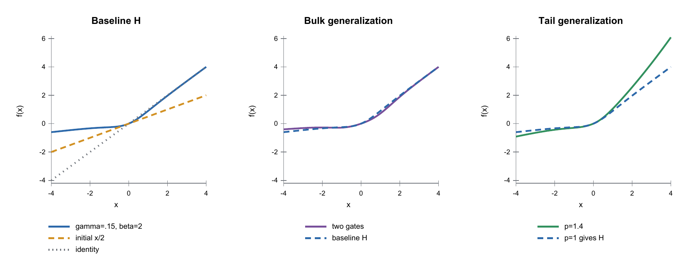
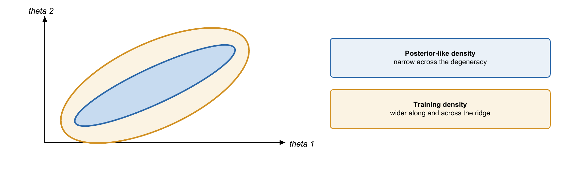
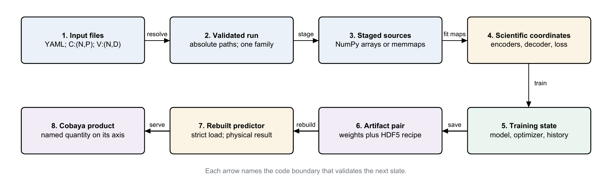

**Warning:** This is the alpha `v0.1` development series. It is not ready for
production inference.

# CoCoA SONIC

**S**imulated **O**bservables for **N**umerical **I**nference in **C**osmology

<p align="center">
  
</p>

CoCoA SONIC fits fast emulators to tables produced by slower cosmology codes.
An emulator is a trained approximation that reproduces an expensive
calculation quickly enough to use inside parameter inference.
Start with one existing training YAML configuration file and one
`*_train_emulator.py` driver.
The detailed mathematics, campaign tools, family guides, and implementation
diagrams are retained in the [question-led appendices](#faq-appendices).

The package layout and change-to-file guide live in
[`emulator/README.md`](emulator/README.md).

## Table of contents

### Main path: get one run working

1. [Install and check the environment](#start-install)
2. [Choose the driver](#start-driver)
3. [Write the smallest useful YAML](#start-yaml)
4. [Run and validate](#start-run)
5. [Read and serve the result](#start-results)

### Common questions raised by developers

- [Appendices about campaigns and GPUs](#appendix-a-running)
  - [How do I run one-off and campaign jobs?](#1-run-it)
  - [How do I define a one-knob sweep?](#sweep-block)
  - [How does multi-GPU packing work?](#multi-gpu)
  - [Which driver belongs to each family?](#drivers-table)
- [Appendices about YAML and model settings](#appendix-b-yaml)
  - [What does a complete YAML contain?](#2-the-yaml-file)
  - [What belongs in `data`?](#3-data)
  - [How do I choose the objective and training controls?](#5-loss)
  - [How do I choose MLP, CNN, or transformer models?](#10-model)
  - [How do I add a PCE base?](#12-pce)
  - [How do I fine-tune or transfer from a saved artifact?](#13-starting-from-a-saved-emulator-fine-tuning--transfer)
- [Appendices about physical families and generating their training data](#appendix-c-families)
  - [How do scalar emulators work?](#14-scalar-derived-parameter-emulators)
  - [How do CMB emulators work?](#15-emulating-cmb-spectra-tt--te--ee--phi-phi)
  - [How do background emulators work?](#16-emulating-the-expansion-history-hz-bao-and-sn-distances)
  - [How do matter-power emulators work?](#17-emulating-the-matter-power-spectrum-hybrid-inference-emul2)
  - [How do I generate the training set?](#18-generating-the-training-set)
- [Appendices about scientific concepts, implementation, and saved artifacts](#appendix-d-concepts)
  - [What scientific problem does the emulator solve?](#conceptual-overview)
  - [How does the pipeline transform the files?](#19-appendix-the-pipeline)
  - [Why is the metric a Mahalanobis chi-square?](#20-appendix-the-chi2-metric-mahalanobis)
  - [What do the activation functions do?](#21-appendix-activation-functions)
  - [Which setting wins when controls collide?](#22-appendix-precedence-when-settings-collide)
  - [How do I script a saved emulator without Cobaya?](#23-appendix-scripting-a-saved-emulator-without-cobaya)
- [Appendices about AI-assisted development](#appendix-e-ai)
  - [How does this repository use AI sessions?](#24-ai-usage)

---

## 1. Install and check the environment <a id="start-install"></a>

CoCoA SONIC normally lives inside a CoCoA installation at
`$ROOTDIR/external_modules/code/emulators_code_v2`. Follow the
[official CoCoA README](https://github.com/CosmoLike/cocoa/blob/main/README.md)
to install, compile, and start CoCoA. Use its instructions to activate the
environment and run `start_cocoa.sh`.

After completing those instructions, `$ROOTDIR` is the top-level CoCoA folder.
This CoCoA SONIC-specific check prints the options for one training program:

```bash
cd "$ROOTDIR"
python external_modules/code/emulators_code_v2/cosmic_shear_train_emulator.py --help
```

The cosmic-shear path also needs the compiled CoCoA/CosmoLike installation.
`--root` selects the project, while the YAML names the CosmoLike dataset files.
Scalar, CMB, background, and matter-power training consume generated tables
directly. CUDA is recommended for full training; validation and many
documentation checks run on CPU.

## 2. Choose the driver <a id="start-driver"></a>

Choose the row that matches the observable in your training files. Each family
also has `sweep_ntrain`, `sweep_hyperparam`, and `tune` siblings.

| Goal | Required `data` key | One-run driver |
|---|---|---|
| Cosmic shear / CosmoLike vector | CosmoLike dataset keys | `cosmic_shear_train_emulator.py` |
| Named scalar outputs | `outputs` | `scalar_train_emulator.py` |
| TT, TE, EE, or lensing-potential spectrum | `cmb` | `cmb_train_emulator.py` |
| $H(z)$ or a distance function | `grid` | `baosn_train_emulator.py` |
| $P(k,z)$ or nonlinear boost | `grid2d` | `mps_train_emulator.py` |

The complete command matrix is in
[FAQ A4](#drivers-table). The family-specific input definitions are in
[Appendix C](#appendix-c-families).

## 3. Write the smallest useful YAML <a id="start-yaml"></a>

Copy the closest file from [`example_yamls/`](example_yamls/) into the folder
you will pass as `--fileroot`. Every basic one-run file begins with these two
top-level blocks:

```yaml
data:
  train_dv:     w0wa_takahashi_dvs_train_cs_16.npy
  train_params: w0wa_takahashi_params_train_cs_16.1.txt
  train_covmat: w0wa_takahashi_params_train_cs_16.covmat
  val_dv:       w0wa_takahashi_dvs_train_cs_8.npy
  val_params:   w0wa_takahashi_params_train_cs_8.1.txt
  cosmolike_data_dir: lsst_y1
  cosmolike_dataset:  lsst_y1_M1_GGL0.05.dataset
  param_cuts:
    omegabh2_hi: 0.035
  n_train: 25000
  n_val:   5000
  split_seed: 0

train_args:
  nepochs: 1600
  bs: 256
  loss:
    mode: sqrt
  model:
    name: resmlp
    mlp:
      width: 128
      n_blocks: 4
```

The file names and family sub-block change by driver. Blocks with strict
schemas reject unknown keys, and every driver rejects incompatible
combinations at startup. The complete reference begins with
[FAQ B1](#2-the-yaml-file).

### Linear maps <a id="start-linear"></a>

A linear map is not a standalone model choice. Every architecture creates its
entry and exit projections with learned linear layers. Their dimensions are
derived from the parameter and output tables; configure the hidden path with
`model.mlp`. [FAQ B9](#linear-layers-and-residual-blocks) draws the matrices.

### Residual blocks <a id="start-residual"></a>

Residual blocks add an unchanged skip path around learned layers. Set how many
the shared trunk uses with `model.mlp.n_blocks`; `0` leaves the entry and exit
projections plus the output affine map, while a positive value stacks that
many residual blocks between them. The block layout is explained in
[FAQ B9](#linear-layers-and-residual-blocks).

### MLP: `resmlp` <a id="start-mlp"></a>

Use the dense residual trunk by itself for the smallest baseline:

```yaml
train_args:
  model:
    name: resmlp
    mlp:
      width: 128
      n_blocks: 4
```

See the full [`mlp` reference](#mlp).

### CNN correction head: `rescnn` <a id="start-cnn"></a>

Use a convolutional correction when neighboring output coordinates have a
meaningful local order:

```yaml
train_args:
  model:
    name: rescnn
    mlp:
      width: 128
      n_blocks: 4
    cnn:
      kernel_size: 11
      n_blocks: 1
      gate_init: 0.1
```

The head's locality, grouping, and remaining switches are in
[FAQ B9: CNN](#cnn-name-rescnn).

### Transformer correction head: `restrf` <a id="start-trf"></a>

Use attention when separated bins or tokens must exchange information:

```yaml
train_args:
  model:
    name: restrf
    mlp:
      width: 128
      n_blocks: 4
    trf:
      n_heads: 2
      n_blocks: 1
      n_mlp_blocks: 2
      gate_init: 0.1
```

Token construction and divisibility rules are in
[FAQ B9: transformer](#trf-name-restrf).

### Polynomial base plus neural refiner: `pce` <a id="start-pce"></a>

Add `pce` beside `data` and `train_args` to fit a deterministic polynomial
base before training the chosen neural architecture as a refiner:

```yaml
pce:
  form: residual
```

The allowed families, ratio/residual rule, fit controls, and exclusions are in
[FAQ B11](#12-pce).

## 4. Run and validate <a id="start-run"></a>

Run from `$ROOTDIR`. `--root` names the project and its `chains/` output
folder. `--fileroot` normally names the folder holding the YAML, and `--yaml`
is normally a bare filename there; `--yaml` may instead be an absolute path:

```bash
python "$D/cosmic_shear_train_emulator.py" \
  --root projects/lsst_y1/ \
  --fileroot emulators/training_scripts/ \
  --yaml cosmic_shear_train_emulator.yaml \
  --diagnostic diagnostic
```

Treat startup validation errors as configuration failures; do not continue
with partially matched files. During training, inspect the staged row counts,
validation loss, and `frac>0.2`. `--diagnostic NAME` writes a multipage PDF
for a one-run driver. Production-width matter-power diagnostics have an
additional host-memory warning documented in [FAQ A1.2](#one-training-run).

## 5. Read and serve the result <a id="start-results"></a>

A successful run writes one artifact root under `--root/chains`. Keep its
`.h5` and `.emul` members together. The `.emul` holds the best-epoch weights;
the `.h5` records the geometries, histories, input/output identity, and
resolved recipe.

- To serve it inside Cobaya, copy the theory pattern from
  [FAQ A1.3](#run-the-saved-emulator-in-a-cobaya-mcmc).
- To call it directly from Python, use
  [FAQ D5](#23-appendix-scripting-a-saved-emulator-without-cobaya).
- To compare training sizes, knobs, activations, or Optuna trials, continue
  with [Appendix A](#appendix-a-running).

---

# Common questions raised by developers <a id="faq-appendices"></a>

# Appendices about campaigns and GPUs <a id="appendix-a-running"></a>

## FAQ A1. How do I run one-off and campaign jobs? <a id="1-run-it"></a>

### FAQ A1.1. Where does it run and what do the path flags mean? <a id="setup-where-it-runs-and-the-three-path-flags"></a>

The cosmic-shear training path needs a working CoCoA/CosmoLike installation
to obtain its likelihood mask and covariance. Scalar, CMB, background and
matter-power training consume already-generated files directly. The library
uses NumPy, SciPy and HDF5 as well as PyTorch.
CUDA is recommended for full training, while many validation and documentation
tasks run on a CPU. Every driver reads the same three path flags, so set the
driver folder once:

```bash
# Run from $ROOTDIR. CoCoA exports this environment variable.
# --root names the project folder under $ROOTDIR.
# --fileroot names the subfolder that holds this YAML and its outputs.
# --yaml is a bare filename under --fileroot.
# Data vectors, parameters and covariances live under --root/chains.
D=external_modules/code/emulators_code_v2
```

### FAQ A1.2. How do I run one training? <a id="one-training-run"></a>

Train the YAML's model once. `--diagnostic` adds a
multipage PDF of accuracy diagnostics:

```bash
python $D/cosmic_shear_train_emulator.py \
  --root projects/lsst_y1/ --fileroot emulators/training_scripts/ \
  --yaml cosmic_shear_train_emulator.yaml --diagnostic diagnostic
```

For a production-width matter-power run, omit `--diagnostic`. The PDF file is
small. One calculation used to create it currently needs a large in-memory
tensor. For each validation cosmology, the code finds the 40 nearest training
cosmologies.
It then gathers every model output for all 40 neighbours before fitting the
local linear comparison. For the documented matter-power output width, one
validation cosmology requires `40 × 24,522` float32 values. At four bytes per
value, that is about 3.9 MB (3.7 MiB) per validation row. The total grows in
direct proportion to the number of validation rows. For example, 10,000 rows
would require about 39 GB (36.5 GiB) for this tensor alone. Other target arrays
and the least-squares workspace require additional memory. Training staging
itself is bounded. [FAQ C4](#17-emulating-the-matter-power-spectrum-hybrid-inference-emul2)
explains its column-first, chunked path.

This writes the trained emulator under `--root/chains` as a `.emul` / `.h5`
pair: the `.emul` holds the best-epoch weights. The `.h5` carries both
whitening geometries, the per-epoch histories and the fully resolved config
using artifact schema version 2. Because the HDF5 record stores the resolved
configuration, `rebuild_emulator` in `emulator/results.py` always reads the
stored recipe. Changes to later configuration defaults cannot alter the rebuilt
model. Keep the two files together: do not mix files
from different path roots or overwrite only one member of a trusted `.h5` /
`.emul` pair.

### FAQ A1.3. How do I run the saved emulator in a Cobaya MCMC? <a id="run-the-saved-emulator-in-a-cobaya-mcmc"></a>

Once saved, the emulator runs inside a Cobaya MCMC through the thin Theory
adapter `cobaya_theory/emul_cosmic_shear.py`: point its `emulators:` list at
the saved path root and it rebuilds the module and reads the sampled
parameters it needs straight from the `.h5`. The sampling YAML supplies the
artifact root and device. The artifact supplies the architecture and parameter
ordering. The whole theory block is:

```yaml
theory:
  emul_cosmic_shear:
    # Cobaya's external-class schema names this key python_path.
    # The value selects the adapter from this repository.
    python_path: ./external_modules/code/emulators_code_v2/cobaya_theory/
    stop_at_error: True
    extra_args:
      device: 'cuda'
      # Give one ROOTDIR-relative path root per emulator.
      # Each root resolves to <root>.h5 and <root>.emul.
      # All other settings are read from the HDF5 record.
      emulators:
        - projects/lsst_y1/chains/emulator_resmlp_t256_ntrain250000
```

The adapter reads the sampled parameter names from the `.h5`, transports their
values to the predictor at every Cobaya step then returns the resulting data
vector:

```
sampling YAML         the theory block above: device + the emulators list
     │
     ▼  cobaya_theory/emul_cosmic_shear.py
thin adapter          transports parameters to the predictor and returns
     │                the predicted data vector
     ▼  emulator/inference.py: EmulatorPredictor
encode                rescale the sampled parameters into the units the
                      network was trained on
forward               the rebuilt network predicts the data vector in its
                      trained-on, rescaled units
combine               the factored-IA or NPCE recombination, when the
                      artifact was trained with one
decode                undo the rescaling: back to the physical data vector
     │
     ▼
likelihood            scores it as usual
```

A copyable full evaluate config ships as
`cobaya_theory/EXAMPLE_EMUL_EVALUATE.yaml`. It adds the likelihood, parameter,
and sampler blocks around the theory block shown above.

CosmoLike can keep its own likelihood calculation while three emulators supply
the CAMB products it consumes. Its `use_emulator: 2` mode reads the matter
power spectrum from `emul_mps`, the expansion history from `emul_baosn` and
the sound horizon `r_drag` from `emul_scalars`. Put all three theory blocks in
one sampling YAML. That
hybrid pattern is described in
[FAQ C4](#17-emulating-the-matter-power-spectrum-hybrid-inference-emul2).

### FAQ A1.4. How do I measure an `N_train` learning curve? <a id="the-n_train-learning-curve"></a>

This driver measures how accuracy changes as the training set grows. It
retrains the same model at several training-set sizes and plots `frac>0.2` against
$N_{\rm train}$. [FAQ B1](#2-the-yaml-file) defines this error metric. A
curve that is still falling at the largest training set says more data may
help. A flat tail points to model capacity instead. Every sweep point is an
independent training, so the driver assigns one complete training to each
GPU. It uses all visible GPUs by default. See
[Multi-GPU execution and packing](#multi-gpu).

```bash
python $D/cosmic_shear_sweep_ntrain_emulator.py \
  --root projects/lsst_y1/ --fileroot emulators/training_scripts/ \
  --yaml cosmic_shear_train_emulator.yaml --n-points 8 --out curve
```

### FAQ A1.5. How do I sweep one knob? <a id="a-one-knob-sweep"></a>

Pick one knob, such as a learning rate, kernel size or batch size. Train the
full model once per value so that the effect of this knob appears in
isolation.
The knob and its values live in a top-level `sweep:` block, named by the
knob's dotted path:

```yaml
sweep:
  parameter: lr.lr_base
  values:
    - 0.0010
    - 0.0025
    - 0.0063
```

The block's full rules are in [The `sweep:` block](#sweep-block). Run it
with:

```bash
python $D/cosmic_shear_sweep_hyperparam_emulator.py \
  --root projects/lsst_y1/ --fileroot emulators/training_scripts/ \
  --yaml cosmic_shear_train_emulator.yaml --out lrsweep
```

### FAQ A1.6. How do I search several hyperparameters? <a id="a-hyperparameter-search"></a>

[Optuna](https://optuna.org) is a search library: it
proposes trial settings, watches the results and concentrates new trials
where the metric improves. The searched ranges are the YAML's
`[default, min, max, kind]` leaves. A numeric leaf may replace its scalar with
this four-item list. Only leaves written in that form are searched. Every
other driver uses the first item as the resolved default.

```yaml
train_args:
  bs: 256                                # fixed scalar: never searched
  lr:
    lr_base:       [2.5e-3, 1.0e-4, 1.0e-2, log]   # [default, min, max, kind]
    warmup_epochs: [10, 0, 30, int]
  model:
    mlp:
      width:    [128, 64, 256, int]      # kind = int | float | log
      n_blocks: [4, 2, 6, int]
```

`--n-trials` bounds the study:

```bash
python $D/cosmic_shear_tune_emulator.py \
  --root projects/lsst_y1/ --fileroot emulators/training_scripts/ \
  --yaml cosmic_shear_tune_emulator.yaml --n-trials 64
```

### FAQ A1.7. How do I compare activation families? <a id="the-activation-bake-off"></a>

This driver trains the same model once per activation family over a grid of
training sizes, then overlays the learning curves. One family is more
sample-efficient across this grid when its error curve is lower at every
compared training size. Crossing curves give a ranking that depends on the
training-set size. Coincident curves indicate a tie.

```bash
python $D/cosmic_shear_bakeoff_activation_emulator.py \
  --root projects/lsst_y1/ --fileroot emulators/training_scripts/ \
  --yaml cosmic_shear_train_emulator.yaml --out bakeoff
```

The multi-GPU bake-off can wait forever if a worker fails while selecting its
device, loading or staging data or building the geometry. In that case, the
parent waits for a result that the worker never sends.
Run this command under an external job timeout. Missing worker progress marks
the invocation and its output table as failed.

### FAQ A1.8. How do I pack runs onto one large GPU? <a id="packing-runs-on-one-big-card"></a>

On a card with far more memory than one training needs, such as an H200, add
`--gpu-pack` to either sweep. A point estimated to need at most 20% of the GPU
may share the card with three other points. A point needing at most 40% may
share with one other point. Larger points run alone. Packing is off by
default. On a 12 GB RTX 3060, one training normally occupies the card. The
details live in
[Multi-GPU execution and packing](#multi-gpu) below.

### FAQ A1.9. Where do I go after the first command? <a id="where-next"></a>

Every ordinary training YAML has two core top-level blocks:

```yaml
data:          # where the training vectors come from, how many rows to use
  ...
train_args:    # the whole run: objective, optimizer, schedules, model
  ...
```

Workflow-specific blocks can be their siblings: `pce` adds a fitted analytic
base, `transfer` adds a frozen-base correction and `sweep` describes a
one-knob campaign. These blocks live beside `data` and `train_args` at the top
level. Their validators state which combinations are legal.

FAQs B1 through B10 begin with [How is the YAML file organized?](#2-the-yaml-file) and document
every block with its mathematics, options and a small example. Templates live
in `example_yamls/`. There is one template for each driver style. Copy the
appropriate file into your `--fileroot` and edit that copy. The `sweep:` block
is documented [below](#sweep-block).

### FAQ A2. How do I define the one-knob `sweep:` block? <a name="sweep-block"></a>

`cosmic_shear_sweep_hyperparam_emulator.py` and the per-family
`<family>_sweep_hyperparam_emulator.py` siblings call the same `main()`.
They therefore share its multi-GPU pool, `--gpu-pack` option and serial
fallback on one GPU or Apple MPS. The driver reads one extra top-level YAML
block named `sweep`. Other drivers ignore this block. It names exactly one
`train_args` leaf by its dotted path and lists the values to try. The driver
runs one complete training per value at fixed `N_train`.

```yaml
sweep:
  parameter: lr.lr_base
  values:
    - 0.0010
    - 0.0025
    - 0.0063
```

| rule | example | result or reason |
|---|---|---|
| Address a `train_args` leaf by dotted path. | `bs`, `trim.start`, `model.cnn.kernel_size`, `model.cnn.film`, `head.lr.lr_base` | The sweep copies `train_args` and changes exactly that leaf for each point. |
| Treat `model.activation` and `model.activation.type` as special paths. | sweep `H`, `power` and `multigate` | The driver sets the experiment's resolved activation for each point. Leave the `--activation` command-line flag unset. |
| Run one campaign per model class. | `model.name`, `model.ia` | Compare the resulting output tables across campaigns. |
| Refuse an unknown first path segment. | `modle.mlp.width` | The validator catches a typo before training begins. |
| Create a missing intermediate training block. | `head.lr.lr_base` when `head:` is absent | The sweep constructs the missing mapping before assigning the leaf. |
| Refuse phase paths on a single-phase model. | `head.*`, `trunk_epochs`, `trunk.*` with `resmlp` | `validate_sweep_paths` rejects a setting that training would otherwise discard. |

The sweep writes two files under `--fileroot`. `<--out>.txt` is the results
table. `<--out>.pdf` draws the same results as a curve.
Each table row is one swept value and the error metric it reached. When the
swept knob is numeric, such as a batch size or learning rate, the first column
is the value itself:

```text
# sweep: f(delta-chi2 > threshold) vs lr.lr_base
# model=rescnn  threshold=0.2  n_train=250000
# columns: lr.lr_base, frac
0.001  0.401234
...
```

When the knob is a word or switch, the first column is an integer index. This
case includes activation names and the `film` on/off switch. A comment line at
the top maps each index to its setting.

```text
# values: 0=H, 1=power, 2=multigate
# columns: index, frac
0  0.401234
...
```

Both layouts load with a plain `np.loadtxt`. Labels live in comment lines. The
full template is
`example_yamls/cosmic_shear_sweep_hyperparam_emulator.yaml`, with the common
sweep choices ready to swap in. These choices include batch size, activation
family, `film`, convolution depth and head learning rate.

### FAQ A3. How do multi-GPU execution and packing work? <a name="multi-gpu"></a>

Every hyperparameter driver uses all visible CUDA devices by default. Use
`--n-gpus` to set a smaller limit. A single GPU or Apple MPS runs serially.
Each spawned worker owns one complete training.

| Driver | Jobs | Split across GPUs | Extra flags |
|---|---|---|---|
| `sweep_ntrain` | one training per `N_train` | longest-processing-time scheduling. The largest $N$ goes first to the least-loaded GPU | `--gpu-pack` |
| `sweep_hyperparam` | one training per value | round-robin because points have comparable estimated cost | `--gpu-pack` |
| `bakeoff_activation` | one learning curve per activation | by activation | |
| `tune` | Optuna trials | one worker per GPU, one shared study | `--journal` |

#### GPU packing with `--gpu-pack`

`--gpu-pack` is available to both sweep drivers and is off by default. It
runs several small trainings on the same card. For a small model, Python
dispatch can dominate the wall time while the GPU remains mostly idle. Sharing
the card can therefore finish the sweep
faster. The driver estimates each run's GPU-memory need before scheduling. A
run expected to fit in 20% of the card may share with three others. A run
expected to fit in 40% may share with one other. Anything larger receives the
card alone. Use packing for large cards and small-to-medium `N_train`. Leave it
off on small cards and whenever per-epoch timings must remain comparable.
Sharing makes each run slower and noisier. The estimate and sharing arithmetic
are `estimate_train_vram_fraction` and `vram_tokens` in `scheduling.py`.

#### Parallel Optuna

Parallel Optuna uses
`cosmic_shear_tune_emulator.py --n-gpus N`. All workers share one study through
the file selected by `--journal`. The parent adds the warm-start trial and
divides `--n-trials` across the workers. An existing journal resumes the named
study. One GPU or Apple MPS runs the same study serially.

Use successful worker logs and a larger completed-trial count as evidence that
the invocation ran. The reported best trial may predate that invocation.

### FAQ A4. Which driver belongs to each family? <a name="drivers-table"></a>

The driver namespace is `<family>_<verb>_emulator.py`. Every family trains
through the same configuration dispatcher. The `data` block identifies the
family as follows:

| `data` key | family |
|---|---|
| `outputs` | scalar |
| `cmb` | CMB |
| `grid` | background |
| `grid2d` | matter power |
| CosmoLike dataset keys | cosmic shear |

The scalar train driver owns a separate filename and provenance path because a
scalar run has no data-vector file. The CMB, BAOSN and MPS train drivers are
thin wrappers over the cosmic-shear engine. Tune and sweep wrappers are thin
for all four families. In the pattern rows below, `<family>` may be `scalar`,
`cmb`, `baosn` or `mps`.

| driver or pattern | family and required `data` key | action | optional output |
|---|---|---|---|
| `cosmic_shear_train_emulator.py` | cosmic shear, CosmoLike dataset keys | train one emulator from a YAML. This is also the shared engine wrapped by the CMB, BAOSN and MPS train drivers | `--diagnostic` writes the multipage PDF |
| `scalar_train_emulator.py` | scalar, `outputs` | train one named derived-parameter emulator | `--diagnostic` adds scalar pages |
| `cmb_train_emulator.py` | CMB, `cmb` | train one spectrum emulator | `--diagnostic` adds CMB pages |
| `baosn_train_emulator.py` | background, `grid` | train one redshift-grid emulator | `--diagnostic` adds redshift and derived-distance pages |
| `mps_train_emulator.py` | matter power, `grid2d` | train one $(z,k)$ surface emulator | `--diagnostic` adds residual-surface pages |
| `cosmic_shear_sweep_ntrain_emulator.py` and `<family>_sweep_ntrain_emulator.py` | all families | plot `frac>0.2` against `N_train` | multi-GPU pool and `--gpu-pack` |
| `cosmic_shear_tune_emulator.py` and `<family>_tune_emulator.py` | all families | run an Optuna search | serial execution or a multi-GPU journal study |
| `cosmic_shear_bakeoff_activation_emulator.py` | cosmic shear | compare activation-family learning curves | multi-GPU pool |
| `cosmic_shear_sweep_hyperparam_emulator.py` and `<family>_sweep_hyperparam_emulator.py` | all families | sweep one YAML setting | multi-GPU pool and `--gpu-pack` |

**The non-cosmic-shear training-size wrappers may omit `param_cuts`.** With no
cut block, the available pool is the full named parameter table. With active
cuts, the pool and staging paths use the same named columns and physical
bounds, so `pool_size()` is the exact largest legal `N_train`. A request for
one row more is refused before training starts.

---

# Appendices about YAML and model settings <a id="appendix-b-yaml"></a>

## FAQ B1. What does a complete YAML file contain? <a id="2-the-yaml-file"></a>

Every ordinary training YAML has two core top-level blocks. `data` says where
the training vectors come from and how many rows to use. `train_args`
describes the whole run: objective, optimizer, schedules and model.
Workflow-specific sibling blocks may also appear: `pce`, `transfer` and
`sweep`. They are top-level peers beside `train_args`. Their validators
define which combinations are exclusive. Any numeric leaf may be a plain
scalar or a `[default, min, max, kind]` search range, where `kind` is `int`,
`float` or `log`. Only the `*_tune_emulator.py` drivers search the
ranges. Every other driver uses the first item as the resolved default.
FAQs B2 through B10 document each block. When two settings collide, the
winner is defined in the
[precedence appendix](#22-appendix-precedence-when-settings-collide).
Templates live in `example_yamls/`. The `sweep:` block is described in
[Run it](#sweep-block).

The following compact production run uses a two-phase `restrf` model, the
factored `nla` design and BerHu loss for its head phase:

```yaml
data:
  train_dv:     w0wa_takahashi_dvs_train_cs_16.npy
  train_params: w0wa_takahashi_params_train_cs_16.1.txt
  train_covmat: w0wa_takahashi_params_train_cs_16.covmat
  val_dv:       w0wa_takahashi_dvs_train_cs_8.npy
  val_params:   w0wa_takahashi_params_train_cs_8.1.txt
  cosmolike_data_dir: lsst_y1
  cosmolike_dataset:  lsst_y1_M1_GGL0.05.dataset
  n_train: 25000
  n_val:   5000
train_args:
  nepochs: 1600
  bs:      256
  loss:
    mode: sqrt
  model:
    name: restrf
    ia:   nla
    mlp:
      width:    128
      n_blocks: 4
```

Six terms the chapter uses. The details live in appendices
[FAQ D1](#19-appendix-the-pipeline) and
[FAQ D2](#20-appendix-the-chi2-metric-mahalanobis).

| Term | Meaning |
|---|---|
| data vector, `dv` | A one-dimensional ordered list of observables. On the cosmic-shear path it stacks the kept $\xi_+$ and $\xi_-$ angular-correlation values. The position of a number is part of its meaning. |
| chi-square, $\Delta\chi^2$ | Prediction error measured with the analysis covariance: $r^{\mathsf T}\Sigma^{-1}r$, where $r$ is prediction minus truth and $\Sigma^{-1}$ is the inverse covariance. The result is one nonnegative score per cosmology. The log label `frac>0.2` is the number of validation scores above 0.2 divided by the total number of validation cosmologies. The goal is to drive that fraction down. See [FAQ D2](#20-appendix-the-chi2-metric-mahalanobis). |
| whitened | Reversibly rotated and rescaled into covariance coordinates so the components are decorrelated with unit variance. Whitening preserves every selected row and output coordinate while improving numerical conditioning. The saved inverse returns a prediction to physical units. See [FAQ D1](#19-appendix-the-pipeline). |
| theta order | The data vector re-sorted to vary smoothly along the angular axis. The correction heads work in this basis. |
| trunk / head | The shared trunk maps encoded cosmological parameters to a first prediction. `rescnn` and `restrf` add a gated correction head. [FAQ B9](#10-model) defines each path. |
| dump | The on-disk table written by the physics code. NumPy target files can remain memory-mapped so training reads selected slices from disk. Text parameter tables are loaded eagerly. Staging copies selected rows to memory only when they fit the configured memory budget. See [FAQ B2](#3-data). |

---

## FAQ B2. What belongs in `data`? <a id="3-data"></a>

The `data` block names the training and validation files and selects how many
rows to keep. Five filenames are resolved relative to `--root/chains`:

| subset | physical observables | cosmological parameters | parameter covariance |
|---|---|---|---|
| training | `train_dv` | `train_params` | `train_covmat` |
| validation | `val_dv` | `val_params` | no covariance file is read |

The two CosmoLike keys use a different base directory.
`cosmolike_data_dir` and `cosmolike_dataset` resolve under
`$ROOTDIR/external_modules/data`.

`n_train` and `n_val` are absolute row counts. The code applies the physical
cuts first and then selects exactly the requested number of rows. The run
raises an error when too few rows survive the cuts.

`split_seed` controls the seeded shuffle. `ram_frac` is the fraction of free
host memory that staging may occupy. When the selected arrays exceed that
budget, training reads batches from the disk-backed NumPy memory map instead.
[FAQ C5](#18-generating-the-training-set) explains how the physical
parameter rows are sampled, named and written to these files.

```
dv/params dump ─▶ seeded shuffle ─▶ param_cuts ─▶ first n_train (+ n_val)
                                                        │
                          test against ram_frac of free RAM ───┤
                             yes: resident in RAM   no: streamed from the memmap
```

```yaml
data:
  train_dv:     w0wa_takahashi_dvs_train_cs_16.npy
  train_params: w0wa_takahashi_params_train_cs_16.1.txt
  train_covmat: w0wa_takahashi_params_train_cs_16.covmat
  val_dv:       w0wa_takahashi_dvs_train_cs_8.npy
  val_params:   w0wa_takahashi_params_train_cs_8.1.txt
  cosmolike_data_dir: lsst_y1
  cosmolike_dataset:  lsst_y1_M1_GGL0.05.dataset
  n_train:    25000
  n_val:      5000
  split_seed: 0
  ram_frac:   0.7
```

### `param_cuts`

Physical density windows that keep the training set inside the region the
emulator must be accurate on. Each window is a `_lo` / `_hi` pair. Omit a key
for no cut on that side. `lo >= hi` raises.

| keys | quantity | formula | Planck |
|---|---|---|---|
| `omegabh2_lo/_hi` | $\Omega_b h^2$ | $\Omega_b (H_0/100)^2$ | 0.0224 |
| `omegam2h2_lo/_hi` | $\Omega_m^2 h^2$ | $(\Omega_m H_0/100)^2$ | 0.045 |
| `omegamh2_lo/_hi` | $\Omega_m h^2$ | $\Omega_m (H_0/100)^2$ | 0.143 |
| `omegamh2ns_lo/_hi` | $\Omega_m h^2 n_s$ | $\Omega_m h^2 \cdot n_s$ | 0.138 |

The last needs the $n_s$ column in the params file.

```yaml
  param_cuts:
    omegabh2_hi:  0.035
    omegabh2_lo:  0.014
    omegam2h2_lo: 0.015
    omegam2h2_hi: 0.08
```

---

## FAQ B3. Which training globals control a run? <a id="4-training-globals"></a>

The following run-level knobs live directly under `train_args`:

| Knob | What it does |
|---|---|
| `nepochs` | Passes over the training set. |
| `bs` | The training minibatch size. Validation uses an independent batch size derived by `derive_eval_bs` to target about 1024 rows. |
| `trunk_epochs` / `freeze_trunk` | The two-phase schedule of [FAQ B10](#11-two-phase-schedule--the-trunk--head-blocks). [Precedence table C2](#c2-two-phase-schedule-modes) lists the schedule modes. |
| `silent` | Suppress the per-epoch progress lines. |
| `clip` | A per-step ceiling on the gradient norm. `0` turns it off. The whole gradient is rescaled toward the ceiling and keeps its direction. This limits the effect of an extreme sample. The rule is below. |
| `rewind` | On every learning-rate cut by the plateau scheduler of [FAQ B5](#6-optimizer-lr-scheduler), reload the best weights and optimizer snapshot while keeping the reduced rate. An excursion into a bad basin then costs at most `patience` epochs. |

$$g \leftarrow g \cdot \min\left(1,\ \frac{\mathrm{clip}}{\lVert g \rVert}\right)$$

```yaml
train_args:
  nepochs: 1600
  bs:      256
  silent:  false
  # clip:   1.0
  # rewind: true
```

---

## FAQ B4. How do I choose `loss`? <a id="5-loss"></a>

The training objective starts from one chi-square value per sample:
$c=r^\top C^{-1}r$. [FAQ D2](#20-appendix-the-chi2-metric-mahalanobis)
defines this covariance-weighted distance. `loss.mode` transforms each value
into $L(c)$. The training loop may then trim the worst samples and give harder
samples more weight. [FAQs B6 and B7](#7-trim) define those two operations.
Finally, it averages the remaining $L(c)$ values over the batch. The selected
transform controls how strongly each sample contributes to the gradient:

| mode | $L(c)$ | vote vs misfit | use it when |
|---|---|---|---|
| `chi2` | $c$ | grows with $c$ | the fit is already close everywhere and the tail should receive the largest gradient |
| `sqrt` | $\sqrt{c}$ | equal for every sample | the default. It reduces the influence of a fat tail compared with `chi2` |
| `sqrt_dchi2` | $\sqrt{1+2c}-1$ | equal, softer near 0 | a smoother sqrt |
| `berhu` | reversed Huber, defined below | equal in the bulk, larger across the window | push the bulk under the goal |
| `berhu_capped` | berhu, then flat | rising, then bounded above the cap | as `berhu`, but prevents the largest rows from dominating the batch |

In closed form, `chi2` is $c$, `sqrt` is $\sqrt{c}$ and `sqrt_dchi2` is
$\sqrt{1+2c}-1$. `berhu` is the reversed Huber,

$$L_{\mathrm{berhu}}(c) = \sqrt{c} \ \ (c \le k), \qquad
\dfrac{c+k}{2\sqrt{k}} \ \ (c > k)$$

and `berhu_capped` adds $\dfrac{2\sqrt{Kc}+k-K}{2\sqrt{k}}$ for $c > K$.

Both pieces meet with a continuous first derivative at every knot. The lower
knot is $k$, set by `berhu.knot`. Its default is 0.2, the same value used by
the `frac>0.2` diagnostic. The upper cap is $K$, set by `berhu.cap`. Its
default is 10. Both thresholds act on the complete per-sample chi-square. In
the equivalent textbook BerHu notation, the lower threshold corresponds to a
whitened-residual magnitude $\delta=\sqrt{k}$.

The transforms assign different gradient votes. `sqrt` gives every sample an
equal vote. `chi2` gives a larger vote as $c$ grows, so the tail can dominate.
`berhu` keeps equal votes in the bulk and raises them by roughly a factor of
seven between $k$ and $K$. `berhu_capped` becomes flat above $K$, so even a
sample with chi-square 100 has a bounded vote.

The `berhu:` sub-block sets both knots. This family-level spelling remains
active when a sweep changes `loss.mode`. The code also accepts a block named
after the active mode, such as `berhu_capped:`. The validator raises the error
defined by precedence rule [D](#d-loss-block-spellings) when both spellings
appear.

The optional `anneal:` block starts with plain square-root loss and blends
into the BerHu shape. Merely adding the block turns annealing on. It uses the
[shared schedule](#7-trim), with $s$ increasing from 0 to 1:

$$L_s = (1-s) \sqrt{c} + s L(c)$$

```yaml
  loss:
    mode: berhu_capped
    berhu:
      knot: 0.2
      cap:  10
      # anneal:
      #   hold_epochs:   50
      #   anneal_epochs: 300
      #   shape:         cosine
```

---

## FAQ B5. How do optimizer, learning rate, and scheduler fit together? <a id="6-optimizer-lr-scheduler"></a>

The parameter-update stack has three blocks that work together.

| Block | What it does |
|---|---|
| `optimizer` | The class is fixed to **AdamW**. `weight_decay` acts only on the `.weight` tensors of `Linear`, `Conv1d` and `BinLinear`. It never acts on biases, normalization parameters or activation parameters. CUDA uses the faster fused kernel. The full rule is detailed below. |
| `lr` | The learning rate scales with the square root of the batch size: bigger batches average away gradient noise, so the step can grow. The formula is below. `bs_base` is the run-global anchor and never sits inside a phase block. `warmup_epochs` ramps the rate linearly from 0 over the first epochs. |
| `scheduler` | The class is fixed to **ReduceLROnPlateau**. Its settings are `mode`, `patience` and `factor`. It steps once per epoch using the **raw** validation median. The EMA weight average stays separate from this update. A per-phase `scheduler:` replaces the settings and retains the class. See precedence [B](#b-phase-blocks-versus-the-top-level). |

$$\mathrm{lr} = \ell \sqrt{B/B_0}$$

with $\ell$ = `lr_base`, $B$ = `bs` and $B_0$ = `bs_base`.

```yaml
  optimizer:
    weight_decay: 0.0
  lr:
    lr_base:       0.0025
    bs_base:       64.0
    warmup_epochs: 10
  scheduler:
    mode:     min
    patience: 25
    factor:   0.8
```

### Weight decay

Weight decay acts only on true weight matrices. AdamW's decoupled decay adds a
small pull toward zero beside the gradient step:

$$w \leftarrow w - \mathrm{lr} \lambda w$$

Here $\lambda$ is `weight_decay`. This update is separate from the gradient
update. The module that owns a parameter determines whether the parameter
receives decay:

```
    optimizer.weight_decay: lambda
                 │
     decayed ◀───┴───▶ never decayed
┌──────────────────────┐   ┌─────────────────────────────────┐
│ weight matrices only │   │ everything else:                │
│   Linear.weight      │   │   all biases                    │
│   Conv1d.weight      │   │   Affine / FeatureAffine g, b   │
│   BinLinear.weight   │   │   activation parameters         │
└──────────────────────┘   │   H: gamma and beta             │
                           │   multigate: w, beta and mu     │
                           │   in any parameter shape         │
                           └─────────────────────────────────┘
```

Decay limits function complexity by preferring small weight matrices. Applying
the same pull to a bias or activation-shape parameter has a different effect:
it can close a gate or collapse learned centers. The code therefore decides
membership from the owning module, never from a tensor's shape or number of
elements.

```yaml
  optimizer:
    weight_decay: 1.0e-4   # L2 pull on the weight matrices only
                           # Linear, Conv1d and BinLinear weights
                           # biases, Affine / FeatureAffine gains,
                           # and every activation parameter are
                           # never decayed, whatever their shape.
                           # 0 turns decay off.
                           # The template uses 0.
```

---

## FAQ B6. When should I use `trim`? <a id="7-trim"></a>

Before taking the training mean, trimming removes the worst `trim(e)` fraction
of the batch. This is a hard rejection: removed samples contribute no
gradient. This limits the effect of a few contaminated vectors.
Validation never trims samples.

`trim(e)` follows the **shared annealed schedule** implemented by
`anneal_value`. `focus`, `ema.anneal` and `loss.berhu.anneal` reuse the same
schedule with their own `start` and `end` values:

```
value
start ───────────╮
                 │╲     shape: cosine | linear | step | const
                 │ ╲
end   ───────────┴──╲──────────────
        hold          anneal          (epochs)
```

Hold `start` for `hold_epochs`, ramp to `end` over `anneal_epochs`, then stay
at `end`. `cosine` has zero slope at both ends, which avoids an abrupt change
that could mislead the plateau scheduler. `linear` is a straight ramp. `step`
rounds the linear ramp down to a 0.01 grid. `const` holds `start` for the whole
run and ignores `end`, `hold_epochs` and `anneal_epochs`. Keep `end > 0` when
using a changing schedule so the worst fraction remains excluded throughout
training.

```yaml
  trim:
    start:         0.1
    end:           0.025
    hold_epochs:   50
    anneal_epochs: 300
    shape:         cosine
```

---

## FAQ B7. When should I use `focus`? <a id="8-focus"></a>

Focal hardness weighting gives harder samples more influence in the batch
mean. The weight is detached from automatic differentiation, so the gradient
can improve the prediction while the current weight remains fixed.

$$w_i = \left(\frac{c_i}{c_i + \kappa}\right)^{\gamma(e)}$$

`start` / `end` / `hold_epochs` / `anneal_epochs` / `shape` run $\gamma(e)$ on
the [shared schedule](#7-trim). A value of zero gives a plain mean. A typical
final value is about two. `kappa` is the fixed chi-square scale where a
sample's hardness crosses one half. A negative `gamma` turns the feature off
and sets every $w_i$ to one. `berhu` already emphasizes the tail, so use a
weaker focus schedule with a BerHu loss.

```yaml
  focus:
    start:         0.0
    end:           2.0
    hold_epochs:   50
    anneal_epochs: 300
    shape:         linear
    kappa:         0.15
```

---

## FAQ B8. How does `ema` stabilize evaluation? <a id="9-ema"></a>

The optional exponential moving average (EMA) is a running average of the
network weights. The saved artifact uses this averaged copy when EMA is
enabled. The update occurs after every optimizer step:

$$\bar\theta \leftarrow \beta \bar\theta + (1-\beta) \theta
\qquad \beta = 1 - \frac{1}{H S}$$

with $H$ = `horizon_epochs` and $S$ = steps per epoch. The horizon is set
in **epochs**. This makes $\beta$ and the effective averaging window
independent of batch size. Model selection and reported metrics use
$\bar{\theta}$, while the learning-rate scheduler continues to use the raw
validation median. Rewind snapshots the current weights, optimizer state and
averaged weights as one unit.

An optional `anneal:` block applies the
[shared schedule](#7-trim) to the horizon:
$h(e)=\mathrm{horizon}\,s(e)$. The short early horizon prevents poor initial
weights from remaining in the average. Omitting `ema` turns it off and leaves
the non-EMA result byte-identical. A per-phase `ema:` block fully replaces the
top-level block. Writing `ema: null` turns EMA off for that phase.

```yaml
  ema:
    horizon_epochs: 3
    anneal:
      hold_epochs:   50
      anneal_epochs: 300
      shape:         cosine
```

---

## FAQ B9. How do I choose and configure `model`? <a id="10-model"></a>

Two independent settings select the model class. `name` chooses the neural
network architecture. The optional `ia` setting chooses a factored
intrinsic-alignment design. Their combination selects one of six classes:

| | plain | `ia: nla` | `ia: tatt` |
|---|---|---|---|
| `resmlp` | `ResMLP` | `TemplateMLP` | `TemplateMLP` |
| `rescnn` | `ResCNN` | `TemplateResCNN` | `TemplateResCNN` |
| `restrf` | `ResTRF` | `TemplateResTRF` | `TemplateResTRF` |

Every architecture is a shared ResMLP trunk. `rescnn` and `restrf` add a
gated correction head in theta order. The gate is one learned number
that scales the correction. Its initial value is small, so every architecture
begins close to the shared trunk:

```
params ─▶ ResMLP trunk ─▶ y, in the rescaled units of FAQ B1
                          │  fixed basis change to theta order
                          ▼
                    head blocks: cnn conv | trf attention
                          │
          y + gate · correction ─▶ data vector (rescaled)
```

Intrinsic alignment, abbreviated IA, means that galaxies can have correlated
intrinsic shapes even without gravitational lensing. It is the main
astrophysical contaminant of cosmic shear and is described by amplitude
parameters in the analysis.

An `ia` design makes the network emit data-vector-shaped templates in the same
rescaled units as the final prediction. A closed-form polynomial combines
those templates. The IA amplitudes therefore never enter the network. The
emulator remains exact as a function of those amplitudes.

The `nla` design uses three templates and one amplitude, $A_1$:

$$\xi = K_0 + A_1 K_1 + A_1^2 K_2$$

The `tatt` design uses ten templates and three amplitudes: $a_1$, $a_2$,
and $b_{TA}$. Its IA field is
$a_1O_1+a_2O_2+a_1b_{TA}O_{1\delta}$. Because $\xi$ is quadratic in this
field, the expansion contains one GG term, three GI terms and six II terms:

$$\xi = K_0 + a_1 K_1 + a_2 K_2 + a_1 b_{TA} K_3 +
a_1^2 K_4 + a_2^2 K_5 + (a_1 b_{TA})^2 K_6 +
a_1 a_2 K_7 + a_1^2 b_{TA} K_8 + a_1 a_2 b_{TA} K_9$$

### Linear layers and residual blocks

A PyTorch `nn.Linear` layer multiplies the incoming vector by a learned
matrix and then adds a learned offset. If the input has $n_{\rm in}$
components and the output has $n_{\rm out}$ components, the matrix has
shape $(n_{\rm out}, n_{\rm in})$:

```
x = (x_1, ..., x_nin)                    n_in input numbers
        │
        ▼      y_i = sum_j W_ij x_j + b_i
   ┌────────────────┐
   │ W: n_out × n_in│  row i contains the weights for output i
   │ b: n_out       │  b_i is the additive offset for output i
   └────────────────┘
        │
        ▼
y = (y_1, ..., y_nout)                   n_out output numbers
```

A linear layer can therefore change dimension. The entry and exit projections
of a `ResMLP` do exactly that. Every **residual block** in this library has one
fixed width. It accepts `width` numbers and returns `width`
numbers, so its learned path and skip path have the same shape:

```
block input x, shape (batch, width)
       │
       ├──────────────────────┐  skip path: x is unchanged
       │                      │
       ▼                      │
linear(width, width)              │
       │                      │
normalization and activation      │
       │                      │
linear(width, width)              │
       │                      │
       └───────────► add ◄───────────┘  add the unchanged input
                         │
                         ▼
              normalization and activation
                         │
                         ▼
              block output, shape (batch, width)
```

The skip connection lands **after the second linear layer and before the
block's final normalization and activation**. The addition itself is
coordinate by coordinate: sum component $j$ equals learned-path component
$j$ plus input component $j$. The block then normalizes and activates that
sum. The unchanged path gives values and gradients a direct route around the
two learned linear transformations, while preserving the block's fixed
input and output width.

In the `ResMLP` trunk, `model.mlp.width` fixes the width of every residual
block. The trunk changes dimension only at its two projections:

```
parameters: n_params numbers
     │
     ▼  entry projection     W has shape (width, n_params): one row
     │                       for each output feature. This is where
     │                       the vector grows to the working width
     │
     the trunk's residual blocks: every dense layer maps width → width
     │
     ▼  exit projection      W has shape (n_dv, width): one row for
     │                       each output data-vector coordinate
data vector: n_dv numbers
```

This two-projection statement describes the `ResMLP` trunk. Correction heads
have their own linear, convolutional, attention and bin-wise maps, which are
defined in the [`cnn`](#cnn-name-rescnn) and [`trf`](#trf-name-restrf)
subsections.

### `mlp`

The `mlp` block defines the trunk used by every architecture. MLP stands for
multilayer perceptron. It is the baseline dense network in this
library: a stack of dense layers with a nonlinear activation between them,
wrapped by the two projections defined above.

```
parameters rescaled as described in FAQ B1
     │
     ▼  entry projection        n_params → width
     │
   ┌─┴───────────────────────────────────────────────┐
   │  residual block             repeated n_blocks   │
   │     │                                           │
   │     ├──────────────────────────┐                │
   │     ▼                          │                │
   │  dense → norm → activation     │  the identity  │
   │     │                          │  skip: the     │
   │     ▼                          │  block's input,│
   │  dense ────▶ + ◀───────────────┘  unchanged     │
   │     │                                           │
   │     ▼                                           │
   │  norm → activation                              │
   │     │                                           │
   │     ▼                                           │
   │  normalized, activated block output             │
   └─┬───────────────────────────────────────────────┘
     │
     ▼  exit projection         width → data-vector length,
     │                          then one final learned scale
     │                          and shift
data vector (rescaled)
```

Each residual block adds its own input to the learned correction after the
second dense layer. It then applies the final normalization and activation.
The learned path can therefore focus on a correction while the unchanged
input supplies a short route through the stack. The `norm` and `activation`
operations are defined in the next two subsections.

Two knobs. `width` is how many numbers each dense layer carries.
`n_blocks` is how many residual blocks are stacked.

```yaml
  mlp:
    width:    128
    n_blocks: 4
```

### `activation`

A dense layer can only take weighted sums. A stack of weighted sums remains a
single straight-line map, regardless of its depth. The activation between
dense layers bends each number individually. These bends let the network fit
curved physical relationships.

The default family, `H`, has one smooth bend and remains linear in both tails.
The left panel below compares a trained example with the common initial map
$x/2$ and the identity map. The middle panel shows how multiple learned gates
can add transitions in the bulk. The right panel shows how the bounded-power
generalization changes tail growth.

[](documentation/figures/fig07_activations.pdf)

The solid blue baseline uses $\gamma=0.15$ and $\beta=2$. Its left limiting
slope is $\gamma$. Its right limiting slope is one. The orange dashed line
shows the shared initialization $H(x)=x/2$. Multiple gates introduce more than
one transition in the bulk, while the bounded power changes the tail law. The
analytic signed-power transform has unit local slope at zero. The figure
displays forward values. At exactly zero, the PyTorch expression used here has
a zero backward derivative. These
curves illustrate the mechanisms. Each feature learns its own parameters, so
the fitted values can differ from these examples.

The companion
[`activation_functions_teaching.nb`](documentation/activation_functions_teaching.nb)
is an interactive Mathematica derivation of these activation families and
their learned shape parameters.

[`documentation/make_figures.py`](documentation/make_figures.py) generates the vector
PDF. The PNG browser preview comes from
[`documentation/render_readme_previews.py`](documentation/render_readme_previews.py).

Gamma and beta are learnable parameters: gradient descent updates them with
the network weights. Every feature owns an independent pair. A feature is
one of the `width` numbers flowing through the layer. The `norm` subsection
below draws this axis. The network learns the map between layers and the shape
of each feature's nonlinearity at the same time. All four learnable families
start from the line `0.5·x` and change during training.

| `type` | learned numbers per feature | the shape |
|---|---|---|
| `H` | 2 | one bend, with slope gamma to its left and slope 1 to its right |
| `power` | 3 | `H` plus a learned tail exponent: the tails may grow like $x^p$, with $p$ kept inside $[0.5, 1.5]$ |
| `multigate` | 3·`n_gates` + 1 | `n_gates` bends at learned positions. Together they define a slope schedule along x |
| `gated_power` | 3·`n_gates` + 2 | the multiple bends and the tail exponent together |
| `relu` | 0 | negatives are cut to zero and positives pass. This is the textbook baseline |
| `tanh` | 0 | an S-curve, flat at both ends. Those flat ends are the saturation trap the `norm` subsection explains, so pair it with `norm: per_feature` |

The block is `{type, n_gates}` or a bare type string. `n_gates` is
read only by the two multi-gate families. The exact formulas are in
the [activation appendix](#21-appendix-activation-functions).

```yaml
  activation:
    type:    H
    n_gates: 3
```

This sets one shared family for the whole model, trunk and head alike.
A `rescnn` / `restrf` head may pin its own family with
`model.cnn.activation` / `model.trf.activation`. Leaving that key
absent means the head shares the trunk's. A pinned head needs a
frozen-trunk head phase, `head: activation:` is an alias for the same
pin. [Precedence rule A](#a-activation-family) defines which setting wins and
the warning printed when a shared override meets a pinned head.

### `norm`

The normalization slot inside each trunk block. It sits between every
dense layer and its activation:

```
inside a residual block, every dense layer is followed by

  dense ──▶ norm ──▶ activation
             │
             g·x + b     g and b are learned.
                         The network adjusts this rescaling as it trains.
```

As training changes the weights, the values leaving a dense layer can become
large in magnitude. An activation responds strongly only over a limited
window. Far outside that window its curve becomes flat, so its output stops
changing and its gradient approaches zero. That part of the layer then stops
learning. This failure is called **saturation**. The normalization step moves
the values back toward the responsive window:

```
                      the window where the
                      activation still bends
                           ┌─────────┐
values leaving       ●     │  ● ● ●  │      ●      the two outer
a dense layer              └─────────┘             values sit on the
                                                   flat tails: frozen
                                                   output, no gradient
                           ┌─────────┐
after g·x + b            ● │ ● ● ● ● │ ●           rescaled back to
                           └─────────┘             where the curve
                                                   bends, so every value
                                                   can learn again
```

Three settings:

| `norm:` | learned numbers | what it can fix |
|---|---|---|
| `affine`, the default | one pair $(g, b)$ shared by the whole layer: 2 | a global scale drift |
| `per_feature` | one pair per feature: 2·width, 256 at width 128 | each feature's individual operating point. Use it when features need independent scales and shifts. Pair it with `tanh` |
| `none` | 0 | no normalization. Use this setting as an ablation |

```yaml
  norm: affine    # affine (default) | per_feature | none
```

A "feature" is one coordinate of the hidden vector flowing through the trunk.
The number of features is the ResBlock width, `model.mlp.width`. Inside every
ResBlock the batch is a `(B, width)` tensor. Here $B$ is the number of
cosmologies in the batch. Each column is one feature:

```
                 feature columns, width = model.mlp.width ─▶
          ┌─  x_1   x_2   x_3   ...   x_128 ─┐
  B rows  │  (one row = one cosmology's       │
  (batch) │   hidden representation)          │
          └───────────────────────────────────┘

  per layer   :  g·x + b       one (g, b) pair for the whole tensor
  per feature :  g_i·x_i + b_i  one pair per column, shared by every row
```

A feature is one internal coordinate of the hidden representation. Data-vector
elements, cosmological parameters and batch samples are separate axes. The
activation parameters gamma and beta use this same per-feature meaning.

Only the trunk ResBlocks read this key. The transformer head uses its own
internal LayerNorm. The convolutional head has no normalization slot.

#### Normalization is independent of the batch

Every trunk block uses `affine`, `per_feature` or `none`. The first two act
independently on each example. Batch normalization would couple examples and
confound the batch-size and EMA experiments. Its train/eval split also stores
running statistics in buffers outside the EMA weight average, which risks
baking one mode into the compiled evaluation copy. The library uses `affine`
by default.
Choose `per_feature` when the features need independent scales and shifts to
stay inside their activations' responsive windows.

### `cnn` (name `rescnn`)

The convolutional head assumes that the trunk's systematic error varies
smoothly along the angular axis. Its correction should therefore use angular
neighborhoods. A convolution slides a small set of
learned weights along the data vector and reuses those weights at every
angular position.

```
one tomographic bin's stretch of the data vector, in theta order

   v1   v2   v3   v4   v5   v6   v7  ...
        └────────┬────────┘
          k1   k2   k3           the kernel: kernel_size learned
                 │               numbers: 3 drawn here, 11 in the
                 ▼               snippet below
       out4 = k1·v3 + k2·v4 + k3·v5

then the same three numbers slide one step right and produce out5,
then out6 and so on. One small weight set is reused at every
position. A dense layer doing this job would hold a separate weight
for every pair of positions and would connect the largest angular
scales directly to the smallest.
```

Two properties follow. The correction is angular-local by
construction: each output reads only a `kernel_size`-wide window. And
the head stays tiny: the kernel is reused along the whole axis instead
of growing with the data-vector length.

#### Bins as channels

The data vector contains many distinct tomographic-bin curves laid end to end.
The head rearranges it into a grid with one row per bin, then runs
the convolution on all rows at once:

```
theta-order data vector: the bins laid end to end

  [ bin 1 ●●●●●●●● │ bin 2 ●●●●●● │ bin 3 ●●●●●●● │ ... ]
        │
        │   a free rearrangement: numbers move, nothing multiplies
        ▼
              theta ─▶
   bin 1   ● ● ● ● ● ● ● ●
   bin 2   ● ● ● ● ● ● ○ ○      ○ = padding: shorter bins are
   bin 3   ● ● ● ● ● ● ● ○      zero-filled to the longest bin's
    ...                         length. The pad slots are
                                dropped again on the way out
```

The rows are the convolution's **channels**. A channel is one of the parallel
signals mixed by a convolution. At each angular position,
every output bin reads a `kernel_size`-wide window of every input
bin. The operation is local in angle but coupled across bins. This coupling
has a physical interpretation: the bins share one angular grid, so their
covariance connects similar angular scales.

#### Where the learned weights live

A textbook conv head bolted onto a vector output needs learned
adapters: a linear layer in to build the channels, an expansion to
some internal filter count. A linear layer out restores the
output size. Those adapters usually dominate the head's parameter
count. Here, every adapter job is performed by either a free rearrangement or
a frozen transformation. Read the graph one arrow at a time:

```
trunk output y                    in the trunk's rescaled units
   │
   │  fixed basis change         a frozen matrix precomputed once from
   ▼                             the data covariance. It converts the
theta-order data vector          vector into angular order
   │
   │  rearrange into the grid    free: numbers move, nothing
   ▼                             multiplies
(bins × theta) grid
   │
   │  n_blocks × [conv → activation]     the head's only learned
   ▼                                     weights. The last conv
corrected grid                           starts at exactly zero
   │
   │  rearrange back,            the same frozen matrix,
   ▼  undo the basis change      inverted
correction
   │
   ▼
out = y + gate · correction      gate: one learned number, starting
                                 small. The correction fades in while
                                 preserving the trunk at initialization
```

Every convolutional-head block preserves channel count and angular length.
Fixed matrices computed from the covariance change basis before and after the
learned convolutional kernels, activations and gate. Because the last
convolution starts at zero, the correction is zero at epoch 1 and the model
begins exactly equal to its trunk.

#### The knobs

| knob | what |
|---|---|
| `kernel_size` | the sliding window's width, which must be odd. Tune it as if the head had one block |
| `rescale_kernel` | shrink the per-block kernel as depth grows. The whole stack then retains the total view set by `kernel_size` |
| `groups` | cut the cross-bin mixing: `2` keeps xi+ and xi− separate in the graph below. The factored head allows `3` or `6` |
| `separable` | factor each convolution into a per-bin angular filter and a channel mix. This computes the same sum with roughly `kernel_size`/2 times fewer weights |
| `film` | re-inject the cosmology as a per-bin scale and shift computed from the parameters. The paragraph below explains the operation |
| `n_blocks` | stacked conv + activation blocks |
| `gate_init` | the gate's starting value. It is small but never zero because a zero gate passes no gradient to the head |
| `activation` | the head's own family. An absent value shares the trunk family |

`groups` uses the physical split already present in the channel order. The
channels follow data-vector order: all xi+ pairs come first, followed by all
xi− pairs.

```
channels:   xi+ pair 1 .. P │ xi- pair 1 .. P

groups: 1   no cut: every output bin reads every bin
groups: 2   cut at the │: xi+ and xi- never mix. The
            head's conv weights halve
```

`film: false` uses one correction map for every cosmology. `film: true`
derives one scale and shift per bin from the cosmological parameters, so the
cosmology controls which bin corrections are amplified. FiLM starts as an
exact identity, so the
epoch-1 guarantee above is untouched.

```yaml
  cnn:
    kernel_size:    11
    rescale_kernel: false
    groups:         1
    separable:      false
    film:           false
    n_blocks:       1
    gate_init:      0.1
    # activation:        # optional: the head's own family
    #   type: gated_power
```

### `trf` (name `restrf`)

The convolutional head corrects within a window of neighboring angular scales.
The trunk's residuals also correlate between source-pair bins at arbitrary
separations. **Attention**, the transformer's core, supplies this cross-bin
view through learned weights computed from the current sample's tokens.

The head first rearranges the data vector into the same bins × theta
grid used by the convolutional head. Each row contains one tomographic bin's
26 angular values in this example. A row becomes one **token**, which is the
unit processed by attention.

#### What attention computes

At the center is a bins × bins table of weights, rebuilt for every
sample from the tokens themselves:

```
        reads from:   bin 1   bin 2   bin 3   ...
   bin 1              0.81    0.14    0.02        each row says how
   bin 2              0.09    0.77    0.06        much that bin pulls
   bin 3              0.03    0.05    0.90        from every other
   ...                                            bin. Each row sums to 1.
```

Three learned square matrices construct the table. `wq` turns each token into
a **query**, which describes what that bin seeks. `wk` produces a **key**,
which describes what the bin offers. `wv` produces a **value**, which is the
information passed on when the bin is selected. Row $g$ has a large weight
where its query matches another bin's key. Bin $g$ then receives the weighted
sum of the corresponding values. The table is rebuilt for every cosmology, so
none of its entries are fixed.

After attention has shared information across bins, each bin processes what
it received through a private stack of dense layers. The stack contains
`n_mlp_blocks` layers, all at the token width. By default, each physically
distinct bin owns a private stack, so the weights also identify the bin to the
model. `shared_mlp: true` uses one common stack for all bins as an ablation.
That version relies on the token contents alone to distinguish bins.

#### One block, drawn

```
tokens (bins × 26)
   │
   ├──▶ LayerNorm ──▶ attention across bins ──▶ wo, zero-init ──┐
   │                                                            │
   +  ◀─────────────────────────────────────────────────────────┘
   │
   ├──▶ LayerNorm ──▶ each bin's private dense stack ───────────┐
   │                     (its last layer zero-init)             │
   +  ◀─────────────────────────────────────────────────────────┘
   │
   ▼
tokens out       = tokens in, exactly, at initialization
```

LayerNorm is the transformer's internal normalization. It rescales each token
and keeps the attention calculation away from saturation. The transformer
always uses LayerNorm while `model.norm` configures the trunk. LayerNorm's
affine scale and shift remain trainable. Both
branches end in a zero-initialized layer, so every block is exactly the identity at
initialization. The model therefore equals its trunk at epoch 1. The same
small learned `gate` used by the convolutional head then fades in the
correction.

#### Token width is fixed

A textbook transformer first embeds its input into learned token
vectors and projects back to the output shape at the end. In the
published CMB-emulator design those two adapters were the
parameter-heaviest layers of the whole network. This head has
neither: the tokens are the physical bin segments at their natural
width of 26 angular points. The blocks' output is already in
data-vector layout. This applies the same free-or-frozen principle used by the
convolutional head.

#### The knobs

| knob | what |
|---|---|
| `n_heads` | attention runs `n_heads` times in parallel on slices of the token. It must divide the token width, so width 26 allows 1, 2 or 13 heads |
| `n_blocks` | stacked transformer blocks |
| `n_mlp_blocks` | depth of each bin's private dense stack. Every layer stays at token width, so this setting controls depth only |
| `n_tokens` | CMB and BAOSN only: split the single spectrum into this many contiguous windows, which become the attention tokens. Each token has width `ceil(n / n_tokens)`. `n_heads` must divide that width. Cosmic shear and matter power reject this setting because their tomographic bins or redshift slices already define the tokens. |
| `shared_mlp` | use one shared stack for all bins. This restores the textbook block as an ablation |
| `film` | cosmology-aware per-bin scale and shift, exactly as `cnn.film` |
| `gate_init` | the correction gate's starting value, small but never zero |
| `activation` | the head's own family. An absent value shares the trunk family |

```
one token = one bin, width 26            n_heads: 2 -> d_head = 13

    ┌──────────────┬───────────────┐
    │ head 1: 1-13 │ head 2: 14-26 │     the feature axis is sliced
    └──────┬───────┴───────┬───────┘     into n_heads equal parts:
           │               │             26 = n_heads x d_head, so
    G x G attention  G x G attention     n_heads must divide 26
    over all bins,   over all bins,      (1 | 2 | 13). G = the
    using slice 1    using slice 2       number of bins
           │               │
           └─── concat ────┴──▶ width 26 again. wo remixes
                                the heads into one token
```

The query, key, value and output matrices are `wq`, `wk`, `wv` and `wo`.
Every allowed head count partitions the same 26 × 26 matrices into narrower
attention tables. The parameter count and matrix cost remain fixed.

The optional flat key `compile_mode` sets the CUDA `torch.compile` mode. The
defaults are listed in precedence rule
[F](#f-constructor-and-driver-arguments-versus-the-yaml).

```yaml
  model:
    name: restrf
    ia:   nla
    mlp:
      width:    128
      n_blocks: 4
    trf:
      n_heads:      2
      n_blocks:     1
      n_mlp_blocks: 2
      gate_init:    0.1
```

---

## FAQ B10. How does the two-phase `trunk` / `head` schedule work? <a id="11-two-phase-schedule--the-trunk--head-blocks"></a>

Any `rescnn` or `restrf` model can train in two phases. This applies to plain
and factored models on every family that supports a correction head. The trunk
trains first, followed by the head:

```
phase "trunk": epochs 1 .. trunk_epochs     head bypassed, trunk trains alone
      │  restore the best trunk weights
      ▼
set_train_phase("head" if freeze_trunk else "joint")
      │  default: freeze the trunk. Alternative: keep it training jointly
      ▼
phase "head" / "joint": the remaining nepochs - trunk_epochs
      head from its zero-init identity, so the handoff is loss-continuous
```

The symmetric `trunk:` and `head:` blocks are **diffs** against the top
level: each one configures its own training pass. Any key left out of
the block keeps the run's top-level value. Eight keys may appear in either
block. They override in two different ways:

| Keys in a phase block | How the override works |
|---|---|
| `lr` | An overlay: set `lr_base` or `warmup_epochs` for that pass and the other keeps its top-level value. `bs_base` is run-global and never appears here. |
| `scheduler` | A full replacement of the scheduler settings for that pass. The scheduler class itself never changes. |
| `loss`, `trim`, `focus`, `clip`, `rewind`, `ema` | A full replacement: state the whole block and all its sub-keys for that pass. Nothing merges. |

The complete merge rules are in
[precedence rule B](#b-phase-blocks-versus-the-top-level). One asymmetry is
that the `head:` block may also carry `activation:`, an alias that
pins the head's own activation family. The same key inside `trunk:` is an
error. [Precedence rule A](#a-activation-family) defines this restriction.

A two-phase YAML also drives `resmlp`. This design has one trunk and no
correction-head phase, so `train()` merges `trunk:` into the global
configuration and drops `head:`, `trunk_epochs` and `freeze_trunk`.

```yaml
  trunk_epochs:  1500
  freeze_trunk:  false
  head:
    lr:
      lr_base:       0.001
      warmup_epochs: 5
    scheduler:
      mode:     min
      patience: 10
      factor:   0.8
    loss:
      mode: berhu_capped
      berhu:
        knot: 0.2
        cap:  10
```

---

## FAQ B11. How do I add a polynomial `pce` base? <a id="12-pce"></a>

Neural PCE, abbreviated NPCE, begins by fitting a closed-form polynomial
approximation to the training set. This polynomial is the **base**
$B(\theta)$. The selected `model.name` architecture is then trained as a
**refiner** $f(\theta)$ that corrects what the base misses. The base is a
deterministic polynomial least-squares model. It builds the design matrix
once. Then, for each candidate SVD mode, a greedy selector adds one polynomial
term at a time, re-solves least squares on the active terms and measures PRESS
leave-one-out error. The fitted buffers are frozen before neural training
begins. The fit runs on the training set in its rescaled form
from FAQ B1, the same units the chi2 loss uses. The `pce:` block
is a top-level sibling of `data` / `train_args`. Present = NPCE on,
absent = a plain run.

### What the base is made of

PCE stands for **polynomial chaos expansion**. It is a sum of fixed, known
polynomials of the input parameters. This library uses **Legendre
polynomials**, with one fixed curve for each degree. These curves form a fixed
basis. The fit chooses which curves enter and determines their coefficients:

```
degree 0        degree 1        degree 2        degree 3
the constant    the tilt        one bow         two bends

─────────           ╱           ╲     ╱          ╱╲
                  ╱              ╲   ╱          ╱  ╲    ╱
                ╱                 ╲_╱               ╲__╱

                       ... each degree adds one more wiggle
```

Before any polynomial is evaluated, each parameter is rescaled onto
the interval $[-1,1]$ over its training range. Legendre polynomials are
**orthogonal** on this interval: distinct degrees have zero inner product under
the Legendre weight. This separation helps keep the least-squares fit stable as
terms are added. At evaluation time, a point
outside the training box is clamped to the interval's edge.

### One term = a product of one-parameter curves

With 12 parameters, one basis term multiplies one Legendre curve for each
parameter. Most factors are the trivial degree-zero constant:

```
term:  P2(Omega_m) · P1(sigma_8)        a bow in Omega_m times
                                        a tilt in sigma_8
written as one degree per parameter:

  alpha = ( 2, 1, 0, 0, 0, 0, 0, 0, 0, 0, 0, 0 )
            │  │  └────────────┬────────────┘
            │  │               └── the other ten parameters absent
            │  └───── degree 1 in sigma_8
            └──────── degree 2 in Omega_m

total degree       2 + 1 = 3         capped by p_max
interaction order  2 parameters      capped by r_max
```

### Which terms are allowed

Three rules prune the candidate list before anything is fit. `p_max`
caps the total degree. `r_max` caps how many parameters may appear
together in one term. The third, the hyperbolic exponent `q`, decides
how degree may be spread across parameters. With `q` below 1,
spreading the same total degree over several parameters scores as
more expensive than concentrating it in one:

| term, total degree 4 | score at `q: 1` | score at `q: 0.5` |
|---|---|---|
| $x_1^4$ | score 4, kept | score 4, kept |
| $x_1^2 x_2^2$ | score 4, kept | score 8, dropped |
| $x_1 x_2 x_3 x_4$ | score 4, kept | score 16, dropped |

That preference is the sparsity-of-effects prior: smooth physics is
usually dominated by single-parameter trends plus mild low-order
interactions, so the many-parameter cross terms are the right ones to
drop first. Smaller `q` = sparser basis.

### What gets fit, mode by mode

The base first splits the complete data-vector cloud into its main directions
of variation by a singular
value decomposition (SVD). This is the same basic idea as principal
components. Mode zero is close to an overall amplitude. Later modes
describe progressively smaller shape changes. Each mode has one amplitude per
training sample. The polynomials fit these amplitudes:

```
training set: parameters + data vectors, rescaled units
     │
     │  split the data-vector cloud       mode 0 ≈ the overall
     ▼  into its modes                    amplitude. Modes 1, 2, ...
per-mode amplitudes z_0, z_1, ...         ever-smaller shape changes
     │
     │  per mode: least squares over the allowed terms
     │  terms are added greedily. Each addition is judged by its
     ▼  leave-one-out error
normally keep a mode only if that error < loo_max
     │                                    │
     ▼                                    ▼
B(theta) = mean + the accepted       rejected modes are left for
modes and their polynomial fits      the refiner to learn
```

The **leave-one-out error** is the fit's error at each training point,
computed as if that point had been excluded. Algebra evaluates this
generalization score from the fitted system in one pass. It is the intended
gate above because a mode kept with a poor fit
injects more error than it removes. If no mode passes, the implementation
force-keeps mode 0. That fallback can admit a
demonstrably poor base. Use the printed LOO value as the acceptance evidence
for every persisted mode. Modes rejected after an accepted one are left to
the refiner.

Keep the degree low. A high-degree
polynomial can pass near every training point and still oscillate
between them. This behavior is called Runge oscillation:

```
low degree:    ───●────●────●────●───     follows the smooth trend

                  ╱╲   ╱╲   ╱╲
high degree:   ──●──╲─●──╲─●──╲──●───     hits every point, wiggles
                     ╲╱   ╲╱   ╲╱         in between. The refiner must
                                          spend capacity learning them
```

`p_max`, `r_max` and `q` define the candidate basis. `max_terms` caps the
active support tested for each mode. The leave-one-out score chooses the best
support. `loo_max` accepts or rejects the mode.

### The combine form and the block

The `form` setting is required. It selects one of two combine rules:

$$\mathrm{pred} = B(\theta) + f(\theta) \qquad
\mathrm{pred} = B(\theta) (1 + f(\theta))$$

with $B$ = the closed-form base and $f$ = the refiner. `residual`
adds the correction in the same rescaled basis the fit runs in and is
the usual choice. `ratio` multiplies in physical units and suits a
smooth low-order base. A multiplicative refiner has little influence where the
base is near zero. `ratio` exists only on the cosmic-shear
family: the other families whiten element by element, so the residual
form already gives the refiner separate control over every element. On a
log-law grid, adding a residual in the rescaled basis already represents a
multiplicative correction in physical units.

```yaml
pce:
  form: residual         # residual = B + f | ratio = B * (1 + f)
  # These fit knobs are optional. The values shown are the defaults.
  # p_max:     4         # Maximum total degree. This is the smoothness knob.
  # r_max:     2         # Maximum interaction order, measured in variables per term.
  # q:         0.5       # hyperbolic sparsity exponent in (0, 1]
  # k_max:     40        # max leading SVD modes to try
  # loo_max:   0.05      # keep a mode only if its relative LOO < this
  # max_terms: 30        # per-mode active-set cap
  # max_fail:  4         # stop after this many consecutive misses
```

The refiner may use `resmlp`, `rescnn` or `restrf`. It retains the ordinary
model controls: its own two-phase schedule, per-head activation pins,
`model.norm`, the full loss ladder including BerHu, trim, focus, clipping,
rewind and EMA.

`pce:` is exclusive with `--rescale` and `model.ia` because each feature
replaces the chi-square loss construction. Each study fits one base from the
top-level `pce:` block. The sweep machinery accepts `train_args` leaves and
therefore refuses `pce:` as an axis. The collision rules are in the
[precedence appendix](#22-appendix-precedence-when-settings-collide).

The block works with every family: scalar, CMB spectra, background and matter
power. These families use `form: residual`. The base fits the same rescaled
target used by the neural network. For matter power this target is the
law-space surface. CMB has one additional restriction: `pce:` requires
`amplitude_law: none`. The amplitude law and PCE base are two alternative
target constructions and cannot be applied together.

```yaml
# an MPS boost run with a frozen PCE base and a neural refiner
data:
  grid2d:
    quantity: boost
    units: dimensionless
    law: syren_halofit
    # ... the usual grid2d keys (FAQ C4) ...
pce:
  form: residual         # the diagonal families are residual-only
```

---

## FAQ B12. How do I start from a saved emulator? <a id="13-starting-from-a-saved-emulator-fine-tuning--transfer"></a>

Training normally starts from random weights. Two features instead reuse a
saved emulator. Before either run trains, it checks that the reconstructed
starting model still represents the saved source.

The fine-tune check requires numerical agreement within a small tolerance.
Adding zero-connected input columns can change the order of floating-point
operations even though the mathematical function is unchanged. The new
parameter columns must also have exactly zero influence at initialization.
The transfer check is stricter: a zero correction must make the composed
prediction bitwise equal to the frozen base prediction. A failed check stops
before the first optimizer step.

### Choosing between fine-tuning and transfer learning

| method | what trains | appropriate change | why it can use fewer new rows |
|---|---|---|---|
| fine-tuning | every weight in the saved network | a small move, such as more data for the same physics or adding `w0` and `wa` to an LCDM emulator | it starts from weights that already represent the original problem |
| transfer learning | a new small correction network. The saved base remains frozen | a large move with many new parameters or new physics, such as Early Dark Energy plus $w(z)$ principal-component amplitudes | all knowledge in the frozen base is retained exactly, so new rows only need to teach the correction |

### Fine-tuning (`train_args.finetune`) <a id="fine-tuning-train_argsfinetune"></a>

Point `from` at the path root of a saved `.h5` and `.emul` pair. Omit the
`model:` block because the saved artifact supplies the architecture. New
parameter columns are handled automatically. For
example, a new covariance may add `w0` and `wa`. The existing weights remain
unchanged. Every new input starts with exactly zero influence. Use the
ordinary `lr:` block to choose a learning rate about ten times below the
original run and retain a few warmup epochs.

```yaml
train_args:
  finetune:
    from: projects/lsst_y1/chains/my_lcdm_run   # <root>.h5 + <root>.emul
  lr:
    lr_base:       5.0e-4
    bs_base:       64.0
    warmup_epochs: 5
```

Conceptually, an L2-SP anchor penalizes displacement from the saved source
weights. If $w_j^{(0)}$ is saved weight $j$, $w_j$ is its current value and
$m_j$ is a mask, the displacement measure is

$$
{\lambda\over2}\sum_j m_j\left(w_j-w_j^{(0)}\right)^2.
$$

Ordinary weight decay pulls a weight toward zero, while an anchor pulls it
toward its saved value. The reported scientific loss and AdamW's adaptive
moments contain only the scientific objective. The internal anchor is a
separate decoupled update after `optimizer.step()`:

$$
w_j\leftarrow w_j-η\lambda m_j(w_j-w_j^{(0)}),
$$

where η is the current learning rate. For example, if $w_j^{(0)}=2.0$,
$w_j=2.5$, $η=0.01$, $λ=4$ and $m_j=1$, the anchor subtracts
$0.01\times4\times0.5=0.02$. The updated value is $w_j=2.48$. A mask value of zero omits
the pull. Newly added cosmological-input columns use that zero mask so they
remain free to learn the new dependence.

Public fine-tuning runs unanchored, so omit `anchor`. The separate
`transfer.refine.anchor` key applies only to the optional joint-refinement
stage described below.

Full example: `example_yamls/cosmic_shear_finetune_emulator.yaml`.

### Transfer learning (`transfer:`)

The saved emulator is the **base**. All of its weights remain frozen. The
`model:` block describes a new, small correction network that sees the full
new parameter space. For a factored NLA or TATT design, the base and correction
are combined separately for each data-vector template before the amplitude
polynomial is applied.

`form` chooses the composition rule:

| `form` | composition |
|---|---|
| `gain` | `base * (1 + correction)` |
| `sum` | `base + correction` |

`space` chooses whether this operation acts on physical data-vector bins or
on the whitened training coordinates. Each form supplies a recommended
default. Choosing the other legal space prints a note that explains the
trade-off.

The code evaluates and caches the frozen base once for every training row, so
each optimizer step trains only the small correction network. The saved result
embeds the base. Reloading and sampling therefore need no separate base file.

Transfer learning supports cosmic shear, CMB spectra, background quantities,
and matter power. Cosmic shear also supports the factored NLA and TATT bases.
Scalar maps use [fine-tuning](#fine-tuning-train_argsfinetune). A scalar
`transfer:` block raises an error.

CMB, background and matter-power transfer operate only in whitened
coordinates. For these families, the whitened coordinates define the
chi-square metric. Moving the composition to physical space would add only an
element-by-element scale change and could violate a logarithmic target law.
The validator therefore refuses `space: physical`. It also recommends `sum`
when `form: gain` is selected because whitened coordinates cross zero and a
multiplicative correction has no influence there. For these three families,
transfer ends after the frozen-base correction. Joint refinement is available
only for cosmic shear.

A CMB transfer requires `amplitude_law: none` in both the base and the new
run. The amplitude law and transfer are alternative target constructions and
cannot be combined. For every family, the base must match the run's family,
quantity and coordinate grids. A mismatch raises an error that names the
required correction.

```yaml
transfer:
  from: projects/lsst_y1/chains/my_lcdm_run
  form: gain            # gain = base*(1+r) | sum = base + r
  space: physical       # optional, defaults to the form's recommendation
                        # CMB, BAOSN and MPS allow whitened space only.
                        # For those families, sum is recommended.

train_args:
  model:                # the small correction network
                        # The base remains frozen.
    name: resmlp
    mlp:
      width:    32
      n_blocks: 1
```

Full example: `example_yamls/cosmic_shear_transfer_emulator.yaml`.

### Joint refinement: optional `transfer.refine` stage

After the correction converges, an optional second stage unfreezes the base
and trains both together: the base moves at a fraction of the run's learning
rate set by `base_lr_scale`. The `anchor` pulls it back toward the saved
weights. Both keys are required. Writing `anchor: 0.0` explicitly requests
unanchored fine-tuning.

The saved artifact retains the original base, the refined base and the
measured drift. These records show how far the trusted emulator moved to gain
the extra accuracy. Joint refinement is available only for cosmic
shear. CMB, background and matter-power runs refuse a `refine:` block and
support frozen-base transfer only.

```yaml
transfer:
  from: projects/lsst_y1/chains/my_lcdm_run
  form: gain
  refine:
    epochs:        200
    base_lr_scale: 0.01
    anchor:        1.0e-2
```

---

# Appendices about physical families and generating their training data <a id="appendix-c-families"></a>

## FAQ C1. How do scalar (derived-parameter) emulators work? <a id="14-scalar-derived-parameter-emulators"></a>

The emulator above maps cosmological parameters to a cosmic-shear data vector.
A scalar emulator instead predicts a small set of named derived parameters,
with one number per output name. Examples include `H0`, `omegam` and `rdrag`.

A common use samples the acoustic scale `thetastar` and emulates the slower
map from `omegabh2`, `omegach2` and `thetastar` to `H0` and `omegam`.
CosmoLike can then receive the `H0` value it requires without rerunning the
slow calculation. `scalar_train_emulator.py` trains this family. The scalar
path has no data vector, analysis mask or CosmoLike read.

```
sampled parameters rescaled as described in FAQ B1
     │
     ▼  resmlp trunk            the same architecture as FAQ B9,
     │                          narrower because a scalar map is small
standardized outputs
     │
     ▼  undo the standardization
H0, omegam, ...                 one physical number each, served by name
```

### Inputs and outputs are columns of one parameter file

The inputs
are the covmat-header names, rescaled into the network's training units
exactly as described in FAQ B1. The outputs are the columns named by
`data.outputs`. Each output is standardized by shifting it to zero mean and
scaling it to unit variance. The outputs can have very different physical
scales, such as `H0` near 70 and `omegam` near 0.3. Standardization puts them
on the same numerical footing before
the network sees them. The `.txt` needs its GetDist `.paramnames` sidecar
beside it, since the outputs are usually derived columns located by name.

```yaml
data:
  train_params: chain_thetastar_lcdm.1.txt    # needs a .paramnames sidecar
  train_covmat: chain_thetastar_lcdm.covmat    # header = the input names
  val_params:   chain_thetastar_lcdm_val.1.txt
  outputs:                                     # the derived columns to emulate
    - H0
    - omegam
  n_train:    100000
  n_val:      20000
  split_seed: 0
```

The model is a plain trunk selected by `name: resmlp`. Convolutional and
transformer heads require an ordered output coordinate such as theta,
multipole, redshift or wavenumber. A set of unrelated named scalars has no
such axis, so the validator refuses `rescnn` and `restrf`. The loss ladder,
trimming, focus and EMA work unchanged because they act on one error per
sample. Fine-tuning runs unanchored because `train_args.finetune.anchor` is
refused. Scalar artifacts support fine-tuning and a frozen PCE residual base.
The frozen PCE
base and neural residual refiner need no output-coordinate axis, so a `pce:`
block with `form: residual` also works. [FAQ B11](#12-pce) defines this
model. It is the usual PCE setting for a small set of smooth
scalar outputs. The physical-window `param_cuts` are optional on this
path, because a parameter chain is already the target distribution.

### Serving named scalar outputs in an MCMC

The theory block reads its required inputs and provided outputs from the saved
artifact. One generic class, `emul_scalars`, serves any scalar emulator: it lists each
saved emulator's path root and nothing else. Both the required inputs and
provided outputs come from the `.h5`, never a hand-typed list. Point it
at several roots and it provides their union. Three misconfigurations are
loud errors at startup:

| the error | why |
|---|---|
| two emulators provide the same output name | each derived parameter must come from exactly one emulator |
| one emulator's output is another emulator's input | chaining scalar emulators is out of scope |
| a data-vector emulator in the list | `emul_scalars` serves scalar artifacts only. A data-vector emulator belongs in `emul_cosmic_shear`'s list |

```yaml
theory:
  emul_scalars:
    python_path: ./external_modules/code/emulators_code_v2/cobaya_theory/
    extra_args:
      device: cuda
      emulators:
        - projects/lsst_y1/emulators/thetaH0/emul_v2
        - projects/lsst_y1/emulators/rdrag/emul_v2
```

Full example: `example_yamls/scalar_emulator.yaml`.

---

## FAQ C2. How do I emulate CMB TT, TE, EE, or φφ spectra? <a id="15-emulating-cmb-spectra-tt--te--ee--phi-phi"></a>

A CMB emulator predicts one angular power spectrum from one row of
cosmological parameters. The angular multipole ℓ labels angular scale:
small ℓ describes large structures on the sky while large ℓ describes
smaller structures.

| YAML name | Quantity | Meaning |
|---|---|---|
| `tt` | $C_\ell^{TT}$ | temperature auto-spectrum |
| `te` | $C_\ell^{TE}$ | cross-spectrum between temperature and E-mode polarization |
| `ee` | $C_\ell^{EE}$ | E-mode polarization auto-spectrum |
| `pp` | $C_\ell^{\phi\phi}$ | lensing-potential auto-spectrum |

One artifact predicts one spectrum. A likelihood that needs all four spectra
therefore loads four artifacts. If a data file contains $N$ cosmologies and
retains $n_\ell$ multipoles, its spectrum matrix has shape
$(N,n_\ell)$. A training batch of $B$ cosmologies produces a prediction with
shape $(B,n_\ell)$.

```text
sampled cosmologies                         fixed fiducial cosmology
        |                                             |
        | dataset_generator_cmb.py                    | compute_cmb_covariance.py
        | evaluates CAMB through Cobaya               | evaluates CAMB
        v                                             v
TT, TE, EE and pp matrices                  multipole grid, fiducial spectrum,
one sampled cosmology per row               and one error scale per multipole
        |                                             |
        | choose one spectrum                         |
        +----------------------+----------------------+
                               |
                               v
               cmb_train_emulator.py checks that both inputs use
               the same multipoles, encodes the chosen spectrum,
               and trains one network
                               |
               +---------------+---------------+
               |                               |
               v                               v
          <root>.emul                      <root>.h5
          PyTorch weights                  model recipe, geometry,
                                           multipoles and conventions
               |                               |
               +---------------+---------------+
                               |
                               v
       EmulatorPredictor or cobaya_theory/emul_cmb.py returns raw physical C_ℓ
```

The trainer also reads a covariance `.npz` file. That file supplies the
multipole grid, one positive error scale per multipole and the fiducial
spectrum used to define those scales. The spectrum dump and covariance file
must describe the same ℓ grid.

### Why the covariance uses a separate script

For cosmic shear, CosmoLike supplies the analysis covariance. The CMB path
instead builds an analytic fiducial covariance with
`compute_data_vectors/compute_cmb_covariance.py`. Its YAML specifies a fixed
flat-LCDM cosmology and the experiment's sky fraction, detector noise and
beam width.

Let $f_{\rm sky}$ be the observed fraction of the sky and define
$d_\ell=(2\ell+1)f_{\rm sky}$. The diagonal Gaussian variances are

$$
\begin{aligned}
(\sigma_\ell^{TT})^2 &={2(C_\ell^{TT}+N_\ell^{TT})^2\over d_\ell},\\
(\sigma_\ell^{TE})^2 &={(C_\ell^{TT}+N_\ell^{TT})
                         (C_\ell^{EE}+N_\ell^{EE})
                         +(C_\ell^{TE}+N_\ell^{TE})^2\over d_\ell},\\
(\sigma_\ell^{EE})^2 &={2(C_\ell^{EE}+N_\ell^{EE})^2\over d_\ell},\\
(\sigma_\ell^{\phi\phi})^2 &={2(C_\ell^{\phi\phi})^2\over d_\ell}.
\end{aligned}
$$

$N_\ell$ is the instrumental noise power derived from noise in
µK-arcmin and the beam full width at half maximum in arcminutes. The
φφ expression includes cosmic variance but no reconstruction-noise
term $N_\ell^{(0)}$.

The resulting `.npz` contains `ell`, `sigma_tt`, `sigma_te`, `sigma_ee`,
`sigma_pp`, the four fiducial spectra and provenance. It can also contain
dense lens-induced covariance blocks. The trainer contracts residuals with the
selected diagonal `sigma_*` scale. The dense blocks remain stored in the file.

The dump and covariance must describe the same multipole grid. The dump
declares its axis only by width. Set the generator's `lrange` equal
to the covariance file's `ell` array.

### The imposed amplitude law

The primary TT, TE and EE spectra have a leading dependence on the primordial
amplitude $A_s$ and the reionization optical depth $\tau$. The optional
amplitude law removes that leading trend before training. With

```yaml
  cmb:
    spectrum: tt
    covariance: cmbcov_lcdm.npz
    amplitude_law: as_exp2tau_ref
    as_name:       As
    tau_name:      tau
    as_ref:        2.1e-9      # fiducial A_s (must be > 0)
    tau_ref:       0.0544      # fiducial tau
```

the code computes one factor for row $i$,

$$
f_i={A_{s,{\rm ref}}\over A_{s,i}}
    \exp\left[2(\tau_i-\tau_{\rm ref})\right].
$$

The factor is dimensionless and equals one at the reference cosmology. Let
$C_{i\ell}$ be the raw spectrum, $\mu_\ell$ the training mean of
$f_iC_{i\ell}$ and $\sigma_\ell$ the error scale from the covariance file.
The network target is

$$
T_{i\ell}={f_iC_{i\ell}-\mu_\ell\over\sigma_\ell}.
$$

If the network predicts $\widehat T_{i\ell}$, decoding reverses the steps:

$$
\widehat C_{i\ell}
={\sigma_\ell\widehat T_{i\ell}+\mu_\ell\over f_i}.
$$

Encoding multiplies by $f_i$, so decoding divides by $f_i$. The loss also
divides the encoded residual by $f_i$ before reporting

$$
\Delta\chi_i^2
=\sum_\ell\left({\widehat C_{i\ell}-C_{i\ell}\over\sigma_\ell}\right)^2.
$$

`as_name` and `tau_name` name the parameter columns that the configuration
author assigns to $A_s$ and $\tau$. The validator verifies that both columns
exist and that the reference values are numeric. `as_ref` must be finite and
positive. `tau_ref` must be finite.
Set `amplitude_law: none` to learn the raw spectrum without this transform.
The artifact stores the selected law, column names and reference values.

### The roughness penalty (optional)

The optional roughness term penalizes rapid variation in the prediction error
along the multipole axis. Its input is the residual:

```yaml
  loss:
    mode: sqrt
    roughness:
      lam:        0.1   # weight. An absent block omits the term
      period_cut: 50    # smoothing-window scale in multipoles
```

`period_cut` is rounded to an integer. If that integer is even, the code
increases it by one so the moving-average window has an odd width $w$. The
residual $r$ is reflect-padded and smoothed twice with a width-$w$ boxcar:

$$
r_{\rm smooth}=S_w(S_w(r)),\qquad h=r-r_{\rm smooth}.
$$

The per-row score receives the additional term
$\lambda\sum_\ell h_\ell^2$. Two boxcar passes produce a triangular smoothing
kernel with a finite-window frequency response. A perfect prediction has
$r=0$ and pays zero roughness penalty. Delete the `roughness` block to omit
this term.

### Models and saved-source modes

`resmlp`, `rescnn` and `restrf` are supported. The CMB geometry preserves
multipole order, so the convolutional and attention heads use ℓ as their
ordered output coordinate. [FAQ B9](#10-model) defines those models.

The optional frozen PCE base and frozen-base transfer path both require
`amplitude_law: none`. Each replaces the target construction that the analytic
amplitude law would otherwise own. Fine-tuning may retain either supported
amplitude law when its source identity checks pass. FAQs
[FAQ B11](#12-pce) and
[FAQ B12](#13-starting-from-a-saved-emulator-fine-tuning--transfer) define the
three reuse modes.

### Serving the spectra in an MCMC

```yaml
theory:
  emul_cmb:
    python_path: ./cobaya_theory/
    extra_args:
      device: cuda
      emulators:
        - chains/emulator_tt_resmlp_ntrain50000
        - chains/emulator_ee_resmlp_ntrain50000
```

Each path root resolves to a `.emul` weight file and an `.h5` recipe and
geometry file. The geometry records the spectrum name, multipole array and
units. Each loaded spectrum has exactly one artifact owner. A duplicate owner,
an unloaded spectrum request or a multipole beyond the artifact maximum
raises an error.

The adapter serves exactly one convention: `ell_factor=False`, `muK2` for TT,
TE and EE plus a dimensionless pp array. Callers own any temperature-unit or
multipole-factor conversion.

| Output | Returned quantity | Units |
|---|---|---|
| `tt` | raw $C_\ell^{TT}$ | µK² |
| `te` | raw $C_\ell^{TE}$ | µK² |
| `ee` | raw $C_\ell^{EE}$ | µK² |
| `pp` | raw $C_\ell^{\phi\phi}$ | dimensionless |

The geometry infers these units from the spectrum tag. The producer stores no
independent units declaration. Treat the dictionary
and arrays returned by `get_Cl` as read-only because the getter returns the
provider's cached state directly.

### Fine-tuning

A CMB emulator warm-starts from a saved CMB emulator with a compatible
spectrum and amplitude convention, exactly like the data-vector
fine-tune: add

```yaml
train_args:
  finetune:
    from: chains/emulator_tt_resmlp_ntrain50000
```

and delete the `model:` block because the architecture is inherited. The
source and new run must use the same spectrum, amplitude-law name,
amplitude-column names, reference pair, multipole array and float32
error-scale array. The pre-training check applies the tolerance and
zero-influence rules described in [FAQ B12](#13-starting-from-a-saved-emulator-fine-tuning--transfer).

### The diagnostics pages

`--diagnostic` on a CMB run appends two pages to the diagnostic PDF. The first
shows per-multipole residual bands in fractional and error-bar units, with the
worst validation cosmology overlaid. Fractional error is singular where TE
crosses zero, so the error-bar panel is the defined comparison there. The
second page shows the residual component measured by the roughness term.

The complete trainer example is
[`example_yamls/cmb_emulator.yaml`](example_yamls/cmb_emulator.yaml). The
matching covariance example is
[`example_yamls/cmb_covariance_lcdm.yaml`](example_yamls/cmb_covariance_lcdm.yaml).

---

## FAQ C3. How do I emulate H(z), BAO, and supernova distances? <a id="16-emulating-the-expansion-history-hz-bao-and-sn-distances"></a>

Two separate networks cover two disjoint redshift windows. A Hubble artifact
predicts $H(z)$ over the supernova window. The code integrates $c/H$ there
to obtain $\chi$, $D_A$ and $D_L$. A second artifact predicts the
recombination-window distance directly. Nothing integrates across the
untrained desert between them. The BAOSN family serves these quantities to BAO
and supernova likelihoods from two small artifacts:

    the "Hubble" artifact                the recombination artifact
    H(z) on the SN range, z in [0, 3]    the comoving distance, trained
       │                                 directly on the recombination
       │  emulator/background.py:        window z in [1000, 1200]
       │  chi(z) = integral of c/H       This is the CMB-distance anchor.
       ▼  cumulative Simpson integration
    D_C = chi, D_A = chi/(1+z),
    D_L = chi*(1+z)   flat-universe formulas

The high-redshift generator writes radial comoving distance $\chi$. The
flat-only contract calls it $D_M$. The equality $D_M=\chi$ holds at
`omk = 0`. Curved geometry requires a different transverse-distance mapping.

The trained domain consists of the two stated redshift windows. A query in the
untrained gap raises an error.

The training target for $H(z)$ is `log(H + offset)`. This target is named
`log_offset` and is persisted in the artifact. $D_M$ uses the raw `none` law.
Dumps come from
`compute_data_vectors/dataset_generator_background.py`: one
background-only CAMB evaluation per sampled cosmology yields BOTH
quantities and the grids ride beside the dumps as `_z.npy` sidecars.

The ordinary training controls apply unchanged: the loss ladder, trimming,
focal weighting, EMA, clipping, rewind, fine-tuning and frozen-base transfer.
[FAQ B12](#13-starting-from-a-saved-emulator-fine-tuning--transfer) defines
the two saved-source modes. Standardization preserves redshift order, so a
`rescnn` head slides its kernel along $z$ and a `restrf` head divides the grid
into `model.trf.n_tokens` attention windows. [FAQ B9](#10-model) defines
these heads.

NPCE is also available. A `pce:` block fits and freezes a Legendre-polynomial
base on the law-space rows, then trains the selected network as a residual
refiner with `form: residual`. [FAQ B11](#12-pce) defines the PCE controls.

```yaml
data:
  grid:
    quantity: Hubble        # or D_M for the recombination artifact
    units:    km/s/Mpc      # Mpc for D_M
    law:      log_offset    # none for D_M
    offset:   0.0
    z_file:   dvs_train_background_unifs_h_z.npy
```

Training runs through `baosn_train_emulator.py`, a thin wrapper over
the shared train driver that pins the family. The full commented
config is `example_yamls/baosn_hubble_emulator.yaml`.

Serving in an MCMC pairs the two background artifacts in one theory block.
`rdrag` is supplied separately by the
[scalar-emulator family](#14-scalar-derived-parameter-emulators).

```yaml
theory:
  emul_baosn:
    python_path: ./cobaya_theory/
    extra_args:
      device: cuda
      emulators:
        - chains/emulator_hubble_resmlp_ntrain50000
        - chains/emulator_dm_resmlp_ntrain50000
```

The adapter serves the following functions piecewise by query redshift:

| function | returned quantity |
|---|---|
| `get_Hubble` | $H(z)$ in km/s/Mpc or 1/Mpc |
| `get_comoving_radial_distance` | radial comoving distance |
| `get_angular_diameter_distance` | angular-diameter distance with the two-redshift variant |
| `get_luminosity_distance` | luminosity distance |

These are flat-universe formulas. The adapter guard rejects curvature only
when `omk` appears among an artifact's required input names. A fixed or global
nonzero `omk` can bypass it. The quantity called `D_M` is radial $\chi$.
Use these artifacts only with `omk = 0`. Verify that condition outside the
adapter before inference.
Fine-tuning works separately for each artifact. The source and destination
must have the same quantity, grid, units and law. The `model:` block is
inherited. `--diagnostic` adds the per-redshift residual bands and,
for the Hubble artifact, the derived-distance page computed through the
real integration pipeline.

---

## FAQ C4. How do I emulate matter power and use hybrid EMUL2 inference? <a id="17-emulating-the-matter-power-spectrum-hybrid-inference-emul2"></a>

The MPS family predicts a two-dimensional surface over redshift $z$ and
wavenumber $k$. The `law` key selects the target presented to the network:

| `law` | Network target |
|---|---|
| `none` | the raw requested surface |
| `syren_linear` | $\log(P_{\rm lin}/P_{\rm Syren,lin})$ |
| `syren_halofit` | $\log(B/B_{\rm Syren,halofit})$, where $B=P_{\rm nl}/P_{\rm lin}$ |

The formulas live in the vendored `syren/` package, so an external package
update cannot replace them. The artifact stores the law name without a digest
of the formula. Retrain existing artifacts after changing either vendored
formula. A Syren law uses the stored base surface during training and the
current vendored formula during inference. Two artifacts serve the linear and
nonlinear products:

    the "pklin" artifact               the "boost" artifact
    corrects the syren linear          corrects syren-halofit's
    formula -> P_lin(k, z) [Mpc^3]     boost -> B = P_nl / P_lin
                        \                /
                         P_nl = B * P_lin

Dumps come from `compute_data_vectors/dataset_generator_mps.py`: one
CAMB call per sampled cosmology writes the requested raw surfaces. When
`write_syren_base: true`, the generator also writes the matching Syren base
surface used by a Syren law. A raw `law: none` run uses no base sidecar. Syren
training reads the stored base during staging and reuses it for every batch.
The $(z,k)$
grids ride as `_z.npy` / `_k.npy` sidecars and persist into the
artifact. V1 selects every `k_stride`-th wavenumber and always retains the
upper edge. The served interpolator fills the intervals between retained
points.

The ordinary training controls apply unchanged. They cover the correction
heads from [FAQ B9](#10-model). The flattened surface stores redshift as
the outer coordinate. A `rescnn` head therefore treats redshift slices as
convolution channels and slides along $k$. This mixes redshifts at similar
wavenumber. A `restrf` head uses one attention token per redshift slice.
Frozen-base transfer is defined in
[FAQ B12](#13-starting-from-a-saved-emulator-fine-tuning--transfer).

NPCE is also available. A `pce:` block fits and freezes a
Legendre-polynomial base on the staged law-space surface, then trains the
selected network as a residual refiner with `form: residual`.
[FAQ B11](#12-pce) defines this block.

Below the nonlinear scale, the boost equals one for every cosmology. These
grid points carry no training signal. The geometry pins them to the analytic
base or stored constant and reports the number pinned at startup.
Under a Syren law the served value is the analytic base. Under `law: none` it
is the constant itself.

Grid2d training keeps the raw and analytic-base dumps memory-mapped. It
selects the retained $k$ columns, forms the target law in bounded row chunks,
and writes the stored float32 target either to RAM or to an experiment-owned
temporary memmap.
Stable moments are computed from that exact stored payload. The code-side
temporary memory map belongs to the experiment and is released when its
staging slot is replaced or explicitly closed.

The optional PCE block is suitable for small research and smoke runs on this
family. It materializes the full thinned target on the GPU and performs a
dense float64 SVD on the CPU. The documented 50,000-row grid exceeds the
12 GiB test cards before SVD workspace. Reserve this PCE path for grids whose
full thinned target and SVD workspace fit in memory.

```yaml
data:
  grid2d:
    quantity: boost           # or pklin for the linear artifact
    units:    dimensionless   # Mpc3 for pklin
    law:      syren_halofit   # syren_linear for pklin. none = raw
    train_base: dvs_train_mps_unifs_boost_base.npy
    val_base:   dvs_val_mps_unifs_boost_base.npy
    z_file:     dvs_train_mps_unifs_z.npy
    k_file:     dvs_train_mps_unifs_k.npy
    k_stride:   10
```

Training runs through `mps_train_emulator.py`, a thin wrapper over
the shared train driver that pins the family. The full commented
config is `example_yamls/mps_boost_emulator.yaml`.

### Hybrid inference with EMUL2

EMUL2 uses CosmoLike's `use_emulator: 2` mode to supply three CAMB products in
one sampling YAML:

| product | theory block |
|---|---|
| linear and nonlinear $P(k,z)$ | `emul_mps` |
| distances and $H(z)$ | `emul_baosn`. See [FAQ C3](#16-emulating-the-expansion-history-hz-bao-and-sn-distances) |
| `r_drag` | `emul_scalars`. See [FAQ C1](#14-scalar-derived-parameter-emulators) |

`emul_mps` provides `get_Pk_grid` and `get_Pk_interpolator` for both linear
and nonlinear spectra. Its CAMB-compatible provider interface lets existing
likelihood code consume these products unchanged.

```yaml
theory:
  emul_mps:
    python_path: ./cobaya_theory/
    extra_args:
      device: cuda
      emulators:
        - chains/emulator_pklin_resmlp_ntrain50000
        - chains/emulator_boost_resmlp_ntrain50000
```

The ready-to-fill three-theory configuration is
`cobaya_theory/EXAMPLE_EMUL2_EVALUATE.yaml`.
Fine-tuning works separately for each artifact and requires the same quantity,
law and grids.
Transfer learning is implemented here too: a grid2d correction composes
with the frozen base in whitened space. `sum` is the recommended form. The
joint refinement stage remains available only to CosmoLike data-vector
emulators.

Obtain conventional $\sigma(8/h\,\mathrm{Mpc})$ from another provider.
The `sigma8` helper returns $\sigma(8\,\mathrm{Mpc})$ because it integrates $k$
in 1/Mpc with an 8 Mpc radius. Serving $P(k,z)$ is unaffected.

Cobaya registration requires an explicit dependency check. The adapter
advertises products through Cobaya's input-support hook. Its Syren
requirement always asks for `As` even when an artifact uses `As_1e9`. The
example evaluate YAML defines both names, which hides this mismatch. Accept an
EMUL2 result only after the actual Cobaya dependency resolver accepts the
complete three-theory configuration.

---

## FAQ C5. How do I generate a training set? <a id="18-generating-the-training-set"></a>

The [`data` block](#3-data) names the training dumps. The programs under
`compute_data_vectors/` create those files. They use emcee to draw
cosmologies, Cobaya to evaluate the physics and MPI to distribute the rows.
They then write exactly the files consumed by the trainers.

`generator_core.py` owns the command line, sampling, MPI worker pool and
checkpointing. Each family supplies a thin driver that declares its physics
requirements and output files:

| generator | family (README FAQ) | truth code | writes |
|---|---|---|---|
| `dataset_generator_lensing.py` | cosmic shear, FAQs B1 through B12 | CosmoLike | one data-vector `.npy` plus parameter, covariance and range sidecars |
| `dataset_generator_cmb.py` | CMB spectra, FAQ C2 | CAMB | four spectrum files ending in `_tt`, `_te`, `_ee` and `_pp.npy` |
| `dataset_generator_background.py` | expansion history, FAQ C3 | CAMB background | the `_h` and `_dm` pair plus `_z.npy` grid sidecars |
| `dataset_generator_mps.py` | matter power, FAQ C4 | CAMB | the `pklin` and `boost` surfaces, optional Syren `_base` files and `_z`/`_k` sidecars |

The CMB family needs one more file the trainer consumes: the analytic
per-multipole covariance, computed once on a fiducial cosmology by
`compute_data_vectors/compute_cmb_covariance.py`. FAQ C2 derives its
physics. The sampling modes, tempered posterior, controls, execution
machinery and output contract below belong to the shared core. They therefore
apply to every generator. The lensing driver is the worked example.

### Training support

An emulator interpolates within the cloud of cosmologies used for training.
The generator therefore samples a region wider than the posterior so a chain
near the posterior edge remains inside the trained support.

[](documentation/figures/fig03_training_cloud.pdf)

The axes $\theta_1$ and $\theta_2$ stand for any two sampled cosmological
parameters. Temperature expands the orange training ellipse along its main
axes, while correlation control expands it across the posterior degeneracy.
The figure draws the posterior and training regions. Place validation rows
inside the trained support so their score measures interpolation there. The
vector PDF and PNG preview use the same two scripts linked below the opening
pipeline figure.

### Sampling modes

The `--unif` option is required.

| mode | distribution | output tag | use |
|---|---|---|---|
| `--unif 0` | the tempered posterior defined below. It remains dense where chains spend time but is broader than the posterior | `_<probe>_<T>` | production training sets |
| `--unif 1` | a flat distribution inside temperature-stretched hard bounds. `lnp` is one because rows carry no importance weight | `_<probe>_unifs` | coverage studies and stress tests far from the posterior |

Uniform sampling still requires `--temp`. The temperature defines a finite
box for parameters with Gaussian or unbounded priors. Each such bound is
widened by `temp * width / 5`. The different output tag means that the
trainer's `data:` filenames also differ between the two modes.

### Tempered posterior with `--unif 0`

The generator samples

$$\log p_T(\theta) = \frac{1}{T}\left[ -\tfrac{1}{2}(\theta-\theta_0)^\top \tilde\Sigma^{-1} (\theta-\theta_0) + \log \pi(\theta)\right]$$

| symbol | meaning |
|---|---|
| $\theta$ | sampled parameter vector |
| $\theta_0$ | fiducial vector from `train_args.fiducial` in the generator YAML |
| $T$ | temperature from `--temp`. The same value appears in the `_cs_<T>` output tag and the drivers' `t<T>` run tag |
| $\pi(\theta)$ | Cobaya prior. Hard bounds are respected, while infinite-prior bounds receive the finite stretch described above |
| $\widetilde\Sigma$ | Fisher or parameter covariance from `params_covmat_file`, with correlations limited by `maxcorr`. The default limit is 0.15 |

Dividing the full bracket by $T$ produces an effective covariance
$T\widetilde\Sigma$, which is broader than the posterior covariance.

### Sampling controls

| Knob | Why it exists |
|---|---|
| `--temp` | Flattens the likelihood by the temperature T, so the training cloud extends past the posterior. At T = 1 the cloud would hug the posterior. A chain that reaches the posterior's edge would step outside the training support. Larger T widens the cloud. |
| `--maxcorr` | Fills the volume *perpendicular* to the degeneracy directions. A raw Fisher covariance is a thin ellipsoid along the degeneracy. Clipping the off-diagonal correlations thickens it across those directions. |
| `--boundary` | Below 1, shrinks the validation and test sets *inside* the training support. Place validation and test rows inside this support because accuracy degrades near its edge. |

### Sampling and worker process

emcee uses `DEMove` for 90% of proposals and
`DESnookerMove` for 10%. The code removes duplicate chain points, reports the
autocorrelation time and retains `--nparams` rows. An MPI master sends one
parameter row at a time to workers. Each worker evaluates the Cobaya model,
including CAMB and CosmoLike when required by the generator YAML.

`--freqchk` controls checkpoint frequency. `--loadchk` loads an existing
checkpoint. `--append` extends it. A failed physics evaluation is written
as zeros and marked in the failure file. Rerunning with `--loadchk 1` attempts
that row again.

### Failure flags

The failure file is the only record that distinguishes a failed physics row
from a physical zero target. Trainer staging reads the target array as written.
Require every failure flag to be zero before training.

Use only `0 < --boundary < 1`. The parser resets every other value to
one.

### Appending checkpoints safely

A checkpoint is a multi-file set. Append writes its members sequentially.
Before `--append`, keep an external copy of the entire set, including
`.paramnames` and the background or matter-power axis sidecars. A requested
resume or append now stops if a required file is missing or invalid; it never
turns that error into fresh generation at the same filenames. Publication is
still sequential rather than atomic, so an interrupted append can leave files
from different moments. Restore the saved set before trying again.

### Output files

`<T>` is the temperature tag for a tempered run and
is `unifs` for a uniform run.

The table shows the normal full-dataset names used by `--chain 0`. With
`--chain 1`, the generator writes a parameter chain for plotting but does not
compute data vectors. It adds `_chain_only` after the temperature or `unifs`
tag and writes only five parameter-side files: `.1.txt`, `.paramnames`,
`.covmat`, `.ranges`, and `.facts.yaml`. It does not create or reuse a failure
file, data-vector file, or coordinate-axis file. This separate name prevents a
chain-only run from replacing the parameters that belong to a full dataset.

| file | content | consumed by |
|---|---|---|
| `<paramfile>_<probe>_<T>.1.txt` | columns `weights`, `lnp`, then every column declared by the sidecar | the shared parameter-table resolver validates the complete declaration and width, then selects requested inputs and scalar derived outputs by name |
| `<paramfile>_<probe>_<T>.paramnames` | first token declares every numeric column after `weights` and `lnp`; one trailing `*` marks a derived column | required column authority for staging and pool sizing, then `ParamGeometry` names, the HDF5 record and `get_requirements`. A legacy table without it is refused rather than guessed by position |
| `<paramfile>_<probe>_<T>.covmat` | the parameter covariance | `data.train_covmat`, which defines the input-whitening basis |
| `<paramfile>_<probe>_<T>.ranges` | the sampled bounds | getdist plotting of the training cloud |
| `<paramfile>_<probe>_<T>.facts.yaml` | the generator family, fixed cosmology, parameter names and sampled support bound to the chain digest | staging and artifact provenance checks |
| `<datavsfile>_<probe>_<T>.npy` | the stacked training targets | the trainer memory-maps it as `data.train_dv`. The generator table above lists each family's file set |
| `<failfile>_<probe>_<T>.txt` | the flagged failed rows | `--loadchk 1` reruns to recompute them |

### The two `train_args` schemas

The generator YAML is a *cobaya* YAML with
its own `train_args` block. Its keys include `probe`, `ord`, `fiducial` and
`params_covmat_file`. This is unrelated to the emulator trainer's
`train_args` block in FAQ B1. The two stages use two different schemas. The
generator's block configures the Cobaya model that produces the dumps. The
trainer's block configures the network that learns those dumps.

### Required command-line choices

A generator invocation must name the project
root, generator YAML, output roots, sampling mode, requested row count and an
integer random seed. Tempered sampling also needs the fiducial and parameter
covariance named in its YAML. If `--boundary` is supplied, use a value strictly
between zero and one. Paths depend on the local CoCoA checkout and the selected
project. The argument parser in `generator_core.py` is the option reference.

### A minimum CAMB-backed background run

This example varies only $H_0$. CAMB computes the Hubble rate on one redshift
grid and the comoving distance on a second grid. The small configuration makes
the command useful for learning the generator before producing a large
training set.

Create the directory first:

```bash
mkdir -p "$ROOTDIR/projects/generator_example/generator"
```

Save the following content as
`$ROOTDIR/projects/generator_example/generator/background_minimal.yaml`:

```yaml
likelihood:
  background_anchor:
    external: "lambda _self: 0.0"
    requires:
      Hubble:
        z: [0.1]
        units: km/s/Mpc

theory:
  camb:
    path: ./external_modules/code/CAMB

params:
  H0:
    prior:
      min: 60.0
      max: 75.0
    latex: H_0
  ombh2:
    value: 0.02237
  omch2:
    value: 0.1200
  mnu:
    value: 0.06
  w:
    value: -1.0

train_args:
  probe: background
  ord:
    - [H0]
  z_sn: [0.1, 1.0, 8]
  z_rec: [1000.0, 1200.0, 8]
```

The expression `lambda _self: 0.0` creates a small unnamed Python function.
Cobaya supplies its likelihood object through the `_self` parameter. The
function returns zero, so it adds no penalty to the sampled points. Its
`requires` block tells Cobaya that a consumer needs the Hubble rate. `ord`
gives the column order for the sampled parameters. Each redshift entry has the
form `[minimum redshift, maximum redshift, number of points]`.

Run the serial form from the CoCoA root:

```bash
cd "$ROOTDIR"
REPO="$ROOTDIR/external_modules/code/emulators_code_v2"
PYTHON="$ROOTDIR/.local/bin/python"

"$PYTHON" "$REPO/compute_data_vectors/dataset_generator_background.py" \
  --root projects/generator_example \
  --fileroot generator \
  --yaml background_minimal.yaml \
  --datavsfile background_dvs \
  --paramfile background_params \
  --failfile background_failures \
  --chain 0 \
  --nparams 200 \
  --unif 1 \
  --temp 1 \
  --seed 1234 \
  --freqchk 1000 \
  --loadchk 0 \
  --append 0
```

`--unif 1` draws uniformly within the finite parameter bounds. `--seed 1234`
owns every random draw, so the same inputs reproduce the same parameter table.
The command omits `--boundary`, which keeps the full sampled support. The
minimum accepted row count is 200.

An MPI *rank* is one independent Python process. The command above starts one
rank. Rank 0 samples the parameter table, evaluates all 200 CAMB rows and
writes the outputs. It has no worker rank in this serial form. A parallel run
started with `mpirun -n 4` has four ranks in total. Rank 0 coordinates the job
and evaluates the first row to determine the output shape. The other three
ranks evaluate the remaining rows.

```text
serial:    rank 0 = sampler + CAMB evaluator + writer

parallel:  rank 0 = sampler + first CAMB row + coordinator + writer
                    |          |          |
                    v          v          v
                  rank 1     rank 2     rank 3   = remaining CAMB rows
```

`--freqchk 1000` sets the interval between intermediate checkpoints. This
example has only 200 rows, so it writes no intermediate checkpoint. It still
writes the final checkpoint after the last row. For this YAML the two target
arrays both have shape `(200, 8)`. The failure sidecar has 200 entries. Every
entry must be zero before the arrays become training data.

The serial and parallel paths write the same file types. `--loadchk 1` reads
an existing checkpoint and retries flagged rows. `--append 1` extends a loaded
checkpoint with new samples. The
[appending-checkpoints subsection](#appending-checkpoints-safely) lists the
precautions for that operation.

---

# Appendices about scientific concepts, implementation, and saved artifacts <a id="appendix-d-concepts"></a>

## FAQ D0. What scientific problem does the emulator solve? <a id="conceptual-overview"></a>

An **emulator** is a fast fitted approximation to a slower scientific
calculation. One input row describes one cosmology through numbers such as
$H_0$, the present expansion rate and $\Omega_m$, the present matter-density
fraction. The slow physics code maps that row to an observable. CoCoA SONIC
learns the same map from a table of examples so an inference sampler can
evaluate it many times.

| Physical family | What one artifact predicts |
|---|---|
| Cosmic shear | The kept $\xi_+$ and $\xi_-$ angular-correlation values in one ordered data vector |
| Scalar | Named one-number outputs such as $H_0$ or $r_{\rm drag}$ |
| Cosmic microwave background (CMB) | One TT, TE, EE or lensing-potential spectrum versus multipole $\ell$ |
| Background expansion | $H(z)$ or a recombination-distance function versus redshift $z$ |
| Matter power | Linear $P(k,z)$ or a nonlinear boost on a grid of redshift and wavenumber |

Cosmic shear is the weak distortion of galaxy images by foreground matter.
$\xi_+$ and $\xi_-$ are its two angular correlation functions. A **3×2-point**
analysis combines three two-point probes: cosmic shear, galaxy-galaxy lensing,
and galaxy clustering. CosmoLike, inside CoCoA, supplies the mask that states
which entries the likelihood keeps and the covariance Σ that describes their
correlated survey uncertainty.

If $r$ is the prediction-minus-truth residual on the kept entries, accuracy
is measured by

$$
\Delta\chi^2 = r^{\mathsf T}\Sigma^{-1}r.
$$

This score measures emulator error in the uncertainty units that inference
uses. [FAQ D2](#20-appendix-the-chi2-metric-mahalanobis) derives it. The other
four families reuse the same staging, construction, training, persistence,
and executable-evidence system while defining their own coordinates and
scientific loss.

The complete pipeline appears below. Each numbered box represents one run
state. Each arrow names the code boundary that must validate the next state.

[](documentation/figures/fig01_ownership_chain.pdf)

Here $C$ is the table of cosmological parameters and $V$ is the table of
observable data vectors. $N$ is the total number of cosmologies. $B$ is
the number processed in one batch. $P$ and $P_{\mathrm{enc}}$ are the raw and
encoded parameter widths. $D$ is the physical data-vector width. $K$ is
the encoded target width. A NumPy array lives in CPU memory. A NumPy `memmap`
instead presents a disk file as an array and reads only the requested pieces.

Blue boxes contain input or staged data. Gold boxes perform scientific
coordinate transformations or make predictions in those coordinates. Green
owns the training state while purple marks saved or served interfaces. The
vector PDF is generated by
[`documentation/make_figures.py`](documentation/make_figures.py). The PNG
browser preview is generated by
[`documentation/render_readme_previews.py`](documentation/render_readme_previews.py).

`EmulatorExperiment` wires these stages together. Each driver has one task:
train one model, search hyperparameters, vary the training-set size, or compare
activation families ([Appendix A](#appendix-a-running)).

## FAQ D1. How does the pipeline transform files into a trained artifact? <a id="19-appendix-the-pipeline"></a>

The goal is to replace an expensive physics code with a network that maps a
handful of cosmological parameters to the cosmic-shear data vector, fast enough
to call inside a cosmological inference and accurate enough that the data
vector's [chi2](#20-appendix-the-chi2-metric-mahalanobis) remains small.
Chi-square is the prediction-to-truth distance measured using the data
covariance. It is the quantity used by the inference.

Two ideas run through the whole pipeline:

1. Whitening rotates and rescales both inputs and outputs. The network sees
   decorrelated directions with unit variance.
2. The chi-square metric judges training and evaluation in the natural
   geometry of the data covariance. Correlated, well-measured residual
   directions receive the appropriate weight.

```
cosmological parameters
   │   geometries/parameter.py   center, rotate, unit-scale          (whiten in)
   ▼
whitened inputs
   │   designs/plain.py          ResMLP, ResCNN or ResTRF
   ▼
whitened data vector
   │   geometries/output.py      un-whiten + scatter to full length  (whiten out)
   ▼
physical residual vs truth
   │   losses/core.py            contract with the inverse covariance
   ▼
chi2  =  r^T Cinv r
```

### Step 1: stage data with `data_staging.py`

The training set pairs one physical parameter row with one target row. The
parameter `.txt` file is parsed eagerly into a NumPy array. Its complete
`.paramnames` sidecar is required: staging validates names, derived roles,
order and numeric width before opening the target. The target `.npy` file is
then opened as a file-backed memmap, so
selected rows can be read without loading the full target. Physical cuts and
the requested row count choose the active rows. If those selected parameter
and target rows fit the memory budget, staging copies them into compact RAM
arrays. Otherwise the parameter array remains resident while the target
payload remains file-backed. The result is a source dictionary containing
`C`, `dv`, `idx` and row-identity information.

```
1.  Stage the data                            load_source · data_staging.py

      params table (.txt) + complete .paramnames declaration
                           │
                 resolve_parameter_table
                 validate names · roles · order · full width
                 select requested columns by name (exact-2-D float32)
                           │
                           ├───────────────┐
                           │               │
                         named C      dv dump (.npy)
                           │          opened only after schema validation
                           │          np.load(mmap_mode=r), never loaded whole
                           └───────┬───────┘
                           ▼
                 seeded shuffle             randperm(n, gen)   (split_seed)
                           ▼
                 physical cuts              phys_cut_idx: keep lo < omega_b h^2 < omegabh2_hi
                           ▼                 + lo < omegam^2 h^2 < hi (lower bounds
                           │                 + window optional), omegab/omegam/H0
                           │                 columns found by name
                 keep N_train               idx = phys[:n_train]  (absolute, post-cut)
                           ▼
            stage_source:  compare subset bytes with ram_frac · available RAM
                 ┌─────────┴──────────┐
                yes                    no
                 ▼                     ▼
       ┌──────────────────────────────┐  ┌────────────────────┐
       │ copy distinct rows in sorted │  │ keep full arrays / │
       │ disk order, idx_src =        │  │ memmap, idx_src =  │
       │ searchsorted(rows, idx)      │  │ global idx         │
       └──────────────────────────────┘  └────────────────────┘
                 └─────────┬──────────┘
                           ▼
       source dict  { C, dv, idx, dump_rows
                      C_mean and dv_mean are added for training }
                    ──────────────────────────────────────────────▶  build_loaders
```

`idx` first names selected **disk rows in seeded order**. A RAM copy is filled
in sorted disk order for sequential I/O. Its storage-row coordinates and the
seeded selection positions are two distinct orderings. `searchsorted(rows, idx)` maps each selected disk row
to its compact storage row while preserving seeded visit order. A plain
`arange` would silently change training order. The disk path keeps global
indices. `dump_rows[j]` records which original disk row supplied compact
storage row `j`. A grid2d sibling base file uses this coordinate to align its
rows.

### Step 2: whiten inputs with `geometries/parameter.py`

Raw cosmological parameters are correlated and span wildly different scales.
`ParamGeometry` centers them,
rotates into the parameter-covariance eigenbasis then scales each direction to
unit variance. The network therefore receives decorrelated, unit-variance
inputs.

```
2.  Whiten the inputs                          ParamGeometry · geometries/parameter.py

      raw params  θ                            (B, n_param)  physical, correlated
          │
          │  − center                          c = training mean
          ▼
      centered
          │  @ evecs                           rotate into the param-covmat eigenbasis
          ▼                                     evecs, √λ = eigh(covmat)   (from_covmat)
      decorrelated
          │  / √λ                              scale every axis to unit variance
          ▼
      whitened input  X  ────────────────────▶ model sees decorrelated, σ = 1 inputs

      encode(θ) = (θ − c) @ evecs / √λ          decode = (X · √λ) @ evecsᵀ + c  (exact inverse)
```

### Step 3: whiten outputs and retain the metric

`geometries/output.py` applies the analysis mask, which keeps selected entries from
the full, strongly correlated data vector. `DataVectorGeometry` *squeezes*
the vector to these retained entries and whitens
them in the data-covariance eigenbasis. This decorrelates the coordinates and
gives them unit variance under the covariance used to define the transform,
so they have comparable numerical scale. Learning difficulty can still differ
by coordinate. The same object holds `Cinv`, the masked inverse covariance
that the chi-square score contracts against.

```
3.  Whiten the output, keep the metric         DataVectorGeometry · geometries/output.py

      raw data vector  d                        (B, total_size)  full 3x2pt
          │
          │  squeeze  d[:, dest_idx]            keep only the unmasked entries → (B, n_keep)
          ▼
          │  − center                           c = training mean of the kept entries
          ▼
          │  @ evecs / √λ                       whiten in the kept-block cov eigenbasis
          ▼                                      evecs, √λ = eigh(kept cov)
      whitened target  t  ◀──────────────────── network predicts  ŷ ≈ t
                                                 decorrelated, unit-variance scale

      ── the loss un-whitens then scores the true metric ──────────────────────
          ŷ − t  ──unwhiten──▶  r               r = physical residual  (· √λ) @ evecsᵀ
                                    │
                χ² = rᵀ · Cinv · r  ◀┘            full masked precision (geom.Cinv_sq)
                                                 for full whitening this equals ‖ŷ − t‖²
                                                 because whitening uses the χ² basis
```

### Step 4: build the loss with `losses/core.py`

`make_chi2` wraps the output geometry in the chi-square metric.
[FAQ D2](#20-appendix-the-chi2-metric-mahalanobis)
explains how this metric weights each residual direction by the survey's
measurement uncertainty.

The network receives whitened targets. For the full covariance geometry,
ordinary squared error on the whitened
residual equals the physical chi-square because the whitening basis is the
chi-square basis. Equal numerical scale improves conditioning. Nonlinear
parameter dependence, tails and network approximation difficulty can still
differ by direction.

The loss also carries optional trim and focus schedules. `trim` drops the
worst-fit fraction. `focus` gives more weight to difficult retained rows.
FAQs [B6](#7-trim) and [B7](#8-focus) define these controls.

```
4.  Build the loss                            make_chi2 · losses/core.py

      cosmolike cov / mask / inv-cov
                │  DataVectorGeometry.from_cosmolike: one CosmoLike read plus one eigendecomposition
                ▼
         geom   (built once)        owns squeeze · center · whiten · decode · Cinv
                │
                │  wrap: composition stores geom as self.geom, no inheritance
                ▼
       choose rescale mode
      ┌──────────────────┬─────────────────────────┬──────────────────────────┐
    "none"            "rescaled" (A)             "residual" (B)
      ▼                  ▼                          ▼
┌──────────────┐  ┌────────────────────┐    ┌────────────────────┐
│ CosmolikeChi2│  │ RescaledChi2       │    │ ResidualBaseChi2   │
│ plain masked │  │ R divides ŷ →      │    │ R moves the        │
│ Mahalanobis  │  │ diag(1/R) in grad  │    │ baseline, plain χ² │
└──────────────┘  └────────────────────┘    └────────────────────┘
 needs_params      needs_params = True          needs_params = True
  unset → False    + build_shear_angle_map(geom) + configure_rescaling(...)
                │
                ▼
        chi2fn  ─────────────────────────────────▶  run_emulator
        forwards encode / decode / dest_idx / total_size → self.geom
        pipeline reads getattr(chi2fn, "needs_params", False)
        this capability flag replaces an isinstance branch
```

The diagram uses two software ideas. **Composition** means that one `geom`
object is built once and stored inside the selected loss for the full run. The
**`needs_params` capability flag** tells the pipeline whether a loss also needs
cosmological parameters. Any parameter-aware loss sets this flag. The
pipeline dispatches through the capability value.

### Step 5: choose the model

`designs/plain.py` and `designs/ia.py` own the model classes.

`ResMLP` is the baseline: an input projection followed by a stack of residual
blocks and an output projection. `ResCNN` adds a 1D convolution on top of the ResMLP
trunk. The convolution follows the angular axis where neighbouring data-vector
entries vary smoothly. `ResTRF` does the same job with a small transformer
whose tokens are the tomographic bins.

Two independent YAML keys pick the class. `train_args.model.name` chooses
the architecture. The separate `train_args.model.ia` key layers a factored
intrinsic-alignment design on top of it. The model then emits a small set of
templates. The loss combines them in closed form. The IA amplitudes never
enter the network. Omit `ia` for the plain emulator.

| `model.name` | plain, with `ia` omitted | NLA, with 1 amplitude and 3 templates | TATT, with 3 amplitudes and 10 templates |
|---|---|---|---|
| `resmlp` | `ResMLP` | `TemplateMLP` | `TemplateMLP` |
| `rescnn` | `ResCNN` | `TemplateResCNN` | `TemplateResCNN` |
| `restrf` | `ResTRF` | `TemplateResTRF` | `TemplateResTRF` |

In the factored variants the correction head works per template: the gated
convolution of `TemplateResCNN` or the bin-token transformer of
`TemplateResTRF`, corrects each template before the closed-form combine.

### Step 6: feed the GPU with `batching.py`

The loaders select one of three regimes according to available device memory.
If the encoded set fits, it remains on
the GPU. Otherwise the loader streams a chunk at a time from host RAM or from
the disk-backed memory map. The training loop receives two callables,
`load_C` and `load_dv`. A callable is a function stored for later use. These
two functions hide the selected storage regime, so the batch loop is identical
for every dataset size.

```
6.  Feed the GPU                              _build_loaders_one · batching.py

     one source's data vectors                budget = free VRAM (CUDA) | GPU_MEM (else)
               │
               │  test encoded size    enc_dvs + resident < 0.8 · budget
       ┌───────┴───────────────────────────────────┐
      yes                                           no
       │                                    inspect dv storage type
       │                                ┌───────────┴───────────┐
       │                               yes                      no (np.memmap)
       ▼                                ▼                        ▼
 ┌───────────────┐             ┌──────────────────┐    ┌──────────────────┐
 │ Regime 1      │             │ Regime 2         │    │ Regime 3         │
 │ resident GPU  │             │ RAM → GPU        │    │ disk → GPU       │
 │ pre-encode    │             │ stream a chunk,  │    │ stream a chunk,  │
 │ once, batch = │             │ encode on the fly│    │ encode on the fly│
 │ on-GPU index  │             │ pinned on CUDA   │    │ memmap read      │
 └───────────────┘             └──────────────────┘    └──────────────────┘
  encode once,                  re-stream the subset once per epoch, in VRAM-sized
  slice resident batches       chunks (load = bs · batches_per_load). Load once
                                per chunk, then slice resident minibatches
```

### Step 7: train with `training.py`

`run_emulator` builds the model, optimizer and scheduler from their
specification dictionaries. Each epoch applies the
configured training schedules, trains on all batches and evaluates the
validation set. The best epoch minimizes `f(dchi2 > 0.2)`, which is printed as
`frac>0.2` in the logs. The function returns the full training and validation
histories.

When an `ema:` block is present, model selection and reported metrics use the
Polyak weight average. The learning-rate scheduler still steps on the raw
validation median. The saved model is the best averaged copy.

`EmulatorExperiment` in `experiment.py` ties steps 1 through 7 into one
object. Each driver is therefore a thin wrapper that varies one aspect of the
run:

```
                       EmulatorExperiment   (steps 1 through 7)
                                │
     ┌────────────┬─────────────┼───────────────┬──────────────────┐
     ▼            ▼             ▼               ▼                  ▼
train         tune          sweep_ntrain  sweep_hyperparam  bakeoff_activation
  one run    Optuna search f(dchi2) vs N  one YAML knob      one curve per act
             multi-GPU     multi-GPU      multi-GPU         multi-GPU
             journal       LPT packing    even split        grouped by act
```

---

## FAQ D2. Why is the accuracy metric a Mahalanobis chi-square? <a id="20-appendix-the-chi2-metric-mahalanobis"></a>

Every loss mode begins with a per-sample training score. This score is normally
the chi-square $c$. With CMB `loss.roughness`, the score is
$c + \lambda c_{\rm rough}$. The transform $L$ selected in FAQ B4 acts on
that training score. Evaluation reports statistics of the untransformed $c$
and excludes the roughness term. This chi-square is a squared Mahalanobis
distance: the prediction-to-truth residual is measured in the uncertainty
units and correlations of the data. For `r = pred − truth`,

```
   d²  =  rᵀ · C⁻¹ · r          C = data covariance,  C⁻¹ = precision (Cinv)
```

The program reports this value as chi-square.

| | formula | what it does |
|---|---|---|
| plain Euclidean | `rᵀ r = Σ rᵢ²` | every entry counts equally |
| Mahalanobis | `rᵀ C⁻¹ r` | each residual direction is measured in units of its uncertainty, with correlations included |

Two special cases make the definition concrete:

- For diagonal `C`, its entries are variances σᵢ² and the off-diagonal
  correlations are zero.
  In this case, `d² = Σ (rᵢ / σᵢ)²`, a sum of squared z-scores. A 1-unit
  error on a tight bin with small σ costs far more than the same error on a
  loose bin.
- For `C = I`, every σ is one and the Mahalanobis and Euclidean formulas
  coincide.

Full covariance whitening changes coordinates so the covariance becomes the
identity. In that basis, Mahalanobis distance is an ordinary Euclidean norm:

```
   rᵀ · C⁻¹ · r   =   ‖ whiten(r) ‖²
```

This is the "whiten the output, keep the metric" operation in pipeline step 3.
The network receives targets in the whitened basis. The selected loss applies
$L$ to the training score defined above. Full whitening makes the squared
whitened residual and physical chi-square equal to rounding when the score is
the plain $c$.
`DiagonalGeometry` scales coordinates independently and may retain
correlations, so its loss keeps the explicit `Cinv` contraction.

---

## FAQ D3. What do the activation functions do? <a id="21-appendix-activation-functions"></a>

The `ResBlock` nonlinearity is a **learnable, per-feature activation**: every
feature carries its own shape parameters, which train with the network. A
feature is one coordinate of the hidden vector. The default activation is
$H(x)$. Three learnable generalizations are available. Select the family
with `--activation` or through `make_activation` in
[`activations.py`](emulator/activations.py).

In the equations below, $\odot$ means element-by-element multiplication.
$\sigma(z)=1/(1+e^{-z})$ is the logistic sigmoid. Every Greek parameter is a
vector of length `dim`, with one value for each feature.

### The default $H(x)$

The library defines the default activation as

$$H(x) = \Big( \gamma + (1 + e^{-\beta \odot x})^{-1} \odot (1 - \gamma) \Big) \odot x$$

Because $(1 + e^{-\beta x})^{-1} = \sigma(\beta x)$, this is a per-feature
**interpolation between the identity and a Swish gate**:

$$H(x) = \gamma \odot x + (1 - \gamma) \odot \mathrm{Swish}_\beta(x), \qquad \mathrm{Swish}_\beta(x) = x \sigma(\beta x).$$

For positive $\beta$, the gate approaches $\gamma$ as $x\to-\infty$ and one
as $x\to+\infty$. The activation is therefore linear in both tails. Its left
slope is $\gamma$. Its right slope is one, which preserves nonzero tail
gradients. $\gamma$ controls
the left-tail slope, while $|\beta|$ controls the sharpness of the transition
near zero. The sign of $\beta$ chooses the transition direction.

Initialization sets $\gamma=0$ and $\beta=0$. Since $\sigma(0)=1/2$, every
feature begins with $H(x)=x/2$. Each feature owns two learnable vectors:
$\gamma$ and $\beta$.

### Generalizations

Each family contains $H$ at initialization and adds the specific
bulk-transition or tail parameters defined below. $H$ stays the default.

#### Multi-gate

`multigate` selects `GatedActivation`. It replaces the single
sigmoid gate with a sum of $K$ sigmoids. This creates a learnable slope
schedule through the central region:

$$\mathrm{gate}(x) = a_0 + \sum_{k=1}^{K} w_k \sigma\big(\beta_k (x - \mu_k)\big), \qquad \mathrm{out} = \mathrm{gate}(x) \odot x.$$

Every sigmoid is bounded, so the output remains asymptotically linear. When
all $\beta_k$ are positive, the left limiting slope is $a_0$ and the right
limiting slope is $a_0+\sum_k w_k$. The general signed case is defined in the
manuscript. $H$ is recovered with $K=1$, $a_0=\gamma$,
$w_1=1-\gamma$ and $\mu_1=0$. The general form also learns the right-tail
slope and each transition center $\mu_k$. It owns $3K+1$ vectors per feature.

#### Bounded power tail

`power` selects `PowerGatedActivation`. It keeps the
single gate from $H$ but applies it to a signed power transform $\psi_p$. The
transform is linear near zero and grows approximately as $|x|^p$ in the
tails. The learned exponent is constrained to $[p_{\min},p_{\max}]$. The
default interval is $[0.5,1.5]$.

$$\psi_p(x) = \mathrm{sign}(x) \frac{(1 + |x|)^p - 1}{p}, \qquad p = p_{\min} + (p_{\max} - p_{\min}) \sigma(\rho),$$

$$\mathrm{out} = \big(\gamma + (1 - \gamma) \sigma(\beta x)\big) \odot \psi_p(x).$$

The $/p$ normalization gives $\psi_p$ slope $1$ at $x = 0$ for **any** $p$, so
$p$ reshapes only the tail. The base $1 + |x| \ge 1$ keeps any real $p$ finite
for ordinary finite inputs. The sigmoid box prevents an unconstrained exponent
from running away. Setting $\rho=0$ gives $p=1$ and recovers $H$. The family
owns three vectors per feature: $\gamma$, $\beta$ and $\rho$.

#### Gated power

`gated_power` selects `GatedPowerActivation`. It multiplies
the multi-gate bulk by the bounded power tail:

$$\mathrm{out} = \Big(a_0 + \sum_{k=1}^{K} w_k \sigma\big(\beta_k(x - \mu_k)\big)\Big) \odot \psi_p(x).$$

$3K + 2$ vectors per feature.

### Selecting one

| `--activation` | class | adds over `H` | params / feature |
|---|---|---|---|
| `H`, the default | `activation_fcn` | the baseline gate | 2 |
| `multigate` | `GatedActivation` | K-sigmoid bulk slope schedule | 3K + 1 |
| `power` | `PowerGatedActivation` | bounded learnable tail exponent | 3 |
| `gated_power` | `GatedPowerActivation` | both of the above | 3K + 2 |
| `relu` | `nn.ReLU` | a parameter-free rectifier | 0 |
| `tanh` | `nn.Tanh` | a parameter-free saturating curve. Pair it with `norm: per_feature` | 0 |

$K$ is the multi-gate family's gate count. It is passed to
`make_activation` as `n_gates` and defaults to three. `relu` and `tanh` are
parameter-free baselines. ReLU is a plain rectifier. Tanh is a classic
saturating curve, so `norm: per_feature` is its saturation guard.

---

## FAQ D4. Which setting wins when controls collide? <a id="22-appendix-precedence-when-settings-collide"></a>

Configuration can come from the YAML, driver flags, phase override blocks or
built-in defaults. When two sources set the same setting, these tables say
which value the run uses. Every
row describes the resolved value consumed by the run. The startup
`print_design` banner displays this resolved state.

### A. Activation family

There are two activation slots. The shared slot serves the trunk and every
component without an explicit activation. The head slot serves the `rescnn`
or `restrf` correction head. The shared slot resolves in this order:
`--activation`, then `model.activation`, then `H`. The head follows the shared
slot unless `model.cnn.activation` or `model.trf.activation` pins a different
family.

| `--activation` | `model.activation` | `model.<head>.activation` | trunk gets | head gets |
|---|---|---|---|---|
| absent | `H` | absent | `H` | shared `H` |
| absent | `H` | `gated_power` | `H` | pinned `gated_power` |
| `power` | `H` | absent | `power` | shared `power`. The flag wins |
| `power` | `H` | `gated_power` | `power` | pinned `gated_power`. Startup prints a warning |

The most specific setting wins. An explicit head pin therefore holds even
when the command-line flag changes the shared slot. The flag and
`model.activation` never set the head slot directly.

The table has four associated rules:
- The flag sets only the type. `n_gates` is always read from the YAML
  at `model.activation.n_gates` for the shared slot or from the head block for
  a pinned head.
- The bake-off and a `model.activation` sweep rewrite the shared slot per
  curve. A pinned head stays fixed. The driver prints this warning once at
  startup.
- A two-phase model accepts a second spelling of the activation pin. Write it
  as `head: activation:`.
  The canonical spelling is `model.cnn.activation` or
  `model.trf.activation`, which also works for single-phase YAMLs. The
  validator rejects both spellings together, even when they agree.
  `trunk: activation:` is
  also an error. Section B explains why.
- A per-head pin requires a frozen-trunk head phase. Set `trunk_epochs > 0`
  and keep `freeze_trunk` true. If trunk and head train together, the model
  uses one activation family and refuses the pin.

### B. Phase blocks versus the top level

Per key, a `trunk:` / `head:` value beats the top-level `train_args`, which
beats the built-in default. The way values combine depends on the key:

| key | override semantics | note |
|---|---|---|
| `lr` | overlay `{lr_base, warmup_epochs}` onto the top-level `lr` | `bs_base` is run-global: inside a phase `lr` it is an error |
| `scheduler` | full kwargs replacement | the scheduler class stays the run's: a `cls` in a phase is an error |
| `loss` | full block replacement | `{mode, berhu}`. It does not merge with the top-level block |
| `trim` / `focus` | full block replacement | restart at the phase's own epoch 1 |
| `clip` / `rewind` | value replacement | |
| `ema` | full block replacement | `ema: null` explicitly turns EMA off for that phase and overrides an inherited top-level block |
| `activation` | head only. This is an alias for `model.<head>.activation` that is consumed when the model is built | Legal in `head:` because the head trains only in phase 2. Illegal in `trunk:` because the same trunk modules exist in both phases. |

Phase blocks override the top-level settings for their own phase.
Construction settings are run-global. `head: activation:` is the
one component-specific exception because the head component and head phase
have the same owner.

### C. Single-phase demotion on `resmlp`

A `resmlp` model has no `set_train_phase` method and therefore has no phase
transition. This includes the NLA and TATT variants. `resolve_phase_args`
demotes the schedule keys before training:

| key | on a single-phase model |
|---|---|
| `trunk:` | merged into the top level. Each key is replaced in full except that `lr` overlays and retains `bs_base` |
| `head:` | dropped |
| `trunk_epochs` | dropped |
| `freeze_trunk` | dropped |

One shared YAML drives both model families. A one-line notice names every
demoted setting so the banner describes the run that will execute.

### C2. Two-phase schedule modes

| `trunk_epochs` | `freeze_trunk` | schedule |
|---|---|---|
| `0` / absent | must be absent | joint training from epoch 1 |
| `N > 0` | `true` / absent | trunk-only for `N` epochs, then the default frozen-trunk and head-only phase |
| `N > 0` | `false` | trunk-only for `N` epochs, then a joint trunk-and-head fine-tune |

`freeze_trunk` has meaning only in a two-phase schedule. Setting it without
`trunk_epochs > 0` is an error because the value would otherwise do nothing.
The `head:` block configures phase 2 in either mode.

### D. Loss-block spellings

| config | result |
|---|---|
| `loss` absent or no `mode` key | `mode: sqrt` |
| a berhu mode with no `berhu:` sub-block | knots `{knot: 0.2, cap: 10}` |
| the family-level knot block spelled `berhu:` | accepted and remains active during a mode sweep |
| the knot block spelled after the active mode (`berhu_capped:` under `mode: berhu_capped`) | accepted |
| both spellings present | an error with both conflicting paths named |

Each setting has one home. The family spelling `berhu:` survives a `mode`
sweep. The mode-named spelling reads literally. Giving both is ambiguous.

### E. Sweeps and searches

| context | rule |
|---|---|
| `sweep_hyperparam` | the sweep leaf replaces the copied `train_args` baseline for that point |
| sweep parameter `model.activation` | a special case: it sets the experiment's shared slot, so `--activation` must be unset |
| `model.name` / `model.ia` | refused because these settings change the model class |
| `head.*`, `trunk_epochs`, `freeze_trunk` or `trunk.*` on a single-phase model | refused at startup by `validate_sweep_paths` |
| tune ranges `[default, min, max, kind]` | the suggested value per trial beats the default. The train drivers use the default and trial 0 starts from it |
| `sweep_ntrain` | the driver's per-point `n_train` is passed directly to `stage_train` and replaces `data.n_train` |
| the top-level `pce:` block | excluded from sweep and search paths. Each study owns one fitted base |

A sweep varies exactly one concretized leaf per point over the shared
baseline. Startup refuses axes that training would discard and axes that
change the model class.

### F. Constructor and driver arguments versus the YAML

| setting | precedence |
|---|---|
| `device` | an explicit argument beats automatic detection. Automatic order is CUDA, MPS, then CPU |
| `thresholds` | a constructor arg beats `DEFAULT_THRESHOLDS` |
| `rescale` | configured only by a driver flag. The YAML has no matching key |
| top-level `pce` | exclusive with `rescale` and `model.ia` because each replaces the chi-square loss. `validate_pce` requires one choice at a time. |
| `ram_frac` | Parallel sweep and bake-off workers force zero and stream from one shared memory map. Optuna workers divide `data.ram_frac` by the worker count because each stages its own subset. A serial run uses `data.ram_frac`, whose default is 0.7. |
| `compile_mode` | YAML `model.compile_mode` beats the architecture default. Convolutional and transformer heads default to `"default"` because CUDA-graph capture can fail on the gated skip-add. `resmlp` defaults to `"reduce-overhead"`. |

The drivers own runtime placement and the multi-worker memory budget. The YAML
owns the per-model settings and supplies a documented default when a key is
omitted.

### G. Deliberately fixed settings

| setting | why there is no override |
|---|---|
| evaluation batch size | derived from `n_val` with a target near 1024 rows and minimal tail padding. It is independent of training `bs` |
| `bs_base` | the run-global sqrt-rule anchor. A phase-level value is an error |
| optimizer / scheduler class | fixed to `AdamW` and `ReduceLROnPlateau`. A phase scheduler changes its settings while retaining the class |
| TRF token width | pinned to the padded physical bin length because this design has no learned embedding or adapter |
| TRF MLP interior width | pinned to token width. `n_mlp_blocks` controls depth only |

These settings are fixed by design or derived from data. Their missing override
is intentional.

---

## FAQ D5. How do I script a saved emulator without Cobaya? <a id="23-appendix-scripting-a-saved-emulator-without-cobaya"></a>

A saved emulator has two doors. In a chain, the Cobaya theory blocks
serve it:

| quantity | Cobaya theory | guide section |
|---|---|---|
| data vector | `emul_cosmic_shear` | [Run it](#run-the-saved-emulator-in-a-cobaya-mcmc) |
| derived scalar | `emul_scalars` | [scalar emulators](#14-scalar-derived-parameter-emulators) |
| CMB spectrum | `emul_cmb` | [CMB spectra](#15-emulating-cmb-spectra-tt--te--ee--phi-phi) |
| expansion history | `emul_baosn` | [background emulators](#16-emulating-the-expansion-history-hz-bao-and-sn-distances) |
| matter-power surface | `emul_mps` | [matter power](#17-emulating-the-matter-power-spectrum-hybrid-inference-emul2) |

For profile likelihoods, quick checks, plots and batch evaluation, call the
same artifact directly from Python through `EmulatorPredictor`:

```
                        ┌── in a chain: the Cobaya theory blocks
saved emulator  ────────┤     emul_cosmic_shear / emul_scalars /
 <root>.h5 + .emul      │     emul_cmb / emul_baosn / emul_mps
                        └── in a script: EmulatorPredictor
                              predict(dict) -> the family's native
                                              output (table below)
```

Both doors share one decode path, so a script and a chain get identical
values from the same artifact by construction.

### Load one

```python
import os
import sys

repository_path = os.path.join(
    os.environ["ROOTDIR"],
    "external_modules/code/emulators_code_v2",
)
sys.path.insert(
    0,
    repository_path,
)

from emulator.inference import EmulatorPredictor

artifact_root = os.path.join(
    os.environ["ROOTDIR"],
    "projects/lsst_y1/chains/emulator_resmlp_t256_ntrain250000",
)
pred = EmulatorPredictor(
    artifact_root,
    device="cuda",
)
```

`artifact_root` names the saved emulator without a filename extension. It
resolves to `<root>.h5` and `<root>.emul`. The files record the input names,
their order, every rescaling and the output definition. The remaining choice
is `device`, which may be `cuda`, `mps` or `cpu`.

### What `predict` returns

| artifact | return value | physical interpretation or next step |
|---|---|---|
| data vector | one-dimensional NumPy array | The default is the artifact's probe block. Construct with `dv_return="3x2pt"` for a full-length vector that places retained entries at their original coordinates and fills omitted entries with zero. |
| scalar | `{name: value}` dictionary of Python floats | One entry is returned for every emulated output name. |
| CMB | one-dimensional NumPy array on the stored multipole grid | TT, TE and EE are in µK². pp is dimensionless. Decoding has already reversed the stored amplitude law, so these are physical $C_\ell$ values. |
| background | `{"z": grid, "<quantity>": values}` | A `Hubble` artifact returns km/s/Mpc. Pass the dictionary to `distance_interpolators` to construct distance functions. |
| matter power | `{"z": ..., "k": ..., "<quantity>": surface}` | The surface has shape `(nz, nk)` and remains in the stored target-law space. For a Syren law it is $\log(P/P_{\rm Syren})$. `EmulatorPredictor` returns this stored target-law surface. `emul_mps` multiplies the Syren base back. |

The input is a dict of physical parameter values. Its keys are the
artifact's stored input names, available as `pred.names`. A scalar artifact
also exposes `pred.output_names`. Extra dictionary keys are ignored. A
missing required key raises an error that names it.

### The profile-script pattern

`EmulatorPredictor` supplies the schema-v2 form of a profile calculation:

```python
etheta = EmulatorPredictor(
    root_thetaH0,
    device="cuda",
)
erd = EmulatorPredictor(
    root_rdrag,
    device="cuda",
)

out = etheta.predict({"omegabh2": 0.02238,
                      "omegach2": 0.1201,
                      "thetastar": 1.04109})
h0, om = out["H0"], out["omegam"]
rd     = erd.predict({"omegabh2": 0.02238,
                      "omegach2": 0.1201})["rdrag"]
```

Each call evaluates one point. Use a loop to evaluate a profile grid. The
`compile_model` defaults to `False` because a single-point evaluation rarely
recovers the cost of compilation.

### The background pattern

A background artifact returns its quantity on the stored redshift grid. The
same function gives distances to scripts and to the Cobaya adapter, so both
callers use one convention:

```python
from emulator.background import distance_interpolators

ehub = EmulatorPredictor(
    root_hubble,
    device="cuda",
)
parameters = {
    "omegabh2": 0.02238,
    "omegach2": 0.1201,
    "H0": 67.36,
    "w": -1.0,
}
out = ehub.predict(parameters)
dist = distance_interpolators(
    z_grid=out["z"],
    h_grid=out["Hubble"],
)
dist["dl"](1.5)      # luminosity distance at z = 1.5, in Mpc
dist["H"](0.5)       # H(z = 0.5), km/s/Mpc
```

### Artifact version compatibility

The predictor reads schema-v2 `.h5` and `.emul` pairs. Earlier `.joblib` and
`.pt` artifacts use their original classes and `extra` / `ord` sidecars. A
schema-v2 replacement requires retraining.
[FAQ C1](#14-scalar-derived-parameter-emulators) explains the scalar path.

---

# Appendices about AI-assisted development <a id="appendix-e-ai"></a>

## FAQ E1. How does this repository use AI sessions? <a id="24-ai-usage"></a>

This repository can use an Architect to design and audit a change and an
Implementer to build it. The default setup also makes an optional, bounded Red
Team lane available; a two-role run omits that lane. For one explicitly named
unit, Sol may instead be assigned as a second Implementer. Prof. Miranda
directs the scientific contracts, model architecture, public interface,
testing requirements, and Python readability conventions.

The Architect and Red Team are the thinking roles. They provide complete,
ordered implementation or candidate-repair directives so the Implementer may
be a simpler model and still work without inventing design decisions.

That workflow is separate from the emulator library documented above, so it
has its own guides. [`ai/README.md`](ai/README.md) explains the roles and walks
through a first ticket. [`ai/tools/README.md`](ai/tools/README.md) helps the
user choose a command, understand what it changes, stop it safely, recover
from common problems, and transfer unfinished local work.
