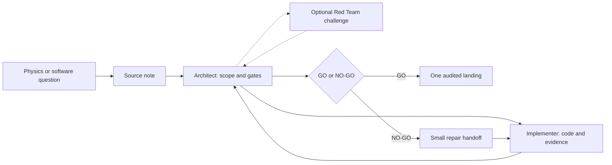
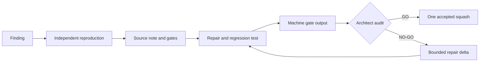
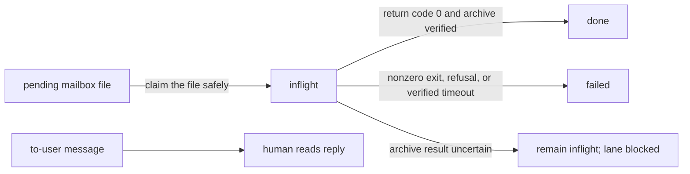
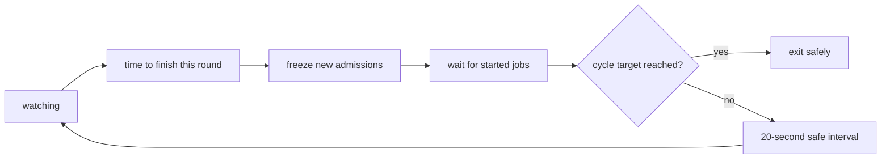
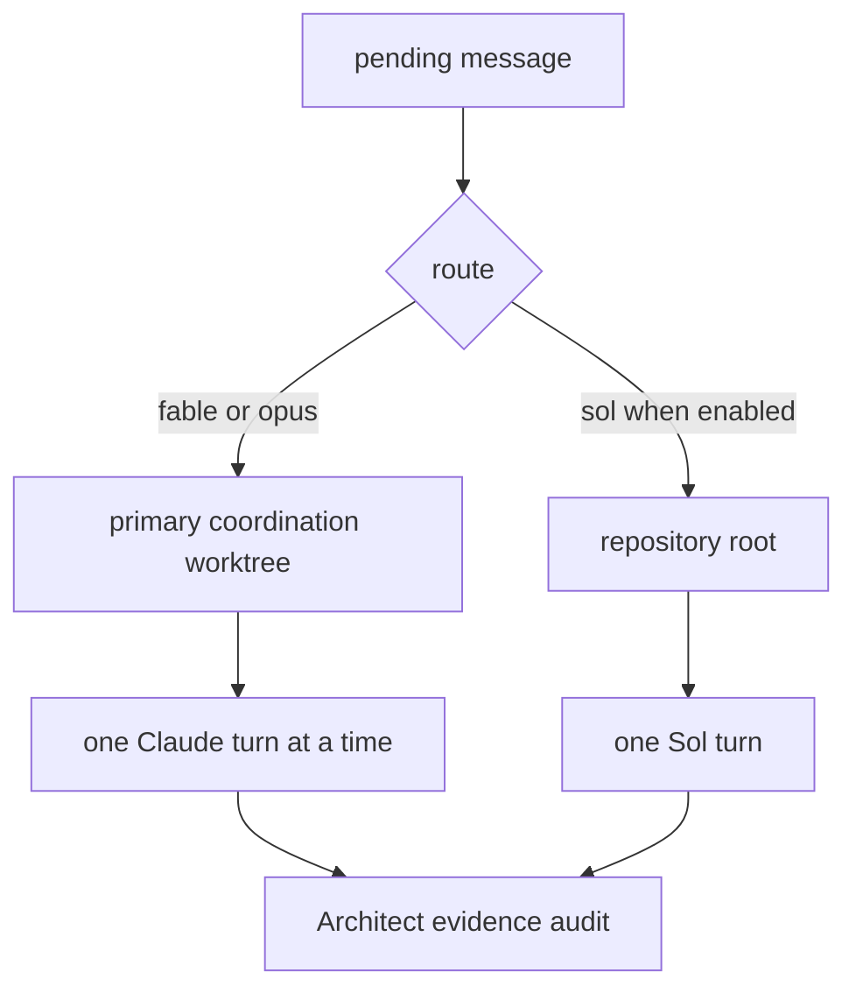
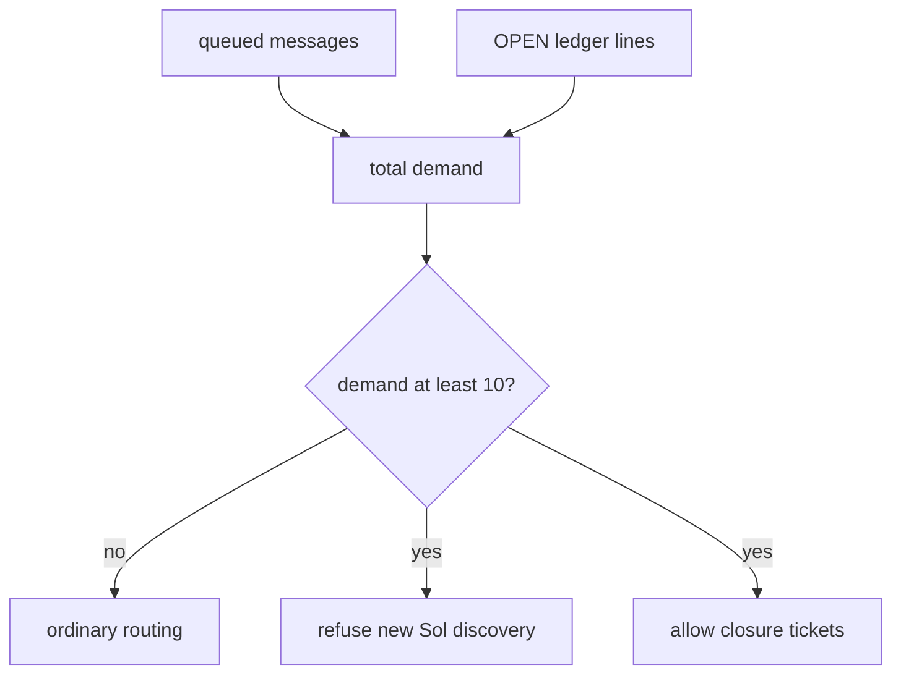
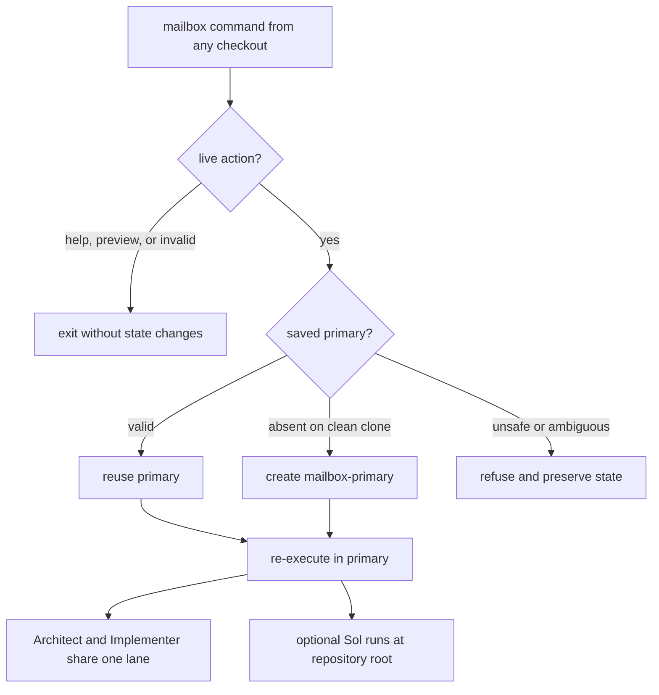

# AI-assisted development

This directory contains the tools that let several AI roles work on one
scientific codebase without treating chat as the project record.

The emulator library itself is documented in the top-level
[`README.md`](../README.md). Prof. Miranda owns the scientific contracts,
architecture, public interface, tests, and Python readability conventions.
Agents work inside those boundaries.


## Contents

### Main guide

1. [Start here](#start-here)
2. [Complete one small ticket](#complete-one-small-ticket)
3. [Roles, models, and decisions](#roles-models-and-decisions)
4. [Notes, tests, and gates](#notes-tests-and-gates)
5. [Useful daily commands](#useful-daily-commands)
6. [Fix-only watches](#fix-only-watches)
7. [Runtime controls](#runtime-controls)
8. [Exact command reference](#exact-command-reference)

### Common questions raised by developers

**[Appendices about mailbox mechanics](#appendices-about-mailbox-mechanics)**

- [FAQ A1. How does a mailbox message move?](#appendix-a--how-does-a-mailbox-message-move)
- [FAQ A2. What happens when the outcome cannot be verified?](#faq-a2-unverified-outcome)
- [FAQ B1. When can I interrupt the watcher?](#appendix-b--when-is-it-safe-to-stop-the-watcher)
- [FAQ B2. What does `--cycle` count?](#faq-b2-cycle-count)
- [FAQ C1. Why are messages divided into lanes?](#appendix-c--how-do-queues-and-lanes-work)
- [FAQ C2. Where does Sol work?](#faq-c2-sol-worktree)
- [FAQ D1. When does the demand guard refuse discovery?](#appendix-d--what-is-the-demand-guard)
- [FAQ D2. When may Sol act as a second Implementer?](#faq-d2-second-implementer)

**[Appendices about setup and recovery](#appendices-about-setup-and-recovery)**

- [FAQ E1. What should I check first?](#appendix-e--how-do-i-troubleshoot-a-run)
- [FAQ E2. How do I recover the saved primary worktree?](#faq-e2-primary-recovery)
- [FAQ F1. Which folder does each role use?](#appendix-f--what-is-the-worktree-topology)
- [FAQ F2. May I use another worktree?](#faq-f2-other-worktrees)
- [FAQ G. How do I install this on another machine?](#appendix-g--how-do-i-install-this-on-another-machine)

**[Appendices about occasional transfer](#appendices-about-occasional-transfer)**

- [FAQ H1. How do I package unfinished work?](#appendix-h--how-can-i-send-unfinished-work-to-someone-else)
- [FAQ H2. How does the recipient inspect it safely?](#faq-h2-inspect-unfinished-work)

## Start here

You do not need prior AI-agent or Git-worktree experience. Keep this mental
model:



Three objects make this reliable:

| Object | Plain-language meaning |
| --- | --- |
| **Source note** | The written problem, scope, and acceptance checks. It is the source of truth. |
| **Watcher** | A long-running command that notices mailbox files and launches the correct role. |
| **Worktree** | A second checked-out folder for the same Git repository. It gives the agents one known place to share uncommitted notes and code. |

A **ticket** is one bounded change described by a source note.

A worktree is not a copy made by hand. Git registers it and gives it a branch.
The mailbox tool creates or reuses one primary coordination worktree, normally
`.claude/worktrees/mailbox-primary`.

The watcher may be launched from any checkout. Live mailbox commands resolve
the saved primary and continue there. This prevents two terminals from
silently using different mailboxes.

### Where things live

| Path | Purpose |
| --- | --- |
| `ai/README.md` | This operating guide |
| `ai/notes/` | Durable knowledge and local ticket records |
| `ai/tests/` | Regression tests and focused reproductions |
| `ai/gates/` | Validation board, checks, configuration, and logs |
| `ai/tools/` | Mailbox, relay, status, and transfer utilities |

### The one rule to remember

The mailbox message is only a pointer. The cited note carries the substance.

If a chat message, mailbox message, and source note disagree, the source note
wins. A later developer should be able to resume from repository records
without reconstructing the chat.

## Complete one small ticket

The example below adds a hypothetical `--version` option. Use a small ticket
first; it makes each moving part visible.

### 1. Preview without changing anything

From any checkout:

```bash
python3 ai/tools/mailbox_daemon.py --dry-run
```

Expected result: pending work, launch commands, and working directories are
printed. No branch, worktree, lock, or mailbox file is created.

### 2. Create the shared agent folder

On a clean clone, run one finite live pass before writing an uncommitted note:

```bash
python3 ai/tools/mailbox_daemon.py --once
```

Expected result: on a clean installation, the tool creates
`.claude/worktrees/mailbox-primary` on branch `claude/mailbox-primary`, saves
that choice, reports the path, checks the current queue, and exits. An empty
first run prints that the mailbox is empty. Git calls this registered shared
folder a *worktree*.

The Architect and Implementer share this folder. The command does not create a
separate Sol worktree; a dispatched Sol review starts at the repository root.

Open the reported primary path for the next step. A newly created worktree
starts from committed Git state, so it cannot see an uncommitted note written
in another checkout.

If the command finds old mailbox files or a watcher in another checkout, it
refuses instead of guessing which mailbox is correct. Preserve every path it
names and follow [Appendix E](#appendix-e--how-do-i-troubleshoot-a-run).

### 3. Write the source note

In the saved primary, create a temporary ticket note such as
`ai/notes/version-flag.md`:

```markdown
# Version flag

## Goal

Add `--version` without changing normal training behavior.

## Acceptance gates

- `python3 train.py --version` exits successfully.
- Existing training tests remain green.
- A regression test checks the printed version.
```

Good notes answer four questions:

1. What behavior is wanted?
2. What must not change?
3. Which files or subsystem are in scope?
4. What command proves success?

### 4. Start the watcher

This example uses Opus as Architect and Sonnet as Implementer:

```bash
python3 ai/tools/mailbox_daemon.py --watch \
  --architect-model opus \
  --implementer-model sonnet
```

Keep this terminal open. The watcher checks the mailbox every 20 seconds and
prints progress while a turn is running.

The models are command-line choices. The roles are stable: the Architect still
defines and audits the unit, and the Implementer still makes the bounded
change.

The default watch also makes the independent Sol Red Team lane available. It
does not create Sol work by itself; Sol runs only when a `to-sol` message is
queued. For an Architect-and-Implementer run only:

```bash
python3 ai/tools/mailbox_daemon.py --watch --skip-redteam
```

`--no-red-team` is an exact alias. Existing `to-sol` files remain queued for a
later three-role watch.

### 5. Send the ticket to the Architect

In another terminal, from any checkout in the repository:

```bash
python3 ai/tools/mailbox_daemon.py --send fable \
  --unit "You are the Architect. Coordinate the version-flag unit in ai/notes/version-flag.md."
```

Expected result: one numbered `to-fable` file is published. `fable` is the
stable Architect route even when that route launches a different Claude model.

### 6. Follow GO or NO-GO

For a read-only summary, run this from the saved primary:

```bash
python3 ai/tools/handoff_router.py --status
```

The Architect records exactly one decision for the named unit:

- **GO**: the cited evidence satisfies the gates, and the audited unit may be
  landed.
- **NO-GO**: the unit is held, and the Architect names the smallest repair
  needed for another audit cycle.

The durable evidence is split by purpose:

| Location | What it tells you |
| --- | --- |
| `ai/notes/mailbox/done/` | Which routing message was consumed |
| `ai/notes/relay/` | What the dispatched process printed |
| Source or audit note | What was claimed, tested, and decided |

Stop the watcher only at a printed safe interval, or use `--cycle` for an
automatic safe exit. [Appendix B](#appendix-b--when-is-it-safe-to-stop-the-watcher)
explains both.

## Roles, models, and decisions

Models can change from run to run. Authority does not.

| Role | Responsibility | Stable route |
| --- | --- | --- |
| **Architect / Auditor** | Defines the unit and gates, audits raw evidence, decides `GO` or `NO-GO` | `to-fable` |
| **Implementer** | Changes only the named unit and produces validation evidence | `to-opus` |
| **Independent Red Team** | Challenges the named commit or change and reports findings to the Architect | `to-sol` |

The role instructions live in `.claude/FABLE_ROLE.md`,
`.claude/OPUS_ROLE.md`, and `.codex/REDTEAM_ROLE.md`. A route name is transport,
not a model name and not authority by itself.

### Architect language is GO or NO-GO

Only the Architect adjudicates agent evidence.

- `GO` authorizes the named unit to advance.
- `NO-GO` holds it and identifies the failed claims and repair delta.
- “Pass” and “fail” may describe a test, but they do not replace the decision.

The Architect owns any accepted edit to the permanent notes and the audited
landing boundary. The Implementer and Red Team do not inherit that authority.

### When does the Red Team run?

In the default three-role setup, the Red Team lane is available for each
ticket's normal audit flow. Enabling the lane does not start a review:
Sol runs only after a `to-sol` message is queued, normally by the Architect or
the user. That review covers the named commit or change and behavior directly
affected by that change.

It does **not** turn a ticket review into a broad attack on the library. A
widespread search happens only when the user explicitly writes:

```text
Do a widespread search for ...
```

A Red Team finding is input to the Architect. It is never a self-executing
ruling. `--skip-redteam` removes that optional lane for one watch; it does not
weaken the Architect's evidence audit.

## Notes, tests, and gates

### Notes are the source of truth

Substantive handoffs belong in notes. Mailbox messages should be short routing
summaries that cite the relevant section.

A **test** checks one behavior. A **gate** is a repeatable acceptance command
with a required result. The **validation board** lists and runs those gates so
the Architect can audit machine output instead of trusting a summary.

Exactly ten Markdown notes are permanent repository knowledge:

1. `MEMORY.md`
2. `artifacts-inference-warmstart.md`
3. `conventions-and-workflow.md`
4. `data-generation-and-cuts.md`
5. `families-background-mps.md`
6. `families-scalar-cmb.md`
7. `models-and-designs.md`
8. `project-and-history.md`
9. `training-stack.md`
10. `user-didactics-and-python-voice.md`

The backlog, dated audits, incident reports, state notes, handoff registers,
mailbox files, and relay logs are local working records. Do not add them to a
GitHub commit.

The Architect decides whether an accepted change modifies a general property
described by the permanent ten. If it does, the Architect owns that update.

### How does a reported problem become a tested fix?



A regression test keeps the same bug from returning unnoticed. It should prove
that it detects the original defect. Where practical, reintroduce or mutate the
defect and show that the check turns red.

### Run the validation board

```bash
python3 ai/gates/run_board.py --list
python3 ai/gates/run_board.py --check
python3 ai/gates/run_board.py --dry-run
```

These commands list state, run preflight only, and print the selected gate
commands. They do not claim that the full gates ran.

On a configured workstation:

```bash
python3 ai/gates/run_board.py
python3 ai/gates/run_board.py --gate ID
```

Hardware-only rows may be recorded explicitly. They are never silently
treated as green.

## Useful daily commands

### Ask where the program is

```bash
python3 ai/tools/handoff_router.py --status
```

This prints a read-only summary of branches, audits, open reviews, and next
actions.

### Preview one send

```bash
python3 ai/tools/mailbox_daemon.py --dry-run --send opus \
  --unit "You are the Implementer. Follow the ARCHITECT_HANDOFF in ai/notes/version-flag.md."
```

The exact message is printed, but no file is written.

### Queue implementation

```bash
python3 ai/tools/mailbox_daemon.py --send opus \
  --unit "You are the Implementer. Follow the ARCHITECT_HANDOFF in ai/notes/version-flag.md."
```

### Run a two-role manual relay

```bash
python3 ai/tools/handoff_router.py \
  --note ai/notes/version-flag.md \
  --skip-redteam
```

This command controls only that clipboard relay. It does not change the roles
used by an already running mailbox watcher.

### Queue a bounded Red Team discovery

```bash
python3 ai/tools/mailbox_daemon.py --send sol \
  --ticket-kind discovery \
  --unit "You are the Independent Red Team. Review the version-flag change named in ai/notes/version-flag.md. Stay within that change."
```

A new discovery is refused when fix-only mode or the demand guard forbids new
findings.

### Queue Red Team closure of existing work

```bash
python3 ai/tools/mailbox_daemon.py --send sol \
  --ticket-kind closure \
  --unit "You are the Independent Red Team. Close the existing item described in ai/notes/backlog.md."
```

The published file begins with `MAILBOX-TICKET: closure`.

### Test transport without assigning work

```bash
python3 ai/tools/mailbox_daemon.py --ping opus
```

The reply is addressed `to-user`. The watcher leaves it for a human and does
not dispatch it onward.

## Fix-only watches

Use fix-only mode when the current ledger is already large and the run should
retire known work instead of finding more:

```bash
python3 ai/tools/mailbox_daemon.py --watch --fix-only yes
```

The value also accepts `1` or `true`, in any capitalization.

In this mode:

- existing closure work remains eligible;
- new Sol discovery is refused;
- the policy is held by an exact per-mailbox lock, so external sends see it;
- a pending Sol file's stored ticket class is checked again before launch;
- an invalid pending Sol message moves to `failed/` instead of being guessed
  from prose.

Fix-only can be combined with a two-role setup or a cycle limit:

```bash
python3 ai/tools/mailbox_daemon.py --watch --fix-only yes --cycle 2
python3 ai/tools/mailbox_daemon.py --watch --fix-only yes --skip-redteam --cycle 0
```

## Runtime controls

| Concern | Options | Default |
| --- | --- | --- |
| Claude route models | `--architect-model`, `--implementer-model` | Fable, Opus |
| Claude effort | `--fable-effort`, `--opus-effort` | `xhigh`, `max` |
| Sol effort | `--sol-effort` | `xhigh` |
| Roles used | `--skip-redteam`, `--no-red-team` | Architect + Implementer + Sol |
| Turn timeout | `--dispatch-timeout` | 60 minutes |
| Context compaction | `--claude-context`, `--sol-context` | 500000 tokens each |
| Watch lifetime | `--cycle` | omitted: indefinite; `N>0`: stop at cycle N; `0`: drain enabled queue and ledger |
| Discovery policy | `--fix-only` | off |

Model selection and effort are independent. Choosing Sonnet does not silently
lower the Implementer effort.

At the context budget, a live session compacts its history and continues from
a summary. Claude receives `CLAUDE_CODE_AUTO_COMPACT_WINDOW`; Sol receives
`model_auto_compact_token_limit`.

The watcher checks the daemon source timestamp on every pass. If that file
changes, the stale watcher retires. Relaunch it to load the new code.

## Exact command reference

The live help is authoritative:

```bash
python3 ai/tools/mailbox_daemon.py --help
```

The current transcript is kept here for offline reading and regression checks.

<details>
<summary>Current <code>mailbox_daemon.py --help</code> transcript</summary>

```
usage: mailbox_daemon.py [-h] [--dry-run] [--once] [--watch] [--cycle count]
                         [--skip-redteam] [--fix-only value] [--send AGENT]
                         [--ping AGENT] [--unit UNIT]
                         [--ticket-kind {closure,discovery}]
                         [--architect-model MODEL] [--implementer-model MODEL]
                         [--fable-effort {low,medium,high,xhigh,max}]
                         [--opus-effort {low,medium,high,xhigh,max}]
                         [--sol-effort {none,low,medium,high,xhigh}]
                         [--dispatch-timeout MINUTES]
                         [--claude-context TOKENS] [--sol-context TOKENS]

file mailbox + headless dispatch for the agent loop

options:
  -h, --help            show this help message and exit
  --dry-run             show what would happen and change nothing: pending
                        dispatches are printed, not run, and --send/--ping
                        print the message file they would queue without
                        writing it
  --once                process the current backlog and exit
  --watch               poll the mailbox every 20 seconds
  --cycle count         with --watch, exit safely after this many global
                        rendezvous cycles; 0 waits until the enabled dispatch
                        queue and open ledger are empty; omitting the option
                        keeps watching indefinitely
  --skip-redteam, --no-red-team
                        with --watch, dispatch only Architect and Implementer
                        routes; disable the entire Sol route and leave
                        existing to-sol messages queued for a later normal
                        watch
  --fix-only value      with --watch, close existing ledger work only; the
                        value accepts 1, true, or yes in any capitalization
  --send AGENT          queue a message to this agent and exit
  --ping AGENT          queue a transport-confirmation ping to this agent (its
                        reply lands as a -to-user.md file the daemon never
                        dispatches)
  --unit UNIT           the message text for --send (a routing summary
                        pointing at ai/notes/)
  --ticket-kind {closure,discovery}
                        required with --send sol: declare whether the unit
                        closes existing work or seeks new findings
  --architect-model MODEL
                        Claude model alias or full name for the Architect
                        route (legacy fable address; default: claude-fable-5)
  --implementer-model MODEL
                        Claude model alias or full name for the Implementer
                        route (legacy opus address; default: claude-opus-4-8)
  --fable-effort {low,medium,high,xhigh,max}
                        claude CLI reasoning effort for the Architect route
                        (legacy fable address; default: xhigh)
  --opus-effort {low,medium,high,xhigh,max}
                        claude CLI reasoning effort for the Implementer route
                        (legacy opus address; default: max)
  --sol-effort {none,low,medium,high,xhigh}
                        codex CLI reasoning effort for Sol dispatches
                        (default: xhigh)
  --dispatch-timeout MINUTES
                        kill a dispatched turn that runs past this many
                        minutes and park its message in failed/ (default: 60)
  --claude-context TOKENS
                        Architect and Implementer Claude turns compact their
                        context whenever it reaches this many tokens (default:
                        500000)
  --sol-context TOKENS  Sol turns compact their context whenever it reaches
                        this many tokens (default: 500000)
```

</details>

### Action rules

- `--once`, `--watch`, `--send`, and `--ping` are mutually exclusive primary
  actions.
- `--cycle` accepts a nonnegative integer and is valid only with `--watch`.
- Omitting `--cycle` watches indefinitely. `--cycle 0` instead waits for the
  enabled routes and literal `- OPEN` ledger lines to drain.
- `--skip-redteam` and `--no-red-team` are watch-only aliases.
- A two-role watch preserves queued Sol files and refuses new Sol sends and
  pings until that watch releases its mode lock.
- `--unit` is required with `--send`.
- A Sol send also requires `--ticket-kind closure|discovery`.
- `--dry-run` modifies finite actions without writing state.
- Invalid models, effort values, timeouts, and action combinations fail before
  mailbox mutation.

The manual relay has separate live help:

```bash
python3 ai/tools/handoff_router.py --help
```

Its same-named two-role option controls one clipboard relay, not a running
watcher.

# Common questions raised by developers

## Appendices about mailbox mechanics <a id="appendices-about-mailbox-mechanics"></a>

### FAQ A1. How does a mailbox message move? <a id="appendix-a--how-does-a-mailbox-message-move"></a>

Publication and dispatch are filesystem state transitions, not chat events.



### FAQ A2. What happens when the outcome cannot be verified? <a id="faq-a2-unverified-outcome"></a>

The uncertain path deliberately stays in `inflight/`. Later work cannot
overtake a message whose outcome is unknown.

`--dispatch-timeout MINUTES` defaults to 60. A verified timeout kills the
child, records timeout history under `ai/notes/mailbox/.dispatch-history/`,
and moves the message to `failed/`.

If history or archive identity cannot be verified, the message stays in
`inflight/` and blocks its lane. A clean child exit alone is not enough; the
daemon also verifies the archived file identity.

`--dry-run` performs none of these transitions.

### FAQ B1. When can I interrupt the watcher? <a id="appendix-b--when-is-it-safe-to-stop-the-watcher"></a>

Read the watcher literally:

| Signal | Meaning | Safe to interrupt? |
| --- | --- | --- |
| Heartbeat or “turns in flight” | A role is running or about to start | No |
| `all lanes idle; safe to Ctrl-C ...` | The bounded safe interval is open | Yes |
| Cycle-limit exit | The watcher finished work it had started and exited itself | Already safe |
| Timeout | Recovery was attempted | Inspect `failed/` or `inflight/` first |

### FAQ B2. What does `--cycle` count? <a id="faq-b2-cycle-count"></a>

A cycle is one round of watching. It starts when the watcher starts, or just
after the previous safe countdown. To finish the round, the watcher pauses new
launches and waits for every job it already started to finish.



Choose the lifetime explicitly:

| Command | Behavior |
| --- | --- |
| `--watch` | Watch indefinitely; stop during a printed safe interval |
| `--watch --cycle 2` | Exit after the second completed watch round |
| `--watch --cycle 0` | Exit after enabled routes and open ledger lines drain |
| `--watch --skip-redteam --cycle 0` | Drain Architect and Implementer; report deferred Sol files |

`--cycle 0` does not turn backlog lines into mailbox messages. It simply keeps
watching until normal ticket messages have closed every literal `- OPEN` line
in `ai/notes/backlog.md` and the enabled message queues are empty.

Before zero-mode exit, the watcher takes the same publication lock as
`--send` and verifies a stable regular UTF-8 ledger plus the enabled root
queue. An unverifiable ledger keeps the watcher active; it never becomes
“zero work” by assumption.

Two common safe messages are:

```text
all lanes idle; safe to Ctrl-C for 19s more; 3 messages waiting.
```

A running-turn heartbeat looks like this:

```text
  ... 0046-to-opus.md still running (3 min elapsed, log 12.4 kB; tail -f .../ai/notes/relay/20260714-031840-dispatch-opus.log)
```

```text
cycle limit reached (2/2 cycles); all lanes idle; watcher exiting safely; 3 messages waiting; 4 open ledger jobs remain.
```

The ordinary 20-second idle poll is also safe, but it is not a cycle boundary.

### FAQ C1. Why are messages divided into lanes? <a id="appendix-c--how-do-queues-and-lanes-work"></a>

A **turn** processes one message. A **dispatch** starts a turn. A **lane** is
the one-at-a-time queue for one working directory.



Filenames impose order within a lane. Different working directories may run
at the same time. Routes that use one directory run one at a time.

Architect and Implementer intentionally share the primary worktree, staged
index, notes, and uncommitted code. The daemon therefore gives them one lane.

### FAQ C2. Where does Sol work? <a id="faq-c2-sol-worktree"></a>

Dispatched Sol starts at `REPO_ROOT`. The daemon does not automatically create
a separate Sol worktree.

A two-role watch disables the Sol lane. Queued Sol messages wait untouched.

### FAQ D1. When does the demand guard refuse discovery? <a id="appendix-d--what-is-the-demand-guard"></a>

Total demand is:

```text
queued mailbox messages + literal “- OPEN” lines in ai/notes/backlog.md
```

At demand ten or more, a new Sol discovery is refused. Closure of known work
remains allowed.



### FAQ D2. When may Sol act as a second Implementer? <a id="faq-d2-second-implementer"></a>

The number never changes a role by itself. Sol becomes a second Implementer
for one unit only when that message opens with this exact declaration and
also carries the Implementer contract and gates:

```text
OpenAI Sol — this is a role as second Implementer for this unit.
```

Without that declaration, Sol remains the bounded Red Team.

The daemon's exact threshold hint is preserved here as an output example:

```text
  hint: total open demand is at or past 10 units; the red team is now the second implementer: build units flow to it as well as to the primary Implementer route (.claude/FABLE_ROLE.md, Second-Implementer assignments).
```

Treat that line as a routing prompt, not a role assignment. The exact
second-Implementer declaration above is still required in the unit.

## Appendices about setup and recovery <a id="appendices-about-setup-and-recovery"></a>

### FAQ E1. What should I check first? <a id="appendix-e--how-do-i-troubleshoot-a-run"></a>

| Symptom | Likely meaning | First action |
| --- | --- | --- |
| A live command refuses and names several mailbox folders | More than one old mailbox or watcher may exist | Preserve every named folder; rerun from the intended shared worktree |
| The saved primary worktree is refused | Its saved path, branch, and Git's worktree list disagree | Preserve the folder; compare with `git worktree list --porcelain` |
| Heartbeat advances but Claude log is small | Claude may be buffering output | Keep watching the elapsed time |
| Log and clock stop | Child may be hung | Wait for timeout or inspect the process; do not interrupt outside a safe interval |
| `inflight/` blocks a lane | Archive outcome is uncertain | Inspect source, archive, log, and identity before moving anything |
| Sol discovery is refused | Demand guard or fix-only mode is active | Record the item; use closure only for already known work |
| Watch exits after a source edit | Its loaded daemon became stale | Relaunch the watcher |
| Send warns that no watcher holds the mailbox | No live `--watch` owns the primary lock | Start a watcher; the message remains queued |

### FAQ E2. How do I recover the saved primary worktree? <a id="faq-e2-primary-recovery"></a>

The daemon never cleans, stashes, resets, checks out, prunes, or recreates a
saved primary automatically.

1. Preserve the reported state file, mailbox, and relay directories.
2. Run `git worktree list --porcelain`.
3. Compare the registered path and branch with the error.
4. Restore the expected attached branch, or use `git worktree move` for an
   intentional move. Do not move the directory by hand.
5. Rerun the command. Missing, detached, wrong-branch, or ambiguous state
   continues to refuse until its Git identity is repaired.

Dirty, ahead, or diverged work is preserved. The daemon does not merge, fetch,
pull, or push the primary branch for you.

### FAQ F1. Which folder does each role use? <a id="appendix-f--what-is-the-worktree-topology"></a>



Default local infrastructure:

| Resource | Default |
| --- | --- |
| Worktree | `<REPO_ROOT>/.claude/worktrees/mailbox-primary` |
| Branch | `claude/mailbox-primary` |
| State | `<REPO_ROOT>/.claude/worktrees/.mailbox-primary-worktree.json` |
| Bootstrap lock | `<REPO_ROOT>/.claude/worktrees/.mailbox-primary-worktree.lock` |

The state is local infrastructure, not a file to commit. It records the Git
common directory, primary name, absolute path, and attached branch. Model
flags do not change it.

### FAQ F2. May I use another worktree? <a id="faq-f2-other-worktrees"></a>

An independently launched interactive developer may use another worktree.
That does not change the mailbox primary.

### FAQ G. How do I install this on another machine? <a id="appendix-g--how-do-i-install-this-on-another-machine"></a>

1. Clone the repository.
2. Install and authenticate Claude Code.
3. Install the Codex CLI if the Sol lane will be used.
4. Check the executable paths used by `build_agent_commands()` in
   `ai/tools/mailbox_daemon.py`.
5. Preview from any checkout:

   ```bash
   python3 ai/tools/mailbox_daemon.py --dry-run
   ```

6. Inspect every reported command and working directory.
7. Start the live watcher with the desired models:

   ```bash
   python3 ai/tools/mailbox_daemon.py --watch \
     --architect-model opus \
     --implementer-model sonnet
   ```

Use `which claude` and `which codex` to locate installed executables. Change
only the executable paths when a machine installs them elsewhere; model,
effort, context, sandbox, and service-tier settings remain repository policy.

## Appendices about occasional transfer <a id="appendices-about-occasional-transfer"></a>

### FAQ H1. How do I package unfinished work? <a id="appendix-h--how-can-i-send-unfinished-work-to-someone-else"></a>

This is a limited recovery tool, not the normal workflow. Prefer closing the
ticket through notes, gates, and GO or NO-GO. Use a bundle only when another
developer must resume local, uncommitted backlog work. A bundle is a one-time
snapshot, not synchronization: choose one active owner, stop editing the
sender's copy after handoff, and package again from a known Git base if a
second transfer is unavoidable.

Preview the selection:

```bash
python3 ai/tools/backlog_bundle.py pack --dry-run
```

Create an ignored `.tar.xz` attachment:

```bash
python3 ai/tools/backlog_bundle.py pack
```

### FAQ H2. How does the recipient inspect it safely? <a id="faq-h2-inspect-unfinished-work"></a>

The recipient validates it without writing:

```bash
python3 ai/tools/backlog_bundle.py inspect path/to/backlog-....tar.xz
```

Then unpack it into a fresh ignored review directory:

```bash
python3 ai/tools/backlog_bundle.py unpack path/to/backlog-....tar.xz
```

`read` and `import` are aliases for `inspect` and `unpack`. Import never
overwrites live notes or applies code.

Put ordinary supporting files in `ai/notes/backlog-support/`. Use repeatable
`--include REPO_RELATIVE_FILE` for an extra patch, image, or regular file.

The bundle records its Git base and SHA-256 inventory. It excludes the ten
permanent notes, mailbox queues, and relay logs. The archive is ignored by Git
and should not be added to GitHub.

Checksums detect corruption, not authorship. Compare the printed archive
SHA-256 with the sender through another channel.
