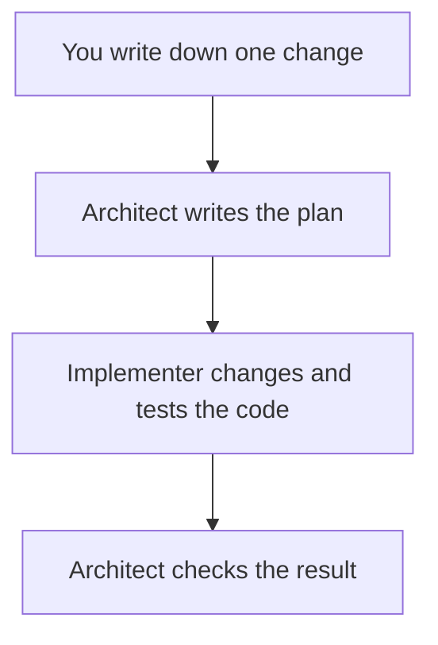
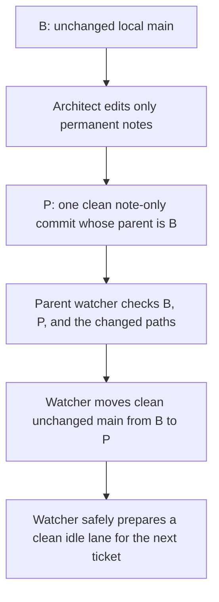
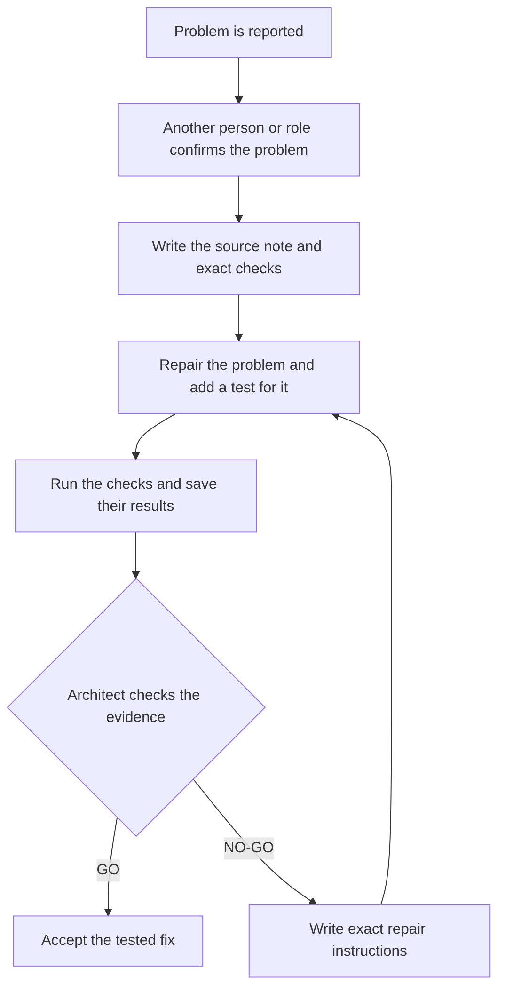
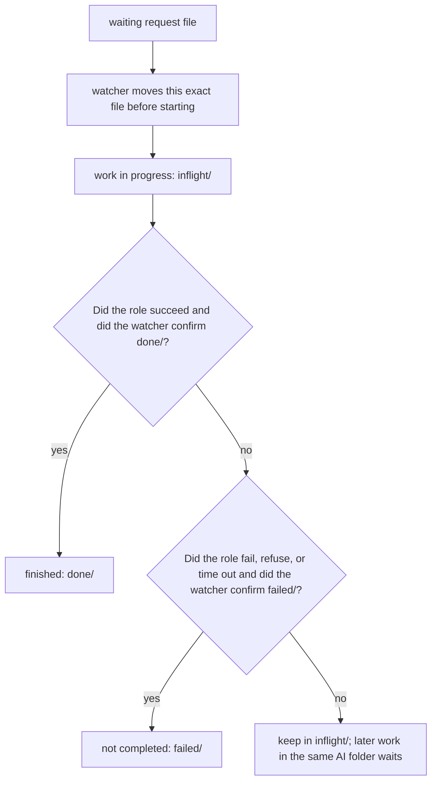
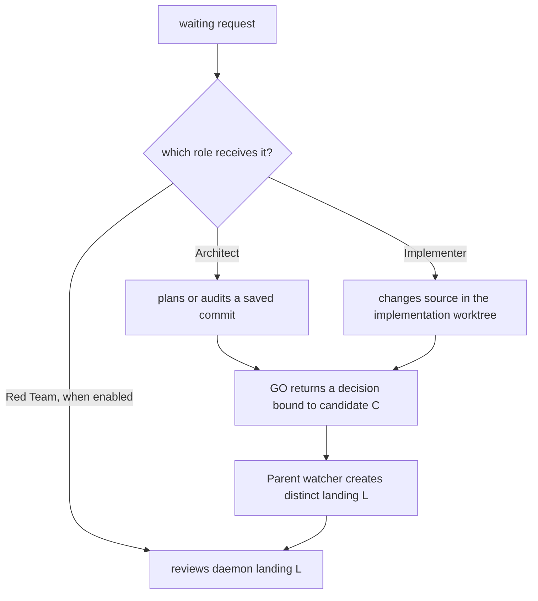
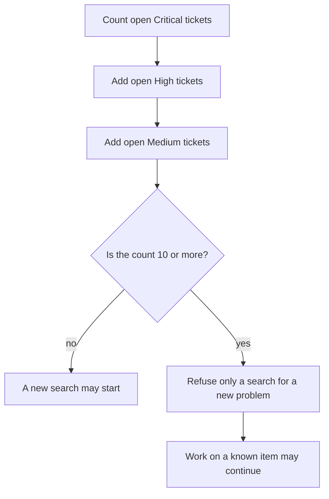

# AI-assisted development

## Why split the work into three roles?

If you can use Fable or Sol for every step without worrying about usage
limits, you may not need this system. One of those models can plan, write,
test, and review a change by itself.

This guide is written for students who may have a basic account or limited
paid access. AI models process text in **tokens**, small pieces of text that
they read or write. An account may limit this use through tokens, messages, or
cost. Implementation is the token-heavy part of this workflow: the model
repeatedly reads files, writes code, runs tests, studies failures, and tries
repairs.

The roles let you assign the longest work to a model that costs less to use:

- The **Architect** decides the design and writes complete instructions.
- The **Implementer** follows those instructions and performs the longer
  code-and-test work.
- The optional **Red Team** checks one named change for mistakes and, if it
  finds a defect, sends a detailed repair proposal back to the Architect.

The Architect and Red Team do the independent reasoning. Their instructions
must be detailed enough that the Implementer does not need to invent the
design. The Implementer can therefore be a much simpler model.

For example, if the account provides them and Fable use is unavailable, Opus
can be the Architect while Sonnet or Haiku is the Implementer. Sol can be
reserved for reviews of specific changes. The model choices belong to each
run; use `--architect-model` and `--implementer-model` to change them. If the
budget does not allow a Red Team review, a watch with `--skip-redteam` runs
only the Architect and Implementer.

This directory contains the tools that let several AI roles work on one
scientific codebase without treating chat as the project record.

The emulator library itself is documented in the top-level
[`README.md`](../README.md). The repository's scientific contracts,
architecture, public interface, tests, and Python readability rules constrain
every agent change.

## Contents

### Main guide

1. [Why split the work into three roles?](#why-split-the-work-into-three-roles)
2. [Start here](#start-here)
3. [Complete one small ticket](#complete-one-small-ticket)
4. [Roles, models, and decisions](#roles-models-and-decisions)
5. [Choose which discoveries may become tickets](#choose-which-discoveries-may-become-tickets)
6. [Close or reopen a ticket](#close-or-reopen-a-ticket)
7. [Notes, tests, and gates](#notes-tests-and-gates)
8. [Fix-only watches](#fix-only-watches)
9. [Choose and run a command-line tool](tools/README.md)

### Common questions raised by developers

**[Appendices about roles and work folders](#appendices-about-roles-and-work-folders)**

- [FAQ A1. How does a mailbox message move?](#appendix-a--how-does-a-mailbox-message-move)
- [FAQ A2. What if the watcher cannot tell whether a message finished safely?](#faq-a2-unverified-outcome)
- [FAQ C1. Why can some AI jobs run together while others must wait?](#appendix-c--how-do-queues-and-lanes-work)
- [FAQ C2. Where does Sol work?](#faq-c2-sol-worktree)
- [FAQ D1. Why can the tool refuse a new Red Team search?](#appendix-d--what-is-the-demand-guard)
- [FAQ D2. Can Sol change the code?](#faq-d2-can-sol-change-code)
- [FAQ F1. Which folder does each role use?](#appendix-f--what-is-the-worktree-topology)
- [FAQ F2. Can I create another work folder for myself?](#faq-f2-other-worktrees)

**[Tool commands, stopping, setup, recovery, and transfers](tools/README.md#common-questions-raised-by-developers)**

- [When can I interrupt the watcher?](tools/README.md#appendix-b--when-is-it-safe-to-stop-the-watcher)
- [What does `--cycle` count?](tools/README.md#faq-b2-cycle-count)
- [What should I check first?](tools/README.md#appendix-e--how-do-i-troubleshoot-a-run)
- [What should I do if the tool rejects a saved AI folder?](tools/README.md#faq-e2-primary-recovery)
- [How do I set this up on another computer?](tools/README.md#appendix-g--how-do-i-install-this-on-another-machine)
- [How can two people transfer unfinished work?](tools/README.md#appendix-h--how-can-i-send-unfinished-work-to-someone-else)

## Start here

You do not need prior AI-agent or Git-worktree experience. You need Git,
Python 3, and the Claude command-line program. The Codex command-line program
is needed only when the Sol role is enabled. See the
[setup guide](tools/README.md#appendix-g--how-do-i-install-this-on-another-machine)
before continuing on a new computer.

Start with one request moving through four steps:



### Talk only to the Architect

Give every ticket request, clarification, policy choice, and scope change to
the Architect. Do not write instructions to the Implementer or Red Team. If
you want a Red Team review, tell the Architect, for example:

```text
Please instruct the Red Team to do a widespread search for ...
```

The Architect writes the decisions in the ticket's **source note**, the
Markdown file that records the problem, allowed work, and required checks.
**Discovery severity** says how serious a newly found problem must be before
it may become another ticket.

In a manual run, each role has a separate web conversation. The **relay
tool**, `handoff_router.py`, checks the source note and puts an approved
instruction block on the clipboard. A **clipboard block** is the exact text
to paste into the next conversation.

The tool may add file paths and saved-record locations. It cannot replace the
Architect's decisions. Copy each block unchanged; you are carrying the
approved instructions, not writing a message to the Implementer or Red Team.

If the check finds a problem, the Architect writes repair instructions and
the Implementer tries again. The optional Red Team adds another review; its
place in the loop is explained later.

The tool keeps this sequence organized with three objects:

A **mailbox** is a folder of request files. A **directive** is the Architect's
ordered plan. A Git **branch** is a named line of saved changes, and a Git
**commit** is one saved project version. A **gate** is a named validation job
whose required result is written before it starts.

| Object | Plain-language meaning |
| --- | --- |
| **Source note** | The written problem, scope, and acceptance checks. It is the source of truth. |
| **Watcher** | A long-running command that notices mailbox files and launches the correct role. |
| **Worktree** | Another project folder that Git manages for the same repository. It keeps agent work out of your main folder. |

A **ticket** is one requested change described by a source note.

A worktree is not a copy made by hand. Git registers it and gives it a branch.
The mailbox tool creates or reuses three agent worktrees:

- `mailbox-primary` is the Architect's coordination folder for plans,
  decisions, and shared records;
- `mailbox-implementer` is where the Implementer changes source code; and
- `mailbox-sol` is the optional Red Team's saved role folder.

When the Architect or Red Team must inspect source code, the watcher also
creates a temporary, read-only view of the exact commit under review. This
prevents either role from accidentally reading newer unfinished work from a
saved worktree.

The Architect and Red Team inspect saved commits. They do not edit source
code. Only the Implementer changes source files. After an Architect `GO`, the
Architect sends a five-line decision bound to candidate C, the exact commit it
audited. After that Architect process exits, the parent watcher creates and
records landing L on `main`. The Architect does not perform that Git step or
touch your main folder. Before later role work starts, the watcher safely
advances each clean idle role folder to L so the next turn uses the accepted
tools and role instructions. It refuses rather than resetting a folder with
unfinished or different work.

The watcher may be launched from any project folder that Git recognizes.
Mailbox commands that write files find the saved worktrees, then continue
from the Architect's coordination folder. This prevents two terminals from
silently using different mailboxes or placing an agent in your main folder.

### Where things live

| Path | Purpose |
| --- | --- |
| `ai/README.md` | This operating guide |
| `ai/notes/` | Durable knowledge and local ticket records |
| [`ai/tests/`](tests/README.md) | Small repeatable checks, scripts that rebuild earlier failures, and the command for each group |
| [`ai/gates/`](gates/README.md) | Checks that need named scientific data or hardware, plus their setup and saved logs |
| [`ai/tools/README.md`](tools/README.md) | Which tool to run, what it changes, command options, setup, and recovery |

### The one rule to remember

The mailbox message is only a pointer. The cited note carries the substance.

If a chat message, mailbox message, and source note disagree, the source note
wins. A later developer should be able to resume from repository records
without reconstructing the chat.

## Complete one small ticket

The example below adds a hypothetical `--version` option. Use a small ticket
first; it makes each moving part visible.

### 1. Preview without changing anything

From any project folder that Git recognizes:

```bash
python3 ai/tools/mailbox_daemon.py --dry-run
```

Expected result on an empty installation: the command prints the three AI work
folders that a command which writes files would create, reports `mailbox
empty`, and changes nothing. If messages are waiting, it also prints the role
command and working folder that a command which writes files would use. No
branch, worktree, or mailbox file is created.

### 2. Create the agent work folders

On a newly installed copy with no local edits, run this one-time setup before
writing a ticket note that Git has not saved:

```bash
python3 ai/tools/mailbox_daemon.py --once
```

Expected result: on a clean installation, the tool creates and saves three Git
*worktrees*. A worktree is simply another folder for the same repository,
with its own branch and working files.

- The Architect uses `mailbox-primary` for plans, audits, and records.
- The Implementer changes source code in `mailbox-implementer`.
- Sol uses `mailbox-sol` for optional Red Team review.
- Your original repository folder remains yours. No ordinary AI job starts
  there.

The command reports the saved paths, checks for waiting requests, and exits.
An empty first run prints that the mailbox is empty.

Open the saved Architect coordination folder reported by `--once` for the
next step.
A newly created worktree starts from the latest saved Git version, so it cannot
see a ticket note that Git has not saved in another project folder.

If the command finds old mailbox files or a watcher in another project folder,
it refuses instead of guessing which mailbox is correct. Preserve every path
it names and follow the
[tool recovery guide](tools/README.md#appendix-e--how-do-i-troubleshoot-a-run).

### 3. Write the source note

In the saved Architect coordination folder, create a temporary ticket note such as
`ai/notes/version-flag.md`:

```markdown
# Version flag

## Goal

Add `--version` without changing normal training behavior.

## Acceptance checklist

- `python3 train.py --version` exits successfully.
- Existing training tests still pass.
- A regression test checks the printed version.
```

Good notes answer four questions:

1. What behavior is wanted?
2. What must not change?
3. Which files or subsystem are in scope?
4. What command proves success?

### 4. Start the watcher

This example uses Opus as Architect and Sonnet as Implementer:

```bash
python3 ai/tools/mailbox_daemon.py --watch \
  --architect-model opus \
  --implementer-model sonnet
```

Keep this terminal open. The watcher checks the mailbox every 20 seconds and
prints progress while an AI job is running.

The models are command-line choices. The roles are stable: the Architect still
finishes the design, writes the ordered directive, and checks the ticket. The
Implementer follows that directive and makes the requested change.

The default watch also makes the independent Sol Red Team role available. It
does not create Sol work by itself; Sol runs only when a `to-sol` message is
waiting. For an Architect-and-Implementer run only:

```bash
python3 ai/tools/mailbox_daemon.py --watch --skip-redteam
```

`--no-red-team` is another name for the same option. Existing `to-sol` files
remain waiting for a later three-role watch.

The discovery severity defaults to `medium`. Add, for example,
`--severity high` to the watch command when discoveries created during that
run should use the stricter setting. Each discovery request saves its own
setting, so restarting the watcher does not change a request that is already
waiting.

### 5. Send the ticket to the Architect

In another terminal, from any project folder that Git recognizes:

```bash
python3 ai/tools/mailbox_daemon.py --send architect \
  --unit "Please coordinate the version-flag ticket in ai/notes/version-flag.md."
```

Expected result: one numbered `to-fable` file is saved in the mailbox.
`to-fable` is the internal Architect address; users select the plain
`architect` target and do not address internal roles. The file also saves the
ticket's discovery threshold and review scope. A normal request saves the
bounded scope, which means one named change. Omitting `--severity` saves
`medium`; an explicit `--severity high` or `--severity low` travels to the
Architect with the request. A request that begins with the explicit “do a
widespread search” command saves the widespread scope and Low severity.

### 6. Follow GO or NO-GO

For a read-only summary, run this from the saved Architect coordination folder:

```bash
python3 ai/tools/handoff_router.py --status
```

The Architect records exactly one decision for the named ticket:

- **GO**: the cited evidence satisfies the gates. The Architect writes only
  the five-line decision bound to the exact candidate. After the Architect
  job exits, the parent watcher creates and records the distinct landing.
- **NO-GO**: the ticket is held, and the Architect names the smallest repair
  needed for another review.

The saved records are split by purpose:

| Location | What it tells you |
| --- | --- |
| `ai/notes/mailbox/done/` | Which mailbox request was completed |
| `ai/notes/relay/` | What the AI role printed |
| Source or review note | What was claimed, tested, and decided |

Stop the watcher only at a printed safe interval, or use `--cycle` for an
automatic exit. The [safe-stop and cycle guide](tools/README.md#appendix-b--when-is-it-safe-to-stop-the-watcher)
explains both.

## Roles, models, and decisions

Models can change from run to run. Authority does not.

| Role | Responsibility | Mailbox address |
| --- | --- | --- |
| **Architect / Auditor** | Thinks through the design, writes the complete implementation directive, checks the original evidence, and decides `GO` or `NO-GO` | `to-fable` |
| **Implementer** | Follows the ordered directive, changes only the named ticket, and produces validation evidence | `to-opus` |
| **Independent Red Team** | After the watcher records a ticket's accepted landing, reads that exact commit adversarially and returns a detailed advisory result; it never approves or blocks the landing | `to-sol` |


The role instructions live in `.claude/FABLE_ROLE.md`,
`.claude/OPUS_ROLE.md`, and `.codex/REDTEAM_ROLE.md`. That mailbox address does
not name the model or give a role authority. These addresses are for internal
handoffs. The user's command target is always `architect`.

### How the three bots work now

The normal ticket path uses the Architect and Implementer. The Architect is
the decision maker:

1. The **Architect** turns the user's request into complete, ordered
   instructions.
2. The **Implementer** follows those instructions, changes the code, runs the
   named tests, and returns the real output.
3. The **Architect** audits that immutable candidate. `GO` sends only a
   decision bound to that exact candidate. `NO-GO` sends focused repair
   instructions back to the Implementer.
4. After the Architect process exits, the parent **watcher** creates a distinct
   squash landing, verifies that your attached `main` folder is still clean
   and unchanged, fast-forwards it, records the local landing, and advances
   every safe clean idle role folder to that accepted version.

The Red Team is deliberately outside that approval path. After the watcher
records the accepted landing, the **Red Team** reads that exact commit
adversarially. It never supplies a required `GO`, and the Architect does not
wait for its answer before deciding. Another ticket may start while the
review runs only when the selected `--cycle` limit still has an unused ticket
slot.

The roles can therefore form a simple pipeline without sharing source files:

1. The **Implementer** may change ticket B in `mailbox-implementer`.
2. At the same time, the **Architect** may audit ticket A as a saved,
   unchanging commit. The audit reads files and test output; it does not edit
   source code.
3. The optional **Red Team** may review an earlier daemon-recorded landing
   through a
   temporary, exact-commit snapshot. It also does not edit source code.

Only the Implementer writes source code. The Architect audits and decides; it
does not merge or push the ordinary ticket. The parent watcher owns that
bounded Git step after the Architect process exits. Separate folders prevent
the three roles from changing or committing through the same Git folder.

The watcher does wait before it exits. In an ordinary three-role run, one
**cycle** means one ticket has completed all of these steps:

1. Architect and Implementer work back and forth until the Architect accepts
   the immutable candidate and the watcher records its distinct landing.
2. Red Team reviews that ticket's exact landing commit.
3. Red Team returns either `NO CHANGE` or `REOPEN` with the same ticket and
   commit identifiers.

This separation keeps the Red Team advisory without losing the review when a
finite watcher run ends. With `--cycle 1`, no second ticket may start and the
watcher does not exit until step 3 returns. With `--cycle 3`, as many as three
different tickets may be in progress while earlier Red Team reviews return,
but a fourth ticket cannot start.

The positive number limits **admission**, which means permission to start a
new ticket. The watcher reserves one of the available ticket slots before it
starts any role for that ticket. A pipeline may overlap work already admitted,
but it may never use that overlap to start ticket 4 under `--cycle 3`.

The watcher identifies the ticket without guessing from prose. When work
first goes to the actual Implementer, the saved record names an anchor from a
ticket currently listed as Open, its full 40-character starting Git commit,
and one unchanged work mode. The Implementer receives `normal` work when Red
Team is enabled and `two-role` work under `--skip-redteam`. All returns
preserve those values. Candidate C must be a new saved version that descends
from the starting commit, not the unchanged base or an unrelated branch. The
Implementer returns C. The watcher later creates a
different landing commit L with the same ticket change on the current main
parent.

This is why the Red Team is optional. The Architect already performs the
mandatory audit before accepting a fix, so Architect and Implementer can
complete a ticket without a third bot. Red Team spends additional tokens to
provide a second, adversarial look afterward. Use that extra check when the
budget permits it; use `--skip-redteam` when it does not. Omitting Red Team
does not reduce the Architect's planning or audit duties. In a two-role watch,
the watcher's recorded local landing completes the ticket and its cycle. Positive
limits work normally: `--skip-redteam --cycle 2` finishes after two accepted
tickets. `--cycle 0` finishes all recorded work on the enabled routes.

After recording a local landing, the watcher makes one bounded, non-force
push attempt. If that push fails or cannot be confirmed, the ticket does not
reopen and the landing is not repeated. The watcher saves **push debt**: a
plain local record naming the exact landing and the push command still owed.
The local fix remains on `main`; the user can inspect the recorded debt and
push later.

If the watcher stops after preserving candidate C but before recording
landing L, it resumes only from the saved record for that exact ticket. It
does not compare the separate Architect branch with `main`, interpret their
ordinary difference as unfinished work, or manufacture an Architect ticket
from a changed-line count.

If the old bug remains, the Red Team writes a detailed local note and returns
`REOPEN`. If a separate bug is found during an allowed discovery task, it
returns `NEW TICKET`. The Architect immediately links that note from the
backlog and performs only the required bookkeeping. The Architect does not
repeat the investigation at that moment.

Later, when that ticket reaches the front of the permitted priority order,
the Architect uses the Red Team note to judge the evidence and write the next
Implementer plan. The note must therefore explain the bug to both a human and
the Architect: what should happen, what happens instead, a reproducible
example, the affected files and behavior, realistic impact, raw evidence,
uncertainty, and the proposed acceptance check. This transfers the completed
investigation and saves Architect tokens for prioritization, design, and
audit.

The Red Team may use a more capable model than the Architect. That can improve
the finding, but it does not change the authority boundary. Persuasive evidence
earns attention; model identity does not grant a veto or permission to edit
the backlog.

### The thinking roles must finish the plan

The system is designed so the Implementer can be a simpler or less expensive
model. It may be Sonnet, Haiku, an open-source model, or something else. The
Architect and Red Team therefore do the reasoning; the Implementer should not
need to invent architecture.

Before implementation, the Architect's temporary ticket note must say:

- the exact worktree, non-main branch, and base commit to use;
- which files and exact symbols to edit;
- what to do, in numbered dependency order;
- the interfaces, types, shapes, algorithms, constants, and failure behavior;
- the exact tests, fixtures, assertions, commands, and expected results;
- what is off-limits, when to stop, and who owns each parallel file.

The plan must also give the Implementer specific jobs to pass to subagents.
A subagent is a short-lived helper that works on one bounded part of the
ticket. This saves time without asking a cheaper Implementer model to decide
how the ticket should be divided.

For example, while the Implementer repairs a mailbox parser:

- one subagent can reproduce the failure and return the exact command and
  output;
- another can inspect the existing regression tests and name the missing
  case; and
- the Implementer acts as the **Integrator**: it checks both reports, edits
  the owned source, combines any non-overlapping test work, and runs the final
  commands itself.

This delegation is required in every directive, even for a small source edit.
The Implementer must try to launch all planned helpers before making an
Integrator-owned implementation edit. Helpers whose
file ownership does not overlap run at the same time. The Implementer waits
for every required return, integrates the accepted pieces, and only then runs
the final commands personally. The Architect may not guess that a
runtime lacks this feature. If the first attempted helper launch fails before
any edit, the Implementer stops and places the failure inside the exact
`IMPLEMENTER_HANDOFF`, under `Subagent work`:

```text
- Capability checked: `the launch capability that was tried`
- Attempted operation: The concrete first helper launch attempted before editing.
- Raw failure: `the first runtime error, unchanged`
```

These are not a later summary. The relay records the full ticket-cycle name
and a SHA-256 fingerprint of the exact handoff that contains these rows. The
Architect must copy the three rows exactly into the revised plan; it cannot
rewrite them from memory, a log, or a second attempt. This makes the
no-helper exception traceable to a real pre-edit failure rather than an
assumption. Only after that revision is checked may the Implementer continue
without helpers. “This ticket is small” is not an exception, and an unresolved
`blocked` helper result cannot support `GO`.

The three required labels are `Capability checked`, `Attempted operation`,
and `Raw failure`. Their spelling and their values remain unchanged through
the exception review.

The Architect's source note also records which roles will work on the ticket
and, when Red Team is included, the discovery severity. A normal mailbox user
does not edit these internal rows. If you must carry instructions between
manual web conversations, follow the
[manual relay examples](tools/README.md#useful-daily-commands); their options
can confirm the Architect's saved choices but cannot change them.

Each file or test target begins its own visible bullet:

```markdown
- `ai/tools/mailbox_daemon.py::agent_preamble`: Change the role preamble.
```

The file-and-symbol name must come first, followed by the exact edit or test.
Inline links, images, hidden metadata, and copied mailbox or relay text cannot
supply the required instructions. Put any supplemental diagram outside the
checked directive.

The same note also has a separate `## Implementation evidence / resume state`
section. The Implementer appends results there and never changes the checked
directive's heading structure.

The Architect checks that directive before sending it to the Implementer:

```bash
python3 ai/tools/handoff_contract.py architect ai/notes/<ticket>.md
```

A Red Team finding must be equally useful: it explains why the problem happens
and provides an ordered candidate repair plus a test that prevents the same
problem from returning. It checks that proposal with
`python3 ai/tools/handoff_contract.py redteam ai/notes/<ticket>.md`. The
[persuasive finding template](../.codex/REDTEAM_ROLE.md#persuasive-finding-record)
lists the required explanatory sections. The proposal goes back to the
Architect first. Only the Architect may adopt it and issue the final directive
the Implementer must follow.

If a directive is missing, contradictory, or leaves open a choice that could
change the result, the Implementer stops and reports the gap.

The phrase “Use your best judgment” is not an acceptable substitute for a
design decision.

### Limit the size of one ticket during maintenance

After a period of large development, you may want each maintenance ticket to
stay small. Start the watcher with a character limit:

```bash
python3 ai/tools/mailbox_daemon.py --watch --max 1200
```

Expected startup line:

```text
ticket character limit: 1200 added plus deleted characters per ticket
```

For each ticket, the Architect records the starting Git commit. Before
`GO`, the Architect compares that saved version with the proposed final
commit. Every added character and every removed character counts, including
spaces and line breaks. Adding 40 characters and removing 10 gives a total of
50; `--max 50` accepts that size, while `--max 49` does not.

The limit is not a target and does not permit dense or unfinished code. The
Architect must also issue `NO-GO` for unclear names, packed statements,
collapsed logic, missing explanations, omitted tests, or a partial fix made
only to stay below the number. The finished Python must remain readable to a
C programmer and a physics undergraduate learning Python. If the smallest
complete and readable change does not fit, the Architect asks you to split
the ticket or raise the limit.

The default is `--max 0`, which means no character limit. Readability, tests,
and all other review requirements still apply. This zero is unrelated to
`--cycle 0`, which controls when the watcher exits.

The [ticket-size questions](tools/README.md#appendices-about-ticket-size)
explain the exact count and the cases the guard refuses.

### Architect language is GO or NO-GO

Only the Architect decides whether the evidence is sufficient.

- `GO` authorizes the named ticket to advance.
- `NO-GO` holds it and identifies the failed claims and smallest required
  repair.
- “Pass” and “fail” may describe a test, but they do not replace the decision.

The Architect owns any accepted edit to the permanent notes and may commit
those eleven notes separately in the Architect coordination branch. The
Implementer and Red Team do not inherit that authority. For an ordinary
ticket, the Architect only audits C and sends the decision; the parent watcher
alone creates L and advances `main` after that Architect process exits.

### How a permanent-note update reaches `main`

The eleven permanent notes explain durable project rules to future users and
AI roles. Only the Architect may edit them. The Implementer and Red Team may
report a problem with a note, but they never change or commit one.

This protected update is deliberately separate from ticket work. It waits
until no ordinary ticket is reserved, running, awaiting landing recovery, or
awaiting its closure review. Completed history and an older push failure do
not count as active ticket work.

The process uses two saved project versions:

- B is the exact local `main` version before the Architect starts.
- P is the Architect's clean saved update. P has one parent—B—and changes
  one or more of the eleven permanent notes and nothing else.

Git calls B the **parent** of P because P is saved directly after B. P is not
combined with another branch or unrelated change.

The watcher marks this special Architect turn with
`MAILBOX-ADMIN: permanent-notes` and supplies B through
`MAILBOX_NOTES_BASE`. These are internal safety labels; a normal user does not
write them. When an audit discovers a durable update, the bound Architect
queues the separate note turn with:

```bash
python3 "$MAILBOX_PRIMARY_WORKTREE/ai/tools/handoff_router.py" \
  --architect-notes-admin "PLAIN-LANGUAGE SUMMARY"
```

This is not a command for a normal user terminal, the Implementer, or the Red
Team. It works only inside the saved Architect process and waits for ticket
work to become idle. A changed turn ends with one exact four-line request and no
Implementer message:

```text
MAILBOX-RETURN: architect-notes-go
MAILBOX-BASE: FULL-B-FROM-MAILBOX_NOTES_BASE
MAILBOX-NOTES-COMMIT: FULL-P
MAILBOX-DECISION: GO
```

If the Architect decides that no note needs to change, it leaves the saved
version at B and sends neither a daemon request nor an Implementer request.



The Architect does not move the user's checkout and does not push P. After
the Architect process exits, the parent watcher checks the exact B/P pair and
moves a clean, attached, unchanged `main` to the already-created P. This
operation does not use or complete a ticket cycle and does not ask Sol for a
review.

Before moving `main`, the watcher proves that the clean idle Architect,
Implementer, and Red Team work folders can all move forward safely. After P
lands, it moves all three saved role folders to P. A later Implementer
request waits until this is complete, so the next ticket begins from
`ticket@P` and uses the current tools and role instructions.

The watcher then tries one bounded non-force push. If the result is failed or
uncertain, it saves push debt naming that exact P instead of repeating the
edit. It never resets a role folder that is dirty, has different saved work,
or is still active; it preserves that work and explains why P cannot land or
the next ticket cannot start.

### When does the Red Team run?

In the default three-role setup, the Red Team role is available for the later
review of closed tickets and for an explicitly admitted discovery task.
Enabling the role does not start a review. Sol runs only after the Architect
saves an internal `to-sol` message. That review covers the named saved Git
version or change and the behavior directly affected by it.

After the watcher records a ticket's landing, it queues a bounded Red Team
review for that ticket and exact landing. This advisory review does not delay
the Architect's GO or the local landing. Another ticket may start only when the chosen cycle limit
has an unused slot. The review return completes the counted cycle, so a
watcher with a positive `--cycle` limit remains alive until the matching
result arrives. A remaining bug produces `REOPEN`; a clean review produces
`NO CHANGE`, not an approval.

It does **not** turn a ticket review into a broad attack on the library. A
widespread search happens only when the user begins the request with the
explicit command:

```text
Please instruct the Red Team to do a widespread search for ...
```

Send those words only to the Architect. The Architect records them in the
source note and decides whether to write a Red Team handoff. A user message
never starts Red Team work directly.

A Red Team finding is input to the Architect. Its detailed repair plan is a
candidate, never a self-executing ruling and never a direct instruction to the
Implementer. In plain terms, the finding cannot change code by itself; the
Architect must decide whether to use it.

`--skip-redteam` removes that optional role for one watch. It does not weaken
the Architect's evidence review, and it does not invent a Red Team result.

## Choose which discoveries may become tickets

Here, a **discovery** is a request for the Red Team to inspect one named
change for a new bug that could become a separate piece of work.

**Severity** means how much harm a bug can cause. For discovery work,
`--severity` states the minimum severity the user wants considered for a new
ticket. The default is `medium`.

| Setting | A discovered bug may be proposed as a ticket when… |
| --- | --- |
| `high` | It severely impacts core functionality, causes data loss, halts system operations, or makes the science wrong. The finding must show this consequence and explain why Medium is not enough. |
| `medium` | It meets the high rule, or it can affect normal operation and the Red Team can show a probable way for it to occur. A merely theoretical or improbable edge case does not qualify. |
| `low` | It is a concrete discovered bug, including an improbable edge case. The Red Team must still name the code path and evidence; an unsupported guess is not a discovered bug. |

Severity and likelihood answer different questions. Severity asks how much
harm the bug causes. Likelihood asks whether a user can probably reach it
during normal work. No numerical probability calculation is required. The Red
Team names the input, action, or failure path that supports `probable` or
`improbable`.

Every discovery result records five items:

1. the user's saved severity setting;
2. the Red Team's `high`, `medium`, or `low` rating;
3. whether the bug is probable or improbable;
4. the evidence for that likelihood; and
5. whether the result meets the user's setting.

The Red Team does not open a backlog ticket. It sends this assessment and its
evidence to the Architect. A finding that should become separate work begins
with the prominent line `Backlog action: NEW TICKET`. The Architect
immediately adds that ticket to the backlog so it cannot be lost, then studies
the evidence and may accept, upgrade, or downgrade the proposed rating with a
written reason. This keeps the Red Team's original assessment visible while
leaving the final classification with the Architect.

High must remain unusual. A long test, inconvenient cleanup, missing optional
feature, difficult repair, or desire for another Implementer does not make a
bug High. The Red Team must connect a concrete failure to the severe harm in
the table. The Architect must record why the evidence exceeds Medium before
placing the accepted ticket in High. Otherwise the ticket is Medium or Low.
This restraint matters because severity controls the order in which work is
done. It never selects a model, adds an Implementer, or changes what a cycle
means.

“This can make the science wrong” is still not enough by itself. High means
the defect damages a primary result: generated training data, a trained
emulator, a value served to a scientific program, saved data, or a core run.
A wrong plot, diagnostic ranking, or optional report is normally Medium even
when it could mislead the reader. It becomes High only if evidence also shows
that the same defect changes a primary result or stops a core workflow.

The backlog has one additional bug classification: **Critical**. It is not a
command-line choice and the Red Team never assigns it. Only the Architect may
use Critical after evidence shows that a current bug broadly breaks a central
library workflow or systematically invalidates the library's scientific
results. High is not automatically Critical. The Architect must write why
High is insufficient and name the evidence of broad breakage. Urgency,
difficulty, or a desire for another Implementer is never enough.

The backlog also distinguishes a **Bug fix** from **New functionality**. A
feature may be High, Medium, or Low but never Critical. Critical bugs come
first. A user-designated High feature comes before High bugs; High bugs come
before a Medium feature. A Low feature waits for Critical, High, and Medium
bug fixes. Saying “after the backlog is closed” makes the feature Low and
makes every ticket already open at that moment a prerequisite.

The setting controls whether a newly found problem becomes separate work. It
does not make an unsafe current change acceptable: a defect in the named
change can still make that change `NO-GO`. It also does not widen the search.
A library-wide search still needs the user's explicit “Please instruct the
Red Team to do a widespread search for ...” request to the Architect.
That request is automatically Low and waits until no Critical, High, or
Medium ticket is open. A broad search for optional new problems should not
delay known non-Low work.

`--fix-only` is stronger than every severity value and permits no discovery.
A two-role watch started with `--skip-redteam` or `--no-red-team` has no Red
Team. A discovery is also refused when ten or more open Critical, High, and
Medium tickets are recorded; Low tickets and waiting mailbox files do not
count toward that limit. Close recorded work first. The [tool guide](tools/README.md#choose-the-minimum-discovery-severity)
shows the exact commands and the saved ticket lines.

## Close or reopen a ticket

The normal path does not wait for Red Team approval. The Architect sends the
plan, the Implementer makes and tests the change, and the Architect checks the
evidence. If the evidence earns `GO`, the Architect closes the backlog record
and sends the exact five-line `architect-go` decision for candidate C. The
Architect does not merge, commit, update `main`, or push that ticket.

After the Architect process exits, the parent watcher creates distinct
landing L, fast-forwards a clean unchanged user `main`, and records the
result. The Red Team then reviews the same ticket and exact L. This is an
advisory check after the Architect's decision. It cannot stop or undo the
landing. If no bug remains, Red Team returns `NO CHANGE`. If a
concrete bug remains, Red Team returns a formal `REOPEN` assessment with its
evidence.

Every ticket also contains an integer named **Red Team reopen count**. It
starts at `0` and never resets. Every formal `REOPEN` assessment adds one,
while reopening is allowed, even if the Architect later decides that the Red
Team's objection was mistaken or repeated old evidence.

The number therefore records the Red Team's attempts, not just the attempts
the Architect accepted.

The bookkeeping happens first so a concern cannot be missed. When the Red
Team returns `REOPEN`, the Architect immediately moves the ticket back to the
Open section, increases the integer, preserves the Red Team note link, and
acknowledges receipt. This first step does not reproduce the bug or analyze
the proposal. It is deliberately short so the watcher can continue.

When the reopened ticket later becomes the next permitted item in the
priority-ordered backlog, the Architect reads the detailed Red Team note,
performs any targeted verification needed to judge it, and makes the final
`GO` or `NO-GO` decision. A strong Red Team note saves the Architect from
reconstructing the investigation and reserves Architect tokens for deciding
the design and writing the Implementer directive.

For this later assessment, `GO` means that the Architect accepts the Red
Team's evidence: the ticket stays open for repair. `NO-GO` means that the
evidence does not justify more work: the Architect closes the ticket again,
records why, and permanently bars another Red Team reopening of that ticket.
These labels judge the Red Team proposal; they are separate from the earlier
Architect audit that approved the Implementer candidate and caused the parent
watcher to land it. The Red Team proposes; the Architect decides.

Every ticket says either `Red Team reopening: allowed` or `Red Team
reopening: barred by Architect NO-GO`. Once barred, the status never changes
back. Red Team must not send another `REOPEN` for that ticket, even with
rephrased evidence. A genuinely different defect is a `NEW TICKET`. This
final rule prevents an Architect rejection and another Red Team request from
repeating forever.

After the second `REOPEN`, the comparison must explicitly say what evidence
is new. Each later attempt receives a stricter comparison so repeating the
same objection cannot keep work moving in a circle. The Architect may lower
the ticket's priority when the evidence no longer supports its earlier
urgency. The sixth `REOPEN` changes the ticket to Low automatically, even if
it was previously Critical or High.

For example, suppose a checkpoint ticket has reopen count `0`. The Red Team
returns `REOPEN` because one saved file lacks an axis label. The Architect
moves the ticket to Open, changes the count to `1`, and records the Red Team
note without checking the claim during that bookkeeping step.

If a later closure review returns `REOPEN` for the same missing label, the
count becomes `2`. When the ticket reaches the front of its permitted priority
group, the Architect must compare the new file and command with the first
report. A copied report with no new failing file can receive `NO-GO`; a newly
demonstrated failure can receive `GO` and exact repair instructions.

A **cycle** follows exactly one ticket. Architect and Implementer may exchange
several repair messages, but those messages do not each count as a cycle. In
the normal three-role setup, the cycle completes after the Architect accepts
the immutable candidate, the watcher records its distinct landing, and the Red
Team returns its advisory review of that exact landing. Another ticket may start during that review only when the
selected cycle limit has another unused ticket slot. For example, `--cycle 1`
never admits ticket B while ticket A is awaiting its review.

The watcher's 20-second safe-stop countdown is only a chance to press Ctrl-C.
It never starts or completes a cycle. In a two-role run, the cycle completes
when the watcher records that ticket's local landing. The
[cycle appendix](tools/README.md#faq-b2-cycle-count) gives examples for the
normal three-role setup and the two-role setup.

## Notes, tests, and gates

### Notes are the source of truth

All important instructions belong in notes. Mailbox messages should be short
summaries that cite the relevant section.

The three checking tools have different jobs:

- A **test** asks one small question. For example,
  `test_parameter_table.py` gives the loader a table with one row and confirms
  that the loader returns a two-dimensional table. The
  [test guide](tests/README.md) explains each test file and gives the commands
  that run it.

- A **gate** is a larger named check whose required result is written down
  before it runs. A gate may run tests, compare a scientific answer, or use
  configured data or hardware. For example, the dataset-publication gate runs
  44 small publication tests. One test changes an already-copied file while a
  second file is being copied and requires the operation to stop. The gate
  prints `PASS` or `FAIL` for each of its six required results. Before the
  command runs, the board states which six results are required and what each
  must show. The command is not a general request to “check the code.”

- The **validation board** is the saved list of all gates. For example,
  `python3 ai/gates/run_board.py --list` prints each gate's name and its saved
  status, such as `not run` or a current `PASS`. When a gate is actually run,
  its output reports `UNAVAILABLE` if required data or hardware is missing.
  The Architect uses the list and the actual gate output when deciding `GO` or
  `NO-GO`.

Git's `main` branch is the public sequence of accepted project versions. Each
accepted fix enters `main` as one commit containing the fix, its tests, and
any tracked documentation it requires. The watcher combines the exact
candidate's ticket change into one distinct commit after the Architect exits;
Git calls this a **squash**. Intermediate attempts do not get their own main
commit. The Architect does not run that merge or push.

Local status updates stay out of `main`. A workflow-rule change that is not
part of the scientific or code fix stays out of that fix commit. When the rule
is durable repository knowledge, the Architect reviews and commits it later
as a separate Architect-only change.

Exactly eleven Markdown notes are permanent repository knowledge:

1. `MEMORY.md`
2. `artifacts-inference-warmstart.md`
3. `conventions-and-workflow.md`
4. `data-generation-and-cuts.md`
5. `families-background-mps.md`
6. `families-scalar-cmb.md`
7. `models-and-designs.md`
8. `project-and-history.md`
9. `training-stack.md`
10. `python-changes-go-no-go.md`
11. `readme-go-no-go.md`

`MEMORY.md` begins with the mandatory GO/NO-GO contract for changing any file
in this list. Permanent notes state current, reusable knowledge. Dates, ticket
numbers, role conversations, review waves, and temporary status belong in
local working records instead.

`python-changes-go-no-go.md` is mandatory for every tracked Python change, not
only for comments or documentation. The Architect reads the contract before
writing the directive and again before the final verdict. The contract protects
explicit, teachable Python even when a ticket has a character-change limit.

The backlog, dated reviews, incident reports, state notes, handoff registers,
mailbox files, and relay logs are local working records. Do not add them to a
GitHub commit.

A clean clone therefore has no `ai/notes/backlog.md`. Before the first ticket
is admitted, the Architect creates it from the paste-ready skeleton and exact
ticket template in
[`conventions-and-workflow.md`](notes/conventions-and-workflow.md#recreate-the-local-backlog-consistently).
The user does not have to remember a private format, and two users receive the
same headings, priorities, ticket types, links, and human explanations.

### Protect the local backlog

Only the Architect may edit `ai/notes/backlog.md`. The Architect protects its
exact bytes with an Architect-owned SHA-256 check. SHA-256 produces a short
fingerprint: changing even one character produces a different result.

Before accepting work from another role, the Architect confirms that the
backlog still has the expected fingerprint. After the Architect deliberately
adds, closes, reopens, or reclassifies a ticket, the Architect checks the
human-readable entry and then records the new expected fingerprint. The
Implementer and Red Team do not edit either the backlog or the saved value
used to check it. This is protection against accidental edits, not a claim
that a checksum can defeat a deliberately malicious program.

The [backlog guard guide](tools/README.md#protect-the-local-backlog) gives the
exact `check`, `initialize`, and `seal` commands.

The Implementer and Red Team never edit these eleven notes, regardless of the
ticket type. The Architect decides whether an accepted change modifies a
general property recorded there. If it does, the Architect reviews and
commits the note as a separate Architect-only change. That new commit can then
be the starting version for a later implementation ticket.

Before handing work to either role, the Architect records the full starting
commit. The Architect runs the following command immediately before that
handoff and again before the final `GO`:

```bash
python3 ai/tools/permanent_note_guard.py \
  --repo EXACT_WORKTREE \
  --base FULL_STARTING_COMMIT
```

The capitalized values are placeholders. The Architect replaces
`EXACT_WORKTREE` with the Implementer's worktree path and
`FULL_STARTING_COMMIT` with the full starting commit recorded in the
directive. This is a read-only Architect check; the Architect does not edit
source in that folder.

The command calculates a SHA-256 fingerprint—a short identifier for exact
file bytes—from Git. It checks the notes in four places:

| Place checked | Plain meaning |
| --- | --- |
| Starting commit | The saved project version named by the Architect before work begins |
| Current `HEAD` | The latest saved commit in the Implementer worktree |
| Git staging area | Files selected for the next commit |
| Working files | Files currently visible in the Implementer worktree |

The expected fingerprints do not come from an editable checksum list. Only
the Architect's rerun counts; copied output from another role is supporting
evidence.

The command also compares `ai/tools/permanent_note_guard.py` with the starting
commit. This stops another role from changing both a protected note and the
program meant to detect that change. There is no separate checksum file that
could be changed to approve different bytes.

`readme-go-no-go.md` is also the Architect's plain-language contract. It
applies to README files that Git includes and to words inside Python meant to
teach or explain: comments, explanations placed under functions or classes,
command help, messages printed when something happens or fails, and other
explanatory strings.

### How does a reported problem become a tested fix?



A problem is first reported, then another person or role confirms the same
failure. The Architect writes the problem and exact checks in the source note.
The Implementer repairs the problem, adds a test, runs the checks, and saves
the results. The Architect reads that evidence.

`GO` accepts the tested fix. `NO-GO` sends exact repair instructions back to
the repair step.

A regression test keeps the same bug from returning unnoticed. It should prove
that it detects the original defect. Where practical, deliberately restore or
alter the bug and confirm that the test fails.

### Run the validation board

```bash
python3 ai/gates/run_board.py --list
python3 ai/gates/run_board.py --check
python3 ai/gates/run_board.py --dry-run
```

These commands list state, run the setup check only, and print the selected
gate commands. They do not claim that the full gates ran.

On a configured workstation:

```bash
python3 ai/gates/run_board.py
python3 ai/gates/run_board.py --gate ID
```

Hardware-only rows may be recorded explicitly. They are never silently
treated as passing.

## Fix-only watches

Use fix-only mode when the current backlog is already large and the run should
finish known work instead of searching for more:

```bash
python3 ai/tools/mailbox_daemon.py --watch --fix-only yes
```

Here, **closure** means finishing work that is already recorded. **Discovery**
means asking the Architect to have Sol search for a new problem.

Existing closure work remains eligible, while new Sol discovery is refused.
Even `--severity low` cannot override fix-only mode.
The watcher does not turn backlog lines into mailbox requests. Give the item
to the Architect, who writes the instructions for the roles.
The [tool guide](tools/README.md#fix-only-watches) explains the accepted values,
how another terminal learns the same rule, stored-message checks, and
combinations with cycle and two-role options.

## Choose and run a command-line tool

The scripts under `ai/tools/` have different jobs. The
[tool command guide](tools/README.md) provides a task-based chooser, daily
commands, current option reference, safe stopping instructions, setup,
recovery, and unfinished-work transfer.

The first-ticket commands above are enough for a normal run. Use the separate
guide when you need another request to the Architect, a manual clipboard
relay, a protected-note check, a fix-only combination, or an exact
command-line option.

# Common questions raised by developers

## Appendices about roles and work folders <a id="appendices-about-roles-and-work-folders"></a>

### FAQ A1. How does a mailbox message move? <a id="appendix-a--how-does-a-mailbox-message-move"></a>

The mailbox is a set of folders, and each request is a small Markdown file, a
text file ending in `.md`. Sending a request means saving that file in the
mailbox's waiting area. The watcher is the program that looks for waiting
files and starts the appropriate AI role.

Just before starting a role, the watcher moves the exact request file into
`inflight/`, which means **work in progress**. Moving it first prevents a
second watcher from starting the same request. When the role finishes, the
watcher tries to move that same file to `done/` or `failed/`.



Messages ending in `-to-user.md` are replies for a person to read. The watcher
never starts an AI role from those files. The public ping targets the
Architect. Implementer and Red Team ticket results return internally to the
Architect instead of starting a separate user conversation.

### FAQ A2. What if the watcher cannot tell whether a message finished safely? <a id="faq-a2-unverified-outcome"></a>

If a request remains in `inflight/`, the role started but the watcher could
not confirm the final result. Later requests that use the same AI work folder
must wait. Otherwise, they could edit the same files while the first request
is still running or while its result is uncertain.

`--dispatch-timeout MINUTES` sets the longest allowed running time and
defaults to 60 minutes. At that limit, the watcher stops the AI program, saves
a small timeout record under `ai/notes/mailbox/.dispatch-history/`, and tries
to move the request to `failed/`.

If the watcher cannot confirm the timeout record or the move of the exact
request file, it leaves the file in `inflight/`. Even an AI program that exits
without an error is not marked finished until the watcher confirms that the
same request file reached `done/`.

Do not requeue or move an uncertain file. First compare the original request,
its named log, and any copies in `done/` or `failed/` so you know which result,
if any, was saved.

`--dry-run` only prints what would happen. It starts no role and moves no
mailbox file.

### FAQ C1. Why can some AI jobs run together while others must wait? <a id="appendix-c--how-do-queues-and-lanes-work"></a>

Two jobs must not change or commit through the same Git folder at the same
time. The watcher therefore gives each role its own folder. Jobs in separate
folders may run together.

The documentation calls each one-at-a-time sequence a **lane**. A **turn** is
one role handling one message. A **dispatch** is the moment when the watcher
starts that turn. These names appear in logs, but the folder rule is the
important idea.



The number at the beginning of each message filename determines its order
inside the same lane.

The source note and saved commit identifiers connect the lanes. The roles do
not need to share unfinished source edits. For example, the Implementer may
work on ticket B while the Architect audits ticket A and the Red Team reviews
an earlier daemon-recorded landing. A positive `--cycle` limit must still have
a free
ticket slot before ticket B starts.

### FAQ C2. Where does Sol work? <a id="faq-c2-sol-worktree"></a>

A Git **worktree** is an extra working copy of the same project. It has its
own files and its own named line of work, called a branch, while sharing the
project's saved Git history.

Sol never edits source code. On the first live run, the watcher creates a
separate Sol worktree and remembers its location. Later runs reuse it as
Sol's role folder. For each review, the watcher creates a temporary detached
snapshot of the exact daemon-recorded landing named in the closure request.
Sol reads the source from that snapshot, so later Implementer work cannot
change what Sol is reviewing.

Sol can also read the Architect coordination worktree's `ai/notes/` folder so
all roles use the same source notes and mailbox records. A Red Team result may
write its review note there, but it does not change the library source.

Only the Architect may enter your main folder, and only after recording `GO`,
to combine an approved change with `main`.

A two-role watch created with `--skip-redteam` or `--no-red-team` does not run
Sol. Existing Sol messages remain untouched for a later normal watch.

### FAQ D1. Why can the tool refuse a new Red Team search? <a id="appendix-d--what-is-the-demand-guard"></a>

The tool reads the classified open-ticket index in `ai/notes/backlog.md`:

```text
Critical tickets + High tickets + Medium tickets
```

If this count is ten or more, the tool refuses a request for Sol to search for
a new problem. Low tickets do not count. Waiting mailbox files are reported as
queue depth, but they do not change this decision. This prevents optional new
work from growing while important accepted work remains unfinished.

An unclassified `- OPEN` line also refuses discovery until the Architect adds
its priority and type. This prevents a spelling or formatting mistake from
hiding work from the limit.

The refused proposal remains a local deferred candidate without a countable
`- OPEN` marker. After the count drops below ten, the Architect may send the
search and classify any supported finding in the proper priority group. Work
that closes a known item may continue.

A widespread search is stricter. It is automatically Low and starts only when
the Critical, High, and Medium count is zero.



### FAQ D2. Can Sol change the code? <a id="faq-d2-can-sol-change-code"></a>

No. Sol has one optional job: Red Team review. It reads one named commit and
sends advice to the Architect. It does not implement a ticket, edit source
files, approve a commit, or merge a branch.

Use `--skip-redteam` when a run should use only Architect and Implementer.
This option leaves Sol idle; it does not turn Sol into another Implementer.

The user still talks only to the Architect. A request for a Red Team review or
widespread search goes to the Architect, who writes the internal Sol handoff.

### FAQ F1. Which folder does each role use? <a id="appendix-f--what-is-the-worktree-topology"></a>

A **worktree** is a separate project folder that Git creates and remembers.

- You use the repository's main folder.
- Architect uses `mailbox-primary` for plans, decisions, and records.
- Implementer changes source code in `mailbox-implementer`.
- Sol uses `mailbox-sol` as the optional Red Team's saved role folder.

The Architect does not inspect a candidate through unfinished files in
`mailbox-primary`, and Sol does not inspect an accepted change through
unfinished files in `mailbox-sol`. For each source review, the watcher creates
a temporary detached snapshot of the exact commit that role must inspect.

The first mailbox command that can start or send work creates the AI folders
and remembers them. A dry run does not.

Only the Implementer edits source files. The Architect and Red Team read saved
commits and write plans, decisions, or review notes. They can therefore work
at the same time without editing through the Implementer's Git folder. After
the Architect records `GO` and exits, the parent watcher may perform the
controlled Git landing that combines the exact approved candidate with
`main`. The Architect never edits, commits, or pushes through the user's main
folder for an ordinary ticket.

### FAQ F2. Can I create another work folder for myself? <a id="faq-f2-other-worktrees"></a>

Yes. A worktree is a separate project folder that Git creates and remembers.
You may create another one for a manual experiment or other development work.
That extra folder does not change the saved Architect, Implementer, or Sol
folder used by the watcher.
