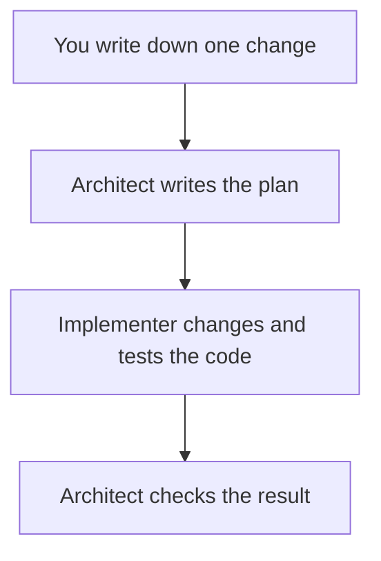
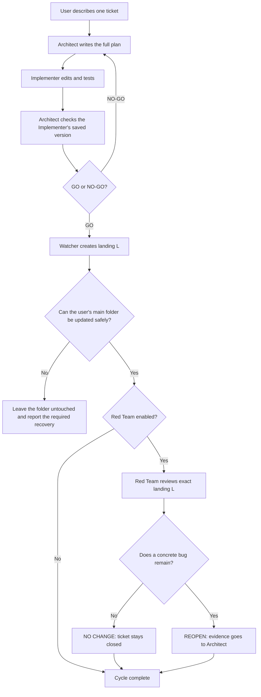
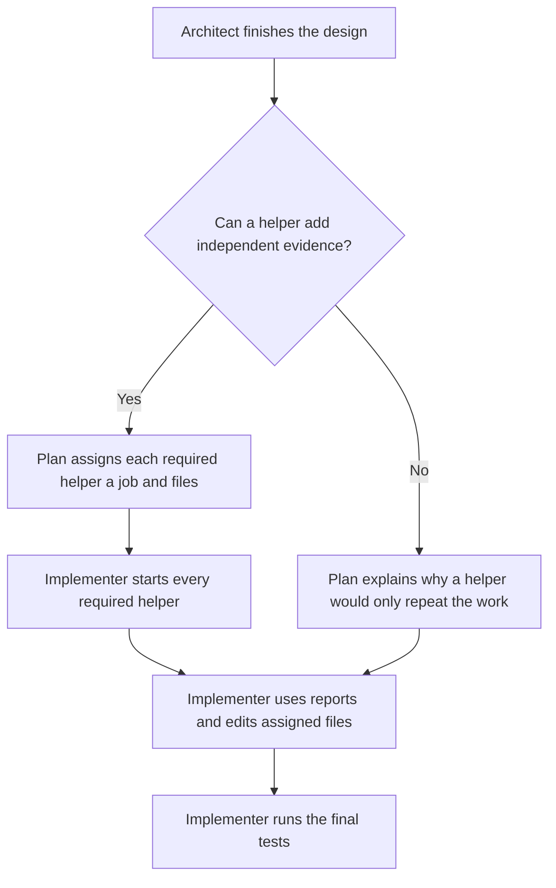
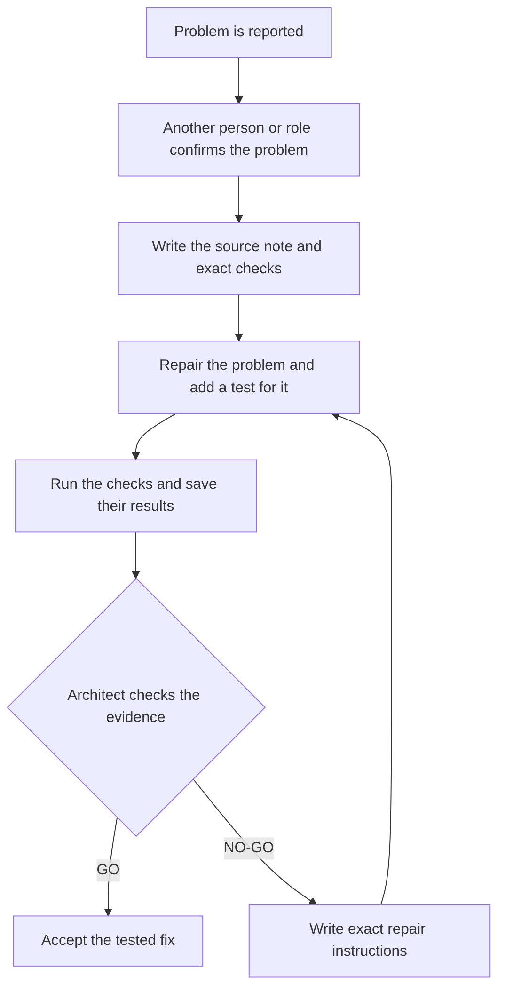
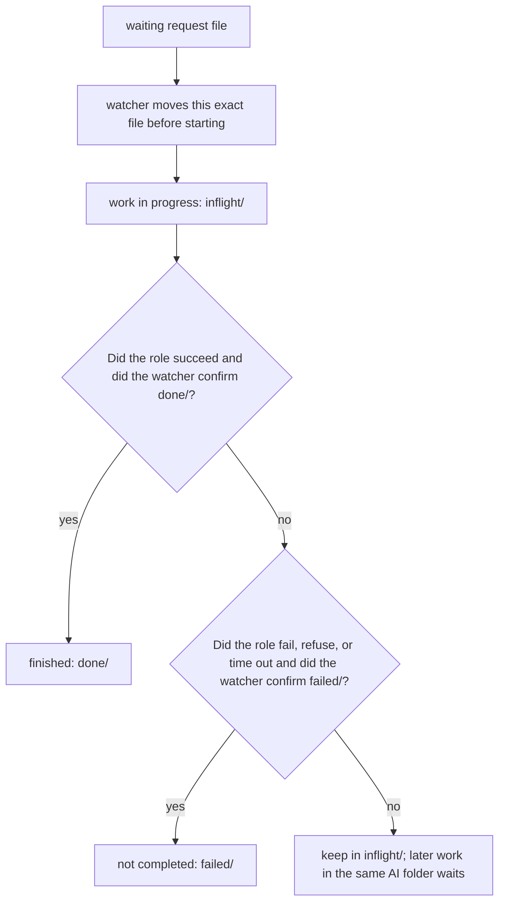
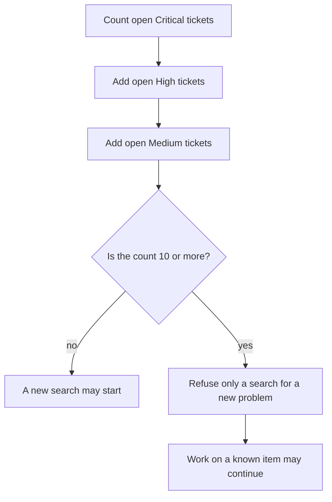
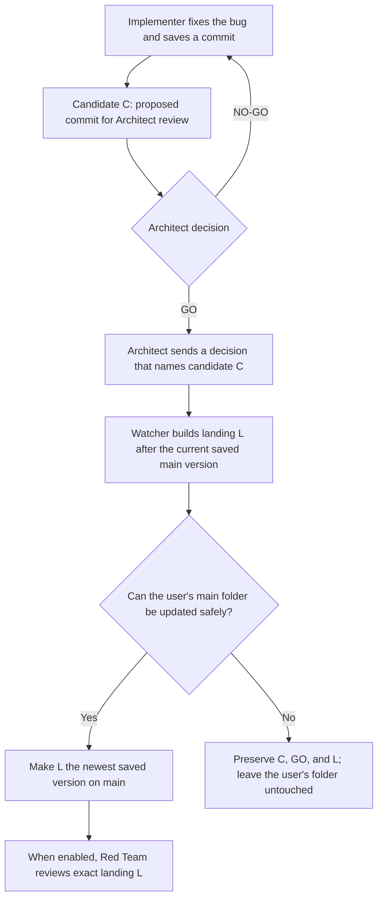
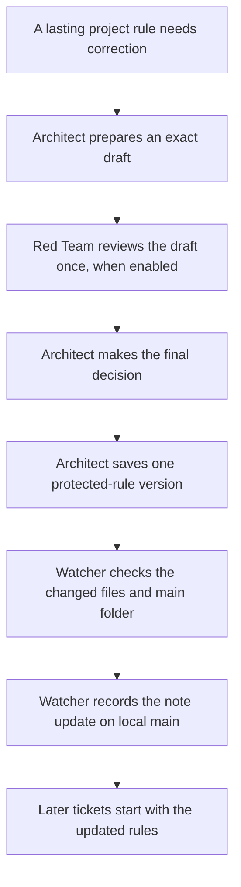
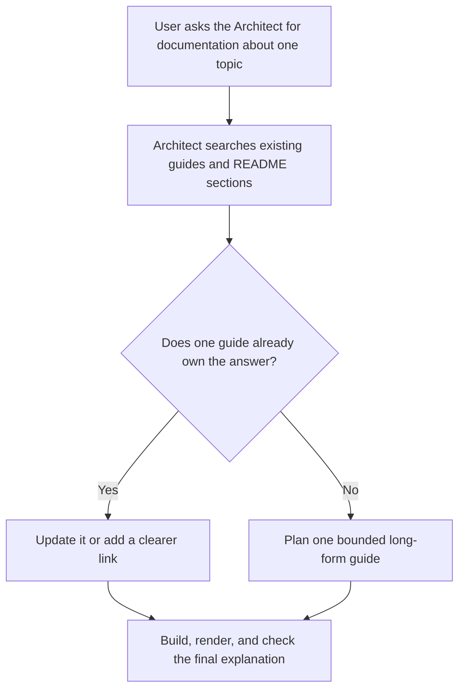

# CoCoA-Flow

**Careful AI workflows for scientific code**

<p align="center">
  
</p>

## Why split the work into three roles?

This system is useful when one powerful AI model is too expensive to use for
every part of development. Planning and review can be short. Reading files,
writing code, running tests, and repairing failures often use much more of an
account's allowance.

The work is therefore divided by responsibility:

- The **Architect** decides the design and writes complete instructions.
- The **Implementer** follows those instructions and performs the longer
  code-and-test work.
- The **Red Team**, optional for ordinary work, checks one named change for
  mistakes and sends a detailed repair proposal back to the Architect when it
  finds a defect.

You describe one small change to the Architect. The Architect plans it, the
Implementer makes and checks the change, and the Architect decides whether
the result is ready. For ordinary work, Red Team may inspect the accepted
change afterward. Changes to the trusted workflow itself use the protected
exception explained later in this guide.

The Architect and Red Team do the independent reasoning. Their instructions
must be detailed enough that a simpler or less expensive Implementer does not
have to invent the design.

If one model can plan, write, test, and review every change without exceeding
the available allowance, this division is optional. It is mainly for students
and developers who need to reserve costly model use for the decisions that
matter most.

The emulator library itself is documented in the top-level
[`README.md`](../README.md). Its science rules, tests, and Python writing
rules still apply when an AI role makes a change.

## Contents

### Main guide

1. [Why split the work into three roles?](#why-split-the-work-into-three-roles)
2. [Start here](#start-here)
3. [Complete one small ticket](#complete-one-small-ticket)
4. [Roles, models, and decisions](#roles-models-and-decisions)
5. [Choose which discoveries may become tickets](#choose-which-discoveries-may-become-tickets)
6. [Close or reopen a ticket](#close-or-reopen-a-ticket)
7. [Notes, tests, and gates](#notes-tests-and-gates)
8. [Fix-only maintenance](#fix-only-watches)
9. [Choose and run a command-line tool](tools/README.md)

### Common questions raised by developers

**[Appendices about roles and work folders](#appendices-about-roles-and-work-folders)**

- [FAQ A1. How does a mailbox message move?](#appendix-a--how-does-a-mailbox-message-move)
- [FAQ A2. What if the watcher cannot tell whether a message finished safely?](#faq-a2-unverified-outcome)
- [FAQ C1. Why can some AI jobs run together while others must wait?](#appendix-c--how-do-queues-and-lanes-work)
- [FAQ C2. Where does Sol work?](#faq-c2-sol-worktree)
- [FAQ C3. What are the internal role names in saved files?](#faq-c3-internal-role-names)
- [FAQ D1. Why can the tool refuse a new Red Team search?](#appendix-d--what-is-the-demand-guard)
- [FAQ D2. Can Sol change the code?](#faq-d2-can-sol-change-code)
- [FAQ F1. Which folder does each role use?](#appendix-f--what-is-the-worktree-topology)
- [FAQ F2. Can I create another work folder for myself?](#faq-f2-other-worktrees)
- [FAQ G1. What do candidate C and landing L mean?](#faq-g1-candidate-and-landing)
- [FAQ H1. How does the Architect update a protected rule?](#faq-h1-permanent-note-update)

**[Appendices about additional documentation](#appendices-about-additional-documentation)**

- [FAQ I1. What if I need a longer explanation of one feature or script?](#faq-i1-feature-documentation)

**[Tool commands, stopping, setup, recovery, and transfers](tools/README.md#common-questions-raised-by-developers)**

- [When can I interrupt the watcher?](tools/README.md#appendix-b--when-is-it-safe-to-stop-the-watcher)
- [What does `--cycle` count?](tools/README.md#faq-b2-cycle-count)
- [What should I check first?](tools/README.md#appendix-e--how-do-i-troubleshoot-a-run)
- [What should I do if the tool rejects a saved AI folder?](tools/README.md#faq-e2-primary-recovery)
- [How do I set this up on another computer?](tools/README.md#appendix-g--how-do-i-install-this-on-another-machine)
- [How can two people transfer unfinished work?](tools/README.md#appendix-h--how-can-i-send-unfinished-work-to-someone-else)

## Start here

You do not need prior experience with AI roles or Git's extra work folders.
You need Git, Python 3, and the Claude command-line program. The Codex
command-line program is needed only when the Sol role is enabled. See the
[setup guide](tools/README.md#appendix-g--how-do-i-install-this-on-another-machine)
before continuing on a new computer.

Start with one request moving through four steps:



That is the whole mental model needed to begin. The next section walks through
one small change. It introduces each tool word only when that word becomes
useful.

The first Architect plan and the Implementer's coding turn use the effort
chosen for those roles. Later checks are narrower: the Architect audits one
saved candidate, the Red Team reviews one landing, and the Architect may
decide one reopening. By default, those routine checks use `medium` reasoning
effort through `--review-effort`. Their machine-generated identity and state
records remove repeated bookkeeping, but the reviewing role still judges the
evidence.

For a closure review, the daemon also supplies the exact ticket title, landing
commit, severity, reopen count, and legal `NO CHANGE` or `REOPEN` outputs. The
small script supplies facts; it does not decide whether a bug remains.
The shorter prompt also omits discovery rules that do not apply to this
bounded review.

This guide calls one requested change a **ticket**. A ticket can be a bug fix,
a small feature, or a documentation repair. It should be small enough for one
clear plan and one final decision.

### Talk only to the Architect

Give every ticket request, clarification, policy choice, and scope change to
the Architect. Do not write instructions to the Implementer or Red Team. If
you want a Red Team review, tell the Architect, for example:

```text
Please instruct the Red Team to do a widespread search for ...
```

The tools carry the Architect's instructions to the other roles. The user does
not have to learn the internal addresses or rewrite those instructions.

## Complete one small ticket

The example below adds a hypothetical `--version` option. Use a small ticket
first; it makes each moving part visible.

### 1. Preview without changing anything

From the project folder that contains both `README.md` and `ai/`:

```bash
python3 ai/tools/mailbox_daemon.py --dry-run
```

Expected result on an empty installation: the command prints the three AI work
folders that a command which writes files would create, reports that no
request is waiting—the literal output says `mailbox empty`—and changes
nothing. If requests are waiting, it also prints the role
command and working folder that a command which writes files would use. No
AI work folder or request file is created.

### 2. Create the agent work folders

On a newly installed copy with no local edits, run this one-time setup before
writing a request that Git has not saved:

```bash
python3 ai/tools/mailbox_daemon.py --once
```

Expected result: on a clean installation, the tool creates and saves three Git
*worktrees*. A worktree is simply another project folder that Git creates and
remembers. Each role receives its own working files.

- The Architect uses `mailbox-primary` for plans, audits, and records.
- The Implementer changes source code in `mailbox-implementer`.
- Sol uses `mailbox-sol` for optional Red Team review.
- Your original repository folder remains yours. No ordinary AI job starts
  there.

The command reports the saved paths, checks for waiting requests, and exits.
An empty first run prints that no request is waiting.

Open the saved Architect coordination folder reported by `--once` for the
next step.
A newly created worktree starts from the latest saved Git version, so it cannot
see a source note that Git has not saved in another project folder.

If the command finds old saved request files or a watcher in another project folder,
it refuses instead of guessing which mailbox is correct. Preserve every path
it names and follow the
[tool recovery guide](tools/README.md#appendix-e--how-do-i-troubleshoot-a-run).

If none of the old AI work needs to be kept, CoCoA-Flow also provides an
explicit destructive reset:

```bash
python3 ai/tools/mailbox_daemon.py --clean-all
```

This command discards every extra local CoCoA-Flow work folder and branch,
including unfinished AI edits. It never runs automatically. Read
[Remove every AI work folder](tools/README.md#remove-every-ai-work-folder)
before using it; a later `--once` creates fresh role folders.

### 3. Write the source note

A **source note** is the Markdown file that records the requested behavior,
the limits on the change, and the checks that must pass. It remains the
authoritative instruction if a later message is shorter or unclear.

In the saved Architect coordination folder, create a temporary source note
such as `ai/notes/version-flag.md`:

```markdown
# Version flag

## Goal

Add `--version` without changing normal training behavior.

## Acceptance checklist

- `python3 train.py --version` exits successfully.
- Existing training tests still pass.
- A regression test checks the printed version.
```

Good notes answer four questions:

1. What behavior is wanted?
2. What must not change?
3. Which files or subsystem are in scope?
4. What command proves success?

### 4. Start the watcher

This example uses Opus as Architect and Sonnet as Implementer:

```bash
python3 ai/tools/mailbox_daemon.py --watch \
  --architect-model opus \
  --implementer-model sonnet
```

Keep this terminal open. The **mailbox** is the set of folders that holds
saved requests. The **watcher** checks those folders every 20 seconds, starts
the correct role, and prints progress while an AI job is running.

The models are command-line choices. The roles are stable: the Architect still
finishes the design, writes the complete ordered plan, and checks the ticket.
The Implementer follows that plan and makes the requested change.

The two roles do not need to use the same AI provider. For example, the
Architect can use Claude while an open-weight model served by
[Ollama](https://ollama.com/) is the Implementer:

```bash
ollama signin
ollama pull glm-5.2:cloud
python3 ai/tools/mailbox_daemon.py --watch \
  --architect-model opus \
  --implementer-provider ollama \
  --implementer-model glm-5.2:cloud \
  --claude-context 64000
```

The documentation uses `glm-5.2:cloud` whenever an Ollama model is not
otherwise specified. It requires an Ollama account, and the prompts and
responses are processed by Ollama's cloud service. `ollama signin` connects
the local Ollama program to that account; `ollama pull` makes the cloud model
available before the unattended watch begins. The watcher uses Ollama's
[headless Claude Code integration](https://docs.ollama.com/integrations/claude-code),
so the open-weight model can inspect the isolated Implementer worktree, edit
files, run tests, and return the same evidence as a Claude Implementer. Claude
Code is the tool shell in this setup; the Implementer model and its inference
service are Ollama, not Anthropic.

Before starting a long run, check the selected services without opening a
ticket:

```bash
python3 ai/tools/mailbox_daemon.py --ping --skip-redteam \
  --implementer-provider ollama \
  --implementer-model glm-5.2:cloud
```

This checks the Claude Architect and Ollama Implementer. Remove
`--skip-redteam` to check Sol as well. The old `to-opus` mailbox name still
means “Implementer”; it does not mean that Opus or any Claude model is required.

The default watch makes the optional Sol Red Team available. For an
Architect-and-Implementer run only:

```bash
python3 ai/tools/mailbox_daemon.py --watch --skip-redteam
```

`--no-red-team` is another name for the same option. Existing Red Team
requests remain waiting for a later three-role watch.

### 5. Send the ticket to the Architect

A **ticket** is one requested change described by one source note. In another
terminal, send this ticket to the Architect:

```bash
python3 ai/tools/mailbox_daemon.py --send architect \
  --unit "Please coordinate the version-flag ticket in ai/notes/version-flag.md."
```

Expected result: the tool saves one numbered request for the Architect. The
user selects the plain `architect` target; the tools handle the internal
address.

### 6. Follow GO or NO-GO

For a read-only summary, run this from the saved Architect coordination folder:

```bash
python3 ai/tools/handoff_router.py --status
```

The Architect records exactly one decision for the named ticket:

- **GO**: the checks support accepting the change. After the Architect job
  exits, the watcher safely saves that accepted change on local `main`, the
  repository's accepted local version.
- **NO-GO**: the ticket is held, and the Architect names the smallest repair
  needed for another review.

Stop the watcher only at a printed safe interval, or use `--cycle` for an
automatic exit. The [safe-stop and cycle guide](tools/README.md#appendix-b--when-is-it-safe-to-stop-the-watcher)
explains both.

### How does an accepted change reach `main`?

After the Implementer finishes, the Architect checks the exact saved change.
`GO` accepts it. `NO-GO` sends it back with focused repair instructions.

After `GO`, the watcher saves the accepted change on local `main` only when
the user's main folder is clean and unchanged. If that safety check fails, it
preserves the accepted work, leaves the user's folder alone, and reports what
must be fixed before another attempt.

The optional Red Team reviews the exact saved result afterward. The
[Git appendix](#faq-g1-candidate-and-landing) explains the internal names
**candidate C** and **landing L**, and shows the focused check that proves they
are distinct.

### Where things live

| Path | Purpose |
| --- | --- |
| `ai/README.md` | This operating guide |
| `ai/notes/` | Long-term project rules and local ticket records |
| [`ai/tests/`](tests/README.md) | Small checks and scripts that rebuild earlier failures |
| [`ai/gates/`](gates/README.md) | Larger checks that may need scientific data or hardware |
| [`ai/tools/README.md`](tools/README.md) | Commands, setup, stopping, and recovery |

The tools save three kinds of working record:

| Location | What it tells you |
| --- | --- |
| `ai/notes/mailbox/done/` | Which request finished |
| `ai/notes/relay/` | What the AI role printed |
| Source or review note | What was requested, checked, and decided |

### The one rule to remember

The mailbox request is only a pointer. The cited source note carries the
substance.

If a chat message, mailbox request, and source note disagree, the source note
wins. A later developer should be able to resume from repository records
without reconstructing the chat.

## Roles, models, and decisions

Models can change from run to run. Authority does not.

| Role | Responsibility |
| --- | --- |
| **Architect / Auditor** | Thinks through the design, writes the complete plan, checks the evidence, and decides `GO` or `NO-GO` |
| **Implementer** | Follows the ordered plan, changes only the named ticket, and reports the test results |
| **Independent Red Team** | Reviews an accepted change and returns nonbinding advice. It may also investigate a new problem when the Architect requests that search. |

The user still sends every request to `architect`. Saved files use older
internal role names; [FAQ C3](#faq-c3-internal-role-names) explains them only
for readers who need to inspect those files.

### How the three bots work now

The user sends every ticket to the Architect. The **watcher** is the Python
program that carries the saved requests between roles. It is not a fourth bot
and does not make design decisions.

The diagram calls the Implementer's exact saved proposal the **candidate**.
It calls the watcher's accepted commit on `main` **landing L**. These names
are explained in more detail in [FAQ G1](#faq-g1-candidate-and-landing).

The diagram shows one ticket. Read it from top to bottom.



#### The required path

1. The **Architect** turns the request into complete, ordered instructions.
2. The **Implementer** follows those instructions, changes the named files,
   runs the named tests, and returns the real output.
3. The **Architect** audits the Implementer's saved Git commit. This saved,
   unchanging version is the **candidate**. `NO-GO` sends focused repair
   instructions back to the Implementer; `GO` accepts only that candidate.
4. After the Architect process exits, the **watcher** creates the **landing**,
   a separate Git commit built directly after the current saved version on
   `main`. It then checks that the user's `main` folder is clean and unchanged
   before making the landing the newest saved version on `main`. If the check
   fails, it preserves the decision and both saved commits without changing
   the user's folder.

An unfinished edit in the user's folder requires cleanup followed by a
watcher restart. If another saved version became the newest version on `main`
after L was created, the watcher preserves the work and reports
`STALE — REQUIRES INTEGRATION REVALIDATION`. This is usually a narrower check
than repeating the original candidate audit. [FAQ G1](#faq-g1-stale-integration)
explains the distinction.

For an ordinary ticket, only the Implementer edits source code. The Architect
reads the candidate and decides; it does not merge or push the ticket. The
watcher performs the limited Git step. It updates a role folder only when no
AI job is using it and the folder has no edits that Git has not saved.

#### What the optional Red Team adds

The Red Team is deliberately outside that approval path for an **ordinary
ticket**. It reads the exact landing after the Architect has decided. Its answer
is `NO CHANGE` when the review finds no remaining bug, or `REOPEN` when it has
concrete evidence that the ticket needs more work. It never supplies a
required `GO` and cannot veto an ordinary landing.

This is why the Red Team is optional. The Architect has already audited the
candidate before accepting it. Use the extra review when the token budget
permits it; use `--skip-redteam` when Architect and Implementer must work
alone. Skipping Red Team does not reduce the Architect's planning or audit
duties.

#### AI tools are maintained outside the watcher

No mailbox ticket may change a file under `ai/tools/`. These files decide
which work can run and reach `main`, so the workflow never proposes or lands
its own replacement.

Red Team may audit these files and send a well-explained `NEW TICKET` finding.
The Architect records the ticket as Open, but sends no Implementer handoff.
The ticket waits until the user asks Codex in the external interface to inspect,
test, commit, and push the repair.

The daemon checks this rule before Implementer launch, again when it examines
a candidate, and once more before landing. The
`protected-control-plane` name cannot turn an `ai/tools/` change into an
Implementer ticket. Old saved tool requests stay parked for inspection and
are never revived by restarting the watcher.

This hard boundary applies only to `ai/tools/`. Protected changes under
`ai/notes/` are the reason the protected exception exists. They still use the
Architect-only guarded route and its required review; they are never sent to
the Implementer.

The watcher also records local `main`, `origin/main`, and the user's checkout
immediately before an Implementer starts. It compares those Git facts after
the turn. If one moved, the watcher parks the request and any new Architect
handoff, preserves the Implementer worktree, lands nothing, and stops. This
catches an ordinary attempt to bypass the workflow. It cannot prove which
process moved Git state or defend against a deliberately hostile process
running as the same operating-system user.

#### How work can overlap

The Implementer may edit ticket 3 while the Architect checks ticket 2 and Red
Team reviews ticket 1. They use different folders or saved, read-only Git
versions. This overlap is allowed only when the `--cycle` limit has room for
all three tickets. [FAQ C1](#appendix-c--how-do-queues-and-lanes-work) explains
why two jobs never edit through the same folder.

#### One cycle means one ticket

For an ordinary ticket with Red Team enabled, a cycle ends after both events
below occur:

1. the watcher records the Architect-accepted landing; and
2. Red Team returns `NO CHANGE`, or the Architect decides GO or NO-GO after a
   Red Team `REOPEN`, for that exact landing.

A `REOPEN` does not finish the cycle by itself. The Architect reads the
evidence immediately. GO reopens the ticket at the same severity. NO-GO keeps
it closed and bars that same objection from reopening it again. The accepted
landing remains on `main` in either case.

With `--skip-redteam`, the landing finishes the cycle. For example,
`--skip-redteam --cycle 2` exits after two accepted tickets have landed.

An Open ticket about `ai/tools/` does not start a cycle. It waits for external
Codex maintenance.

The `--cycle` examples have exact limits:

- `--cycle 1` permits one ticket to start. With Red Team enabled, the watcher
  waits for that ticket's review before exiting.
- `--cycle 3` permits three tickets to start. Their work may overlap, but a
  fourth ticket cannot start.
- `--cycle 0` removes the ticket-count limit. The watcher exits only after no
  request for a role used in this run is waiting or being handled, and no
  backlog item remains Open. The Architect must still send each ticket; the
  watcher does not turn backlog text into a request.

#### If the watcher is interrupted

The watcher resumes from the saved record for the exact ticket; it does not
guess from differences between folders. [FAQ A2](#faq-a2-unverified-outcome)
explains what remains saved and what the user should inspect.

#### If Red Team reports a problem

Red Team sends the Architect a detailed note instead of editing the backlog.
The note preserves the reproduction and evidence, which saves Architect tokens
when that work reaches the front of the backlog. The
[close-or-reopen guide](#close-or-reopen-a-ticket) explains `REOPEN`,
`NEW TICKET`, and the Architect's later decision.

### The Architect must finish the plan before coding

The Implementer may be Sonnet, Haiku, an open-source model, or another less
expensive model. It should not have to invent the design while spending tokens
on code. The Architect decides the implementation before coding. Red Team
must give the same level of detail when it proposes a repair.

A **helper** is a short-lived AI session that handles one small job named in
the plan. The Architect first decides whether a separate helper can add an
independent result.



The Implementer checks helper reports, uses the relevant results, edits its
assigned files, and runs the final tests. Helpers do not choose the design;
their jobs come from the Architect's plan.

#### What a finished plan contains

The temporary ticket note must answer each question below before coding
starts.

| Question | What the Architect must write |
| --- | --- |
| Where does the work happen? | The Implementer's work folder and the saved project version where the ticket starts. |
| What changes? | Each file and function involved, followed by the edits in their required order. |
| What behavior is required? | The valid inputs, returned result, and what happens when an input is invalid. |
| How is the result proved? | The test to run, its command, and the result that means success. |
| What must remain untouched? | Unrelated files and behavior, plus any condition that requires the Implementer to stop. |

The purpose is simple: the Implementer should not have to guess. For example,
“fix invalid mailbox roles” is too vague. A finished plan can say:

- In `ai/tools/mailbox_daemon.py`, keep the mailbox role `user` invalid and
  require the message `unknown mailbox agent`.
- Keep the accepted roles `fable`, `opus`, and `sol` unchanged.
- Check this rule in `ai/tests/test_role_directive_contract.py`.

From the repository's top folder, run:

```bash
python3 -m unittest ai.tests.test_role_directive_contract
```

This command does not edit project files saved by Git. Success means 34 tests
run and the final line is `OK`.

The same ticket note also names the exact function or class, test, and command.
The user does not write that internal format. The
[handoff checker guide](tools/README.md#check-a-handoff-directive) explains
the exact internal fields and commands when they are needed.

#### The Architect decides whether helpers add value

The mailbox tools use **subagent** as their internal name for a helper. A
helper receives one specific job and the files it may read or edit. It is not
another mailbox role and does not decide how to divide the work.

For a mailbox-parser repair with independent work, the plan might assign these
jobs:

- one helper reproduces the failure and returns the exact command and output;
- another reads the existing regression tests and identifies the missing
  case; and
- the Implementer reads both reports, uses the relevant results, edits its
  assigned files, and runs the final tests.

When the Architect requires helpers, the Implementer starts every planned
helper before making its own source edit. Helpers may run at the same time only
when they will not edit the same file. The Implementer waits for every required
report, checks and combines the accepted work, and runs the final commands.

Some tickets have no useful split. For example, one sentence and its existing
assertion may require the same short inspection. The Architect can record that
a helper would only repeat the work without adding independent evidence. The
Implementer must repeat that exact reason and cannot choose this exception.

#### If the first helper cannot start

If the first required helper cannot start, the Implementer stops before editing
and asks the Architect for a revised plan. The
[exact helper-failure record](tools/README.md#which-tool-do-i-use)
explains how the tools preserve the original error and check the revised plan.

#### How the plan is checked

Architect and Red Team each run the handoff checker before sending a note. The
[tools guide](tools/README.md#which-tool-do-i-use) gives the exact
commands and required note sections. A normal mailbox user does not edit those
internal rows.

Red Team can suggest a repair. Only the Architect decides whether to use it
and sends the final instructions to the Implementer.

If a directive is missing, contradictory, or leaves open a choice that could
change the result, the Implementer stops and reports the gap.

The phrase “Use your best judgment” is not an acceptable substitute for a
design decision.

### Limit the size of one ticket during maintenance

After a period of large development, you may want each maintenance ticket to
stay small. Start the watcher with a character limit:

```bash
python3 ai/tools/mailbox_daemon.py --watch --max 1200
```

Expected startup line:

```text
ticket character limit: 1200 added plus deleted characters per ticket
```

For each ticket, the Architect records the starting Git commit. Before
`GO`, the Architect compares that saved version with the proposed final
commit. Every added character and every removed character counts, including
spaces and line breaks. Adding 40 characters and removing 10 gives a total of
50; `--max 50` accepts that size, while `--max 49` does not.

The limit is not a target and does not permit dense or unfinished code. The
Architect must also issue `NO-GO` for unclear names, packed statements,
collapsed logic, missing explanations, omitted tests, or a partial fix made
only to stay below the number. The finished Python must remain readable to a
C programmer and a physics undergraduate learning Python. If the smallest
complete and readable change does not fit, the Architect asks you to split
the ticket or raise the limit.

The default is `--max 0`, which means no character limit. Readability, tests,
and all other review requirements still apply. This zero is unrelated to
`--cycle 0`, which controls when the watcher exits.

The [ticket-size questions](tools/README.md#appendices-about-ticket-size)
explain the exact count and the cases the guard refuses.

### Architect language is GO or NO-GO

Only the Architect decides whether the evidence is sufficient.

- `GO` authorizes the named ticket to advance.
- `NO-GO` holds it and identifies the failed claims and smallest required
  repair.
- “Pass” and “fail” may describe a test, but they do not replace the decision.

After reviewing an Implementer candidate, the Architect also ends its terminal
answer with a short human assessment. It says whether the result was `EXACT`,
`CLOSE`, `PARTIAL`, `OFF TARGET`, or `BLOCKED`; what was done well; what
remains; whether the file scope was respected; and what happens next.

For example:

```text
Architect review: NO-GO
Implementer result: CLOSE
Review history: Not accepted after 1 Implementer attempt.
What went well: The scientific check is in the correct function.
What remains: The adapter-level refusal still needs direct evidence.
Scope: All changed files were authorized and no protected file changed.
Next action: Return one bounded evidence repair to the Implementer.
```

This describes one exact candidate. It does not grade the model or replace the
formal `GO` or `NO-GO` decision.

The Architect owns any accepted edit to the permanent notes and may commit
those eleven notes separately in the Architect coordination branch. The
Implementer and Red Team do not inherit that authority.

`ai/notes/role-contract.yaml` is a separate protected machine contract. It
records stable role permissions, timing limits, role worktrees, and the files
an Implementer may not change. The tools check these values before work
starts. It is not a twelfth permanent Markdown note. Only the
Architect may edit it, through protected-policy administration; the
Implementer and Red Team may read it but never change it.

The nearby
[`implementer-failure-modes.yaml`](notes/implementer-failure-modes.yaml) is a
small protected reference catalog. It points from eight common problems to
responses the tools already enforce. The Implementer and Red Team may read it
but cannot change it. It creates no second policy framework; the code and
`role-contract.yaml` remain the sources of truth.

For an ordinary ticket, the Architect checks the Implementer's proposed saved
change and sends the decision. After the Architect exits, the watcher alone
records the accepted version on local `main` when its safety checks pass.
[FAQ G1](#faq-g1-candidate-and-landing) gives the internal Git names for those
two versions.

### How a protected rule reaches `main`

The eleven permanent notes explain durable project rules. The Architect,
Implementer, and Red Team role files define the three roles.
`ai/notes/role-contract.yaml` is
the machine-readable record for configurable role-system settings. The
reader keeps role identities, saved worktree layout, trusted file locations,
and irreversible Git safeguards fixed until code provides an explicit
migration. Only the Architect may edit these files, through protected-policy
administration. The Implementer and Red Team may report a problem, but they
never change or commit one.

When Red Team is enabled, the Architect shows it the proposed wording once.
Red Team checks whether the change is necessary, whether a smaller change
would work, and whether it weakens another rule. Red Team returns one advisory
`GO` or `NO-GO` recommendation. The Architect makes the final decision. If the
Architect corrects the draft after a `NO-GO`, there is no second review round.
With `--skip-redteam`, the Architect records that this check was not
available.

This update waits until ordinary ticket work is idle. The Architect saves a
protected-rule change in the Architect folder. After the Architect exits, the
watcher checks that the change contains only protected policy files and that
the user's `main` folder is still safe to update. It then records that exact
change on local `main` and prepares the three AI folders for later work.

This update is not a ticket and does not use a cycle. Its one pre-change check
is different from a ticket's closure review. A normal user never has to write
its internal control fields. [FAQ H1](#faq-h1-permanent-note-update) explains
those fields for a maintainer who must diagnose this special path.

### When does the Red Team run?

The default three-role setup makes Red Team available. Starting the watcher
does not immediately start Red Team.

Red Team work begins in two ways:

1. After the watcher records an accepted ticket on local `main`, it
   automatically asks Red Team to review that exact saved version. This is
   the ordinary, advisory review.
2. The user may ask the Architect to arrange a separate search for a new bug.

The first review stays focused on the accepted ticket and the behavior it
directly affects. It is advisory: it does not delay or undo the Architect's
`GO` or the accepted local change.

The Red Team result does finish that ticket's counted cycle. A watcher with a
positive `--cycle` limit therefore stays open until the matching result
returns. Another ticket starts only when that limit still permits it.
[The cycle examples](tools/README.md#faq-b2-cycle-count) show `--cycle 1`,
`--cycle 3`, and `--cycle 0`.

A remaining bug produces `REOPEN`. A review that finds no remaining bug
produces `NO CHANGE`, not an approval.

It does **not** turn a ticket review into a broad attack on the library. A
widespread search happens only when the user begins the request with the
explicit command:

```text
Please instruct the Red Team to do a widespread search for ...
```

Send those words only to the Architect. The Architect records them in the
source note and decides whether the search may start. A user message never
starts Red Team work directly.

A Red Team finding is advice to the Architect. Even a detailed repair proposal
cannot change code by itself and is not an instruction to the Implementer.
The Architect decides whether the evidence justifies another ticket or
repair.

`--skip-redteam` removes the optional review for one watch. It does not weaken
the Architect's evidence review, and it does not invent a Red Team result.

## Choose which discoveries may become tickets

A **discovery** asks the Red Team to look for a new bug that could become a
separate ticket. `--severity` sets the minimum harm level for those new
tickets. The default is `medium`.

### Choose the minimum severity

| Setting | A finding qualifies when… |
| --- | --- |
| `high` | Evidence shows severe damage to core operation, saved data, or a primary scientific result, and explains why Medium is insufficient. |
| `medium` | It meets the High rule, or evidence shows a probable defect in normal operation. An improbable edge case does not qualify. |
| `low` | Evidence shows a concrete bug, including an improbable edge case. An unsupported guess does not qualify. |

Severity measures harm. Likelihood asks whether normal use can probably reach
the bug. A wrong primary scientific result may be High; a wrong optional plot
or report is normally Medium unless the same defect also changes a primary
result or stops a core workflow.

This setting applies only to new tickets. It does not excuse a defect in the
change under review, widen the review, select a model or role, or change what
a cycle means.

### Let the Architect classify the finding

The Red Team reports its rating, likelihood, and evidence. It does not edit
the backlog or instruct the Implementer. A proposed separate ticket begins
with `Backlog action: NEW TICKET`.

The Architect records the ticket so it is not lost. When the ticket reaches
the correct priority, the Architect may keep, raise, or lower the proposed
rating and writes the reason.

Only the Architect may assign **Critical**. Critical is not a `--severity`
choice and is reserved for broad failure of a central workflow or systematic
damage to scientific results. Features are never Critical.

### Put bugs and features in priority order

- Critical bugs come before every feature.
- A user-designated High feature comes before High bugs.
- High bugs come before a Medium feature.
- A Low feature waits for Critical, High, and Medium bug fixes.
- “After the backlog is closed” makes a feature Low and makes every ticket
  already open at that time a prerequisite.

### Know when discovery waits or is off

- A widespread search is Low and waits until no Critical, High, or Medium
  ticket is open.
- `--fix-only` permits no discovery.
- `--skip-redteam` and `--no-red-team` disable discovery with the Red Team.
- Ten open Critical, High, or Medium tickets block another discovery. Low
  tickets and waiting mailbox files do not count toward ten.

The [tool guide](tools/README.md#choose-the-minimum-discovery-severity) gives
the commands and the exact records saved for these decisions.

## Close or reopen a ticket

### Close an accepted ticket

An Architect `GO` closes the ticket for candidate C. The watcher then creates
landing L. If Red Team is enabled, it reviews exact L after the landing; it
cannot delay or undo that landing. The [earlier diagram](#how-does-an-accepted-change-reach-main)
shows C and L.

The Architect normally closes and seals the backlog entry immediately before
sending `GO`. If that bookkeeping step is accidentally omitted, the watcher
keeps C and the accepted `GO`, asks the Architect only to close the backlog
entry, and then resumes the landing. It does not rerun the Implementer or ask
the Architect to repeat the candidate review.

`NO CHANGE` means no remaining bug was found. `REOPEN` means the Red Team has
concrete evidence that the same ticket still needs work.

### Record a Red Team `REOPEN`

The **Red Team reopen count** starts at `0`, increases for every allowed
formal `REOPEN`, and never resets. It counts requests even when the Architect
later rejects the evidence.

| Event | What happens next |
| --- | --- |
| Red Team returns `NO CHANGE` | The ticket stays closed. |
| Red Team returns `REOPEN` | The same cycle stays active while the Architect reads the evidence. |
| Architect gives `GO` | The count increases and the ticket returns to Open at the same severity. The cycle then ends. |
| Architect gives `NO-GO` | The count increases, the ticket stays closed with a reason, and that objection is permanently barred. The cycle then ends. |

This required decision keeps the report from being lost. With `--cycle 1`, the
watcher does not exit between the Red Team `REOPEN` and the Architect's answer.

Before the Architect reasons, the watcher prints a short checked record: the
ticket title, landing, severity, reopen count, and the exact effects of GO and
NO-GO. After the Architect seals the backlog, it checks that the count changed
once and that the chosen outcome preserved the required severity and status.
The program checks bookkeeping; the Architect still judges the evidence.

### Stop repeated reopen requests

- A different defect uses `NEW TICKET`; it does not reopen the old ticket.
- From count `2` onward, the Red Team must identify new evidence. The
  Architect may lower the severity when the evidence no longer supports it.
- Count `6` automatically makes the ticket Low.
- After an Architect `NO-GO`, Red Team cannot reopen that ticket again.

The [tool guide](tools/README.md#review-a-closed-ticket) explains the detailed
record, and the [cycle appendix](tools/README.md#faq-b2-cycle-count) explains
when a finite watch exits.

## Notes, tests, and gates

### Notes are the source of truth

All important instructions belong in notes. Mailbox messages should be short
summaries that cite the relevant section.

The three checking tools have different jobs:

- A **test** asks one small question. For example,
  `test_parameter_table.py` gives the loader a table with one row and confirms
  that the loader returns a two-dimensional table. The
  [test guide](tests/README.md) explains each test file and gives the commands
  that run it.

- A **gate** is a larger named check whose required result is written down
  before it runs. A gate may run tests, compare a scientific answer, or use
  configured data or hardware. For example, the dataset-publication gate runs
  44 small publication tests. One test changes an already-copied file while a
  second file is being copied and requires the operation to stop. The gate
  prints `PASS` or `FAIL` for each of its six required results. Before the
  command runs, the board states which six results are required and what each
  must show. The command is not a general request to “check the code.”

- The **validation board** is the saved list of all gates. For example,
  `python3 ai/gates/run_board.py --list` prints each gate's name and its saved
  status, such as `not run` or a current `PASS`. When a gate is actually run,
  its output reports `UNAVAILABLE` if required data or hardware is missing.
  The Architect uses the list and the actual gate output when deciding `GO` or
  `NO-GO`.

Git's `main` branch is the public sequence of accepted project versions. Each
accepted fix enters `main` as one commit containing the fix, its tests, and
any tracked documentation it requires. The watcher combines the exact
candidate's ticket change into one distinct commit after the Architect exits;
Git calls this a **squash**. Intermediate attempts do not get their own main
commit. The Architect does not run that merge or push.

GitHub shows a commit's first line as its subject and the remaining Markdown
as its body. The watcher copies the Architect-approved candidate subject and
body into the landing commit without rewriting them. It adds only the two
machine lines needed to recover the exact ticket and candidate after a crash.
Those two labels are reserved, so a candidate message that already uses them
is refused instead of creating an ambiguous landing message. Changing their
letter case or adding space before the colon does not bypass that refusal.

Local status updates stay out of `main`. A workflow-rule change that is not
part of the scientific or code fix stays out of that fix commit. When the rule
is durable repository knowledge, the Architect reviews and commits it later
as a separate Architect-only change.

Exactly eleven Markdown notes are permanent repository knowledge:

1. `MEMORY.md`
2. `artifacts-inference-warmstart.md`
3. `conventions-and-workflow.md`
4. `data-generation-and-cuts.md`
5. `families-background-mps.md`
6. `families-scalar-cmb.md`
7. `models-and-designs.md`
8. `project-and-history.md`
9. `training-stack.md`
10. `python-changes-go-no-go.md`
11. `readme-go-no-go.md`

The protected `role-contract.yaml` beside them is machine policy, not a
Markdown knowledge note, so this list remains exactly eleven files.

`MEMORY.md` begins with the mandatory GO/NO-GO contract for changing any file
in this list. Permanent notes state current, reusable knowledge. Dates, ticket
numbers, role conversations, review waves, and temporary status belong in
local working records instead.

`python-changes-go-no-go.md` is mandatory for every tracked Python change, not
only for comments or documentation. The Architect reads the contract before
writing the directive and again before the final verdict. The contract protects
explicit, teachable Python even when a ticket has a character-change limit.

The backlog is the exception among working records: Git tracks it because its
Open tickets are valuable project work. Dated reviews, incident reports,
handoff registers, mailbox files, and relay logs remain local and are not
committed.

A clean clone already contains `ai/notes/backlog.md`. If it is missing,
restore it from the current `main` branch instead of inventing a replacement.
The ticket format is defined in
[`conventions-and-workflow.md`](notes/conventions-and-workflow.md#maintain-the-tracked-backlog-consistently).

### Protect the tracked backlog

Only the Architect may edit `ai/notes/backlog.md`. The Architect protects its
exact bytes with an Architect-owned SHA-256 check. SHA-256 produces a short
fingerprint: changing even one character produces a different result.
The backlog is operational state, not permanent policy. An Architect backlog
update does not require a protected-policy ticket or Red Team policy review.

Before accepting work from another role, the Architect confirms that the
backlog still has the expected fingerprint. After the Architect deliberately
adds, closes, reopens, or reclassifies a ticket, the Architect checks the
human-readable entry and then records the new expected fingerprint. The daemon
places that sealed version in the same landing commit as the ticket fix. The
Implementer and Red Team do not edit either the backlog or the saved value
used to check it. This is protection against accidental edits, not a claim
that a checksum can defeat a deliberately malicious program.

The [backlog guard guide](tools/README.md#protect-the-tracked-backlog) gives the
exact `check`, `initialize`, and `seal` commands.

The Implementer and Red Team never edit these eleven notes,
`ai/notes/role-contract.yaml`, or
`ai/notes/implementer-failure-modes.yaml`, regardless of the ticket type. The
Architect decides whether an accepted change modifies a general property
recorded there.
If it does, the Architect reviews and commits the note as a separate
Architect-only change. That new commit can then be the starting version for a
later implementation ticket.

Before handing work to either role, the Architect records the full starting
commit. The Architect runs the following command immediately before that
handoff and again before the final `GO`:

```bash
python3 ai/tools/permanent_note_guard.py \
  --repo EXACT_WORKTREE \
  --base FULL_STARTING_COMMIT
```

The capitalized values are placeholders. The Architect replaces
`EXACT_WORKTREE` with the Implementer's worktree path and
`FULL_STARTING_COMMIT` with the full starting commit recorded in the
directive. This is a read-only Architect check; the Architect does not edit
source in that folder.

The command calculates a SHA-256 fingerprint—a short identifier for exact
file bytes—from Git. It checks the notes in four places:

| Place checked | Plain meaning |
| --- | --- |
| Starting commit | The saved project version named by the Architect before work begins |
| Current `HEAD` | The latest saved commit in the Implementer worktree |
| Git staging area | Files selected for the next commit |
| Working files | Files currently visible in the Implementer worktree |

The expected fingerprints do not come from an editable checksum list. Only
the Architect's rerun counts; copied output from another role is supporting
evidence.

The command also compares `ai/tools/permanent_note_guard.py` with the starting
commit. This stops another role from changing both a protected note and the
program meant to detect that change. There is no separate checksum file that
could be changed to approve different bytes.

`readme-go-no-go.md` is also the Architect's plain-language contract. It
applies to README files that Git includes and to words inside Python meant to
teach or explain: comments, explanations placed under functions or classes,
command help, messages printed when something happens or fails, and other
explanatory strings.

### How does a reported problem become a tested fix?



A problem is first reported, then another person or role confirms the same
failure. The Architect writes the problem and exact checks in the source note.
The Implementer repairs the problem, adds a test, runs the checks, and saves
the results. The Architect reads that evidence.

`GO` accepts the tested fix. `NO-GO` sends exact repair instructions back to
the repair step.

A regression test keeps the same bug from returning unnoticed. It should prove
that it detects the original defect. Where practical, deliberately restore or
alter the bug and confirm that the test fails.

### Run the validation board

```bash
python3 ai/gates/run_board.py --list
python3 ai/gates/run_board.py --check
python3 ai/gates/run_board.py --dry-run
```

These commands list state, run the setup check only, and print the selected
gate commands. They do not claim that the full gates ran.

On a configured workstation:

```bash
python3 ai/gates/run_board.py
python3 ai/gates/run_board.py --gate ID
```

Hardware-only rows may be recorded explicitly. They are never silently
treated as passing.

<a id="fix-only-watches"></a>
## Fix-only maintenance

Fix-only maintenance uses two commands. First, save one general request:

```bash
python3 ai/tools/mailbox_daemon.py --send architect --fix-only true
```

This starts no AI role. It accepts no `--unit` or `--severity`.

Then start the watcher with those choices:

```bash
python3 ai/tools/mailbox_daemon.py --watch --fix-only true \
  --severity high --cycle 5 --max 10000
```

The watcher owns the choices:

- `--severity high` allows Critical and High bug fixes;
- `--cycle 5` allows at most five tickets, with one ticket per cycle; and
- `--max 10000` limits each ticket to 10,000 added plus deleted characters.

`medium` also allows Medium bugs; `low` also allows Low bugs. New
functionality, discovery, and parked Low edge cases remain excluded.

After the Architect sends one Implementer plan, the daemon saves the same
request again. It waits behind the current ticket, then asks for the next
eligible bug. A reached cycle limit leaves it for a later fix-only watch.

Use a positive `--cycle` limit when Open feature tickets remain. `--cycle 0`
waits for every Open backlog item, including features that fix-only mode does
not select.

Model options and `--skip-redteam` also belong on the watcher. The
[tool guide](tools/README.md#fix-only-watches) explains the exact behavior.

## Choose and run a command-line tool

The scripts under `ai/tools/` have different jobs. The
[tool command guide](tools/README.md) provides a task-based chooser, daily
commands, current option reference, safe stopping instructions, setup,
recovery, and unfinished-work transfer.

The first-ticket commands above are enough for a normal run. Use the separate
guide when you need another request to the Architect, a manual clipboard
relay, a protected-note check, a fix-only combination, or an exact
command-line option.

# Common questions raised by developers

## Appendices about roles and work folders <a id="appendices-about-roles-and-work-folders"></a>

### FAQ A1. How does a mailbox message move? <a id="appendix-a--how-does-a-mailbox-message-move"></a>

The watcher carries each saved request through three simple states: waiting,
being handled, and finished. The user normally sends a request and lets the
watcher move it.

#### Check what happened

A finished request appears in `ai/notes/mailbox/done/`. A request under
`inflight/` is still being handled or needs the recovery check in
[FAQ A2](#faq-a2-unverified-outcome). Do not move either file by hand.

#### Why the watcher moves the file first

The mailbox is a set of folders. Each request is a small Markdown file, which
is a text file ending in `.md`. Just before starting a role, the watcher moves
that exact file into `inflight/`, the folder for work in progress. Moving it
first prevents another watcher from starting the same request.

When the role finishes, the watcher tries to move that same file to `done/`
or `failed/`.



Messages ending in `-to-user.md` are replies for a person to read. The watcher
never starts an AI role from those files. The separate
[`--ping` connection check](tools/README.md#check-whether-claude-and-sol-can-answer)
contacts the configured services directly and creates no mailbox message.
Implementer and Red Team ticket results return internally to the Architect
instead of starting a separate user conversation.

### FAQ A2. What if the watcher cannot tell whether a message finished safely? <a id="faq-a2-unverified-outcome"></a>

Leave the uncertain request where it is. Read the original request, the log
named by the watcher, and any matching file in `done/` or `failed/` before
deciding what happened. Do not requeue or move the file by hand.

#### If the request remains in progress

A request left in `inflight/` means that the role started but the watcher
could not confirm the final result. Later work that needs the same AI folder
waits so that two jobs never edit uncertain files at the same time.

An Implementer that reaches 90 minutes pauses after a completed tool action.
It saves a clean progress commit and asks the Architect whether the approach
should continue, become smaller, or be replaced. This pause is still part of
the same ticket and cycle. Work resumes only after the Architect answers.

An Implementer that is about to lose detailed conversation context pauses for
a different reason. It records what is finished, what failed, which approaches
must not be repeated, any uncommitted files, and the next exact action. After
the Architect accepts that checkpoint, a fresh Implementer reads the saved
record and checks the repository before continuing the same ticket. The
watcher does not rewrite the record as its own summary, create candidate C, or
close the cycle at this pause.

`--dispatch-timeout MINUTES` sets a later emergency limit and defaults to 120
minutes. At that limit, the watcher stops the AI program, saves a timeout record
under `ai/notes/mailbox/.dispatch-history/`, and tries to move the request to
`failed/`.

If it cannot confirm both the record and the move, it keeps the request in
`inflight/`. A program that exits without an error is not marked finished
until the watcher confirms that the same request reached `done/`.

#### If an accepted change has not reached `main`

A run can stop after the Implementer saves a proposed change but before the
watcher records the accepted version on local `main`. Restart the watcher; it
uses the saved record for that exact ticket. [FAQ G1](#faq-g1-candidate-and-landing)
explains the Git names for those two saved versions.

The watcher does not compare the separate Architect folder with `main` or use
a **changed-line count**, the number of added or removed lines, to invent
another ticket.

#### If the push fails

After recording the accepted version locally, the watcher tries once to send
it to the repository on GitHub. Git calls this action a **push**. If the push
fails or cannot be confirmed, the accepted local change remains on `main`.

The watcher saves **push debt**, its name for a local record containing the
exact saved version and push command still owed. It does not reopen or accept
the ticket a second time.

#### If the command was a preview

`--dry-run` only prints what would happen. It starts no role and moves no
mailbox file.

### FAQ C1. Why can some AI jobs run together while others must wait? <a id="appendix-c--how-do-queues-and-lanes-work"></a>

Different roles may work at the same time because they use different folders.
Two jobs that need the same folder wait for each other; otherwise, they could
overwrite or commit each other's unfinished work.

#### Let the watcher schedule the jobs

The user does not assign folders or start overlapping work by hand. Send each
ticket to the Architect and let the watcher decide which saved folder is
available. If `--cycle` limits the number of tickets, another ticket starts
only while that number has not been reached. [FAQ B2](tools/README.md#faq-b2-cycle-count)
gives concrete examples.

For example, the Implementer may change ticket B while the Architect audits
ticket A and Red Team reviews an earlier accepted change:

| Role folder | One job that can be running there |
| --- | --- |
| Architect | Write the next plan or audit a proposed saved change |
| Implementer | Change the named files and save the proposed change |
| Red Team | Review an earlier accepted saved change |

Only the Architect issues `GO`. The Implementer supplies the exact saved
version for that decision. [FAQ G1](#faq-g1-candidate-and-landing) explains
the internal names candidate C and landing L.

The ticket's Markdown instruction file and the names of its saved Git versions
connect the roles. They do not need to share unfinished source edits.

#### Words that appear in the logs

These three real status lines use the tool's internal words:

```text
1 turn in flight; not safe to stop.
dispatch preparation admitted; not safe to stop.
newer messages queued in this working-directory lane: 2
```

- A **turn** is one role handling one request. The first line says one role is
  still working.
- A **dispatch** is the watcher starting that work. The second line says the
  watcher is preparing to start a role.
- A **lane** is the one-at-a-time sequence for one shared work folder. The
  third line says two later requests need that same folder and must wait.

The number at the beginning of a request filename gives its order inside the
same lane.

### FAQ C2. Where does Sol work? <a id="faq-c2-sol-worktree"></a>

Sol works outside the user's main folder and never edits source code. For a
review, it reads a temporary, read-only folder that shows exactly the saved
version named in the request.

#### What the user needs to do

Nothing needs to be copied into Sol's folder. Start the normal watcher when a
Red Team review is wanted. Use `--skip-redteam` or `--no-red-team` for a
two-role run; existing Sol messages remain waiting for a later normal watch.

#### How the folders keep the review stable

On the first live run, the watcher creates a separate Sol worktree and
remembers it. A Git **worktree** is another project folder that Git creates
and remembers. Later runs reuse it as Sol's role folder.

For each review, the watcher also creates a temporary read-only view of the
exact accepted saved version. Later Implementer work therefore cannot change
what Sol is reading.

Sol can read the Architect coordination worktree's `ai/notes/` folder so all
roles use the same source notes and mailbox records. A Red Team result may
write its review note there, but it does not change the library source.

No AI role enters the user's main folder to land a ticket. After Architect
`GO`, the watcher alone performs the checked update described in
[How does an accepted change reach `main`?](#how-does-an-accepted-change-reach-main).

### FAQ C3. What are the internal role names in saved files? <a id="faq-c3-internal-role-names"></a>

Most users do not need these names. Send every request to `architect` and let
the watcher choose the saved-file address.

When diagnosing a saved request, use this translation:

| Saved-file address | Role |
| --- | --- |
| `to-fable` | Architect |
| `to-opus` | Implementer |
| `to-sol` | Red Team |

The role instructions live in `.claude/FABLE_ROLE.md`,
`.claude/OPUS_ROLE.md`, and `.codex/REDTEAM_ROLE.md`. A saved-file address or
filename does not select a model or change a role's authority. Model choice
comes from the watcher command.

### FAQ D1. Why can the tool refuse a new Red Team search? <a id="appendix-d--what-is-the-demand-guard"></a>

The tool pauses optional searches when important known work already needs
attention. Fixing accepted problems takes priority over asking Red Team to
look for more.

#### What to do after a refusal

Continue work on the recorded Critical, High, and Medium tickets. When fewer
than ten remain, the Architect may send another ordinary search. A widespread
search waits until none of those three groups remains open.

#### How the tool makes the decision

The tool counts the open tickets in `ai/notes/backlog.md`:

```text
Critical tickets + High tickets + Medium tickets
```

If this count is ten or more, the tool refuses a request for Sol to search for
a new problem. Low tickets and waiting mailbox requests do not change this
count.

An unclassified `- OPEN` line also refuses discovery until the Architect adds
its priority and type. This prevents a spelling or formatting mistake from
hiding work from the limit.

The refused proposal remains local and is not added as an Open ticket. Work
that closes a known item may continue.

A widespread search is stricter. It is automatically Low and starts only when
the Critical, High, and Medium count is zero.



### FAQ D2. Can Sol change the code? <a id="faq-d2-can-sol-change-code"></a>

No. Sol has one optional job: Red Team review. It reads one named saved
project version and sends advice to the Architect. It does not implement a
ticket, edit source files, approve a change, or combine Git work.

#### Choose whether Sol runs

Use `--skip-redteam` when a run should use only Architect and Implementer.
This option leaves Sol idle; it does not turn Sol into another Implementer.

#### Send every request through the Architect

The user still talks only to the Architect. A request for a Red Team review or
widespread search goes to the Architect, who writes the internal Sol handoff.

### FAQ F1. Which folder does each role use? <a id="appendix-f--what-is-the-worktree-topology"></a>

The user keeps the repository's main folder. Each AI role uses a separate
folder that the watcher creates and remembers.

| Who | Folder used |
| --- | --- |
| User | The repository's main folder |
| Architect | `mailbox-primary` for plans, decisions, and records |
| Implementer | `mailbox-implementer` for source-code changes |
| Sol | `mailbox-sol` for optional Red Team records |

#### What the user should do

Run, explore, and make personal changes in the main folder. Do not copy ticket
work into an AI role folder. The first mailbox command that can start or send
work creates the AI folders; a dry run only previews them.

#### How reviews avoid unfinished files

For a source review, the watcher creates a temporary read-only folder showing
the exact saved version under review. The Architect and Sol therefore do not
inspect a proposed change through newer unfinished files in their saved role
folders.

Only the Implementer edits source files. The Architect and Red Team read saved
versions and write plans, decisions, or review notes. They can therefore work
at the same time without editing through the Implementer's Git folder. After
the Architect records `GO` and exits, the watcher may save the exact approved
change on `main`. The Architect never edits, commits, or pushes through the
user's main folder for an ordinary ticket.

### FAQ F2. Can I create another work folder for myself? <a id="faq-f2-other-worktrees"></a>

Yes. A worktree is a separate project folder that Git creates and remembers.
You may create another one for a manual experiment or other development work.
That extra folder does not change the saved Architect, Implementer, or Sol
folder used by the watcher.

### FAQ G1. What do candidate C and landing L mean? <a id="faq-g1-candidate-and-landing"></a>

They are two different saved versions of one accepted ticket. **Candidate C**
is the Implementer's proposed change. After Architect `GO`, the watcher builds
**landing L**, the version that can become the newest local `main`.

The [candidate-to-landing guide](../documentation/candidate_to_landing.pdf)
explains the Git objects and watcher commands in depth. This FAQ keeps the
short operating explanation.

#### If the watcher leaves the main folder unchanged

Read the recovery message before changing anything. If the main folder only
contains unfinished edits, make it clean and restart the watcher. If another
saved version became the newest version on `main` after L was created, read
the integration-revalidation explanation below. Do not delete C, GO, or L.

#### If `main` changes after L is prepared <a id="faq-g1-stale-integration"></a>

The watcher reports:

```text
STALE — REQUIRES INTEGRATION REVALIDATION
```

This state does not mean that the original candidate audit failed. It means L
was built directly after one saved `main` version, called **M0**, but `main`
now names a newer version, called **M1**.

```text
M0  ->  intervening main changes  ->  M1
                                        + accepted candidate C
                                        -> provisional combined result
```

The Architect checks only whether the change from M0 to M1 affects C. The
Architect does not approve those intervening commits again. The check covers
C's assumptions, APIs, dependencies, tests, and numerical or scientific
behavior. The original acceptance commands must pass on the combined result,
along with any new relevant checks introduced on M1.

A complete candidate audit is needed only when that interaction changes what
C means or invalidates its earlier evidence. Otherwise the narrower
integration revalidation is sufficient.

Automation stops safely at this state and preserves C, the old L, the
Architect's GO, and the user's files. If `main` already contains L and merely
has later commits, the task is recovery rather than revalidation. If M1 does
not descend from M0, Git history needs user reconciliation instead.

#### How the two saved versions are made

The Implementer fixes the bug and saves candidate C as a Git commit. The
letter C is only a short label for “candidate.” Saving C does not change
`main`.

After `GO` and after the Architect process exits, the watcher creates landing
L. The letter L is short for “landing.” The watcher builds L directly after
the current saved version on local `main`. L therefore contains the accepted
ticket change from C as well as any other saved work already on `main`.

The user's main folder is the project folder where Git has selected the branch
named `main`. Creating L does not change this folder. The watcher checks that
the folder still has `main` selected, contains no unfinished changes, and
still has the same saved version that the watcher used to build L. Only then
does it make L the newest saved version on `main`. If that check fails, the
watcher preserves C, the `GO`, and L, and leaves the user's folder alone.



#### Run the focused developer check

The repository's
[candidate-and-landing check](tests/tools_mailbox_daemon_primary_worktree_repro.py)
builds this example inside a temporary Git repository. It does not touch the
live mailbox or project files. From the repository's top folder, run:

```bash
python3 -c \
  'from ai.tests.tools_mailbox_daemon_primary_worktree_repro import arm_architect_receipt_binds_candidate_to_squash_landing as check; raise SystemExit(0 if check() else 1)'
```

The current check exits with code `0` and prints:

```text
candidate C and squash landing L are distinct=True
```

Here, **squash** means that the complete ticket change is saved as one landing
commit. Success means exit code `0` and the `distinct=True` line shown above.

#### How the approval stays attached to one candidate

Git gives each saved project version a full 40-character commit identifier.
The Architect's internal `GO` record repeats the ticket, C's full identifier,
whether Red Team is enabled, and the `GO` result. This prevents approval for
one proposed version from being used for another. The record cannot name L
because L does not exist until after the Architect process exits.

For an ordinary ticket, only the Implementer edits source code, tests, or
documentation files that Git saves. The Architect writes plans, decisions,
and backlog records through a separate Architect route. Red Team may write a
local review record that is not part of the saved project history, but it
never edits source files that Git saves.

Before later role work starts, the watcher updates a role folder only when no
job is using it, the folder has no unfinished changes, and Git can safely
update it to the required saved version. Otherwise, the watcher leaves that
folder untouched.

The watcher may be launched from any project folder that Git recognizes.
Commands that write files find the saved worktrees, then continue from the
Architect's coordination folder. This prevents two terminals from silently
using different mailboxes or placing an agent in the user's main folder.

### FAQ H1. How does the Architect update a protected rule? <a id="faq-h1-permanent-note-update"></a>

Only the Architect may edit the eleven permanent notes,
`ai/notes/role-contract.yaml`, or the three role files, and
only through protected-policy administration. The YAML is the machine-readable
record for settings that may change without a protocol migration. The
Implementer and Red Team may point out a missing or incorrect rule, but they
do not change or commit these files.

The user does not run a special note-update command. The Architect waits for
ordinary ticket work to become idle, saves a protected-rule change, and exits.
The watcher then checks and records that exact change on a clean, unchanged
local `main`.



This special update is not a ticket. It consumes no cycle. Its single
pre-change Red Team pass returns one advisory `GO` or `NO-GO` recommendation;
the Architect makes the final decision. There is no second review after a
correction and no post-change closure review. If the Architect decides that no
protected rule needs to change, it sends no update.

#### Internal record used for recovery

The rest of this answer is for a maintainer diagnosing a refused or
interrupted permanent-note update. A normal run writes these values
automatically.

The process uses two saved project versions:

- B is the exact local `main` version before the Architect starts.
- P is the Architect's clean saved update. P follows directly after B and
  changes only the eleven notes, `ai/notes/role-contract.yaml`,
  `ai/notes/implementer-failure-modes.yaml`, or the three protected role files.

P has one parent: B. In Git, this means P was saved directly after B rather
than combined with another line of work.

The watcher marks the Architect job with `MAILBOX-ADMIN: permanent-notes` and
supplies B through `MAILBOX_NOTES_BASE`. Inside that already running Architect
process, the Architect may queue the separate note update with:

```bash
python3 "$MAILBOX_PRIMARY_WORKTREE/ai/tools/handoff_router.py" \
  --architect-notes-admin "PLAIN-LANGUAGE SUMMARY"
```

This command is not for a normal user terminal, the Implementer, or the Red
Team. A changed Architect job ends with this exact four-line record and no
Implementer request:

```text
MAILBOX-RETURN: architect-notes-go
MAILBOX-BASE: FULL-B-FROM-MAILBOX_NOTES_BASE
MAILBOX-NOTES-COMMIT: FULL-P
MAILBOX-DECISION: GO
```

If no permanent note needs to change, the Architect leaves the saved version
at B and sends neither a daemon request nor an Implementer request.

After the Architect exits, the watcher that started that job—the **parent
watcher**—checks the exact B/P pair. It confirms that the role folders are
idle and safe to update before it makes P the newest saved version on local
`main`. A later Implementer request then starts from saved version P.

This special update does not use or complete a ticket cycle. When Red Team is
enabled, its one required review happens before the Architect's final decision.

The watcher tries one non-force push, meaning one attempt to send P without
overwriting newer remote work. If that attempt fails or is uncertain, it
saves a local **push-debt record** containing exact P and the command still
owed. It does not repeat the edit. The watcher never resets a role folder that
has unfinished or different saved work.

## Appendices about additional documentation <a id="appendices-about-additional-documentation"></a>

### FAQ I1. What if I need a longer explanation of one feature or script? <a id="faq-i1-feature-documentation"></a>

Ask the Architect for documentation about that one topic. This kind of guide
is useful when a feature or script is important to understand but its complete
explanation would make a README too long. It is not a request for another
manual about the whole library.

The Architect searches existing guides and README sections first. Two guides
that explain the same mechanism can slowly disagree, so a new file is created
only when no current document owns the reader's question.



The Architect checks [`documentation/README.md`](../documentation/README.md),
opens likely existing sources, and compares the proposed explanation with the
current code. The plan states one reader question, the included and excluded
scope, the implementation sources, one worked example, important failure
behavior, the README link, and the commands that build and render the final
document.

The Implementer writes the tracked source and compiled file. The Architect
reviews every rendered page and decides `GO` or `NO-GO`. Red Team review is
optional and advisory, as it is for other tickets.

Use these two documents to see the difference in scope:

- The [candidate-to-landing guide](../documentation/candidate_to_landing.pdf)
  explains one Git mechanism in depth.
- The [CoCoA SONIC emulator guide](../documentation/emulator_code_guide.pdf)
  is a complete manual for the emulator library.

A new feature-specific guide is a **Low-priority new-functionality ticket** by
default. It becomes **High** only when the user explicitly asks for High
priority because understanding the feature is urgent. Incorrect existing
instructions that can damage normal use are classified as a documentation bug
instead of using this default.
