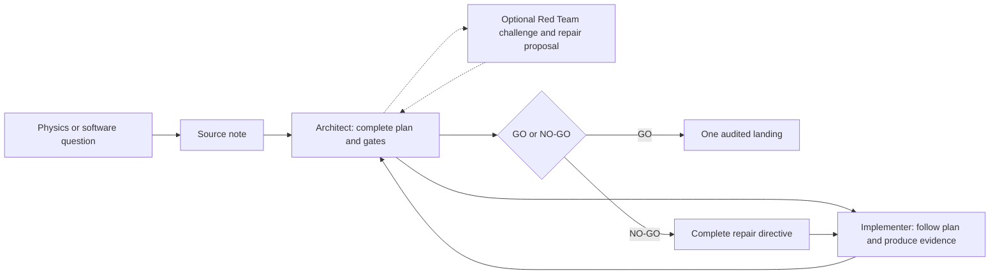
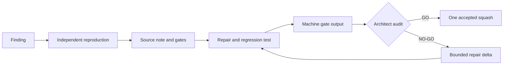
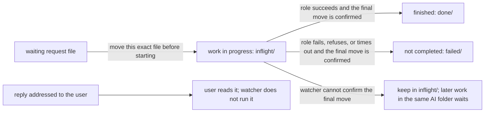
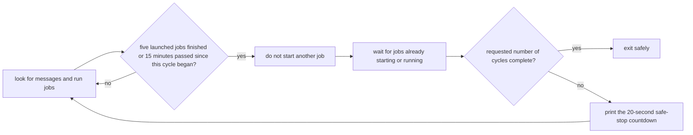
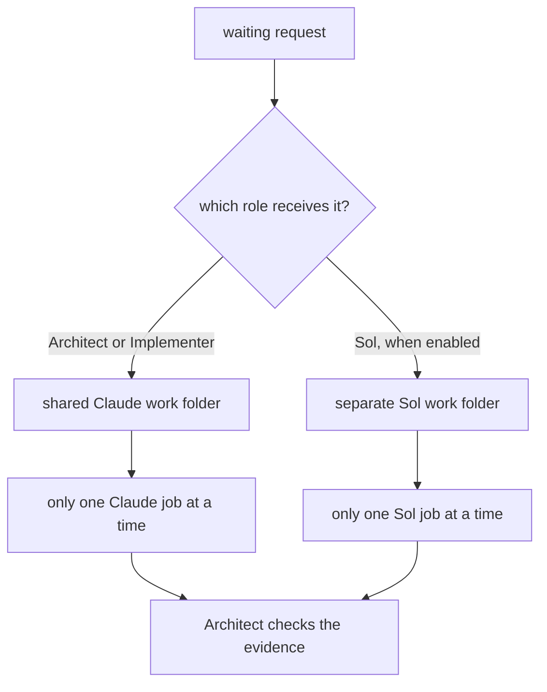
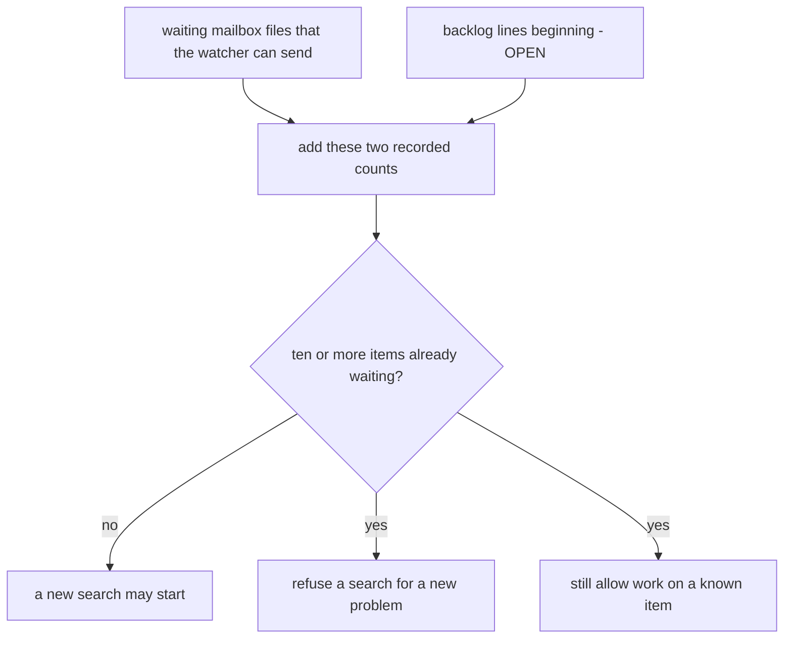

# AI-assisted development

This directory contains the tools that let several AI roles work on one
scientific codebase without treating chat as the project record.

The emulator library itself is documented in the top-level
[`README.md`](../README.md). Prof. Miranda owns the scientific contracts,
architecture, public interface, tests, and Python readability conventions.
Agents work inside those boundaries.


## Contents

### Main guide

1. [Start here](#start-here)
2. [Complete one small ticket](#complete-one-small-ticket)
3. [Roles, models, and decisions](#roles-models-and-decisions)
4. [Notes, tests, and gates](#notes-tests-and-gates)
5. [Useful daily commands](#useful-daily-commands)
6. [Fix-only watches](#fix-only-watches)
7. [Runtime controls](#runtime-controls)
8. [Exact command reference](#exact-command-reference)

### Common questions raised by developers

**[Appendices about how the mailbox works](#appendices-about-mailbox-mechanics)**

- [FAQ A1. How does a mailbox message move?](#appendix-a--how-does-a-mailbox-message-move)
- [FAQ A2. What if the watcher cannot tell whether a message finished safely?](#faq-a2-unverified-outcome)
- [FAQ B1. When can I interrupt the watcher?](#appendix-b--when-is-it-safe-to-stop-the-watcher)
- [FAQ B2. What does `--cycle` count?](#faq-b2-cycle-count)
- [FAQ C1. Why can some AI jobs run together while others must wait?](#appendix-c--how-do-queues-and-lanes-work)
- [FAQ C2. Where does Sol work?](#faq-c2-sol-worktree)
- [FAQ D1. Why can the tool refuse a new Red Team search?](#appendix-d--what-is-the-demand-guard)
- [FAQ D2. When may Sol implement instead of review?](#faq-d2-second-implementer)

**[Appendices about setup, problems, and recovery](#appendices-about-setup-and-recovery)**

- [FAQ E1. What should I check first?](#appendix-e--how-do-i-troubleshoot-a-run)
- [FAQ E2. What should I do if the tool rejects a saved AI folder?](#faq-e2-primary-recovery)
- [FAQ F1. Which folder does each role use?](#appendix-f--what-is-the-worktree-topology)
- [FAQ F2. Can I create another work folder for myself?](#faq-f2-other-worktrees)
- [FAQ G. How do I set this up on another computer?](#appendix-g--how-do-i-install-this-on-another-machine)

**[Appendices about sharing unfinished work](#appendices-about-occasional-transfer)**

- [FAQ H1. How can I send unfinished work to another person?](#appendix-h--how-can-i-send-unfinished-work-to-someone-else)
- [FAQ H2. How can the other person open that package safely?](#faq-h2-inspect-unfinished-work)

## Start here

You do not need prior AI-agent or Git-worktree experience. Keep this mental
model:



Three objects make this reliable:

| Object | Plain-language meaning |
| --- | --- |
| **Source note** | The written problem, scope, and acceptance checks. It is the source of truth. |
| **Watcher** | A long-running command that notices mailbox files and launches the correct role. |
| **Worktree** | Another checked-out folder for the same Git repository. It keeps agent work out of your main folder. |

A **ticket** is one bounded change described by a source note.

A worktree is not a copy made by hand. Git registers it and gives it a branch.
The mailbox tool creates or reuses two agent worktrees: one shared by Claude
and one for Sol.

The watcher may be launched from any checkout. Live mailbox commands resolve
both saved worktrees, then continue from the Claude primary. This prevents two
terminals from silently using different mailboxes or placing an agent in your
main folder.

### Where things live

| Path | Purpose |
| --- | --- |
| `ai/README.md` | This operating guide |
| `ai/notes/` | Durable knowledge and local ticket records |
| `ai/tests/` | Regression tests and focused reproductions |
| `ai/gates/` | Validation board, checks, configuration, and logs |
| `ai/tools/` | Mailbox, relay, status, and transfer utilities |

### The one rule to remember

The mailbox message is only a pointer. The cited note carries the substance.

If a chat message, mailbox message, and source note disagree, the source note
wins. A later developer should be able to resume from repository records
without reconstructing the chat.

## Complete one small ticket

The example below adds a hypothetical `--version` option. Use a small ticket
first; it makes each moving part visible.

### 1. Preview without changing anything

From any checkout:

```bash
python3 ai/tools/mailbox_daemon.py --dry-run
```

Expected result: pending work, launch commands, and working directories are
printed. No branch, worktree, lock, or mailbox file is created.

### 2. Create the agent work folders

On a clean clone, run one finite live pass before writing an uncommitted note:

```bash
python3 ai/tools/mailbox_daemon.py --once
```

Expected result: on a clean installation, the tool creates and saves two Git
*worktrees*. A worktree is simply another folder for the same repository,
with its own branch and working files.

- The Architect and Implementer share `mailbox-primary`.
- Sol uses a separate folder named `mailbox-sol`.
- Your original repository folder remains yours. No ordinary agent turn starts
  there.

The command reports the saved paths, checks the current queue, and exits. An
empty first run prints that the mailbox is empty.

Open the reported primary path for the next step. A newly created worktree
starts from committed Git state, so it cannot see an uncommitted note written
in another checkout.

If the command finds old mailbox files or a watcher in another checkout, it
refuses instead of guessing which mailbox is correct. Preserve every path it
names and follow [Appendix E](#appendix-e--how-do-i-troubleshoot-a-run).

### 3. Write the source note

In the saved primary, create a temporary ticket note such as
`ai/notes/version-flag.md`:

```markdown
# Version flag

## Goal

Add `--version` without changing normal training behavior.

## Acceptance gates

- `python3 train.py --version` exits successfully.
- Existing training tests remain green.
- A regression test checks the printed version.
```

Good notes answer four questions:

1. What behavior is wanted?
2. What must not change?
3. Which files or subsystem are in scope?
4. What command proves success?

### 4. Start the watcher

This example uses Opus as Architect and Sonnet as Implementer:

```bash
python3 ai/tools/mailbox_daemon.py --watch \
  --architect-model opus \
  --implementer-model sonnet
```

Keep this terminal open. The watcher checks the mailbox every 20 seconds and
prints progress while a turn is running.

The models are command-line choices. The roles are stable: the Architect still
finishes the design, writes the ordered directive, and audits the unit. The
Implementer follows that directive and makes the bounded change.

The default watch also makes the independent Sol Red Team lane available. It
does not create Sol work by itself; Sol runs only when a `to-sol` message is
queued. For an Architect-and-Implementer run only:

```bash
python3 ai/tools/mailbox_daemon.py --watch --skip-redteam
```

`--no-red-team` is an exact alias. Existing `to-sol` files remain queued for a
later three-role watch.

### 5. Send the ticket to the Architect

In another terminal, from any checkout in the repository:

```bash
python3 ai/tools/mailbox_daemon.py --send fable \
  --unit "You are the Architect. Coordinate the version-flag unit in ai/notes/version-flag.md."
```

Expected result: one numbered `to-fable` file is published. `fable` is the
stable Architect route even when that route launches a different Claude model.

### 6. Follow GO or NO-GO

For a read-only summary, run this from the saved primary:

```bash
python3 ai/tools/handoff_router.py --status
```

The Architect records exactly one decision for the named unit:

- **GO**: the cited evidence satisfies the gates. The Architect uses its
  explicit landing grant to land that audited unit in the same turn.
- **NO-GO**: the unit is held, and the Architect names the smallest repair
  needed for another audit cycle.

The durable evidence is split by purpose:

| Location | What it tells you |
| --- | --- |
| `ai/notes/mailbox/done/` | Which routing message was consumed |
| `ai/notes/relay/` | What the dispatched process printed |
| Source or audit note | What was claimed, tested, and decided |

Stop the watcher only at a printed safe interval, or use `--cycle` for an
automatic safe exit. [Appendix B](#appendix-b--when-is-it-safe-to-stop-the-watcher)
explains both.

## Roles, models, and decisions

Models can change from run to run. Authority does not.

| Role | Responsibility | Stable route |
| --- | --- | --- |
| **Architect / Auditor** | Thinks through the design, writes the complete implementation directive, audits raw evidence, and decides `GO` or `NO-GO` | `to-fable` |
| **Implementer** | Follows the ordered directive, changes only the named unit, and produces validation evidence | `to-opus` |
| **Independent Red Team** | Thinks adversarially about the named change and gives the Architect a detailed candidate repair when it finds a defect | `to-sol` |

The role instructions live in `.claude/FABLE_ROLE.md`,
`.claude/OPUS_ROLE.md`, and `.codex/REDTEAM_ROLE.md`. A route name is transport,
not a model name and not authority by itself.

### The thinking roles must finish the plan

The system is designed so the Implementer can be a simpler or less expensive
model. It may be Sonnet, Haiku, an open-source model, or something else. The
Architect and Red Team therefore do the reasoning; the Implementer should not
need to invent architecture.

Before implementation, the Architect's temporary ticket note must say:

- the exact worktree, non-main branch, and base commit to use;
- which files and exact symbols to edit;
- what to do, in numbered dependency order;
- the interfaces, types, shapes, algorithms, constants, and failure behavior;
- the exact tests, fixtures, assertions, commands, and expected results;
- what is off-limits, when to stop, and who owns each parallel file.

Each file or test target begins its own visible bullet:

```markdown
- `ai/tools/mailbox_daemon.py::agent_preamble`: Change the role preamble.
```

The locator must come first, followed by the exact edit or test. Inline links,
images, hidden metadata, and transport copies cannot supply binding
instructions. Put any supplemental diagram outside the validated packet. The
note also has a sibling
`## Implementation evidence / resume state` section. The Implementer appends
results there and never changes the validated packet's heading structure.

The Architect checks that packet before dispatch:

```bash
python3 ai/tools/handoff_contract.py architect ai/notes/<ticket>.md
```

A Red Team finding must be equally useful: it explains the root cause and
provides an ordered candidate repair plus its regression test. It checks that
proposal with `handoff_contract.py redteam`. The proposal goes back to the
Architect first. Only the Architect may adopt it and issue the binding
directive.

If a directive is missing, contradictory, or leaves a consequential choice
open, the Implementer stops and reports the gap. “Use your best judgment” is
not an acceptable substitute for a design decision.

### Architect language is GO or NO-GO

Only the Architect adjudicates agent evidence.

- `GO` authorizes the named unit to advance.
- `NO-GO` holds it and identifies the failed claims and repair delta.
- “Pass” and “fail” may describe a test, but they do not replace the decision.

The Architect owns any accepted edit to the permanent notes and the audited
landing boundary. The Implementer and Red Team do not inherit that authority.

### When does the Red Team run?

In the default three-role setup, the Red Team lane is available for each
ticket's normal audit flow. Enabling the lane does not start a review:
Sol runs only after a `to-sol` message is queued, normally by the Architect or
the user. That review covers the named commit or change and behavior directly
affected by that change.

It does **not** turn a ticket review into a broad attack on the library. A
widespread search happens only when the user explicitly writes:

```text
Do a widespread search for ...
```

A Red Team finding is input to the Architect. Its detailed repair plan is a
candidate, never a self-executing ruling and never a direct instruction to the
Implementer. `--skip-redteam` removes that optional lane for one watch; it does
not weaken the Architect's evidence audit.

## Notes, tests, and gates

### Notes are the source of truth

Substantive handoffs belong in notes. Mailbox messages should be short routing
summaries that cite the relevant section.

A **test** checks one behavior. A **gate** is a repeatable acceptance command
with a required result. The **validation board** lists and runs those gates so
the Architect can audit machine output instead of trusting a summary.

Exactly eleven Markdown notes are permanent repository knowledge:

1. `MEMORY.md`
2. `artifacts-inference-warmstart.md`
3. `conventions-and-workflow.md`
4. `data-generation-and-cuts.md`
5. `families-background-mps.md`
6. `families-scalar-cmb.md`
7. `models-and-designs.md`
8. `project-and-history.md`
9. `training-stack.md`
10. `user-didactics-and-python-voice.md`
11. `readme-go-no-go.md`

The backlog, dated audits, incident reports, state notes, handoff registers,
mailbox files, and relay logs are local working records. Do not add them to a
GitHub commit.

The Implementer and Red Team never edit these eleven notes, regardless of the
ticket type. The Architect decides whether an accepted change modifies a
general property recorded there. If it does, the Architect reviews and
commits the note as a separate Architect-only change. That new commit can then
be the starting version for a later implementation ticket.

Before handing work to either role, the Architect records the full starting
commit. The Architect runs the following command immediately before that
handoff and again before the final `GO`:

```bash
python3 ai/tools/permanent_note_guard.py \
  --repo EXACT_WORKTREE \
  --base FULL_STARTING_COMMIT
```

The capitalized values are placeholders. The Architect replaces
`EXACT_WORKTREE` with the AI work-folder path and `FULL_STARTING_COMMIT` with
the full starting commit recorded in the directive.

The command calculates a SHA-256 fingerprint—a short identifier for exact
file bytes—from Git. It checks the notes in four places:

| Place checked | Plain meaning |
| --- | --- |
| Starting commit | The saved project version named by the Architect before work begins |
| Current `HEAD` | The latest saved commit in the AI work folder |
| Git staging area | Files selected for the next commit |
| Working files | Files currently visible in the AI work folder |

The expected fingerprints do not come from an editable checksum list. Only
the Architect's rerun counts; copied output from another role is supporting
evidence.

The command also compares `ai/tools/permanent_note_guard.py` with the starting
commit. This stops another role from changing both a protected note and the
program meant to detect that change. There is no separate checksum file that
could be changed to approve different bytes.

`readme-go-no-go.md` is also the Architect's plain-language contract. It
applies to README files that Git includes and to words inside Python meant to
teach or explain: comments, explanations placed under functions or classes,
command help, messages printed when something happens or fails, and other
explanatory strings.

### How does a reported problem become a tested fix?



A regression test keeps the same bug from returning unnoticed. It should prove
that it detects the original defect. Where practical, reintroduce or mutate the
defect and show that the check turns red.

### Run the validation board

```bash
python3 ai/gates/run_board.py --list
python3 ai/gates/run_board.py --check
python3 ai/gates/run_board.py --dry-run
```

These commands list state, run preflight only, and print the selected gate
commands. They do not claim that the full gates ran.

On a configured workstation:

```bash
python3 ai/gates/run_board.py
python3 ai/gates/run_board.py --gate ID
```

Hardware-only rows may be recorded explicitly. They are never silently
treated as green.

## Useful daily commands

### Check a handoff directive

The thinking role runs one of these before it queues implementation or a
candidate repair:

```bash
python3 ai/tools/handoff_contract.py architect ai/notes/<ticket>.md
python3 ai/tools/handoff_contract.py redteam ai/notes/<ticket>.md
```

The check is read-only and reports `VALID` or `INVALID` for both packet types.
Those are structural results, not role decisions; only the Architect says
`GO` or `NO-GO`. `VALID` means the required sections are present, ordered,
concrete, and include canonical visible file/test locator bullets, numbered
work, a real shell command block, and acceptance checkboxes. It does not judge
whether the scientific plan is correct.

### Ask where the program is

```bash
python3 ai/tools/handoff_router.py --status
```

This prints a read-only summary of branches, audits, open reviews, and next
actions.

### Preview one send

```bash
python3 ai/tools/mailbox_daemon.py --dry-run --send opus \
  --unit "You are the Implementer. Follow the ARCHITECT_HANDOFF in ai/notes/version-flag.md."
```

The exact message is printed, but no file is written.

### Queue implementation

```bash
python3 ai/tools/mailbox_daemon.py --send opus \
  --unit "You are the Implementer. Follow the ARCHITECT_HANDOFF in ai/notes/version-flag.md."
```

### Run a two-role manual relay

```bash
python3 ai/tools/handoff_router.py \
  --note ai/notes/version-flag.md \
  --skip-redteam
```

This command controls only that clipboard relay. It does not change the roles
used by an already running mailbox watcher. Its source must be a direct,
non-symlink `.md` file in this checkout's `ai/notes/` directory. A relay log,
mailbox file, outside path, or `../` escape is transport or untrusted input,
not the source instruction.

### Queue a bounded Red Team discovery

```bash
python3 ai/tools/mailbox_daemon.py --send sol \
  --ticket-kind discovery \
  --unit "You are the Independent Red Team. Review the version-flag change named in ai/notes/version-flag.md. Stay within that change."
```

A new discovery is refused when fix-only mode or the demand guard forbids new
findings.

### Queue Red Team closure of existing work

```bash
python3 ai/tools/mailbox_daemon.py --send sol \
  --ticket-kind closure \
  --unit "You are the Independent Red Team. Close the existing item described in ai/notes/backlog.md."
```

The published file begins with `MAILBOX-TICKET: closure`.

### Test transport without assigning work

```bash
python3 ai/tools/mailbox_daemon.py --ping opus
```

The reply is addressed `to-user`. The watcher leaves it for a human and does
not dispatch it onward.

## Fix-only watches

Use fix-only mode when the current ledger is already large and the run should
retire known work instead of finding more:

```bash
python3 ai/tools/mailbox_daemon.py --watch --fix-only yes
```

The value also accepts `1` or `true`, in any capitalization.

In this mode:

- existing closure work remains eligible;
- new Sol discovery is refused;
- the policy is held by an exact per-mailbox lock, so external sends see it;
- a pending Sol file's stored ticket class is checked again before launch;
- an invalid pending Sol message moves to `failed/` instead of being guessed
  from prose.

Fix-only can be combined with a two-role setup or a cycle limit:

```bash
python3 ai/tools/mailbox_daemon.py --watch --fix-only yes --cycle 2
python3 ai/tools/mailbox_daemon.py --watch --fix-only yes --skip-redteam --cycle 0
```

## Runtime controls

| Concern | Options | Default |
| --- | --- | --- |
| Claude route models | `--architect-model`, `--implementer-model` | Fable, Opus |
| Claude effort | `--fable-effort`, `--opus-effort` | `xhigh`, `max` |
| Sol effort | `--sol-effort` | `xhigh` |
| Roles used | `--skip-redteam`, `--no-red-team` | Architect + Implementer + Sol |
| Turn timeout | `--dispatch-timeout` | 60 minutes |
| Context compaction | `--claude-context`, `--sol-context` | 500000 tokens each |
| Watch lifetime | `--cycle` | omitted: indefinite; `N>0`: stop at cycle N; `0`: drain enabled queue and ledger |
| Discovery policy | `--fix-only` | off |

Model selection and effort are independent. Choosing Sonnet does not silently
lower the Implementer effort.

At the context budget, a live session compacts its history and continues from
a summary. Claude receives `CLAUDE_CODE_AUTO_COMPACT_WINDOW`; Sol receives
`model_auto_compact_token_limit`.

The watcher checks the daemon source timestamp on every pass. If that file
changes, the stale watcher retires. Relaunch it to load the new code.

## Exact command reference

The live help is authoritative:

```bash
python3 ai/tools/mailbox_daemon.py --help
```

The current transcript is kept here for offline reading and regression checks.

<details>
<summary>Current <code>mailbox_daemon.py --help</code> transcript</summary>

```
usage: mailbox_daemon.py [-h] [--dry-run] [--once] [--watch] [--cycle count]
                         [--skip-redteam] [--fix-only value] [--send AGENT]
                         [--ping AGENT] [--unit UNIT]
                         [--ticket-kind {closure,discovery}]
                         [--architect-model MODEL] [--implementer-model MODEL]
                         [--fable-effort {low,medium,high,xhigh,max}]
                         [--opus-effort {low,medium,high,xhigh,max}]
                         [--sol-effort {none,low,medium,high,xhigh}]
                         [--dispatch-timeout MINUTES]
                         [--claude-context TOKENS] [--sol-context TOKENS]

file mailbox + headless dispatch for the agent loop

options:
  -h, --help            show this help message and exit
  --dry-run             show what would happen and change nothing: pending
                        dispatches are printed, not run, and --send/--ping
                        print the message file they would queue without
                        writing it
  --once                process the current backlog and exit
  --watch               poll the mailbox every 20 seconds
  --cycle count         with --watch, exit safely after this many global
                        rendezvous cycles; 0 waits until the enabled dispatch
                        queue and open ledger are empty; omitting the option
                        keeps watching indefinitely
  --skip-redteam, --no-red-team
                        with --watch, dispatch only Architect and Implementer
                        routes; disable the entire Sol route and leave
                        existing to-sol messages queued for a later normal
                        watch
  --fix-only value      with --watch, close existing ledger work only; the
                        value accepts 1, true, or yes in any capitalization
  --send AGENT          queue a message to this agent and exit
  --ping AGENT          queue a transport-confirmation ping to this agent (its
                        reply lands as a -to-user.md file the daemon never
                        dispatches)
  --unit UNIT           the message text for --send (a routing summary
                        pointing at ai/notes/)
  --ticket-kind {closure,discovery}
                        required with --send sol: declare whether the unit
                        closes existing work or seeks new findings
  --architect-model MODEL
                        Claude model alias or full name for the Architect
                        route (legacy fable address; default: claude-fable-5)
  --implementer-model MODEL
                        Claude model alias or full name for the Implementer
                        route (legacy opus address; default: claude-opus-4-8)
  --fable-effort {low,medium,high,xhigh,max}
                        claude CLI reasoning effort for the Architect route
                        (legacy fable address; default: xhigh)
  --opus-effort {low,medium,high,xhigh,max}
                        claude CLI reasoning effort for the Implementer route
                        (legacy opus address; default: max)
  --sol-effort {none,low,medium,high,xhigh}
                        codex CLI reasoning effort for Sol dispatches
                        (default: xhigh)
  --dispatch-timeout MINUTES
                        kill a dispatched turn that runs past this many
                        minutes and park its message in failed/ (default: 60)
  --claude-context TOKENS
                        Architect and Implementer Claude turns compact their
                        context whenever it reaches this many tokens (default:
                        500000)
  --sol-context TOKENS  Sol turns compact their context whenever it reaches
                        this many tokens (default: 500000)
```

</details>

### Action rules

- `--once`, `--watch`, `--send`, and `--ping` are mutually exclusive primary
  actions.
- `--cycle` accepts a nonnegative integer and is valid only with `--watch`.
- Omitting `--cycle` watches indefinitely. `--cycle 0` instead waits for the
  enabled routes and literal `- OPEN` ledger lines to drain.
- `--skip-redteam` and `--no-red-team` are watch-only aliases.
- A two-role watch preserves queued Sol files and refuses new Sol sends and
  pings until that watch releases its mode lock.
- `--unit` is required with `--send`.
- A Sol send also requires `--ticket-kind closure|discovery`.
- `--dry-run` modifies finite actions without writing state.
- Invalid models, effort values, timeouts, and action combinations fail before
  mailbox mutation.

The manual relay has separate live help:

```bash
python3 ai/tools/handoff_router.py --help
```

Its same-named two-role option controls one clipboard relay, not a running
watcher.

# Common questions raised by developers

## Appendices about how the mailbox works <a id="appendices-about-mailbox-mechanics"></a>

### FAQ A1. How does a mailbox message move? <a id="appendix-a--how-does-a-mailbox-message-move"></a>

The mailbox is a set of folders, and each request is a small Markdown file, a
text file ending in `.md`. Sending a request means saving that file in the
mailbox's waiting area. The watcher is the program that looks for waiting
files and starts the appropriate AI role.

Just before starting a role, the watcher moves the exact request file into
`inflight/`, which means **work in progress**. Moving it first prevents a
second watcher from starting the same request. When the role finishes, the
watcher tries to move that same file to `done/` or `failed/`.



Messages ending in `-to-user.md` are replies for a person to read. The watcher
never starts an AI role from those files.

### FAQ A2. What if the watcher cannot tell whether a message finished safely? <a id="faq-a2-unverified-outcome"></a>

If a request remains in `inflight/`, the role started but the watcher could
not confirm the final result. Later requests that use the same AI work folder
must wait. Otherwise, they could edit the same files while the first request
is still running or while its result is uncertain.

`--dispatch-timeout MINUTES` sets the longest allowed running time and
defaults to 60 minutes. At that limit, the watcher stops the AI program, saves
a small timeout record under `ai/notes/mailbox/.dispatch-history/`, and tries
to move the request to `failed/`.

If the watcher cannot confirm the timeout record or the move of the exact
request file, it leaves the file in `inflight/`. Even an AI program that exits
without an error is not marked finished until the watcher confirms that the
same request file reached `done/`.

Do not requeue or move an uncertain file. First compare the original request,
its named log, and any copies in `done/` or `failed/` so you know which result,
if any, was saved.

`--dry-run` only prints what would happen. It starts no role and moves no
mailbox file.

### FAQ B1. When can I interrupt the watcher? <a id="appendix-b--when-is-it-safe-to-stop-the-watcher"></a>

Read the watcher's latest status line:

| Printed status | Plain meaning | Safe to press Ctrl-C? |
| --- | --- | --- |
| A periodic progress message, `turn in flight`, or `turns in flight` | An AI role is running | No |
| `dispatch preparation admitted; not safe to stop` | The watcher is starting a role | No |
| `safe interval ended; not safe to stop` | An earlier safe period has ended | No |
| `safe to Ctrl-C` | No AI role is running or starting during the printed countdown | Yes |
| `watcher exiting safely` | The watcher has already stopped | Yes; no action is needed |
| A timeout message | The watcher is stopping one long-running role and saving its result | No. Wait for a later `safe to Ctrl-C` or `watcher exiting safely` line. After it stops, inspect `failed/` and `inflight/` before requeueing |

### FAQ B2. What does `--cycle` count? <a id="faq-b2-cycle-count"></a>

For `--cycle N`, where `N` is greater than zero, a cycle begins when the
watcher starts or when the preceding 20-second safe-stop countdown ends. It
reaches its next safe-stop point after five launched AI jobs finish or 15
minutes pass from the start of that cycle, whichever happens first. Ordinary
idle checks do not reset that 15-minute clock in this mode.

To complete the cycle, the watcher stops starting new jobs and waits for jobs
that are already starting or running. It then either exits or prints the
20-second Ctrl-C countdown before beginning another cycle.



Choose how long the watcher should run:

| Command | What it does |
| --- | --- |
| `--watch` | Keep watching until you stop it during a printed safe countdown |
| `--watch --cycle 2` | Exit safely after two completed cycles, even if more work is waiting |
| `--watch --cycle 0` | Exit only when no enabled mailbox message is waiting and `ai/notes/backlog.md` has no line that begins `- OPEN` |
| `--watch --skip-redteam --cycle 0` | Wait only for Architect and Implementer work; leave Sol messages untouched for a later run |

`--cycle 0` does not read a backlog description and invent an AI request from
it. Someone must still send the appropriate mailbox message. The roles that
handle that request must also change its `- OPEN` backlog line when the work
is genuinely finished.

Just before a zero-cycle exit, the watcher briefly prevents `--send` from
saving another message. It checks that the backlog is an ordinary readable
text file, that the file did not change during the check, and that no enabled
message is waiting. If it cannot perform those checks, it keeps running
instead of guessing that the work is finished.

This line marks a safe countdown:

```text
all lanes idle; safe to Ctrl-C for 19s more; 3 messages waiting.
```

The words `all lanes idle` mean that no AI role is running or starting. The
last number says how many request files still wait, including work for a role
that may be disabled in this run.

While a role is running, a periodic progress message looks like this:

```text
  ... 0046-to-opus.md still running (3 min elapsed, log 12.4 kB; tail -f .../ai/notes/relay/20260714-031840-dispatch-opus.log)
```

It names the request, elapsed time, and current log-file size. The final path
is the log that an experienced user may inspect while the job runs.

```text
cycle limit reached (2/2 cycles); all lanes idle; watcher exiting safely; 3 messages waiting; 4 open ledger jobs remain.
```

This last line means the requested two cycles are complete and the watcher
has stopped safely. “Open ledger jobs” means backlog lines that still begin
with `- OPEN`.

The watcher also waits 20 seconds when it simply finds no work. Interrupting
during that idle wait is safe, but the idle wait does not complete a cycle.

### FAQ C1. Why can some AI jobs run together while others must wait? <a id="appendix-c--how-do-queues-and-lanes-work"></a>

Two roles must not edit the same working folder at the same time. The watcher
therefore starts only one job at a time in each AI folder. Jobs in separate AI
folders may run together.

The documentation calls each one-at-a-time sequence a **lane**. A **turn** is
one role handling one message. A **dispatch** is the moment when the watcher
starts that turn. These names appear in logs, but the folder rule is the
important idea.



The number at the beginning of each message filename determines its order
inside the same lane.

Architect and Implementer intentionally share one Claude folder so both see
the same notes and unfinished edits. They must therefore take turns. Sol uses
a different folder and may run at the same time as one Claude role.

### FAQ C2. Where does Sol work? <a id="faq-c2-sol-worktree"></a>

A Git **worktree** is an extra working copy of the same project. It has its
own files and its own named line of work, called a branch, while sharing the
project's saved Git history.

Sol never works in the main folder that you use. On the first live run, the
watcher creates a separate Sol worktree and remembers its location. Later
runs reuse it. Claude and Sol therefore edit different folders, and neither
normally interferes with your main folder.

Before Sol starts an implementation job, the Architect's `Execution
checkout` must name the saved Sol folder, its branch (which must not be
`main`), and the full identifier of the starting Git commit—the exact saved
version of the project from which Sol should begin. If any detail is missing
or different, Sol must not edit any file. The manual router refuses before
sending the job; a mailbox-started Sol turn returns a blocker to the
Architect.

Only the Architect may enter your main folder, and only after recording `GO`,
to combine an approved change with `main`.

A two-role watch created with `--skip-redteam` or `--no-red-team` does not run
Sol. Existing Sol messages remain untouched for a later normal watch.

### FAQ D1. Why can the tool refuse a new Red Team search? <a id="appendix-d--what-is-the-demand-guard"></a>

The tool counts two exact kinds of recorded work:

```text
waiting mailbox messages + lines that begin “- OPEN” in ai/notes/backlog.md
```

The documentation calls this sum **total demand**. If ten or more existing
items are already waiting, the tool refuses a request for Sol to search for a
new problem. This prevents another discovery request from creating still more
work while many known items remain unfinished. A library-wide search still
requires the user's explicit widespread-search request.

The new search does not count against itself: with nine existing items, it
may be accepted as the tenth. The tool checks again just before starting it.
If ten other items exist by then, it refuses the search and tries to move its
message to `failed/`.

Put the proposed search at the end of `ai/notes/backlog.md`. Retry only when
total demand is below ten, including any `- OPEN` line added for this proposal.
Sol may still review or help finish a specific known item. Work that closes a
known item may continue.



### FAQ D2. When may Sol implement instead of review? <a id="faq-d2-second-implementer"></a>

Having ten unfinished items does not automatically change Sol's role. The
first non-empty line after the required ticket line selects Sol's role for
this message. One optional line beginning `### ARCHITECT_HANDOFF` may appear
between them. To select the second-Implementer role, that first non-empty
assignment line must be the exact declaration below:

```text
OpenAI Sol — this is a role as second Implementer for this unit.
```

Putting that sentence later in the message, or merely quoting it in a
discussion, does not change the role. Without the declaration in the required
place, Sol remains the Red Team and reviews only the named change.

The declaration selects the role; it does not by itself permit an edit. Sol
may begin editing only after the cited Architect `Implementation directive`
passes validation. That directive must say what to change, how to change it,
and which tests must pass. Otherwise Sol returns a blocker to the Architect.
After valid second-Implementer work, Sol follows `.claude/OPUS_ROLE.md` and
sends an `IMPLEMENTER_HANDOFF`, the structured result sent back to the
Architect. Sol does not also Red Team review the same job.

The separate manual tool `handoff_router.py --mode second-implementer` sends
one supplied implementation job to Sol instead of Opus. It never asks both
Implementers to perform the same instruction. Two implementation jobs may run
at the same time only when they use different source notes, edit separate
files, and work in separate Git worktrees.

Run the manual tool inside the exact Sol worktree named in `Execution
checkout`. Before it copies a prompt, it confirms that Git recognizes that
folder, that the folder uses the named non-`main` branch, and that its current
saved version exactly matches the full starting commit named by the
Architect. This ensures that its tests run in the same folder where Sol makes
the change.

When ten or more items are waiting, the watcher prints this reminder:

```text
  hint: 10 or more items are waiting. Give Sol separate implementation jobs as a second Implementer, but only a message with the required declaration changes Sol's role; otherwise Sol remains the Red Team.
```

The watcher does not create those jobs and does not change Sol's role by
itself. The exact declaration above is still required in each implementation
message.

## Appendices about setup, problems, and recovery <a id="appendices-about-setup-and-recovery"></a>

### FAQ E1. What should I check first? <a id="appendix-e--how-do-i-troubleshoot-a-run"></a>

| What you see | What it probably means | What to do first |
| --- | --- | --- |
| A command refuses and lists several mailbox folders | It found old or duplicate mailbox locations and cannot safely choose one | Do not delete any folder. Rerun the command from the Claude worktree you intend to use |
| The tool refuses a saved Claude or Sol folder | The saved path or branch does not match what Git currently knows | Keep the folder. Run `git worktree list --porcelain`, which only prints Git-managed work folders and their branches, and compare it with the error |
| The elapsed time increases but the Claude log stays small | Claude may still be working but has not printed more text yet | Keep watching the elapsed time |
| Neither elapsed time nor log size changes | The AI program may be stuck | Let the normal timeout handle it. Stop manually only after the watcher prints `safe to Ctrl-C`, and press Ctrl-C before that countdown ends |
| A file in `inflight/` prevents later work | The watcher started the request but could not prove whether it saved the final request file in `done/` or `failed/` | Compare the original request, any copy in `done/` or `failed/`, and the named log before moving anything |
| Sol cannot start a new search | A fix-only watch accepts only work that finishes already recorded items, or ten known items already wait | Record the possible issue and use Sol only on a specific known item for now |
| The watcher exits after you edit `mailbox_daemon.py` | The running watcher noticed that its own program file changed | Start the watcher again so it loads the new code |
| `--send` warns that no watcher is active | The request was saved, but no watcher is currently handling that mailbox | Start a watcher. The saved request remains safe while it waits |

### FAQ E2. What should I do if the tool rejects a saved AI folder? <a id="faq-e2-primary-recovery"></a>

The tool will not repair a Claude or Sol folder by changing or deleting your
work. It never hides edits, discards edits, changes the folder's branch,
removes the folder, or replaces it automatically.

For every rejected AI folder:

1. Keep the state file, mailbox folder, relay logs, and AI work folder named in
   the error. Do not delete them.
2. Run `git worktree list --porcelain`. This command only prints the work
   folders and branches that Git knows.
3. Compare the printed path and branch with the error message.
4. If you intentionally moved the folder, use
   `git worktree move OLD_PATH NEW_PATH` instead of Finder, `mv`, or another
   ordinary file move. If the branch is wrong or missing and you do not
   already know how to repair a Git worktree, stop. Do not guess or switch
   branches until the existing edits are backed up and understood.

If and only if the error contains `schema-1`, an older mailbox tool saved the
Claude folder information. First stop every older watcher or mailbox command.
Then continue:

5. Update the saved Claude worktree so `ai/tools/mailbox_daemon.py` is the same
   current version as this repository. Merely finding a file with that name is
   not enough. If you do not know how to update that Git worktree without
   losing edits, stop and ask for Git help.
6. In the main project folder that you normally use, rename
   `.claude/worktrees/.mailbox-primary-worktree.json` to a clearly marked
   backup instead of deleting it. Do not look for this file inside the saved
   Claude worktree.
7. Run the original mailbox command from the saved Claude worktree. The tool
   will continue to refuse if the folder is
   missing, has no named branch, uses the wrong branch, or could refer to more
   than one saved location.

For a Sol-only path or branch error, do not rename the Claude state file.

Local edits and commits already made are preserved even when they are not
present on `main`. The tool does not download, combine, or upload either AI
branch for you; Git operations such as `fetch`, `pull`, `merge`, and `push`
remain deliberate human or Architect actions.

### FAQ F1. Which folder does each role use? <a id="appendix-f--what-is-the-worktree-topology"></a>

A **worktree** is a separate project folder that Git creates and remembers.

- You use the repository's main folder.
- Architect and Implementer share one Claude worktree.
- Sol uses a different worktree.

The first mailbox command that can start or queue work creates both AI folders
and remembers them. A dry run does not. Claude and Sol normally work only in
those folders, never in your main folder. The single exception is explicit:
after the Architect records `GO`, the Architect may enter the main folder to
combine that approved change with `main`.

### FAQ F2. Can I create another work folder for myself? <a id="faq-f2-other-worktrees"></a>

Yes. A worktree is a separate project folder that Git creates and remembers.
You may create another one for a manual experiment or other development work.
That extra folder does not change the saved Claude or Sol folder used by the
watcher.

### FAQ G. How do I set this up on another computer? <a id="appendix-g--how-do-i-install-this-on-another-machine"></a>

1. Clone the repository.
2. Install Claude Code and sign in to it.
3. Install the Codex command-line program if you want to use Sol. A two-role
   Architect-and-Implementer run with `--skip-redteam` does not need Codex.
4. Ask the computer where those programs are installed:

   ```bash
   command -v claude
   command -v codex
   test -x /Applications/ChatGPT.app/Contents/Resources/codex && \
     echo /Applications/ChatGPT.app/Contents/Resources/codex
   ```

   The first command should print the Claude path. Codex may print after the
   second command or, on macOS with the ChatGPT application, after the third.
   If neither Codex check prints a path and you want Sol, install Codex before
   continuing.
5. Open `ai/tools/mailbox_daemon.py`. Find `build_agent_commands()`, the
   function that contains the two executable paths, and check that its Claude
   and Codex paths match the paths printed above.
6. Preview the setup from any project folder that Git recognizes:

   ```bash
   python3 ai/tools/mailbox_daemon.py --dry-run
   ```

   A dry run starts no AI role and moves no mailbox file. Read every printed
   command and work-folder path before continuing.
7. Start the watcher. The watcher is the long-running program that looks for
   mailbox messages and starts the appropriate role. This command enables the
   default Red Team:

   ```bash
   python3 ai/tools/mailbox_daemon.py --watch \
     --architect-model opus \
     --implementer-model sonnet
   ```

   This command runs only the Architect and Implementer:

   ```bash
   python3 ai/tools/mailbox_daemon.py --watch \
     --skip-redteam \
     --architect-model opus \
     --implementer-model sonnet
   ```

If the new computer installed Claude or Codex elsewhere, change only those two
program paths. The model names in the watcher command are choices for that
run. Reasoning level, context limit, file permissions, and service tier are
repository-wide settings and should change only through a deliberate project
decision.

## Appendices about sharing unfinished work <a id="appendices-about-occasional-transfer"></a>

### FAQ H1. How can I send unfinished work to another person? <a id="appendix-h--how-can-i-send-unfinished-work-to-someone-else"></a>

The normal workflow is to finish, review, and commit a change in the
repository. Sometimes one person must stop before finishing—for example,
because access or AI credits run out—and another person must continue. The
bundle tool provides limited support for that case.

A **bundle** is one compressed file containing the unfinished backlog and its
supporting files as they existed at one moment. It does not keep two copies in
sync. To avoid conflicting edits, choose one active owner: the sender stops
editing after sending the bundle, and the recipient becomes the only person
continuing that work. If another transfer is unavoidable, create a new bundle
and state which Git commit—the saved project version—it starts from.

Run the following commands from the project folder whose
`ai/notes/backlog.md` contains the unfinished work you want to send.

First preview the files that would be included:

```bash
python3 ai/tools/backlog_bundle.py pack --dry-run
```

Then create the compressed `.tar.xz` file:

```bash
python3 ai/tools/backlog_bundle.py pack
```

The command prints `Wrote:` followed by the new file path and
`Archive SHA-256:` followed by its fingerprint. Save both.

The created file is ignored by Git. Send it directly to the other person; do
not add it to GitHub.

### FAQ H2. How can the other person open that package safely? <a id="faq-h2-inspect-unfinished-work"></a>

The recipient should first inspect the package without extracting or changing
any project file:

```bash
python3 ai/tools/backlog_bundle.py inspect path/to/backlog-....tar.xz
```

This prints the included filenames, sizes, and SHA-256 fingerprints, which are
identifiers calculated from the exact file bytes. Check the file list first.
Then compare the printed `Archive SHA-256` with the value the sender supplied
by phone, text message, or another independent route. Only when the list and
the separately supplied value agree should you unpack into a new review folder
that Git ignores:

```bash
python3 ai/tools/backlog_bundle.py unpack path/to/backlog-....tar.xz
```

`read` is another name for `inspect`, and `import` is another name for
`unpack`. Unpacking never overwrites the live notes and never applies a code
change to the project.

Before creating a bundle, put ordinary supporting files in
`ai/notes/backlog-support/`. Replace `REPO_RELATIVE_FILE` with the file's path
beginning at the project's top folder, for example
`--include images/problem.png`. Repeat `--include` once for each extra file.

The package records its starting Git commit and a SHA-256 fingerprint for
each file. It does not copy the eleven permanent notes, because the recipient
gets those from Git. It also excludes live mailbox messages and relay logs.

The archive SHA-256 identifies the exact compressed package. If the
recipient's value matches the value supplied separately by the sender, the
package bytes are the same. It does not prove who sent the file. The per-file
fingerprints let the tool confirm that the extracted files match the package's
own inventory.
