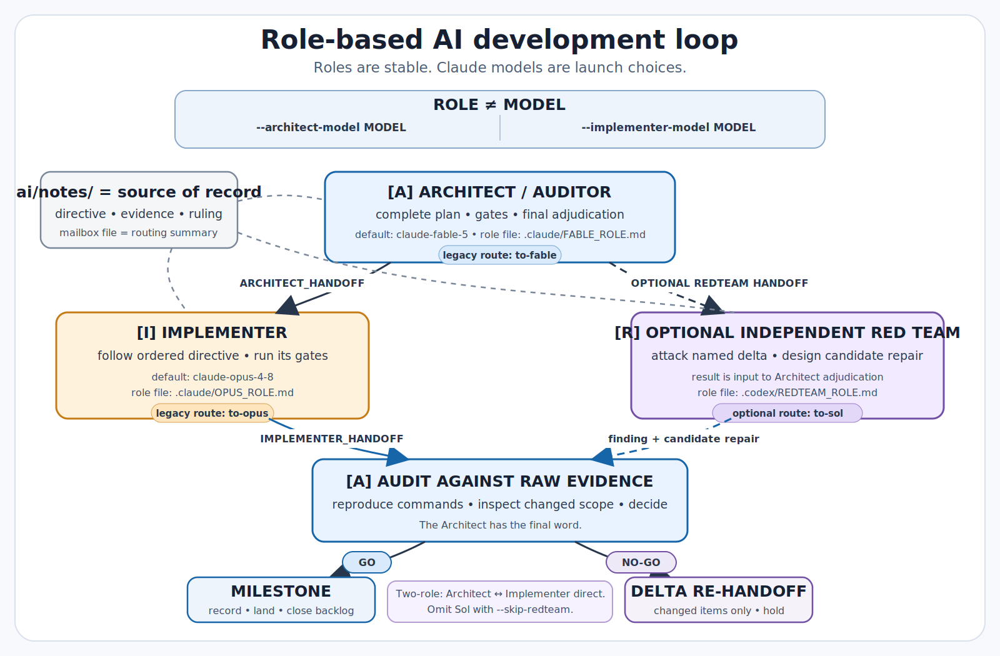
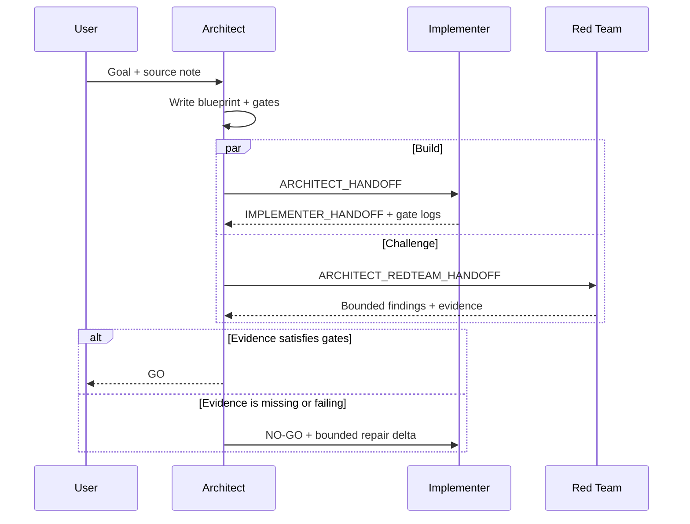
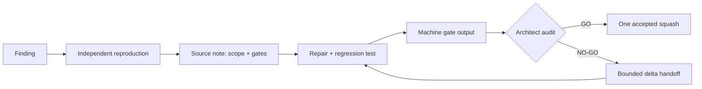
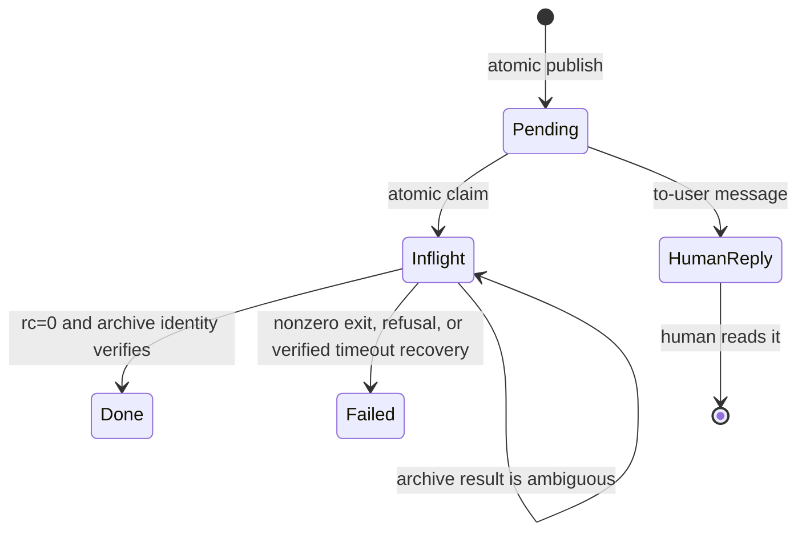
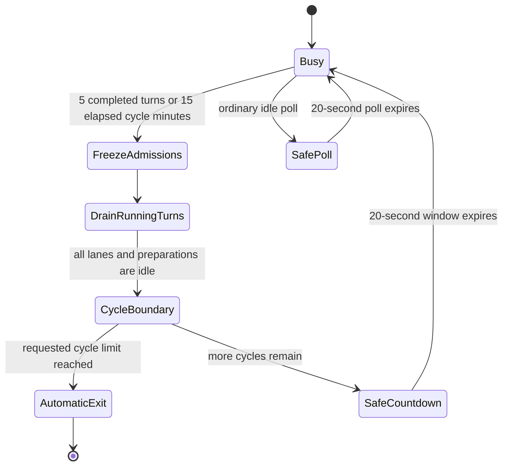
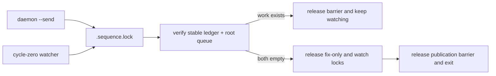
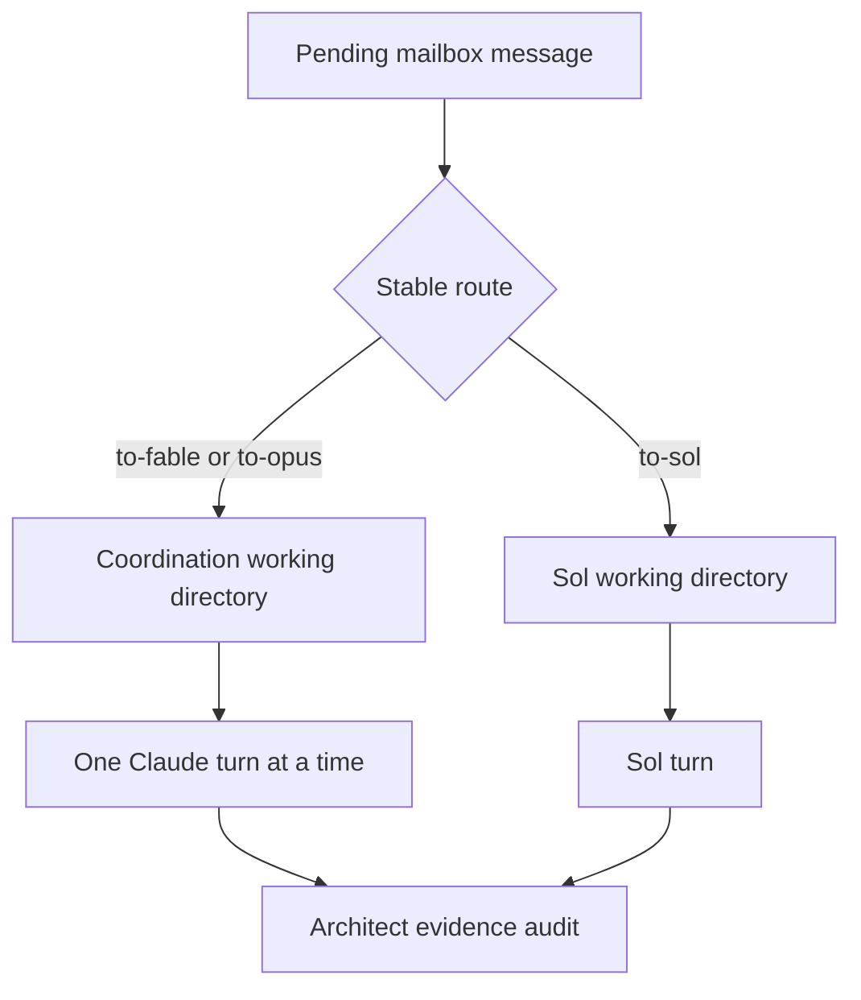
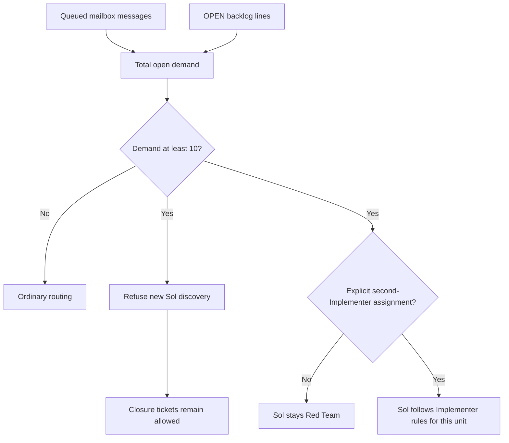
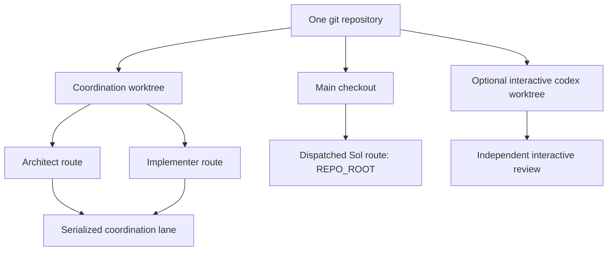

# AI-assisted development loop

This guide explains how a change moves from a written goal to an audited
decision. The emulator library itself is documented in the top-level
[`README.md`](../README.md).

Prof. Miranda owns the scientific contracts, architecture, public interface,
test requirements, and Python readability conventions. Agents work within
those boundaries; they do not redefine them.



## Choose a path

| I want to... | Start here |
| --- | --- |
| Run one complete ticket | [Quick start](#quick-start-complete-one-ticket) |
| Understand who decides | [Roles and authority](#roles-and-authority) |
| Queue or inspect work | [Daily recipes](#daily-recipes) |
| Read a long-running watch | [Reading a running watch](#reading-a-running-watch) |
| Understand concurrency | [Queues, lanes, and demand](#queues-lanes-and-demand) |
| Install the loop elsewhere | [Install on another machine](#install-on-another-machine) |
| Look up every flag | [Exact command reference](#exact-command-reference) |

### Repository layout

All AI-assisted development support lives under one root:

| Path | Purpose |
| --- | --- |
| `ai/README.md` | This operating guide |
| `ai/notes/` | Durable specifications, evidence, decisions, and mailbox state |
| `ai/tests/` | Unit tests and focused regression reproductions |
| `ai/gates/` | The validation board, checks, configurations, and logs |
| `ai/tools/` | Mailbox and status utilities |

The former root-level support directories no longer exist. Commands and links
in this guide use the `ai/` layout directly; there are no compatibility copies,
wrappers, or duplicate README.

## Quick start: complete one ticket

Use `python3` in the commands below. Run them from the same coordination
worktree so the sender and watcher see the same mailbox.

### 1. Write the source note

The note is the contract. The mailbox message will only point to it.

Here is a small, hypothetical unit:

```markdown
# ai/notes/version-flag.md

## Goal

Add `--version` without changing normal training behavior.

## Acceptance gates

- `python3 train.py --version` exits successfully.
- Existing training tests remain green.
- A regression test checks the printed version.
```

Expected result: another session can understand the goal, boundary, and proof
without relying on chat history.

### 2. Preview the mailbox

```bash
python3 ai/tools/mailbox_daemon.py --dry-run
```

Expected result: pending work, launch commands, and working directories are
printed. Nothing is claimed, dispatched, or written.

### 3. Start the watcher

This example uses Opus for the Architect route and Sonnet for the Implementer
route:

```bash
python3 ai/tools/mailbox_daemon.py --watch \
  --architect-model opus \
  --implementer-model sonnet
```

Expected result: the process polls this worktree's mailbox every 20 seconds.
The flags select models for stable routes; they do not rename the routes or
replace the role instructions carried by a valid handoff.

Omit both model flags for the historical Fable-Architect and Opus-Implementer
defaults. Aliases and full Claude model IDs are accepted.

To stop automatically after two global safe-stop cycles, add:

```bash
python3 ai/tools/mailbox_daemon.py --watch --cycle 2
```

Expected result: the first cycle keeps its normal 20-second Ctrl-C window.
At the second proven all-lanes-idle rendezvous, the watcher exits by itself
before reopening admissions. Messages still waiting remain untouched.

### 4. Send the unit to the Architect

In a second terminal, from the same worktree:

```bash
python3 ai/tools/mailbox_daemon.py --send fable \
  --unit "You are the Architect. Coordinate the version-flag unit in ai/notes/version-flag.md."
```

Expected result: one numbered `to-fable` file is queued. The explicit sentence
assigns the Architect role; `fable` selects its stable coordination route even
when that route launches Opus.

### 5. Follow the decision

```bash
python3 ai/tools/handoff_router.py --status
```

Expected result: the router reports branch state, recent audit records, open
reviews, and the next numbered actions. It changes nothing.

The same result has three durable views:

- `ai/notes/mailbox/done/` holds the consumed routing message.
- `ai/notes/relay/` holds the raw dispatch log.
- The cited source or audit note holds the evidence and decision.

A **GO** names the accepted evidence and the exact squash boundary. A
**NO-GO** leaves the unit held and records the smallest repair delta; nothing
lands from that decision.

The normal ticket looks like this over time:



The ticket completes only after GO and the authorized squash landing. A
NO-GO closes the current audit cycle, keeps the ticket open, and starts the
bounded repair cycle recorded in the delta.

Stop the watcher only during an all-lanes-idle safe interval. A heartbeat
proves life, not safety to interrupt.

## Roles and authority

Roles stay stable while models are replaceable.

| Role | Owns | Stable route |
| --- | --- | --- |
| **[A] Architect / Auditor** | Blueprint, acceptance gates, evidence audit, and explicit `GO` / `NO-GO` | `to-fable` |
| **[I] Implementer** | The named implementation unit and its validation output | `to-opus` |
| **[R] Independent Red Team** | Adversarial evidence about the named change | `to-sol` |

The Claude model flags bind models to the two Claude routes for that watcher.
Neither a model nor a route assigns authority. The message must explicitly
assign a role or contain the applicable handoff; the session then reads
`.claude/FABLE_ROLE.md`, `.claude/OPUS_ROLE.md`, or
`.codex/REDTEAM_ROLE.md`.

Only the Architect adjudicates agent evidence. Every architectural ruling,
audit verdict, and landing recommendation uses **GO** or **NO-GO**.

- `GO` means the named unit may advance.
- `NO-GO` holds the unit and names the failed claims plus the smallest repair
  delta.
- Words such as “pass” and “fail” may describe evidence, but never replace the
  decision label.

The Red Team reviews the named commit or change and the behavior it directly
affects. It does not widen that review into a library attack unless the user
explicitly requests: `Do a widespread search for ...`.

A Red Team finding is input to the Architect, not a self-executing ruling.
Using models from two vendors gives that challenge a genuinely independent
failure mode.

The Architect owns the audited squash boundary. The actor who executes that
landing or pushes it is controlled by the current user grant; without a grant,
the agent returns the audited SHA and landing instructions to the user.

Git authority and audit ownership are separate. Merge instructions in the
Architect role apply only under an active grant; the daemon's default is to
return a landing block rather than infer permission from the role.

## Records, tests, and gates

Substantive communication is notes-first. A mailbox message is a routing
summary; the cited note is the durable source of truth.

| Surface | Purpose |
| --- | --- |
| `ai/notes/` | Blueprints, findings, verdicts, repair deltas, and the backlog |
| `ai/notes/mailbox/` | Numbered routing messages and their lifecycle archives |
| `ai/notes/relay/` | Raw dispatch logs |
| `ai/tests/` | Reproductions and regression checks |
| `ai/gates/` | The validation board and machine-run acceptance checks |
| `ai/tools/` | Mailbox, status, and other AI-development utilities |

If a note and a message disagree, the note wins. Sessions forget; repository
records let a human or later session resume.

### From finding to protection

This graph replaces a long verbal protocol. Each arrow must leave inspectable
evidence.



A regression must prove that it detects the original defect. Where practical,
the check reintroduces or mutates the defect and turns red.

Run the gate board instead of accepting a prose claim:

```bash
python3 ai/gates/run_board.py --list
python3 ai/gates/run_board.py --check
python3 ai/gates/run_board.py --dry-run
```

Expected result: the board lists state, runs preflight only, then prints the
commands a full selection would execute. These three commands do not claim
that the gates themselves ran.

On a configured workstation, run `python3 ai/gates/run_board.py` or select a
gate with `--gate ID` to produce machine evidence. Hardware-only rows may be
recorded explicitly; they are never silently treated as green.

Focused daemon reproductions can be run directly:

```bash
python3 ai/tests/tools_mailbox_daemon_role_models_repro.py
python3 ai/tests/tools_mailbox_daemon_rendezvous_repro.py
```

Expected result: both scripts report all focused arms and their mutations
green.

## Daily recipes

### Ask “where are we?”

```bash
python3 ai/tools/handoff_router.py --status
```

Expected result: a read-only summary of git state, audits, open review
branches, and next actions.

### Preview a send

```bash
python3 ai/tools/mailbox_daemon.py --dry-run --send opus \
  --unit "You are the Implementer. Follow the ARCHITECT_HANDOFF in ai/notes/version-flag.md."
```

Expected result: the exact message file that would be queued is printed, but
no file is written.

### Queue implementation

```bash
python3 ai/tools/mailbox_daemon.py --send opus \
  --unit "You are the Implementer. Follow the ARCHITECT_HANDOFF in ai/notes/version-flag.md."
```

Expected result: one `to-opus` message is published atomically.

### Queue a bounded Red Team review

```bash
python3 ai/tools/mailbox_daemon.py --send sol \
  --ticket-kind discovery \
  --unit "You are the Independent Red Team. Review the version-flag change named in ai/notes/version-flag.md. Stay within that change."
```

Expected result: one classified `to-sol` message is queued. A discovery is
refused when the demand guard or a fix-only watch forbids new findings.

### Close existing work with Sol

```bash
python3 ai/tools/mailbox_daemon.py --send sol \
  --ticket-kind closure \
  --unit "You are the Independent Red Team. Close the existing manifest item described in ai/notes/backlog.md."
```

Expected result: the queued file begins with `MAILBOX-TICKET: closure`.

### Test transport without assigning work

```bash
python3 ai/tools/mailbox_daemon.py --ping opus
```

Expected result: the session returns a `to-user` reply. The daemon leaves that
human-addressed file in place and does not dispatch it onward.

## Mailbox lifecycle

Publication and dispatch are filesystem state transitions, not chat events.



An ambiguous `inflight/` head keeps its working-directory lane blocked. This
prevents later work from overtaking a message whose outcome is unknown.

<details>
<summary>Archive, timeout, and retry details</summary>

`--dispatch-timeout MINUTES` defaults to 60. When a turn exceeds it, the
daemon kills the child and attempts atomic timeout history under
`ai/notes/mailbox/.dispatch-history/` plus a verified move to `failed/`.

Only successful history and archive verification publish that recovery state.
If either cannot be secured, the message remains in `inflight/` and keeps its
lane blocked.

Requeueing that message preserves the prior-kill banner. A normal nonzero
child exit does not create timeout history.

A clean child exit does not by itself consume the message. The daemon verifies
that `done/` contains the same device-and-inode identity as the claimed source
and that the source path disappeared. An ambiguous result remains in
`inflight/`, blocks its lane, and makes `--once` fail.

`--dry-run` performs none of these transitions.

</details>

## Reading a running watch

| Signal | Meaning | Safe to stop? |
| --- | --- | --- |
| Heartbeat | A child is still being watched | No |
| Log size grows | The child is producing output | No |
| “turns in flight” | At least one lane is active | No |
| “all lanes idle” | The bounded safe interval is open | Yes, during that interval |
| Timeout | The child was killed; recovery is verified in `failed/` or held in `inflight/` | Inspect before retrying |

The exact heartbeat example is:

```
  ... 0046-to-opus.md still running (3 min elapsed, log 12.4 kB; tail -f .../ai/notes/relay/20260714-031840-dispatch-opus.log)
```

Claude Code may keep its log small until the turn ends. Sol usually narrates
progress continuously, so its log often grows throughout the turn.

### Safe-stop rendezvous



A cycle begins when the watcher starts or the preceding manufactured
countdown closes. It ends at the next K/M global rendezvous, after every
admitted preparation and running child has drained.

The ordinary idle poll is still a safe Ctrl-C opportunity, but it is not a
cycle boundary. In cycle mode it also does not erase accumulated K/M progress.

Choose the lifetime explicitly:

| Invocation | Lifetime |
| --- | --- |
| `--watch` | Existing indefinite watcher; stop during a safe interval |
| `--watch --cycle 2` | Exit automatically at the second global rendezvous |
| `--watch --cycle 0` | Exit when the dispatch queue and literal `- OPEN` ledger lines are both empty |

Zero mode observes the ledger; it does not manufacture tickets from ledger
prose. Routed agents must still close those lines through the mailbox chain.

Before declaring zero-mode completion, the watcher takes the same publication
lock as daemon `--send`. It then verifies a stable regular UTF-8 ledger and
checks the root queue while new daemon sends are blocked.



A send that lands before this cutoff prevents exit. A send already waiting
behind the barrier publishes only after the watch lock is gone, so its normal
“no active watch” warning remains truthful.

If the ledger is missing, nonregular, unreadable, unstable during the read,
or invalid UTF-8, zero mode stays active and explains that completion could
not be verified. It never converts an unverifiable ledger into zero work.
The open is nonblocking, so a concurrent FIFO replacement is rejected instead
of hanging the watcher.

This publication cutoff covers messages created through daemon `--send`.
Creating root mailbox files manually bypasses that protocol and should be
done before starting zero mode.

The unsafe status is exact:

```text
2 turns in flight; not safe to stop.
```

The watcher then exposes one of two exact safe intervals:

```text
all lanes idle; safe to Ctrl-C for 19s more; 3 messages waiting.
```

```text
all lanes idle; safe to Ctrl-C for this 20s poll; no messages waiting.
```

A positive cycle limit replaces the final countdown with an immediate safe
exit. For example:

```text
cycle limit reached (2/2 cycles); all lanes idle; watcher exiting safely; 3 messages waiting; 4 open ledger jobs remain.
```

Zero mode uses this terminal status after the queue and ledger drain:

```text
cycle work complete after 1 cycle; all lanes idle; mailbox and ledger empty; watcher exiting safely.
```

<details>
<summary>Why the safe interval is race-resistant</summary>

The watcher freezes new admissions, drains every running child and admitted
preparation, and only then prints the countdown. The waiting count is sampled
again for every line, but new arrivals cannot launch until the window closes.

At the end, the main thread flushes `safe interval ended; not safe to stop.`
before admissions reopen. Every admitted preparation flushes `dispatch
preparation admitted; not safe to stop.` before it may claim a root message.

The rendezvous applies only to `--watch`. Finite `--once` and `--dry-run`
runs do not pause for it.

</details>

## Queues, lanes, and demand

A **turn** processes one message. A **dispatch** starts that turn. A **lane**
is the serialized queue for one working directory.

### Route to lane



Filenames impose strict order within a lane. Distinct working directories may
run concurrently; routes that resolve to the same directory are serialized.

True coordination/Sol parallelism therefore depends on launch topology. Use
`--dry-run` and inspect each command's working directory before relying on two
lanes.

### Demand guard

Total open demand is queued mailbox messages plus `- OPEN` lines in
`ai/notes/backlog.md`. Unsent ledger work still counts because it is still owed.



The number alone never changes a role. A second-Implementer unit must open
with this sentence and must carry the Implementer contract and gates:

```text
OpenAI Sol — this is a role as second Implementer for this unit.
```

That sentence is a per-unit role override. For that message Sol follows
`.claude/OPUS_ROLE.md`, not the ordinary Red Team rule that forbids functional
implementation. Without the explicit override, Sol remains the bounded Red
Team described in `.codex/REDTEAM_ROLE.md`.

<details>
<summary>Exact saturated queue example</summary>

```
queued .../ai/notes/mailbox/0046-to-opus.md
queue depth: opus=2 sol=2 fable=0 | open backlog (ai/notes/backlog.md): 22 | total demand: 26
  hint: total open demand is at or past 10 units; the red team is now the second implementer: build units flow to it as well as to the primary Implementer route (.claude/FABLE_ROLE.md, Second-Implementer assignments).
```

Demand nine may admit the tenth unit. At demand ten, a new Sol discovery is
refused before publication; a closure remains eligible because it retires work
already owed.

</details>

### Fix-only watches

```bash
python3 ai/tools/mailbox_daemon.py --watch --fix-only yes
```

Expected result: the watcher accepts existing closure work but refuses new Sol
discovery. The mode is held by an exact per-mailbox lock, so external sends see
the same policy.

The persisted ticket class is checked again before launch. Invalid pending Sol
messages move to `failed/` rather than being inferred from prose.

## Troubleshooting by symptom

| Symptom | Likely meaning | First action |
| --- | --- | --- |
| Sent file never dispatches | Sender and watcher use different worktrees | Read the dead-mailbox warning; rerun both from one coordination tree |
| Heartbeat advances but Claude log is tiny | Claude is buffering its reply | Keep watching the elapsed clock |
| Log and clock stop | Child may be hung | Wait for timeout or inspect the process; do not interrupt outside a safe interval |
| `inflight/` message blocks a lane | Archive outcome is ambiguous | Inspect source, archive, log, and identity before moving anything |
| Sol discovery is refused | Demand is saturated or fix-only mode is active | Record the work in the backlog; use closure only for existing work |
| Watch exits after a source edit | Its loaded daemon source became stale | Relaunch the watcher from the intended worktree |
| Send warns that no watcher holds this mailbox | No live `--watch` polls that checkout | Start the watcher there or send from the watched checkout |

<details>
<summary>Dead-mailbox diagnosis</summary>

Every checkout has its own `ai/notes/mailbox/`. A valid send from the main
checkout cannot reach a watcher polling a Claude worktree's mailbox.

After publication, the daemon checks the current mailbox's held
`.dispatch.lock`. If no exact live `watch pid N` owner exists, it warns and
lists other watched mailboxes. It does not reroute or fail the send.

`--dry-run --send` and `--dry-run --ping` can print the same warning without
creating or rewriting a lock.

</details>

## Install on another machine

### Bootstrap checklist

1. Clone the repository.
2. Install and authenticate Claude Code and the Codex CLI.
3. Create separate linked worktrees for independent interactive writers.
4. Choose one Claude worktree as the coordination worktree.
5. Update the two executable paths in `build_agent_commands()`.
6. Run `python3 ai/tools/mailbox_daemon.py --dry-run` there.
7. Inspect every reported command and working directory.
8. Start `--watch`, optionally selecting Architect and Implementer models.

The copy of `ai/tools/mailbox_daemon.py` you launch determines the mailbox,
relay directory, repository root, and coordination working directory. There is
no separate “coordination path” option.

```bash
cd /path/to/emulators_code_v2/.claude/worktrees/<coordination-worktree>
python3 ai/tools/mailbox_daemon.py --dry-run
python3 ai/tools/mailbox_daemon.py --watch \
  --architect-model opus \
  --implementer-model sonnet
```

Expected result: the preview names only paths inside the intended clone, then
the watcher polls that same worktree.

### Worktree topology



One worktree has one staged index. Writers sharing it must be serialized;
writers in separate worktrees can operate without sweeping each other's staged
edits into a commit.

The daemon currently starts dispatched Sol at `REPO_ROOT`; it does not select
an optional Codex worktree. The separate Codex branch in the graph is only for
an independently launched interactive session.

Ask an interactive writer to create its own worktree in its opening message:

```text
Create and work from your own git worktree for this task.
```

For a Codex red-team branch:

```text
Create your own git worktree, on a branch named codex/<topic>, and work from it.
```

### Configure executable paths

On a new machine, `which claude` and `which codex` show the installed
executables. Replace only the program paths in the block below; model, effort,
context, sandbox, and service-tier settings are repository policy.

<details>
<summary>Exact shipped <code>build_agent_commands()</code> block</summary>

```python
    architect_model = validate_model_name(value=architect_model)
    implementer_model = validate_model_name(value=implementer_model)
    commands = {
        # Absolute path: the user's conda shells resolve an OLDER claude
        # binary with a separate (logged-out) credential store; this one
        # is the logged-in v2.1.208 install (diagnosed 2026-07-14).
        "fable": ["/Users/vivianmiranda/.local/bin/claude", "-p",
                  "--model", architect_model,
                  "--effort", fable_effort,
                  "--permission-mode", "acceptEdits"],
        "opus": ["/Users/vivianmiranda/.local/bin/claude", "-p",
                 "--model", implementer_model,
                 "--effort", opus_effort,
                 "--permission-mode", "acceptEdits"],
        # Verified by the red team's read-only probe (codex-cli 0.144.2;
        # the conventions note records the probe): workspace-write sandbox
        # rooted at the repo, which contains every worktree Sol works in.
        # service_tier=standard keeps codex Fast Mode OFF for dispatched
        # turns (USER 2026-07-14): the standard tier is slower in
        # wall-clock time but far cheaper against the token quota, and an
        # unattended mailbox turn never needs the speed. Pinned here
        # because the user's global ~/.codex/config.toml says "priority"
        # -- a dispatch must not inherit that default.
        "sol": ["/Applications/ChatGPT.app/Contents/Resources/codex",
                "exec",
                "--model", "gpt-5.6-sol",
                "-c", "model_reasoning_effort=" + sol_effort,
                "-c", "service_tier=standard",
                "-c", ("model_auto_compact_token_limit="
                       + str(sol_context_budget)),
                "--sandbox", "workspace-write",
                "--cd", REPO_ROOT],
    }
```

</details>

The daemon checks its own source timestamp on every watch pass. Any save that
changes the file retires the stale watcher; relaunch it to load the current
code.

## Runtime controls

| Concern | Options | Default |
| --- | --- | --- |
| Claude route models | `--architect-model`, `--implementer-model` | Fable, Opus |
| Claude effort | `--fable-effort`, `--opus-effort` | `xhigh`, `max` |
| Sol effort | `--sol-effort` | `xhigh` |
| Turn timeout | `--dispatch-timeout` | 60 minutes |
| Context compaction | `--claude-context`, `--sol-context` | 500000 tokens each |
| Watch lifetime | `--cycle` | Omitted: indefinite; `N>0`: stop at cycle N; `0`: drain ledger and queue |

Higher effort spends more tokens and wall-clock time. Model selection and
effort are independent: choosing Sonnet does not silently change the
Implementer effort.

At the context budget, a live session compacts its history and continues from
a summary. Claude receives `CLAUDE_CODE_AUTO_COMPACT_WINDOW`; Sol receives
`model_auto_compact_token_limit`.

## Exact command reference

Run the live manual first:

```bash
python3 ai/tools/mailbox_daemon.py --help
```

Expected result: argparse prints the current options and exits without mailbox
mutation. The single plain-fenced transcript below is kept byte-for-byte for
offline and regression use.

<details>
<summary>Exact current <code>--help</code> transcript</summary>


```
usage: mailbox_daemon.py [-h] [--dry-run] [--once] [--watch] [--cycle count]
                         [--fix-only value] [--send AGENT] [--ping AGENT]
                         [--unit UNIT] [--ticket-kind {closure,discovery}]
                         [--architect-model MODEL] [--implementer-model MODEL]
                         [--fable-effort {low,medium,high,xhigh,max}]
                         [--opus-effort {low,medium,high,xhigh,max}]
                         [--sol-effort {none,low,medium,high,xhigh}]
                         [--dispatch-timeout MINUTES]
                         [--claude-context TOKENS] [--sol-context TOKENS]

file mailbox + headless dispatch for the agent loop

options:
  -h, --help            show this help message and exit
  --dry-run             show what would happen and change nothing: pending
                        dispatches are printed, not run, and --send/--ping
                        print the message file they would queue without
                        writing it
  --once                process the current backlog and exit
  --watch               poll the mailbox every 20 seconds
  --cycle count         with --watch, exit safely after this many global
                        rendezvous cycles; 0 waits until the dispatch queue
                        and open ledger are empty; omitting the option keeps
                        watching indefinitely
  --fix-only value      with --watch, close existing ledger work only; the
                        value accepts 1, true, or yes in any capitalization
  --send AGENT          queue a message to this agent and exit
  --ping AGENT          queue a transport-confirmation ping to this agent (its
                        reply lands as a -to-user.md file the daemon never
                        dispatches)
  --unit UNIT           the message text for --send (a routing summary
                        pointing at ai/notes/)
  --ticket-kind {closure,discovery}
                        required with --send sol: declare whether the unit
                        closes existing work or seeks new findings
  --architect-model MODEL
                        Claude model alias or full name for the Architect
                        route (legacy fable address; default: claude-fable-5)
  --implementer-model MODEL
                        Claude model alias or full name for the Implementer
                        route (legacy opus address; default: claude-opus-4-8)
  --fable-effort {low,medium,high,xhigh,max}
                        claude CLI reasoning effort for the Architect route
                        (legacy fable address; default: xhigh)
  --opus-effort {low,medium,high,xhigh,max}
                        claude CLI reasoning effort for the Implementer route
                        (legacy opus address; default: max)
  --sol-effort {none,low,medium,high,xhigh}
                        codex CLI reasoning effort for Sol dispatches
                        (default: xhigh)
  --dispatch-timeout MINUTES
                        kill a dispatched turn that runs past this many
                        minutes and park its message in failed/ (default: 60)
  --claude-context TOKENS
                        Architect and Implementer Claude turns compact their
                        context whenever it reaches this many tokens (default:
                        500000)
  --sol-context TOKENS  Sol turns compact their context whenever it reaches
                        this many tokens (default: 500000)
```

</details>

### Action rules

- `--once`, `--watch`, `--send`, and `--ping` are mutually exclusive primary
  actions.
- `--cycle` accepts a nonnegative integer and is valid only with `--watch`.
- Omitting `--cycle` differs from `--cycle 0`: omission watches indefinitely;
  zero waits for the dispatch queue and open ledger to drain.
- Zero mode fails closed when it cannot verify a stable regular ledger. Daemon
  sends are serialized across its final queue-and-ledger cutoff.
- `--unit` is required with `--send`.
- A public Sol send also requires `--ticket-kind closure|discovery`.
- `--dry-run` modifies finite actions without writing state.
- Invalid model names, effort values, timeouts, and action combinations fail
  before mailbox mutation.

The live `--help` output is authoritative if explanatory prose ever drifts.
