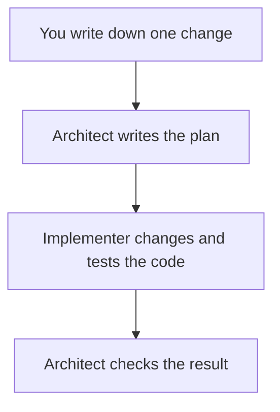
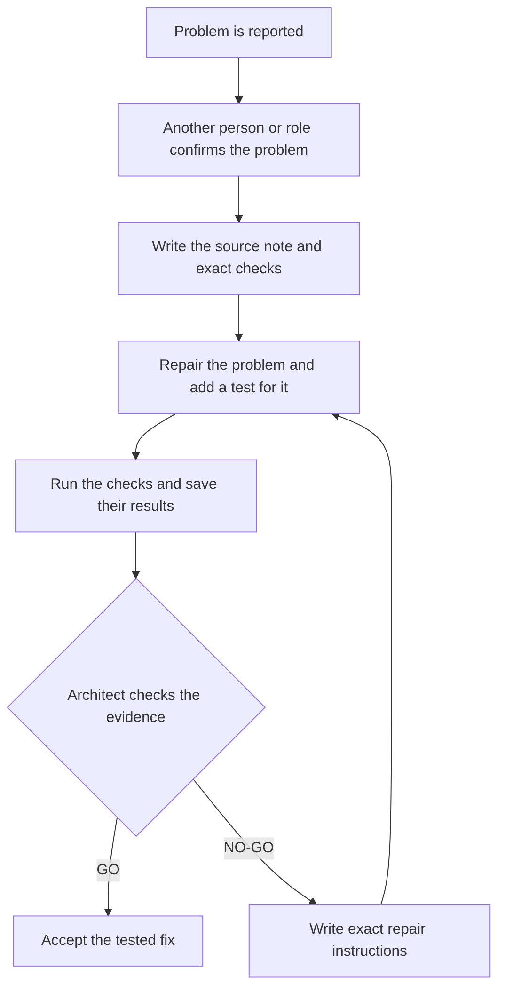
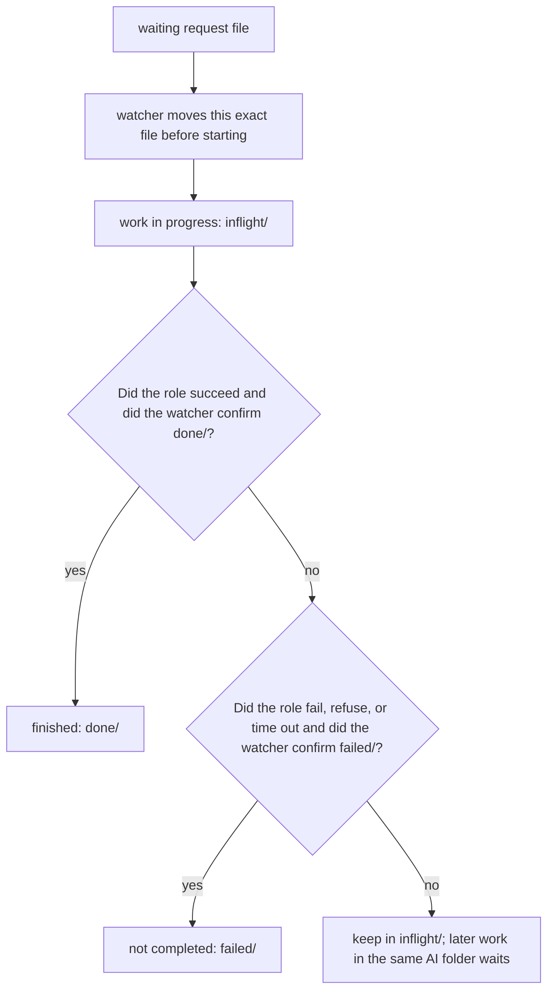
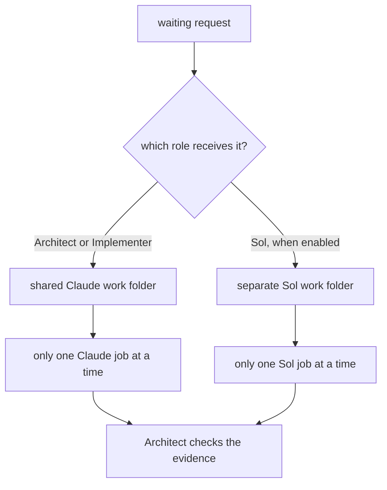
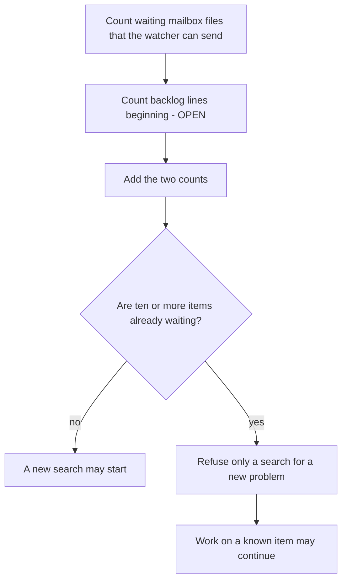

# AI-assisted development

## Why split the work into three roles?

If you can use Fable or Sol for every step without worrying about usage
limits, you may not need this system. One of those models can plan, write,
test, and review a change by itself.

This guide is written for students who may have a basic account or limited
paid access. AI models process text in **tokens**, small pieces of text that
they read or write. An account may limit this use through tokens, messages, or
cost. Implementation is the token-heavy part of this workflow: the model
repeatedly reads files, writes code, runs tests, studies failures, and tries
repairs.

The roles let you assign the longest work to a model that costs less to use:

- The **Architect** decides the design and writes complete instructions.
- The **Implementer** follows those instructions and performs the longer
  code-and-test work.
- The optional **Red Team** checks one named change for mistakes and, if it
  finds a defect, sends a detailed repair proposal back to the Architect.

The Architect and Red Team do the independent reasoning. Their instructions
must be detailed enough that the Implementer does not need to invent the
design. The Implementer can therefore be a much simpler model.

For example, if the account provides them and Fable use is unavailable, Opus
can be the Architect while Sonnet or Haiku is the Implementer. Sol can be
reserved for reviews of specific changes. The model choices belong to each
run; use `--architect-model` and `--implementer-model` to change them. If the
budget does not allow a Red Team review, a watch with `--skip-redteam` runs
only the Architect and Implementer.

This directory contains the tools that let several AI roles work on one
scientific codebase without treating chat as the project record.

The emulator library itself is documented in the top-level
[`README.md`](../README.md). Prof. Miranda owns the scientific contracts,
architecture, public interface, tests, and Python readability conventions.
Agents work inside those boundaries.


## Contents

### Main guide

1. [Why split the work into three roles?](#why-split-the-work-into-three-roles)
2. [Start here](#start-here)
3. [Complete one small ticket](#complete-one-small-ticket)
4. [Roles, models, and decisions](#roles-models-and-decisions)
5. [Choose which discoveries may become tickets](#choose-which-discoveries-may-become-tickets)
6. [Notes, tests, and gates](#notes-tests-and-gates)
7. [Fix-only watches](#fix-only-watches)
8. [Choose and run a command-line tool](tools/README.md)

### Common questions raised by developers

**[Appendices about roles and work folders](#appendices-about-roles-and-work-folders)**

- [FAQ A1. How does a mailbox message move?](#appendix-a--how-does-a-mailbox-message-move)
- [FAQ A2. What if the watcher cannot tell whether a message finished safely?](#faq-a2-unverified-outcome)
- [FAQ C1. Why can some AI jobs run together while others must wait?](#appendix-c--how-do-queues-and-lanes-work)
- [FAQ C2. Where does Sol work?](#faq-c2-sol-worktree)
- [FAQ D1. Why can the tool refuse a new Red Team search?](#appendix-d--what-is-the-demand-guard)
- [FAQ D2. When may Sol implement instead of review?](#faq-d2-second-implementer)
- [FAQ F1. Which folder does each role use?](#appendix-f--what-is-the-worktree-topology)
- [FAQ F2. Can I create another work folder for myself?](#faq-f2-other-worktrees)

**[Tool commands, stopping, setup, recovery, and transfers](tools/README.md#common-questions-raised-by-developers)**

- [When can I interrupt the watcher?](tools/README.md#appendix-b--when-is-it-safe-to-stop-the-watcher)
- [What does `--cycle` count?](tools/README.md#faq-b2-cycle-count)
- [What should I check first?](tools/README.md#appendix-e--how-do-i-troubleshoot-a-run)
- [What should I do if the tool rejects a saved AI folder?](tools/README.md#faq-e2-primary-recovery)
- [How do I set this up on another computer?](tools/README.md#appendix-g--how-do-i-install-this-on-another-machine)
- [How can two people transfer unfinished work?](tools/README.md#appendix-h--how-can-i-send-unfinished-work-to-someone-else)

## Start here

You do not need prior AI-agent or Git-worktree experience. You need Git,
Python 3, and the Claude command-line program. The Codex command-line program
is needed only when the Sol role is enabled. See the
[setup guide](tools/README.md#appendix-g--how-do-i-install-this-on-another-machine)
before continuing on a new computer.

Start with one request moving through four steps:



If the check finds a problem, the Architect writes repair instructions and
the Implementer tries again. The optional Red Team adds another review; its
place in the loop is explained later.

The tool keeps this sequence organized with three objects:

A **mailbox** is a folder of request files. A **directive** is the Architect's
ordered plan. A Git **branch** is a named line of saved changes, and a Git
**commit** is one saved project version. An **acceptance gate** is a check that
must pass before the change can be accepted.

| Object | Plain-language meaning |
| --- | --- |
| **Source note** | The written problem, scope, and acceptance checks. It is the source of truth. |
| **Watcher** | A long-running command that notices mailbox files and launches the correct role. |
| **Worktree** | Another project folder that Git manages for the same repository. It keeps agent work out of your main folder. |

A **ticket** is one requested change described by a source note.

A worktree is not a copy made by hand. Git registers it and gives it a branch.
The mailbox tool creates or reuses two agent worktrees: one shared by Claude
and one for Sol.

The watcher may be launched from any project folder that Git recognizes.
Mailbox commands that write files find both saved worktrees, then continue
from the saved Claude work folder. This prevents two terminals from silently
using different mailboxes or placing an agent in your main folder.

### Where things live

| Path | Purpose |
| --- | --- |
| `ai/README.md` | This operating guide |
| `ai/notes/` | Durable knowledge and local ticket records |
| `ai/tests/` | Regression tests and focused reproductions |
| `ai/gates/` | Validation board, checks, configuration, and logs |
| [`ai/tools/README.md`](tools/README.md) | Which tool to run, what it changes, command options, setup, and recovery |

### The one rule to remember

The mailbox message is only a pointer. The cited note carries the substance.

If a chat message, mailbox message, and source note disagree, the source note
wins. A later developer should be able to resume from repository records
without reconstructing the chat.

## Complete one small ticket

The example below adds a hypothetical `--version` option. Use a small ticket
first; it makes each moving part visible.

### 1. Preview without changing anything

From any project folder that Git recognizes:

```bash
python3 ai/tools/mailbox_daemon.py --dry-run
```

Expected result on an empty installation: the command prints the two AI work
folders that a command which writes files would create, reports `mailbox
empty`, and changes nothing. If messages are waiting, it also prints the role
command and working folder that a command which writes files would use. No
branch, worktree, or mailbox file is created.

### 2. Create the agent work folders

On a newly installed copy with no local edits, run this one-time setup before
writing a ticket note that Git has not saved:

```bash
python3 ai/tools/mailbox_daemon.py --once
```

Expected result: on a clean installation, the tool creates and saves two Git
*worktrees*. A worktree is simply another folder for the same repository,
with its own branch and working files.

- The Architect and Implementer share `mailbox-primary`.
- Sol uses a separate folder named `mailbox-sol`.
- Your original repository folder remains yours. No ordinary AI job starts
  there.

The command reports the saved paths, checks for waiting requests, and exits.
An empty first run prints that the mailbox is empty.

Open the saved Claude work-folder path reported by `--once` for the next step.
A newly created worktree starts from the latest saved Git version, so it cannot
see a ticket note that Git has not saved in another project folder.

If the command finds old mailbox files or a watcher in another project folder,
it refuses instead of guessing which mailbox is correct. Preserve every path
it names and follow the
[tool recovery guide](tools/README.md#appendix-e--how-do-i-troubleshoot-a-run).

### 3. Write the source note

In the saved Claude work folder, create a temporary ticket note such as
`ai/notes/version-flag.md`:

```markdown
# Version flag

## Goal

Add `--version` without changing normal training behavior.

## Acceptance gates

- `python3 train.py --version` exits successfully.
- Existing training tests still pass.
- A regression test checks the printed version.
```

Good notes answer four questions:

1. What behavior is wanted?
2. What must not change?
3. Which files or subsystem are in scope?
4. What command proves success?

### 4. Start the watcher

This example uses Opus as Architect and Sonnet as Implementer:

```bash
python3 ai/tools/mailbox_daemon.py --watch \
  --architect-model opus \
  --implementer-model sonnet
```

Keep this terminal open. The watcher checks the mailbox every 20 seconds and
prints progress while an AI job is running.

The models are command-line choices. The roles are stable: the Architect still
finishes the design, writes the ordered directive, and checks the ticket. The
Implementer follows that directive and makes the requested change.

The default watch also makes the independent Sol Red Team role available. It
does not create Sol work by itself; Sol runs only when a `to-sol` message is
waiting. For an Architect-and-Implementer run only:

```bash
python3 ai/tools/mailbox_daemon.py --watch --skip-redteam
```

`--no-red-team` is another name for the same option. Existing `to-sol` files
remain waiting for a later three-role watch.

The discovery severity defaults to `medium`. Add, for example,
`--severity high` to the watch command when discoveries created during that
run should use the stricter setting. Each discovery request saves its own
setting, so restarting the watcher does not change a request that is already
waiting.

### 5. Send the ticket to the Architect

In another terminal, from any project folder that Git recognizes:

```bash
python3 ai/tools/mailbox_daemon.py --send fable \
  --unit "You are the Architect. Coordinate the version-flag ticket in ai/notes/version-flag.md."
```

Expected result: one numbered `to-fable` file is saved in the mailbox. `fable`
is the stable Architect mailbox address even when it starts a different Claude
model.

### 6. Follow GO or NO-GO

For a read-only summary, run this from the saved Claude work folder:

```bash
python3 ai/tools/handoff_router.py --status
```

The Architect records exactly one decision for the named ticket:

- **GO**: the cited evidence satisfies the gates. The Architect uses its
  explicit permission to combine that approved ticket with `main` during that
  same Architect job.
- **NO-GO**: the ticket is held, and the Architect names the smallest repair
  needed for another review.

The saved records are split by purpose:

| Location | What it tells you |
| --- | --- |
| `ai/notes/mailbox/done/` | Which mailbox request was completed |
| `ai/notes/relay/` | What the AI role printed |
| Source or review note | What was claimed, tested, and decided |

Stop the watcher only at a printed safe interval, or use `--cycle` for an
automatic exit. The [safe-stop and cycle guide](tools/README.md#appendix-b--when-is-it-safe-to-stop-the-watcher)
explains both.

## Roles, models, and decisions

Models can change from run to run. Authority does not.

| Role | Responsibility | Mailbox address |
| --- | --- | --- |
| **Architect / Auditor** | Thinks through the design, writes the complete implementation directive, checks the original evidence, and decides `GO` or `NO-GO` | `to-fable` |
| **Implementer** | Follows the ordered directive, changes only the named ticket, and produces validation evidence | `to-opus` |
| **Independent Red Team** | Thinks adversarially about the named change and gives the Architect a detailed candidate repair when it finds a defect | `to-sol` |

The role instructions live in `.claude/FABLE_ROLE.md`,
`.claude/OPUS_ROLE.md`, and `.codex/REDTEAM_ROLE.md`. That mailbox address does
not name the model or give a role authority.

### The thinking roles must finish the plan

The system is designed so the Implementer can be a simpler or less expensive
model. It may be Sonnet, Haiku, an open-source model, or something else. The
Architect and Red Team therefore do the reasoning; the Implementer should not
need to invent architecture.

Before implementation, the Architect's temporary ticket note must say:

- the exact worktree, non-main branch, and base commit to use;
- which files and exact symbols to edit;
- what to do, in numbered dependency order;
- the interfaces, types, shapes, algorithms, constants, and failure behavior;
- the exact tests, fixtures, assertions, commands, and expected results;
- what is off-limits, when to stop, and who owns each parallel file.

Each file or test target begins its own visible bullet:

```markdown
- `ai/tools/mailbox_daemon.py::agent_preamble`: Change the role preamble.
```

The file-and-symbol name must come first, followed by the exact edit or test.
Inline links, images, hidden metadata, and copied mailbox or relay text cannot
supply the required instructions. Put any supplemental diagram outside the
checked directive.

The same note also has a separate `## Implementation evidence / resume state`
section. The Implementer appends results there and never changes the checked
directive's heading structure.

The Architect checks that directive before sending it to the Implementer:

```bash
python3 ai/tools/handoff_contract.py architect ai/notes/<ticket>.md
```

A Red Team finding must be equally useful: it explains why the problem happens
and provides an ordered candidate repair plus a test that prevents the same
problem from returning. It checks that proposal with `handoff_contract.py
redteam`. The proposal goes back to the Architect first. Only the Architect
may adopt it and issue the final directive the Implementer must follow.

If a directive is missing, contradictory, or leaves open a choice that could
change the result, the Implementer stops and reports the gap.

The phrase “Use your best judgment” is not an acceptable substitute for a
design decision.

### Limit the size of one ticket during maintenance

After a period of large development, you may want each maintenance ticket to
stay small. Start the watcher with a character limit:

```bash
python3 ai/tools/mailbox_daemon.py --watch --max 1200
```

Expected startup line:

```text
ticket character limit: 1200 added plus deleted characters per ticket
```

For each ticket, the Architect records the starting Git commit. Before
`GO`, the Architect compares that saved version with the proposed final
commit. Every added character and every removed character counts, including
spaces and line breaks. Adding 40 characters and removing 10 gives a total of
50; `--max 50` accepts that size, while `--max 49` does not.

The limit is not a target and does not permit dense or unfinished code. The
Architect must also issue `NO-GO` for unclear names, packed statements,
collapsed logic, missing explanations, omitted tests, or a partial fix made
only to stay below the number. The finished Python must remain readable to a
C programmer and a physics undergraduate learning Python. If the smallest
complete and readable change does not fit, the Architect asks you to split
the ticket or raise the limit.

The default is `--max 0`, which means no character limit. Readability, tests,
and all other review requirements still apply. This zero is unrelated to
`--cycle 0`, which controls when the watcher exits.

The [ticket-size questions](tools/README.md#appendices-about-ticket-size)
explain the exact count and the cases the guard refuses.

### Architect language is GO or NO-GO

Only the Architect decides whether the evidence is sufficient.

- `GO` authorizes the named ticket to advance.
- `NO-GO` holds it and identifies the failed claims and smallest required
  repair.
- “Pass” and “fail” may describe a test, but they do not replace the decision.

The Architect owns any accepted edit to the permanent notes and permission to
combine an approved change with `main`. The Implementer and Red Team do not
inherit that authority.

### When does the Red Team run?

In the default three-role setup, the Red Team role is available for each
ticket's normal review. Enabling the role does not start a review. Sol runs
only after the Architect or user saves a `to-sol` message. That review covers
the named commit or change and behavior directly affected by that change.

It does **not** turn a ticket review into a broad attack on the library. A
widespread search happens only when the user explicitly writes:

```text
Do a widespread search for ...
```

A Red Team finding is input to the Architect. Its detailed repair plan is a
candidate, never a self-executing ruling and never a direct instruction to the
Implementer. In plain terms, the finding cannot change code by itself; the
Architect must decide whether to use it.

`--skip-redteam` removes that optional role for one watch. It does not weaken
the Architect's evidence review.

## Choose which discoveries may become tickets

Here, a **discovery** is a request for the Red Team to inspect one named
change for a new bug that could become a separate piece of work.

**Severity** means how much harm a bug can cause. For discovery work,
`--severity` states the minimum severity the user wants considered for a new
ticket. The default is `medium`.

| Setting | A discovered bug may be proposed as a ticket when… |
| --- | --- |
| `high` | It severely impacts core functionality, causes data loss, halts system operations, or makes the science wrong. |
| `medium` | It meets the high rule, or it can affect normal operation and the Red Team can show a probable way for it to occur. A merely theoretical or improbable edge case does not qualify. |
| `low` | It is a concrete discovered bug, including an improbable edge case. The Red Team must still name the code path and evidence; an unsupported guess is not a discovered bug. |

Severity and likelihood answer different questions. Severity asks how much
harm the bug causes. Likelihood asks whether a user can probably reach it
during normal work. No numerical probability calculation is required. The Red
Team names the input, action, or failure path that supports `probable` or
`improbable`.

Every discovery result records five items:

1. the user's saved severity setting;
2. the Red Team's `high`, `medium`, or `low` rating;
3. whether the bug is probable or improbable;
4. the evidence for that likelihood; and
5. whether the result meets the user's setting.

The Red Team does not open a backlog ticket. It sends this assessment and its
evidence to the Architect. The Architect accepts, upgrades, or downgrades the
rating with a written reason, then records the final `GO` or `NO-GO` ticket
decision. This gives the Architect the final decision without hiding the Red
Team's original assessment.

The setting controls whether a newly found problem becomes separate work. It
does not make an unsafe current change acceptable: a defect in the named
change can still make that change `NO-GO`. It also does not widen the search.
A library-wide search still needs the user's explicit “Do a widespread search
for ...” request.

`--fix-only` is stronger than every severity value and permits no discovery.
A two-role watch started with `--skip-redteam` or `--no-red-team` has no Red
Team. A discovery is also refused when ten or more known items are waiting;
close recorded work first. The [tool guide](tools/README.md#choose-the-minimum-discovery-severity)
shows the exact commands and the saved ticket lines.

## Notes, tests, and gates

### Notes are the source of truth

All important instructions belong in notes. Mailbox messages should be short
summaries that cite the relevant section.

A **test** checks one behavior. A **gate** is a repeatable acceptance command
with a required result. The **validation board** lists and runs those gates so
the Architect can audit machine output instead of trusting a summary.

Exactly eleven Markdown notes are permanent repository knowledge:

1. `MEMORY.md`
2. `artifacts-inference-warmstart.md`
3. `conventions-and-workflow.md`
4. `data-generation-and-cuts.md`
5. `families-background-mps.md`
6. `families-scalar-cmb.md`
7. `models-and-designs.md`
8. `project-and-history.md`
9. `training-stack.md`
10. `user-didactics-and-python-voice.md`
11. `readme-go-no-go.md`

The backlog, dated reviews, incident reports, state notes, handoff registers,
mailbox files, and relay logs are local working records. Do not add them to a
GitHub commit.

The Implementer and Red Team never edit these eleven notes, regardless of the
ticket type. The Architect decides whether an accepted change modifies a
general property recorded there. If it does, the Architect reviews and
commits the note as a separate Architect-only change. That new commit can then
be the starting version for a later implementation ticket.

Before handing work to either role, the Architect records the full starting
commit. The Architect runs the following command immediately before that
handoff and again before the final `GO`:

```bash
python3 ai/tools/permanent_note_guard.py \
  --repo EXACT_WORKTREE \
  --base FULL_STARTING_COMMIT
```

The capitalized values are placeholders. The Architect replaces
`EXACT_WORKTREE` with the AI work-folder path and `FULL_STARTING_COMMIT` with
the full starting commit recorded in the directive.

The command calculates a SHA-256 fingerprint—a short identifier for exact
file bytes—from Git. It checks the notes in four places:

| Place checked | Plain meaning |
| --- | --- |
| Starting commit | The saved project version named by the Architect before work begins |
| Current `HEAD` | The latest saved commit in the AI work folder |
| Git staging area | Files selected for the next commit |
| Working files | Files currently visible in the AI work folder |

The expected fingerprints do not come from an editable checksum list. Only
the Architect's rerun counts; copied output from another role is supporting
evidence.

The command also compares `ai/tools/permanent_note_guard.py` with the starting
commit. This stops another role from changing both a protected note and the
program meant to detect that change. There is no separate checksum file that
could be changed to approve different bytes.

`readme-go-no-go.md` is also the Architect's plain-language contract. It
applies to README files that Git includes and to words inside Python meant to
teach or explain: comments, explanations placed under functions or classes,
command help, messages printed when something happens or fails, and other
explanatory strings.

### How does a reported problem become a tested fix?



A problem is first reported, then another person or role confirms the same
failure. The Architect writes the problem and exact checks in the source note.
The Implementer repairs the problem, adds a test, runs the checks, and saves
the results. The Architect reads that evidence.

`GO` accepts the tested fix. `NO-GO` sends exact repair instructions back to
the repair step.

A regression test keeps the same bug from returning unnoticed. It should prove
that it detects the original defect. Where practical, deliberately restore or
alter the bug and confirm that the test fails.

### Run the validation board

```bash
python3 ai/gates/run_board.py --list
python3 ai/gates/run_board.py --check
python3 ai/gates/run_board.py --dry-run
```

These commands list state, run the setup check only, and print the selected
gate commands. They do not claim that the full gates ran.

On a configured workstation:

```bash
python3 ai/gates/run_board.py
python3 ai/gates/run_board.py --gate ID
```

Hardware-only rows may be recorded explicitly. They are never silently
treated as passing.

## Fix-only watches

Use fix-only mode when the current backlog is already large and the run should
finish known work instead of searching for more:

```bash
python3 ai/tools/mailbox_daemon.py --watch --fix-only yes
```

Here, **closure** means finishing work that is already recorded. **Discovery**
means asking Sol to search for a new problem.

Existing closure work remains eligible, while new Sol discovery is refused.
Even `--severity low` cannot override fix-only mode.
The [tool guide](tools/README.md#fix-only-watches) explains the accepted values,
how another terminal learns the same rule, stored-message checks, and
combinations with cycle and two-role options.

## Choose and run a command-line tool

The five scripts under `ai/tools/` have different jobs. The
[tool command guide](tools/README.md) provides a task-based chooser, daily
commands, current option reference, safe stopping instructions, setup,
recovery, and unfinished-work transfer.

The first-ticket commands above are enough for a normal run. Use the separate
guide when you need another send, a manual clipboard relay, a protected-note
check, a fix-only combination, or an exact command-line option.

# Common questions raised by developers

## Appendices about roles and work folders <a id="appendices-about-roles-and-work-folders"></a>

### FAQ A1. How does a mailbox message move? <a id="appendix-a--how-does-a-mailbox-message-move"></a>

The mailbox is a set of folders, and each request is a small Markdown file, a
text file ending in `.md`. Sending a request means saving that file in the
mailbox's waiting area. The watcher is the program that looks for waiting
files and starts the appropriate AI role.

Just before starting a role, the watcher moves the exact request file into
`inflight/`, which means **work in progress**. Moving it first prevents a
second watcher from starting the same request. When the role finishes, the
watcher tries to move that same file to `done/` or `failed/`.



Messages ending in `-to-user.md` are replies for a person to read. The watcher
never starts an AI role from those files.

### FAQ A2. What if the watcher cannot tell whether a message finished safely? <a id="faq-a2-unverified-outcome"></a>

If a request remains in `inflight/`, the role started but the watcher could
not confirm the final result. Later requests that use the same AI work folder
must wait. Otherwise, they could edit the same files while the first request
is still running or while its result is uncertain.

`--dispatch-timeout MINUTES` sets the longest allowed running time and
defaults to 60 minutes. At that limit, the watcher stops the AI program, saves
a small timeout record under `ai/notes/mailbox/.dispatch-history/`, and tries
to move the request to `failed/`.

If the watcher cannot confirm the timeout record or the move of the exact
request file, it leaves the file in `inflight/`. Even an AI program that exits
without an error is not marked finished until the watcher confirms that the
same request file reached `done/`.

Do not requeue or move an uncertain file. First compare the original request,
its named log, and any copies in `done/` or `failed/` so you know which result,
if any, was saved.

`--dry-run` only prints what would happen. It starts no role and moves no
mailbox file.

### FAQ C1. Why can some AI jobs run together while others must wait? <a id="appendix-c--how-do-queues-and-lanes-work"></a>

Two roles must not edit the same working folder at the same time. The watcher
therefore starts only one job at a time in each AI folder. Jobs in separate AI
folders may run together.

The documentation calls each one-at-a-time sequence a **lane**. A **turn** is
one role handling one message. A **dispatch** is the moment when the watcher
starts that turn. These names appear in logs, but the folder rule is the
important idea.



The number at the beginning of each message filename determines its order
inside the same lane.

Architect and Implementer intentionally share one Claude folder so both see
the same notes and unfinished edits. They must therefore take turns. Sol uses
a different folder and may run at the same time as one Claude role.

### FAQ C2. Where does Sol work? <a id="faq-c2-sol-worktree"></a>

A Git **worktree** is an extra working copy of the same project. It has its
own files and its own named line of work, called a branch, while sharing the
project's saved Git history.

Sol never edits code in the main folder that you use. On the first live run,
the watcher creates a separate Sol worktree and remembers its location. Later
runs reuse it.

Claude and Sol therefore edit code in different folders, and neither normally
interferes with your main folder. Sol can also read and write the Claude
worktree's `ai/notes/` folder so all roles share the same source notes and
mailbox records.

Before Sol starts an implementation job, the Architect's `Execution checkout`
field must name the saved Sol project folder, its branch (which must not be
`main`), and the full identifier of the starting Git commit—the exact saved
version of the project from which Sol should begin. If any detail is missing
or different, Sol must not edit any file. The manual router refuses before
sending the job; a mailbox-started Sol turn returns a blocker to the
Architect.

Only the Architect may enter your main folder, and only after recording `GO`,
to combine an approved change with `main`.

A two-role watch created with `--skip-redteam` or `--no-red-team` does not run
Sol. Existing Sol messages remain untouched for a later normal watch.

### FAQ D1. Why can the tool refuse a new Red Team search? <a id="appendix-d--what-is-the-demand-guard"></a>

The tool counts two exact kinds of recorded work:

```text
waiting mailbox messages + lines that begin “- OPEN” in ai/notes/backlog.md
```

The documentation calls this sum **total demand**. If ten or more existing
items are already waiting, the tool refuses a request for Sol to search for a
new problem. This prevents another discovery request from creating still more
work while many known items remain unfinished. A library-wide search still
requires the user's explicit widespread-search request.

The new search does not count against itself: with nine existing items, it
may be accepted as the tenth. The tool checks again just before starting it.
If ten other items exist by then, it refuses the search and tries to move its
message to `failed/`.

Put the proposed search at the end of `ai/notes/backlog.md`. Retry only when
total demand is below ten, including any `- OPEN` line added for this proposal.
Sol may still review or help finish a specific known item. Work that closes a
known item may continue.



### FAQ D2. When may Sol implement instead of review? <a id="faq-d2-second-implementer"></a>

Having ten unfinished items does not automatically change Sol's role. The
first non-empty line after the required ticket line selects Sol's role for
this message. One optional line beginning `### ARCHITECT_HANDOFF` may appear
between them. To select the second-Implementer role, that first non-empty
assignment line must be the exact declaration below. In this required program
sentence, `unit` means this ticket:

```text
OpenAI Sol — this is a role as second Implementer for this unit.
```

Putting that sentence later in the message, or merely quoting it in a
discussion, does not change the role. Without the declaration in the required
place, Sol remains the Red Team and reviews only the named change.

The declaration selects the role; it does not by itself permit an edit. Sol
may begin editing only after the cited Architect `Implementation directive`
passes validation. That directive must say what to change, how to change it,
and which tests must pass.

Otherwise Sol returns a blocker to the Architect. After valid
second-Implementer work, Sol follows `.claude/OPUS_ROLE.md` and sends an
`IMPLEMENTER_HANDOFF`, the structured result sent back to the Architect. Sol
does not also Red Team review the same job.

The [manual second-Implementer guide](tools/README.md#use-sol-as-a-second-implementer)
explains the command, separate-worktree check, and printed reminder. The
watcher never creates those jobs or changes Sol's role by itself.

### FAQ F1. Which folder does each role use? <a id="appendix-f--what-is-the-worktree-topology"></a>

A **worktree** is a separate project folder that Git creates and remembers.

- You use the repository's main folder.
- Architect and Implementer share one Claude worktree.
- Sol uses a different worktree.

The first mailbox command that can start or send work creates both AI folders
and remembers them. A dry run does not.

Code changes happen in the role's own worktree, never in your main folder. Sol
also uses the Claude worktree's `ai/notes/` folder for shared coordination
records. The single exception for code is explicit: after the Architect
records `GO`, the Architect may enter the main folder to combine that approved
change with `main`.

### FAQ F2. Can I create another work folder for myself? <a id="faq-f2-other-worktrees"></a>

Yes. A worktree is a separate project folder that Git creates and remembers.
You may create another one for a manual experiment or other development work.
That extra folder does not change the saved Claude or Sol folder used by the
watcher.
