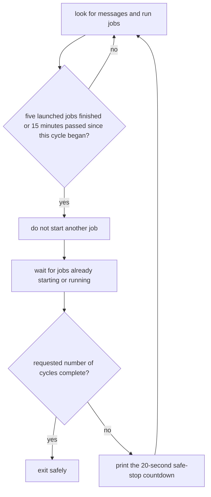

# AI development tools

This folder contains five Python programs for the AI-assisted development
workflow. Most users begin with `mailbox_daemon.py`, the program that watches
for request files and starts the matching AI role.

Read [`ai/README.md`](../README.md) first for the Architect, Implementer, and
optional Red Team roles. This guide answers a narrower question: which program
do I run, what does it change, and what result should I expect?

## Contents

### Main guide

1. [Which tool do I use?](#which-tool-do-i-use)
2. [Where do I run these commands?](#where-do-i-run-these-commands)
3. [Which commands only inspect, and which commands change files?](#which-commands-only-inspect-and-which-commands-change-files)
4. [Useful daily commands](#useful-daily-commands)
5. [Use Sol as a second Implementer](#use-sol-as-a-second-implementer)
6. [Check protected project notes](#check-protected-project-notes)
7. [Fix-only watches](#fix-only-watches)
8. [Runtime controls](#runtime-controls)
9. [Exact command reference](#exact-command-reference)

### Common questions raised by developers

**[Appendices about stopping the watcher](#appendices-about-stopping-the-watcher)**

- [FAQ B1. When can I interrupt the watcher?](#appendix-b--when-is-it-safe-to-stop-the-watcher)
- [FAQ B2. What does `--cycle` count?](#faq-b2-cycle-count)

**[Appendices about setup, problems, and recovery](#appendices-about-setup-and-recovery)**

- [FAQ E1. What should I check first?](#appendix-e--how-do-i-troubleshoot-a-run)
- [FAQ E2. What should I do if the tool rejects a saved AI folder?](#faq-e2-primary-recovery)
- [FAQ G. How do I set this up on another computer?](#appendix-g--how-do-i-install-this-on-another-machine)

**[Appendices about sharing unfinished work](#appendices-about-occasional-transfer)**

- [FAQ H1. How can I send unfinished work to another person?](#appendix-h--how-can-i-send-unfinished-work-to-someone-else)
- [FAQ H2. How can the other person open that package safely?](#faq-h2-inspect-unfinished-work)

## Which tool do I use?

The guide uses five terms throughout:

- A **mailbox** is a set of folders containing small Markdown request files.
- A **watcher** is the long-running mailbox command.
- A **directive** is the full written plan in a ticket note.
- A **relay** copies a short pointer or result between sessions.
- A **dry run** prints an action without performing it.

A **permanent note** is one of the eleven protected Markdown files listed in
[`ai/README.md`](../README.md#notes-are-the-source-of-truth). A `.tar.xz`
archive is one compressed file that can be attached to an email.

A Git **branch** is a named line of saved changes. A **commit** is one saved
project version. A Git **worktree** is an extra project folder attached to a
branch.

Claude and Sol use different worktrees for code. Sol can also read and write
the Claude worktree's `ai/notes/` folder so every role can use the same source
notes and mailbox records.

| What you want to do | Program | First command | Effect |
| --- | --- | --- | --- |
| Preview, start, or stop the mailbox workflow; send work; choose role models | `mailbox_daemon.py` | `python3 ai/tools/mailbox_daemon.py --dry-run` | A dry run only prints. Commands that write files may create AI work folders, save or move mailbox files, write logs, and start AI roles. |
| Check that an Architect or Red Team instruction contains every required part | `handoff_contract.py` | `python3 ai/tools/handoff_contract.py --help` | Reads one Markdown note. It does not run its tests or judge the scientific plan. |
| Read status or run the manual clipboard workflow | `handoff_router.py` | `python3 ai/tools/handoff_router.py --status` | Status only reads. A run with `--note` changes the clipboard, waits for copied replies, runs local commands, and writes relay records. |
| Check that eleven protected project notes still match the Architect's starting commit | `permanent_note_guard.py` | `python3 ai/tools/permanent_note_guard.py --help` | Reads Git and the notes. It changes nothing and does not issue `GO` or `NO-GO`. |
| Package unfinished local backlog work for another person | `backlog_bundle.py` | `python3 ai/tools/backlog_bundle.py pack --dry-run` | A dry run lists files. `pack` writes one `.tar.xz` archive; `unpack` writes a new review folder that Git does not include in commits. |

## Where do I run these commands?

Run the examples from the repository's top folder: the folder containing both
`README.md` and `ai/`. From any project folder that Git recognizes, this
read-only shell command moves the terminal there and confirms that the tools
exist:

```bash
cd "$(git rev-parse --show-toplevel)"
test -d ai/tools && printf '%s\n' 'AI tools found'
```

Expected result:

```text
AI tools found
```

Changing the terminal's current folder does not change a project file.
`mailbox_daemon.py` can resolve the saved AI work folders from another
project folder, but using the top folder keeps paths in examples predictable.

## Which commands only inspect, and which commands change files?

| Command form | Changes project files or saved AI records? | What it does |
| --- | --- | --- |
| Any `--help` command | No | Prints options and exits. |
| `mailbox_daemon.py --dry-run` | No | Prints work folders and messages that a command which writes files would use. |
| `handoff_contract.py architect NOTE` or `handoff_contract.py redteam NOTE` | No | Reads and checks one directive. |
| `handoff_router.py --status` | No | Reads branches and local records, then suggests a next action. It does not run that action. |
| `permanent_note_guard.py --base FULL_COMMIT` | No | Compares the protected files in saved Git versions, the files selected for the next commit, and the files currently visible. |
| `backlog_bundle.py pack --dry-run` | No | Lists the proposed package without writing it. |
| `backlog_bundle.py inspect ARCHIVE` | No | Validates and lists an incoming package without unpacking it. |
| `mailbox_daemon.py --send` or `--ping` | Yes | If its options are written correctly, this command may create or reuse the AI work folders first. If the request is accepted, it writes one numbered mailbox file. If a rule refuses the request, it writes no request file but may already have created the work folders. |
| `mailbox_daemon.py --once` or `--watch` | Yes | May create or reuse AI work folders, start roles, move mailbox files, and write relay or saved workflow records. |
| `handoff_router.py --note NOTE` | Yes | Changes the clipboard, writes local relay records, and runs the selected shell commands. It does not launch a web session for you. |
| `backlog_bundle.py pack` | Yes | Writes a new ignored `.tar.xz` file and never replaces an existing file. |
| `backlog_bundle.py unpack ARCHIVE` | Yes | Writes into a fresh ignored folder under `ai/backlog-imports/`; it does not replace live notes. |

In this table, `NOTE` means the path to a ticket note, `FULL_COMMIT` means the
full Git name of the starting saved version, and `ARCHIVE` means the path to a
received `.tar.xz` file.

A first mailbox command that writes files may create the two Git worktrees
described above.
The [role guide](../README.md#faq-c2-sol-worktree) explains why Claude and Sol
need separate folders.

## Useful daily commands

The examples below use `version-flag.md`, the sample ticket created in the
[first-ticket tutorial](../README.md#complete-one-small-ticket). Replace it
with the filename of your own temporary ticket note. In a command that uses
`<ticket>`, replace the whole placeholder, including the angle brackets.

### Check a handoff directive

The Architect or Red Team runs one of these before sending implementation work
or a candidate repair:

```bash
python3 ai/tools/handoff_contract.py architect ai/notes/<ticket>.md
python3 ai/tools/handoff_contract.py redteam ai/notes/<ticket>.md
```

The check is read-only and reports `VALID` or `INVALID` for both instruction
types. These results check the note's format; only the Architect says `GO` or
`NO-GO`.

`VALID` means the required sections are in order. The note must name exact
files and tests, number its work steps, provide a shell-command block, and
include acceptance checkboxes. The tool does not judge whether the scientific
plan is correct.

### Read the current AI work status

```bash
python3 ai/tools/handoff_router.py --status
```

This prints a read-only summary of branches, completed reviews, review requests
that remain open, and next actions.

### Preview one send

```bash
python3 ai/tools/mailbox_daemon.py --dry-run --send opus \
  --unit "You are the Implementer. Follow the ARCHITECT_HANDOFF in ai/notes/version-flag.md."
```

The command prints the mailbox filename it would create, but writes no file.

### Send work to the Implementer

```bash
python3 ai/tools/mailbox_daemon.py --send opus \
  --unit "You are the Implementer. Follow the ARCHITECT_HANDOFF in ai/notes/version-flag.md."
```

Success prints `queued PATH` and writes one numbered `to-opus` request file.
The send command itself does not start the role. An active watcher handles the
request.

### Run a two-role manual relay

```bash
python3 ai/tools/handoff_router.py \
  --note ai/notes/version-flag.md \
  --skip-redteam
```

Unlike `--status`, this manual relay changes the system
clipboard, waits for copied result sections, creates local relay records, and
runs the selected validation commands. Read every `--gate-cmd` string before
allowing the shell to run it.

This command controls only that clipboard relay. It does not change the roles
used by an already running mailbox watcher. Its source must be an ordinary
`.md` file rather than a linked shortcut in this project folder's `ai/notes/`
directory. The tool refuses a relay log, a mailbox file, a path outside
`ai/notes/`, or a path containing `../` because none of those is the original
source note.

In a path, `../` asks to move above the current folder.

### Ask the Red Team to search one named change

```bash
python3 ai/tools/mailbox_daemon.py --send sol \
  --ticket-kind discovery \
  --unit "You are the Independent Red Team. Review the version-flag change named in ai/notes/version-flag.md. Stay within that change."
```

Success prints `queued PATH` and writes one numbered `to-sol` request file
labelled `discovery`. The send command itself does not start Sol. An active
watcher handles the request.

A **discovery** asks the Red Team to look for a new problem in the named
change. It is refused when fix-only mode is on or when ten or more known items
are already waiting. The role guide explains this
[limit on new searches](../README.md#appendix-d--what-is-the-demand-guard).

### Ask the Red Team to finish a recorded review

```bash
python3 ai/tools/mailbox_daemon.py --send sol \
  --ticket-kind closure \
  --unit "You are the Independent Red Team. Close the existing item described in ai/notes/backlog.md."
```

A **closure** asks the Red Team to finish or recheck a problem that is already
recorded. Success prints `queued PATH` and writes one numbered `to-sol`
request file beginning with `MAILBOX-TICKET: closure`. The send command itself
does not start Sol. An active watcher handles the request.

### Check whether a role can receive and reply

```bash
python3 ai/tools/mailbox_daemon.py --ping opus
```

This sends a small test message rather than a work assignment. Success prints
`queued PATH` and writes one numbered `to-opus` test request. The reply is
addressed `to-user`. The watcher leaves it for a human and does not send it to
another role.

## Use Sol as a second Implementer

The role rule and exact declaration are in
[FAQ D2 of the role guide](../README.md#faq-d2-second-implementer). The manual
command below sends one supplied implementation job to Sol instead of Opus:

```bash
python3 ai/tools/handoff_router.py \
  --note ai/notes/version-flag.md \
  --mode second-implementer
```

Run it inside the exact Sol worktree named in the directive's `Execution
checkout`, the field that states which project folder to use. Before copying
a prompt, the tool confirms that Git recognizes the folder, that it uses the
named non-`main` branch, and that its current commit matches the full starting
commit in the directive.

The command never asks both Implementers to perform the same instruction. It
does not also run Sol as Red Team. `--skip-redteam` cannot be combined with
`--mode second-implementer`.

When ten or more items are waiting, the watcher prints this reminder:

```text
  hint: 10 or more items are waiting. Give Sol separate implementation jobs as a second Implementer, but only a message with the required declaration changes Sol's role; otherwise Sol remains the Red Team.
```

The watcher does not create those jobs or change Sol's role by itself.

## Check protected project notes

Only the Architect interprets this check as part of a `GO` or `NO-GO`
decision. `HEAD` is Git's short name for the latest saved commit in the
current worktree. From the exact worktree named in the directive, this
read-only example checks the notes against that saved version:

```bash
BASE="$(git rev-parse HEAD)"
python3 ai/tools/permanent_note_guard.py \
  --repo "$PWD" \
  --base "$BASE"
```

A real ticket uses the full starting commit recorded before implementation,
which may be older than the current `HEAD`. Success ends with:

```text
PERMANENT-NOTE-GUARD PASS base=... notes=11
```

The guard checks the starting commit, current `HEAD`, files selected for the
next commit, working files, and its own program file contents. A passing guard
proves only that these protected files match. It does not approve the
implementation.

## Fix-only watches

Use fix-only mode when the backlog already contains many items and the run
should finish known work instead of finding more:

```bash
python3 ai/tools/mailbox_daemon.py --watch --fix-only yes
```

The value also accepts `1` or `true`, in any capitalization.

Here, **closure** means finishing work that is already recorded. **Discovery**
means asking Sol to search for a new problem.

When the Sol role is enabled, fix-only mode behaves as follows:

- existing closure work remains eligible;
- new Sol discovery is refused;
- the watcher saves this rule for that mailbox, so a send from another
  terminal follows it too;
- the watcher checks a waiting Sol file's saved `closure` or `discovery` label
  again before launch;
- an invalid waiting Sol message moves to `failed/` instead of being guessed
  from prose.

Fix-only can be combined with a two-role setup or a cycle limit:

```bash
python3 ai/tools/mailbox_daemon.py --watch --fix-only yes --cycle 2
python3 ai/tools/mailbox_daemon.py --watch --fix-only yes --skip-redteam --cycle 0
```

In the second command, the two-role setting disables Sol. Every waiting Sol
file remains untouched until a later watch enables Sol again.

## Runtime controls

| Concern | Options | Default |
| --- | --- | --- |
| Claude models | `--architect-model`, `--implementer-model` | `claude-fable-5`, `claude-opus-4-8` |
| Claude effort | `--fable-effort`, `--opus-effort` | `xhigh`, `max` |
| Sol effort | `--sol-effort` | `xhigh` |
| Roles used | `--skip-redteam`, `--no-red-team` | Architect + Implementer + Sol |
| AI job timeout | `--dispatch-timeout` | 60 minutes |
| Saved conversation length | `--claude-context`, `--sol-context` | 500000 tokens each |
| Watch lifetime | `--cycle` | omitted: indefinite; `N>0`: stop at cycle N; `0`: finish enabled waiting messages and open backlog items |
| Discovery policy | `--fix-only` | off |

Model selection and effort are independent. Choosing Sonnet does not silently
lower the Implementer effort.

Each Claude model option accepts one nonempty value containing no spaces,
tabs, line breaks, or hidden zero character, such as `sonnet` or a full model
name. This checks only a formatting rule. The installed Claude program
confirms whether the model exists only when a live role starts.

The mailbox addresses `fable` and `opus` continue to mean Architect and
Implementer even when the command selects different Claude models. There is no
`--sol-model` option. The program currently pins Sol to `gpt-5.6-sol`; its
command-line choices are effort and saved conversation length.

When a session reaches the chosen token count, it replaces older conversation
text with a shorter summary and continues. Claude receives
`CLAUDE_CODE_AUTO_COMPACT_WINDOW`; Sol receives
`model_auto_compact_token_limit`.

On every pass, the watcher checks when `mailbox_daemon.py` was last modified.
If the file changed, the running watcher exits. Start it again to load the new
code.

## Exact command reference

The program's live help contains its current options:

```bash
python3 ai/tools/mailbox_daemon.py --help
```

The current transcript is kept here for offline reading and regression checks.

<details>
<summary>Current <code>mailbox_daemon.py --help</code> transcript</summary>

```
usage: mailbox_daemon.py [-h] [--dry-run] [--once] [--watch] [--cycle count]
                         [--skip-redteam] [--fix-only value] [--send AGENT]
                         [--ping AGENT] [--unit UNIT]
                         [--ticket-kind {closure,discovery}]
                         [--architect-model MODEL] [--implementer-model MODEL]
                         [--fable-effort {low,medium,high,xhigh,max}]
                         [--opus-effort {low,medium,high,xhigh,max}]
                         [--sol-effort {none,low,medium,high,xhigh}]
                         [--dispatch-timeout MINUTES]
                         [--claude-context TOKENS] [--sol-context TOKENS]

file mailbox + headless dispatch for the agent loop

options:
  -h, --help            show this help message and exit
  --dry-run             show what would happen and change nothing: pending
                        dispatches are printed, not run, and --send/--ping
                        print the message file they would queue without
                        writing it
  --once                process the current backlog and exit
  --watch               poll the mailbox every 20 seconds
  --cycle count         with --watch, exit safely after this many global
                        rendezvous cycles; 0 waits until the enabled dispatch
                        queue and open ledger are empty; omitting the option
                        keeps watching indefinitely
  --skip-redteam, --no-red-team
                        with --watch, dispatch only Architect and Implementer
                        routes; disable the entire Sol route and leave
                        existing to-sol messages queued for a later normal
                        watch
  --fix-only value      with --watch, close existing ledger work only; the
                        value accepts 1, true, or yes in any capitalization
  --send AGENT          queue a message to this agent and exit
  --ping AGENT          queue a transport-confirmation ping to this agent (its
                        reply lands as a -to-user.md file the daemon never
                        dispatches)
  --unit UNIT           the message text for --send (a routing summary
                        pointing at ai/notes/)
  --ticket-kind {closure,discovery}
                        required with --send sol: declare whether the unit
                        closes existing work or seeks new findings
  --architect-model MODEL
                        Claude model alias or full name for the Architect
                        route (legacy fable address; default: claude-fable-5)
  --implementer-model MODEL
                        Claude model alias or full name for the Implementer
                        route (legacy opus address; default: claude-opus-4-8)
  --fable-effort {low,medium,high,xhigh,max}
                        claude CLI reasoning effort for the Architect route
                        (legacy fable address; default: xhigh)
  --opus-effort {low,medium,high,xhigh,max}
                        claude CLI reasoning effort for the Implementer route
                        (legacy opus address; default: max)
  --sol-effort {none,low,medium,high,xhigh}
                        codex CLI reasoning effort for Sol dispatches
                        (default: xhigh)
  --dispatch-timeout MINUTES
                        kill a dispatched turn that runs past this many
                        minutes and park its message in failed/ (default: 60)
  --claude-context TOKENS
                        Architect and Implementer Claude turns compact their
                        context whenever it reaches this many tokens (default:
                        500000)
  --sol-context TOKENS  Sol turns compact their context whenever it reaches
                        this many tokens (default: 500000)
```

</details>

### Action rules

- Choose only one of `--once`, `--watch`, `--send`, and `--ping` in one
  command.
- `--cycle` accepts an integer from 0 through 1,000,000 and is valid only with
  `--watch`.
- Omitting `--cycle` watches indefinitely. `--cycle 0` instead waits until the
  enabled roles have no waiting messages and no backlog line begins `- OPEN`.
- `--skip-redteam` and `--no-red-team` are two names for the same watch-only
  setting.
- A two-role watch preserves waiting Sol files and refuses new Sol sends and
  pings until that watcher stops and releases its saved two-role rule.
- `--unit` is required with `--send`.
- A Sol send also requires `--ticket-kind` followed by either `closure` or
  `discovery`.
- `--dispatch-timeout`, `--claude-context`, and `--sol-context` accept integers
  from 1 through 1,000,000.
- For actions that exit on their own, `--dry-run` prints the proposed action
  without writing workflow files.
- Malformed model values, invalid effort or context values, invalid timeouts,
  and invalid action combinations fail before the tool writes a mailbox file.

The manual relay has separate live help:

```bash
python3 ai/tools/handoff_router.py --help
```

Its `--skip-redteam` option controls one clipboard relay, not a running
watcher.

Every tool has live help. These commands only print and exit:

```bash
python3 ai/tools/mailbox_daemon.py --help
python3 ai/tools/handoff_router.py --help
python3 ai/tools/handoff_contract.py --help
python3 ai/tools/permanent_note_guard.py --help
python3 ai/tools/backlog_bundle.py --help
python3 ai/tools/backlog_bundle.py pack --help
python3 ai/tools/backlog_bundle.py inspect --help
python3 ai/tools/backlog_bundle.py unpack --help
```

# Common questions raised by developers

## Appendices about stopping the watcher <a id="appendices-about-stopping-the-watcher"></a>

### FAQ B1. When can I interrupt the watcher? <a id="appendix-b--when-is-it-safe-to-stop-the-watcher"></a>

Read the watcher's latest status line:

| Printed status | Plain meaning | Safe to press Ctrl-C? |
| --- | --- | --- |
| A periodic progress message, `turn in flight`, or `turns in flight` | An AI role is running | No |
| `dispatch preparation admitted; not safe to stop` | The watcher is starting a role | No |
| `safe interval ended; not safe to stop` | An earlier safe period has ended | No |
| `safe to Ctrl-C` | No AI role is running or starting during the printed countdown | Yes |
| `watcher exiting safely` | The watcher has already stopped | Yes; no action is needed |
| A timeout message | The watcher is stopping one long-running role and saving its result | No. Wait for a later `safe to Ctrl-C` or `watcher exiting safely` line. After it stops, inspect `failed/` (failed requests) and `inflight/` (requests being handled) before sending the request again |

### FAQ B2. What does `--cycle` count? <a id="faq-b2-cycle-count"></a>

For `--cycle N`, where `N` is greater than zero, a cycle begins when the
watcher starts or when the preceding 20-second safe-stop countdown ends. It
reaches its next safe-stop point after five launched AI jobs finish or 15
minutes pass from the start of that cycle, whichever happens first. Ordinary
idle checks do not reset that 15-minute clock in this mode.

To complete the cycle, the watcher stops starting new jobs and waits for jobs
that are already starting or running. It then either exits or prints the
20-second Ctrl-C countdown before beginning another cycle.



Choose how long the watcher should run:

| Command | What it does |
| --- | --- |
| `--watch` | Keep watching until you stop it during a printed safe countdown |
| `--watch --cycle 2` | Exit safely after two completed cycles, even if more work is waiting |
| `--watch --cycle 0` | Exit only when no enabled mailbox message is waiting and `ai/notes/backlog.md` has no line that begins `- OPEN` |
| `--watch --skip-redteam --cycle 0` | Wait only for Architect and Implementer work; leave Sol messages untouched for a later run |

`--cycle 0` does not read a backlog description and invent an AI request from
it. Someone must still send the appropriate mailbox message. The roles that
handle that request must also change its `- OPEN` backlog line when the work
is genuinely finished.

Just before a zero-cycle exit, the watcher briefly prevents `--send` from
saving another message. It checks that the backlog is an ordinary readable
text file, that the file did not change during the check, and that no enabled
message is waiting. If it cannot perform those checks, it keeps running
instead of guessing that the work is finished.

This line marks a safe countdown:

```text
all lanes idle; safe to Ctrl-C for 19s more; 3 messages waiting.
```

The words `all lanes idle` mean that no AI role is running or starting. The
last number says how many request files still wait, including work for a role
that may be disabled in this run.

While a role is running, a periodic progress message looks like this:

```text
  ... 0046-to-opus.md still running (3 min elapsed, log 12.4 kB; tail -f .../ai/notes/relay/20260714-031840-dispatch-opus.log)
```

It names the request, elapsed time, and current log-file size. The final path
is the log that an experienced user may inspect while the job runs.

```text
cycle limit reached (2/2 cycles); all lanes idle; watcher exiting safely; 3 messages waiting; 4 open ledger jobs remain.
```

This last line means the requested two cycles are complete and the watcher
has stopped safely. “Open ledger jobs” means backlog lines that still begin
with `- OPEN`.

The watcher also waits 20 seconds when it simply finds no work. Interrupting
during that idle wait is safe, but the idle wait does not complete a cycle.

## Appendices about setup, problems, and recovery <a id="appendices-about-setup-and-recovery"></a>

### FAQ E1. What should I check first? <a id="appendix-e--how-do-i-troubleshoot-a-run"></a>

| What you see | What it probably means | What to do first |
| --- | --- | --- |
| A command refuses and lists several mailbox folders | It found old or duplicate mailbox locations and cannot safely choose one | Do not delete any folder. Rerun the command from the Claude worktree you intend to use |
| The tool refuses a saved Claude or Sol folder | The saved path or branch does not match what Git currently knows | Keep the folder. Run `git worktree list --porcelain`, which only prints Git-managed work folders and their branches, and compare it with the error |
| The elapsed time increases but the Claude log stays small | Claude may still be working but has not printed more text yet | Keep watching the elapsed time |
| Neither elapsed time nor log size changes | The AI program may be stuck | Let the normal timeout handle it. Stop manually only after the watcher prints `safe to Ctrl-C`, and press Ctrl-C before that countdown ends |
| A file in `inflight/` prevents later work | The watcher started the request but could not prove whether it saved the final request file in `done/` or `failed/` | Compare the original request, any copy in `done/` or `failed/`, and the named log before moving anything |
| Sol cannot start a new search | A fix-only watch accepts only work that finishes already recorded items, or ten known items already wait | Record the possible issue and use Sol only on a specific known item for now |
| The watcher exits after you edit `mailbox_daemon.py` | The running watcher noticed that its own program file changed | Start the watcher again so it loads the new code |
| `--send` warns that no watcher is active | The request was saved, but no watcher is currently handling that mailbox | Start a watcher. The saved request remains safe while it waits |

### FAQ E2. What should I do if the tool rejects a saved AI folder? <a id="faq-e2-primary-recovery"></a>

The AI folders are Git worktrees: extra project folders that Git creates and
remembers. Each worktree has its own branch, the named line of saved changes
used in that folder.

The tool will not repair a Claude or Sol folder by changing or deleting your
work. It never hides edits, discards edits, changes the folder's branch,
removes the folder, or replaces it automatically.

For every rejected AI folder:

1. Keep the state file, mailbox folder, relay logs, and AI work folder named in
   the error. Do not delete them.
2. Run `git worktree list --porcelain`. This command only prints the work
   folders and branches that Git knows.
3. Compare the printed path and branch with the error message.
4. If you intentionally moved the folder, use
   `git worktree move OLD_PATH NEW_PATH` instead of Finder, `mv`, or another
   ordinary file move. If the branch is wrong or missing and you do not
   already know how to repair a Git worktree, stop. Do not guess or switch
   branches until the existing edits are backed up and understood.

   Replace `OLD_PATH` with the worktree's current path and `NEW_PATH` with its
   intended path.

If and only if the error contains `schema-1`, an older mailbox tool saved the
Claude folder information. First stop every older watcher or mailbox command.
Then continue:

5. Update the saved Claude worktree so `ai/tools/mailbox_daemon.py` is the same
   current version as this repository. Merely finding a file with that name is
   not enough. If you do not know how to update that Git worktree without
   losing edits, stop and ask for Git help.
6. In the main project folder that you normally use, rename
   `.claude/worktrees/.mailbox-primary-worktree.json` to a clearly marked
   backup instead of deleting it. Do not look for this file inside the saved
   Claude worktree.
7. Run the original mailbox command from the saved Claude worktree. The tool
   will continue to refuse if the folder is
   missing, has no named branch, uses the wrong branch, or could refer to more
   than one saved location.

For a Sol-only path or branch error, do not rename the Claude state file.

Local edits and commits already made are preserved even when they are not
present on `main`. The tool does not download, combine, or upload either AI
branch for you; Git operations such as `fetch`, `pull`, `merge`, and `push`
remain deliberate human or Architect actions.

### FAQ G. How do I set this up on another computer? <a id="appendix-g--how-do-i-install-this-on-another-machine"></a>

1. Download a Git copy of the repository; Git calls this cloning.
2. Install Claude Code and sign in to it.
3. Install the Codex command-line program if you want to use Sol. A two-role
   Architect-and-Implementer run with `--skip-redteam` does not need Codex.
4. Ask the computer where those programs are installed:

   ```bash
   command -v claude
   command -v codex
   test -x /Applications/ChatGPT.app/Contents/Resources/codex && \
     echo /Applications/ChatGPT.app/Contents/Resources/codex
   ```

   The first command should print the Claude path. Codex may print after the
   second command or, on macOS with the ChatGPT application, after the third.
   If neither Codex check prints a path and you want Sol, install Codex before
   continuing.
5. Open `ai/tools/mailbox_daemon.py`. Find `build_agent_commands()`, the
   function that contains the two executable paths, and check that its Claude
   and Codex paths match the paths printed above.
6. Preview the setup from any project folder that Git recognizes:

   ```bash
   python3 ai/tools/mailbox_daemon.py --dry-run
   ```

   A dry run starts no AI role and moves no mailbox file. Read every printed
   command and work-folder path before continuing.
7. Start the watcher. The watcher is the long-running program that looks for
   mailbox messages and starts the appropriate role. This command enables the
   default Red Team:

   ```bash
   python3 ai/tools/mailbox_daemon.py --watch \
     --architect-model opus \
     --implementer-model sonnet
   ```

   This command runs only the Architect and Implementer:

   ```bash
   python3 ai/tools/mailbox_daemon.py --watch \
     --skip-redteam \
     --architect-model opus \
     --implementer-model sonnet
   ```

If the new computer installed Claude or Codex elsewhere, change only those two
program paths. Model names, reasoning levels, and conversation-length limits
are command-line choices for each run. Claude permission modes and Sol's
service tier are fixed inside `build_agent_commands()`; changing either is a
code change that needs normal project review.

## Appendices about sharing unfinished work <a id="appendices-about-occasional-transfer"></a>

### FAQ H1. How can I send unfinished work to another person? <a id="appendix-h--how-can-i-send-unfinished-work-to-someone-else"></a>

The normal workflow is to finish, review, and commit a change in the
repository. Sometimes one person must stop before finishing—for example,
because access or AI credits run out—and another person must continue. The
bundle tool provides limited support for that case.

A **bundle** is one compressed file containing the unfinished backlog and its
supporting files as they existed at one moment. It does not keep two copies in
sync. To avoid conflicting edits, choose one active owner: the sender stops
editing after sending the bundle, and the recipient becomes the only person
continuing that work. If another transfer is unavoidable, create a new bundle
and state which Git commit—the saved project version—it starts from.

Run the following commands from the project folder whose
`ai/notes/backlog.md` contains the unfinished work you want to send.

First preview the files that would be included. Local ticket notes may contain
information you did not intend to email, so inspect the complete list before
packing:

```bash
python3 ai/tools/backlog_bundle.py pack --dry-run
```

Then create the compressed `.tar.xz` file:

```bash
python3 ai/tools/backlog_bundle.py pack
```

A SHA-256 fingerprint is a long identifier calculated from the archive's
exact contents. The command prints `Wrote:` followed by the new file path and
`Archive SHA-256:` followed by that fingerprint. Save both.

The created file is ignored by Git. Send it directly to the other person; do
not add it to GitHub.

### FAQ H2. How can the other person open that package safely? <a id="faq-h2-inspect-unfinished-work"></a>

The recipient should first inspect the package without extracting or changing
any project file. Replace the sample path below with the exact archive path
received from the sender:

```bash
python3 ai/tools/backlog_bundle.py inspect path/to/backlog-....tar.xz
```

A SHA-256 fingerprint is a long identifier calculated from the archive's
exact contents. This command prints the included filenames and sizes, plus
identifiers for the bundle and compressed archive. Check the file list first.
Then compare the printed `Archive SHA-256` with the value the sender supplied
by phone, text message, or another independent method. Only when the list and
the separately supplied value agree should you unpack into a new review folder
that Git ignores:

```bash
python3 ai/tools/backlog_bundle.py unpack path/to/backlog-....tar.xz
```

`read` is another name for `inspect`, and `import` is another name for
`unpack`. Unpacking never overwrites the live notes and never applies a code
change to the project.

Before creating a bundle, put ordinary supporting files in
`ai/notes/backlog-support/`. Add `--include path/from/project/top` for each
extra file. For example, use
`--include ai/tests/tools_backlog_bundle_repro.py`.

The package records its starting Git commit and a SHA-256 fingerprint for
each file. It does not copy the eleven permanent notes, because the recipient
gets those from Git. Automatic selection excludes live mailbox messages and
relay logs. Do not add either kind of file with `--include`.

The archive SHA-256 identifies the exact compressed package. If the
recipient's value matches the value supplied separately by the sender, the
received archive's contents are unchanged. It does not prove who sent the
file.

The per-file fingerprints are stored inside the package rather than printed
by normal `inspect` output. The tool uses them to confirm that extracted files
match the package's own inventory.

If an unpacking failure leaves a directory containing `.INCOMPLETE`, do not
use it as a finished import. Read the reported refusal, keep the incoming
archive unchanged, and retry into another fresh review folder after fixing the
cause.
