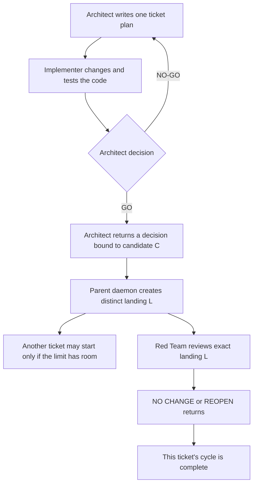

# AI development tools

This folder contains seven Python programs for the AI-assisted development
workflow. Most users begin with `mailbox_daemon.py`, the program that watches
for request files and starts the matching AI role.

Read [`ai/README.md`](../README.md) first for the Architect, Implementer, and
optional Red Team roles. This guide answers a narrower question: which program
do I run, what does it change, and what result should I expect?

## Contents

### Main guide

1. [Which tool do I use?](#which-tool-do-i-use)
2. [Where do I run these commands?](#where-do-i-run-these-commands)
3. [Which commands only inspect, and which commands change files?](#which-commands-only-inspect-and-which-commands-change-files)
4. [Useful daily commands](#useful-daily-commands)
5. [Check protected project notes](#check-protected-project-notes)
6. [Choose the minimum discovery severity](#choose-the-minimum-discovery-severity)
7. [Review a closed ticket](#review-a-closed-ticket)
8. [Protect the local backlog](#protect-the-local-backlog)
9. [Fix-only watches](#fix-only-watches)
10. [Limit the size of one ticket](#limit-the-size-of-one-ticket)
11. [Runtime controls](#runtime-controls)
12. [Exact command reference](#exact-command-reference)

### Common questions raised by developers

**[Appendices about ticket size](#appendices-about-ticket-size)**

- [FAQ A1. Exactly what does `--max` count?](#faq-a1-max-count)
- [FAQ A2. Why can the size check refuse a ticket?](#faq-a2-max-refusal)

**[Appendices about stopping the watcher](#appendices-about-stopping-the-watcher)**

- [FAQ B1. When can I interrupt the watcher?](#appendix-b--when-is-it-safe-to-stop-the-watcher)
- [FAQ B2. What does `--cycle` count?](#faq-b2-cycle-count)

**[Appendices about setup, problems, and recovery](#appendices-about-setup-and-recovery)**

- [FAQ E1. What should I check first?](#appendix-e--how-do-i-troubleshoot-a-run)
- [FAQ E2. What should I do if the tool rejects a saved AI folder?](#faq-e2-primary-recovery)
- [FAQ G. How do I set this up on another computer?](#appendix-g--how-do-i-install-this-on-another-machine)

**[Appendices about sharing unfinished work](#appendices-about-occasional-transfer)**

- [FAQ H1. How can I send unfinished work to another person?](#appendix-h--how-can-i-send-unfinished-work-to-someone-else)
- [FAQ H2. How can the other person open that package safely?](#faq-h2-inspect-unfinished-work)

## Which tool do I use?

The guide uses these terms throughout:

- A **mailbox** is a set of folders containing small Markdown request files.
- A **watcher** is the long-running mailbox command.
- A **cycle** follows one ticket. With Red Team enabled, it ends when the
  advisory review of that ticket's daemon-created landing returns. With
  `--skip-redteam`, it ends when the daemon records the ticket's local landing.
  Several Architect/Implementer repair messages may belong to the same cycle.
- A **cycle identity** joins the exact anchor of a ticket that was Open when
  work began with its full 40-character starting Git commit. A saved mode says
  whether Red Team is enabled and never changes during the work.
- A **source note** is the Markdown file that records one ticket's problem,
  allowed work, and required checks. It is the source of truth.
- A **directive** is the Architect's full written plan inside a source note.
- A **subagent** is a short-lived helper used inside the Implementer lane for
  one bounded task. It is not another mailbox role and has no command-line
  option in `mailbox_daemon.py`.
- **Discovery severity** says how serious a newly found problem must be before
  it may become another ticket.
- **Review scope** says whether the Red Team checks one named change
  (`bounded`) or performs the user's explicit library-wide search
  (`widespread`). A plan without Red Team records `not-used`.
- A **manual relay** carries an approved instruction or result between web
  conversations without changing it.
- A **clipboard block** is the exact text the relay tool asks a human courier
  to paste unchanged.
- A **dry run** prints an action without performing it.

A **permanent note** is one of the eleven protected Markdown files listed in
[`ai/README.md`](../README.md#notes-are-the-source-of-truth). A `.tar.xz`
archive is one compressed file that can be attached to an email.

A Git **branch** is a named line of saved changes. A **commit** is one saved
project version. A Git **worktree** is an extra project folder attached to a
branch.

The three roles use separate Git worktrees. The Architect writes plans and
decisions in the coordination worktree. The Implementer changes source code
in the implementation worktree. Sol has its own saved Red Team worktree. The
roles use the Architect worktree's `ai/notes/` folder for the same source notes
and mailbox records.

An Architect audit or Red Team review must not follow unfinished files in a
saved worktree. For each review, the daemon creates a temporary detached
snapshot of the exact commit and tells the role where to find it. That
snapshot is removed after a successful review that leaves tracked files
unchanged. If safe removal cannot be proved, the daemon preserves the
snapshot and reports the cleanup failure.

Only the Implementer edits source code. The Architect audits immutable
candidate C and returns only a decision. After that Architect process exits,
the parent daemon creates distinct landing L; the Red Team only returns advice.
This separation lets
the Implementer code a newly admitted ticket while the Architect audits a
previous saved candidate and Sol reviews an earlier daemon-recorded landing.

Every Architect directive also divides independent work for Implementer
subagents. For example, one read-only helper can reproduce a failure and
return its raw output while the Implementer owns the source edit. The
Implementer launches all helpers before an Integrator-owned edit. Independent
helpers with non-overlapping ownership run concurrently. The Implementer then
checks every return, combines permitted work, and only afterward reruns the
final commands personally. The Implementer may not skip this attempt merely
because the edit is small or because the runtime is assumed to lack helpers.

If the first actual helper launch fails before any edit, the Implementer
stops. The blocked `IMPLEMENTER_HANDOFF` keeps the planned helper-return rows
under `Subagent work`, marks the rejected helper `blocked`, and ends that
evidence with these three rows:

```text
- Capability checked: `the exact launch capability`
- Attempted operation: The concrete first helper launch attempted before editing.
- Raw failure: `the unchanged first runtime failure`
```

The relay saves that complete handoff and records its full ticket-cycle name
and SHA-256 fingerprint. Those two values identify the exact bytes that
contain the three rows. The Architect may write a no-helper retry only by
copying those rows character-for-character into both the saved prior-failure
record and the revised `Parallel work plan`. A summary, log, later attempt,
older checkpoint, or invented wording does not qualify.

The user sends every request that can change the work to the Architect. The
Architect writes the source note, including the roles and any discovery
severity or Red Team review scope.

During a manual relay, `handoff_router.py` checks that note. It adds the file
paths and saved-record locations needed by each open AI conversation. The
human courier copies each clipboard block unchanged and does not add
instructions for the Implementer or Red Team.

| What you want to do | Program | First command | Effect |
| --- | --- | --- | --- |
| Preview, start, or stop the mailbox workflow; send a request to the Architect; choose role models | `mailbox_daemon.py` | `python3 ai/tools/mailbox_daemon.py --dry-run` | A dry run only prints. Commands that write files may create AI work folders, save or move mailbox files, write logs, and start AI roles. |
| Check that an Architect or Red Team instruction contains every required part | `handoff_contract.py` | `python3 ai/tools/handoff_contract.py --help` | Reads one Markdown note. It does not run its tests or judge the scientific plan. |
| Read status or run the manual clipboard workflow | `handoff_router.py` | `python3 ai/tools/handoff_router.py --status` | Status only reads. A run with `--note` changes the clipboard, waits for copied replies, runs local commands, and writes relay records. |
| Check that eleven protected project notes still match the Architect's starting commit | `permanent_note_guard.py` | `python3 ai/tools/permanent_note_guard.py --help` | Reads Git and the notes. It changes nothing and does not issue `GO` or `NO-GO`. |
| Detect an accidental change to the local backlog | `backlog_guard.py` | `python3 ai/tools/backlog_guard.py check` | `check` only reads. Architect-only `initialize` and `seal` commands write the ignored fingerprint record. |
| Count the text changed by one proposed ticket | `ticket_change_guard.py` | `python3 ai/tools/ticket_change_guard.py --help` | The Implementer compares the ticket's starting commit with a clean current `HEAD`. The Architect names the exact proposed commit, so later work cannot change the measurement. |
| Package unfinished local backlog work for another person | `backlog_bundle.py` | `python3 ai/tools/backlog_bundle.py pack --dry-run` | A dry run lists files. `pack` writes one `.tar.xz` archive; `unpack` writes a new review folder that Git does not include in commits. |

## Where do I run these commands?

Run the examples from the repository's top folder: the folder containing both
`README.md` and `ai/`. From any project folder that Git recognizes, this
read-only shell command moves the terminal there and confirms that the tools
exist:

```bash
cd "$(git rev-parse --show-toplevel)"
test -d ai/tools && printf '%s\n' 'AI tools found'
```

Expected result:

```text
AI tools found
```

Changing the terminal's current folder does not change a project file.
`mailbox_daemon.py` can resolve the saved AI work folders from another
project folder, but using the top folder keeps paths in examples predictable.

## Which commands only inspect, and which commands change files?

| Command form | Changes project files or saved AI records? | What it does |
| --- | --- | --- |
| Any `--help` command | No | Prints options and exits. |
| `mailbox_daemon.py --dry-run` | No | Prints work folders and messages that a command which writes files would use. |
| `handoff_contract.py architect NOTE` or `handoff_contract.py redteam NOTE` | No | Reads and checks one directive. |
| `handoff_router.py --status` | No | Reads branches and local records, then suggests a next action. It does not run that action. |
| `permanent_note_guard.py --base FULL_COMMIT` | No | Compares the protected files in saved Git versions, the files selected for the next commit, and the files currently visible. |
| `backlog_guard.py check` | No | Compares the current backlog with the SHA-256 fingerprint last accepted by the Architect. |
| `ticket_change_guard.py --base FULL_COMMIT --max NUMBER` | No | Implementer check: counts characters added and removed between the named starting commit and a clean current `HEAD`, Git's name for the current saved commit. |
| `ticket_change_guard.py --base FULL_COMMIT --architect-audit --candidate FULL_COMMIT --max NUMBER` | No | Architect check: counts the same ticket against the exact saved candidate named after `--candidate`. Later commits and unsaved work do not become part of this measurement. |
| `backlog_bundle.py pack --dry-run` | No | Lists the proposed package without writing it. |
| `backlog_bundle.py inspect ARCHIVE` | No | Validates and lists an incoming package without unpacking it. |
| `mailbox_daemon.py --send architect` or `--ping architect` | Yes | This is the user's only role target. The command may create or reuse the AI work folders first. If the request is accepted, it writes one numbered Architect mailbox file. If a rule refuses the request, it writes no request file but may already have created the work folders. |
| `mailbox_daemon.py --once` or `--watch` | Yes | May create or reuse AI work folders, start roles, move mailbox files, and write relay or saved workflow records. |
| `handoff_router.py --architect-notes-admin "SUMMARY"` | Yes | Architect-only internal operation. From an already bound Architect process, queues one later permanent-note admin self-route. It refuses from a normal user, Implementer, or Red Team process and cannot be combined with another router operation. |
| `backlog_guard.py initialize --architect-ack` or `backlog_guard.py seal --previous-sha256 SHA256 --architect-ack` | Yes | Writes the ignored backlog fingerprint record. These manual forms are Architect-only. |
| `handoff_router.py --note NOTE` | Yes | Changes the clipboard, writes local relay records, and runs the selected shell commands. It does not launch a web session for you. |
| `backlog_bundle.py pack` | Yes | Writes a new ignored `.tar.xz` file and never replaces an existing file. |
| `backlog_bundle.py unpack ARCHIVE` | Yes | Writes into a fresh ignored folder under `ai/backlog-imports/`; it does not replace live notes. |

In this table, `NOTE` means the path to a ticket note, `FULL_COMMIT` means the
full Git name of the starting saved version, `SHA256` means a 64-character
fingerprint printed by the guard, and `ARCHIVE` means the path to a received
`.tar.xz` file.

A first mailbox command that writes files may create the three Git worktrees
described above.
The [role guide](../README.md#appendix-f--what-is-the-worktree-topology)
explains what each folder is for.

## Useful daily commands

The examples below use `version-flag.md`, the sample ticket created in the
[first-ticket tutorial](../README.md#complete-one-small-ticket). Replace it
with the filename of your own temporary ticket note. In a command that uses
`<ticket>`, replace the whole placeholder, including the angle brackets.

### Check a handoff directive

The Architect or Red Team runs one of these before sending implementation work
or a candidate repair:

```bash
python3 ai/tools/handoff_contract.py architect ai/notes/<ticket>.md
python3 ai/tools/handoff_contract.py redteam ai/notes/<ticket>.md \
  --severity medium
```

The check is read-only and reports `VALID` or `INVALID` for both instruction
types. These results check the note's format; only the Architect says `GO` or
`NO-GO`.

For a Red Team directive, replace `medium` with the severity selected for the
run. The command then checks that the note records that same user setting.
Mailbox runs also provide the selected value through
`MAILBOX_DISCOVERY_SEVERITY`, so the Red Team can omit the option when it runs
the check inside that mailbox job.

`VALID` means the required sections are in order. The note must name exact
files and tests, number its work steps, provide a shell-command block, and
include acceptance checkboxes. The tool does not judge whether the scientific
plan is correct.

<details><summary>Show the exact work-location and locator fields</summary>

An Architect directive names:

- the exact Implementer work folder, which Git calls a worktree;
- its assigned Git branch, which must not be `main`; and
- the full 40-character label for the saved project version where work starts.

Every source edit and regression test appears in a visible row that begins
with a repository path and a real function, class, section, or test name. A
diagram, link, hidden field, or copied mailbox message cannot replace these
rows.

```markdown
- `ai/tools/mailbox_daemon.py::agent_preamble`: Keep `agent="user"` invalid.
  Require a `ValueError` containing `unknown mailbox agent`, without changing
  the accepted `fable`, `opus`, or `sol` cases.
- `ai/tests/test_role_directive_contract.py::RoleDirectiveContractTests`:
  Test the invalid `user` input, the error text, and the unchanged valid roles.
```

The real ticket note uses the exact symbols and tests affected by that ticket;
it does not copy this example when the work concerns another part of the
repository.

</details>

For an Architect note, the check also requires a concrete subagent plan. One
block can tell a read-only helper to reproduce a parser failure and return the
exact command and output; another can give an editing helper one exact
`path::symbol`. Each block names its expected return, observable acceptance
result, and stop condition. The Integrator row tells the Implementer how to
check every return and which final command to rerun.

During a manual relay, the router compares those planned helper names with the
Implementer's structured `Subagent work` evidence before it saves the return
or runs a local check. Missing, renamed, reordered, or extra helper results
are refused. This validation checks that the planned work was reported; the
Architect still examines the evidence and decides `GO` or `NO-GO`.

For a first pre-edit launch failure, the same bounded evidence must also end
with the exact `Capability checked`, `Attempted operation`, and `Raw failure`
rows shown above. The router fingerprints the whole blocked handoff. A later
Architect capability exception must cite that fingerprint and copy the three
rows exactly; it may not create replacement evidence.

Every directive also records its character-change limit, planned maximum, and
readability plan. The limit is the ceiling chosen by the user. The planned
maximum is the Architect's estimate for the complete ticket. When a watcher
or manual relay uses a positive `--max`, pass that same number to this check:

```bash
python3 ai/tools/handoff_contract.py architect ai/notes/<ticket>.md \
  --max 1200
```

A disagreement is `INVALID` because the Implementer must not guess which
limit applies. Use `redteam` instead of `architect` to check a Red Team repair
directive.

### Read the current AI work status

```bash
python3 ai/tools/handoff_router.py --status
```

This prints a read-only summary of branches, completed reviews, review requests
that remain open, and next actions.

### Preview one request to the Architect

```bash
python3 ai/tools/mailbox_daemon.py --dry-run --send architect \
  --unit "Please coordinate the ticket in ai/notes/version-flag.md."
```

The command prints the internal `to-fable` mailbox filename it would create,
but writes no file. `to-fable` is the Architect's internal address.

### Send a ticket request to the Architect

```bash
python3 ai/tools/mailbox_daemon.py --send architect \
  --unit "Please coordinate the ticket in ai/notes/version-flag.md."
```

Success prints `queued PATH` and writes one numbered `to-fable` request file.
The send command itself does not start the Architect. An active watcher
handles the request. The user does not select `opus`, `sol`, or the internal
`fable` address. The file starts with the discovery-severity choice and then
keeps the user's exact request. Omitting `--severity` saves the default,
`medium`; add `--severity high` or `--severity low` when this ticket needs a
different discovery threshold.

### Run a two-role manual relay

First ask the Architect for a two-role plan. The validated source note must
contain these exact rows under `### Role plan`:

```markdown
- Roles: `Architect + Implementer`
- Discovery severity: `not-used`
- Review scope: `not-used`
```

Then carry out the plan:

```bash
python3 ai/tools/handoff_router.py \
  --note ai/notes/version-flag.md \
  --skip-redteam
```

Unlike `--status`, this manual relay changes the system
clipboard, waits for copied result sections, creates local relay records, and
runs the selected validation commands. Read every `--gate-cmd` string before
allowing the shell to run it.

The Architect wrote the decisions in the source note. The relay tool checks
those decisions and builds each clipboard block by adding the paths and
record locations needed for this run. `--skip-redteam` only confirms the
two-role plan; it cannot change another plan into a two-role plan.

Copy each generated block unchanged. Do not edit it, add a request for
another role, or answer on that role's behalf. Give new information to the
Architect. The Architect must update and revalidate the source note before
another relay.

This command controls only that clipboard relay. It does not change the roles
used by an already running mailbox watcher. Its source must be an ordinary
`.md` file rather than a linked shortcut in this project folder's `ai/notes/`
directory. The tool refuses a relay log, a mailbox file, a path outside
`ai/notes/`, or a path containing `../` because none of those is the original
source note.

In a path, `../` asks to move above the current folder.

### Ask the Architect for a Red Team search

```bash
python3 ai/tools/mailbox_daemon.py --send architect \
  --severity medium \
  --unit "Please instruct the Red Team to review the version-flag change in ai/notes/version-flag.md. Keep the review within that change and use medium as the minimum discovery severity."
```

Success prints `queued PATH` and writes one numbered request to the Architect.
The Architect records the scope and severity, checks whether new discovery is
allowed, and writes the internal Red Team handoff. If accepted, that later
internal `to-sol` request contains `MAILBOX-TICKET: discovery` and
`MAILBOX-SEVERITY: medium`.

A **discovery** asks the Red Team to look for a new problem in the named
change. It is refused when fix-only mode is on or when ten or more open
Critical, High, and Medium tickets are recorded. Low tickets and waiting
mailbox files do not count. The role guide explains this
[limit on new searches](../README.md#appendix-d--what-is-the-demand-guard).

The user states a ticket-specific `high`, `medium`, or `low` choice to the
Architect. A watcher or one-time run may also set the default. The Architect
saves the selected value in the internal discovery request, so a later
watcher's default cannot change it.

### Ask the Architect to finish a recorded Red Team review

```bash
python3 ai/tools/mailbox_daemon.py --send architect \
  --unit "Please instruct the Red Team to finish the existing review described in ai/notes/backlog.md."
```

A **closure** asks the Red Team to finish or recheck a problem that is already
recorded. Success here writes the user's request to the Architect. The
Architect later writes the internal `to-sol` request beginning with
`MAILBOX-TICKET: closure`.

### Check whether the Architect can receive and reply

```bash
python3 ai/tools/mailbox_daemon.py --ping architect
```

This sends a small test message rather than a work assignment. Success prints
`queued PATH` and writes one numbered `to-fable` Architect test request. The
reply is addressed `to-user`. The watcher leaves it for a human and does not
send it to another role.

## Check protected project notes

Only the Architect interprets this check as part of a `GO` or `NO-GO`
decision. `HEAD` is Git's short name for the latest saved commit in the
current worktree. From the exact worktree named in the directive, this
read-only example checks the notes against that saved version:

```bash
BASE="$(git rev-parse HEAD)"
python3 ai/tools/permanent_note_guard.py \
  --repo "$PWD" \
  --base "$BASE"
```

A real ticket uses the full starting commit recorded before implementation,
which may be older than the current `HEAD`. Success ends with:

```text
PERMANENT-NOTE-GUARD PASS base=... notes=11
```

The guard checks the starting commit, current `HEAD`, files selected for the
next commit, working files, and its own program file contents. A passing guard
proves only that these protected files match. It does not approve the
implementation.

### Land an Architect-only permanent-note update

This is a narrow parent-daemon operation, not an Implementer ticket. The
daemon is the program running the watcher. Only the Architect may edit and
commit the eleven permanent notes. The guard itself, ordinary documentation,
source code, tests, and the local backlog are outside this route.

The watcher binds two full commit IDs. B is the local `main` commit saved
before the edit. P is the clean Architect coordination `HEAD` after the
note update is committed. P must be one ordinary commit with exactly one
parent, that parent must be B, and the complete B-to-P path list must contain
one or more of the eleven permanent notes and no other file.

A **role baseline** is the saved commit currently checked out in one role's
persistent work folder. The watcher advances these baselines only by a Git
fast-forward, which preserves the existing saved history.

An ordinary Architect audit that identifies a durable update queues the
separate admin turn with this exact command:

```bash
python3 "$MAILBOX_PRIMARY_WORKTREE/ai/tools/handoff_router.py" \
  --architect-notes-admin "PLAIN-LANGUAGE SUMMARY"
```

This command is not a public user route. The publisher requires
`MAILBOX_ROLE=architect`, the exact saved Architect primary path, and the
exact saved shared-notes path. It refuses a missing or empty summary, a second
pending note-admin route, or any combination with `--status`, `--note`,
`--section`, `--mode`, `--skip-redteam`, `--gate-cmd`, `--max`, or
`--severity`. A successful call publishes exactly one `to-fable` self-route
under the mailbox sequence lock.

That self-route uses this exact envelope and then the nonempty plain-language
description:

```text
MAILBOX-ADMIN: permanent-notes

PLAIN-LANGUAGE UPDATE
```

The watcher exports exact B as `MAILBOX_NOTES_BASE`. If no protected note
needs to change, the Architect leaves `HEAD` at B and creates neither a daemon
request nor an Implementer request. If the Architect creates P, the turn must
produce exactly one body-free daemon request:

```text
MAILBOX-RETURN: architect-notes-go
MAILBOX-BASE: FULL-B-FROM-MAILBOX_NOTES_BASE
MAILBOX-NOTES-COMMIT: FULL-P
MAILBOX-DECISION: GO
```

Both placeholders become full 40-character commit IDs. Ticket cycle, mode,
and free-form body lines are forbidden. A note-admin turn that creates an
Implementer handoff is refused.

The watcher refuses this route while any ordinary ticket is active. It checks
more than running child processes: there may be no reserved ticket, no live
candidate, no pending candidate-to-landing recovery, no saved Architect GO
waiting for its landing, and no closure review still owed. Completed history
and an older bounded push-debt record may remain.

After the Architect process exits, the parent watcher rechecks the clean P,
its sole parent B, the exact changed paths, and the attached user checkout. It
also preflights the three role baselines before changing `main`. It may then
fast-forward the user's clean, unchanged `main` from B to the existing P and
advance every clean idle Architect, Implementer, and Red Team baseline to P.
It does not create a ticket landing L. The note update consumes no cycle slot,
increments no cycle total, and queues no Red Team request.

The watcher makes one bounded non-force push attempt for P. A failed or
uncertain result uses the ordinary durable push-debt mechanism and names the
exact P still owed. It does not rerun the Architect or create a ticket.

The note-admin turn is exclusive. Later messages, including a dependent
Implementer request, wait until P reaches `main` and every role baseline.
Therefore the next ticket begins from `ticket@P` and executes the tool and role
files at P. A role lane with uncommitted files, different saved work, or an
active candidate is preserved rather than reset. The watcher refuses P or the
new ticket and prints the repair needed when a fast-forward cannot be proved
safe.

## Choose the minimum discovery severity

Here, a **discovery** is a request for the Red Team to inspect one named
change for a new bug that could become a separate piece of work.

**Severity** means how much harm a bug can cause. The value is the user's
minimum for opening new work from a Red Team discovery. The default is
`medium`.

From any project folder that Git recognizes, tell the Architect when one
request needs a particular value:

```bash
python3 ai/tools/mailbox_daemon.py --send architect \
  --severity high \
  --unit "Please instruct the Red Team to review the named change in ai/notes/version-flag.md."
```

Success prints `queued PATH` and writes one numbered request to the Architect.
Its first two lines save the severity and the review boundary:

```text
MAILBOX-SEVERITY: high
MAILBOX-SCOPE: bounded
```

The user's exact request follows after one blank line. The Architect decides
whether discovery is allowed and writes the internal Red Team request. That
internal request begins with three lines:

```text
MAILBOX-TICKET: discovery
MAILBOX-SEVERITY: high
MAILBOX-SCOPE: bounded
```

The user does not create or send this `to-sol` request directly.

The three values mean:

| Value | Which findings may become new tickets? |
| --- | --- |
| `high` | Only a bug that severely impacts core functionality, causes data loss, halts system operations, or makes the science wrong. The evidence must show that harm and explain why Medium is insufficient. |
| `medium` | High-severity bugs, plus a probable bug that can affect normal operation. Merely theoretical or improbable edge cases do not qualify. |
| `low` | Any concrete discovered bug, including an improbable edge case. A guess without a code path and evidence does not qualify. |

High must remain unusual. A difficult repair, missing optional feature,
inconvenient cleanup, or desire for another Implementer does not meet this
bar. The Architect records why the evidence is too severe for Medium before
classifying a ticket High.

Critical is not a fourth command value and is not a Red Team rating. Only the
Architect may use it as a final backlog classification after evidence shows
that a current bug broadly breaks a central library workflow or systematically
invalidates scientific results. High does not automatically become Critical;
the Architect records why High is insufficient.

A watch or one-time run can set the default for discovery requests created by
its roles. Run either command from any project folder that Git recognizes:

```bash
python3 ai/tools/mailbox_daemon.py --watch --severity high
python3 ai/tools/mailbox_daemon.py --once --severity low
```

On first live use, the daemon creates or reuses the saved Claude and Sol work
folders. `--watch` keeps checking for requests; `--once` checks the current
waiting requests and then exits. Both print `discovery severity default:`
followed by the selected value. If they handle work, they can start AI roles
and move completed request files into `ai/notes/mailbox/done/`.

Each new discovery still saves its value in the request file. A saved value
does not change when a later watch uses another default. A stored discovery
that lacks either its exact severity line or its exact scope line is refused
instead of receiving a guessed value.

For a manual clipboard relay, first ask the Architect to write these rows in
the source note:

```markdown
- Roles: `Architect + Implementer + Red Team`
- Discovery severity: `high`
- Review scope: `bounded`
```

`bounded` means review only the named change and the behavior it directly
affects. Only a user request that begins with the explicit command “do a
widespread search” changes this row to `widespread`; such a search is Low and
waits for every open Critical, High, and Medium ticket. Quoting, negating, or
mentioning that phrase later does not widen the request. Plans without a Red
Team use `not-used`.

Open the exact work folder whose path appears in the source note's `Execution
checkout`, then confirm the saved severity:

```bash
python3 ai/tools/handoff_router.py \
  --note ai/notes/version-flag.md \
  --severity high
```

Success copies the Implementer prompt, prints numbered progress lines, waits
for the Implementer return, runs the named checks, and copies those records to
the Architect for the audit. It writes supporting copies under
`ai/notes/relay/`. It does not put Red Team between the Implementer and the
Architect, start a mailbox watcher, or create a mailbox request.

If the saved plan includes Red Team, the Architect first audits the returned
work. An Architect `GO` ends the audit; it does not merge, commit, update a
reference, push, or touch the user's checkout. In a watched run, the parent
daemon creates the distinct landing only after the Architect process exits,
then queues the separate Red Team handoff for that landing. The manual relay
itself does not perform that daemon-owned landing. The later review is optional
advice and cannot delay the audit decision or local landing.

Here `--severity high` confirms the Architect's saved value. It cannot change
the value or add a Red Team to another role plan. The router refuses a
mismatch before it changes the clipboard.

Copy those generated prompts and returned blocks unchanged. The user is a
courier in this manual mode, not the author of an Implementer or Red Team
instruction. Send any new request or correction to the Architect first.

The Red Team records the user's setting, its own severity rating, whether the
bug is probable or improbable, the evidence for that likelihood, and whether
the finding meets the user's setting. A finding that should become separate
work begins with the prominent line `Backlog action: NEW TICKET`. The
Architect immediately adds it to the backlog so it cannot be forgotten. The
Architect does not reproduce or analyze the bug during this short bookkeeping
step. When the ticket later reaches the front of the permitted priority order,
the Architect reads the cited Red Team note, checks the evidence needed for a
decision, accepts, upgrades, or downgrades the rating with a reason, and makes
the final `GO` or `NO-GO` decision. The Red Team never edits the backlog
itself.

This value does not request a broad search. The Red Team still reviews only
the named change unless the user asks the Architect for a widespread search
and the Architect records that scope in the Red Team handoff.
A request that begins with the explicit command “do a widespread search”
automatically saves Low. That search waits until no Critical, High, or Medium
ticket remains open. Low tickets do not block it.
It also cannot override fix-only mode or a Red Team disabled with
`--skip-redteam` or `--no-red-team`. A new discovery is refused when ten or
more open Critical, High, and Medium tickets are recorded; close accepted
non-Low work first.

## Review a closed ticket

The Architect does not wait for Red Team approval. After the Implementer
finishes and the evidence earns `GO`, the Architect sends a decision-only
request bound to immutable C. After that process exits, the parent daemon
creates distinct L, fast-forwards a clean unchanged attached user `main`, and
records the local landing. It also advances each safe clean idle persistent
role baseline to L before another role starts, so the authoritative daemon and
role files do not stay behind the accepted code. A dirty, diverged, or active
role folder is preserved and causes refusal rather than a reset. Red Team then
reviews that exact ticket and L.
Another ticket may run at the same time only when the chosen cycle
limit still has an unused ticket slot.

After recording L, the daemon makes one bounded non-force push attempt. A
failed or uncertain push creates a durable `pending-main-push-<L>.txt` debt
record with the exact command still owed. Push debt does not reopen the
ticket, repeat the landing, or create another Architect/Implementer loop.

If the process stops after preserving candidate C but before recording L,
recovery uses only that ticket's durable candidate and landing records. The
watcher does not compare the separate Architect coordination branch with
`main`, call their normal difference landing debt, or create an Architect
turn from a changed-line threshold.

This is a bounded advisory review of tickets that already exist. If the Red
Team finds no remaining bug, it returns `NO CHANGE` for the same ticket and
commit. That return is required to complete the normal cycle, but it is a
status report rather than approval. If the Red Team finds a concrete remaining
bug, it returns a formal `REOPEN` assessment with the failing input, command,
or scientific evidence.

Before `REOPEN` or `NEW TICKET`, Red Team writes a detailed local note at a
stable path such as `ai/notes/cmb-axis-red-team-finding.md`. The Architect
preserves that work in the backlog with `See further instructions at
ai/notes/cmb-axis-red-team-finding.md`. The note explains the expected and
observed behavior, affected code path, reproduction, evidence, realistic
impact, review limits, proposed acceptance check, and uncertainty. This saves
the Architect from reconstructing the investigation when the ticket later
reaches the front of the priority order.

Every ticket has an integer called **Red Team reopen count**. It begins at
`0` and never resets. While reopening remains allowed, every formal `REOPEN`
assessment adds one, including a request that the Architect later rejects.

The number records how often the Red Team asked, while the Architect retains
the final decision.

When `REOPEN` arrives, the Architect first restores the ticket to the Open
section and increments the count. This quick bookkeeping keeps the objection
visible. It also preserves the Red Team note link and does not reproduce or
analyze the bug.

When that ticket later reaches the front of the permitted priority order, the
Architect audits the evidence. A `GO` leaves the ticket open and supplies
repair instructions.

A `NO-GO` closes it again, explains why the evidence did not justify more
work, and permanently bars another Red Team reopening of that same ticket.
The ticket records `Red Team reopening: barred by Architect NO-GO`. Red Team
must not send another `REOPEN` for a barred ticket. A different defect uses
`NEW TICKET` instead.

For count `2` and above, the Architect compares the latest report with every
earlier reopening and says what is materially new. Repeated text without a
new failing input, command, file, or scientific consequence receives stricter
scrutiny after each attempt. The Architect may lower the priority when the
evidence no longer supports its urgency.

Count `6` automatically makes the ticket Low, even if it was previously
Critical or High.

For example, a closed loader ticket starts with count `0`. A `REOPEN` report
shows a one-row table that still crashes, so the Architect restores the
ticket and records count `1`.

After another repair, a second `REOPEN` must show evidence beyond the first
one-row example. The count becomes `2` before the Architect decides whether
that evidence earns `GO` or `NO-GO`.

In a normal three-role run, this matching Red Team result completes the
cycle. It never blocks the Architect's GO or the daemon's local landing, but a finite watcher
waits for the result before it exits for that cycle count. A two-role run has
no later Red Team review, so its cycle completes when the Architect accepts
the candidate and the daemon records its landing. Positive limits work in both setups. For example,
`--skip-redteam --cycle 2` finishes after two accepted tickets.

## Protect the local backlog

Git does not save `ai/notes/backlog.md`, so a normal Git comparison cannot
detect an accidental edit. `backlog_guard.py` stores a SHA-256 fingerprint of
the exact backlog bytes last accepted by the Architect. The small fingerprint
record is also local and ignored by Git.

After creating the first backlog, the Architect reads every entry and then
initializes the guard:

```bash
python3 ai/tools/backlog_guard.py initialize --architect-ack
```

Expected result includes these lines, where `SHA256` is a 64-character
lowercase fingerprint:

```text
Backlog guard initialize passed.
accepted SHA-256: SHA256
BACKLOG-GUARD-INITIALIZE PASS sha256=SHA256
```

Before accepting another role's result or editing the backlog, the Architect
runs the read-only check:

```bash
python3 ai/tools/backlog_guard.py check
```

The Architect copies the 64-character value printed after `accepted
SHA-256:`. If the command reports a mismatch, stop and inspect the backlog;
do not approve unknown text by replacing its saved value.

After a deliberate edit, such as adding or reopening one ticket, the
Architect reads the changed entry and seals that exact version:

```bash
python3 ai/tools/backlog_guard.py seal \
  --previous-sha256 SHA256 \
  --architect-ack
```

Replace `SHA256` with the value copied before the edit. `seal` refuses a
different previous value, a linked file, a file that changes while it is
being read, or a manual call without `--architect-ack`.

The Implementer and Red Team may run `check` as supporting evidence, but they
never run `initialize` or `seal` and never edit the backlog or its fingerprint
record. This guard is meant to expose accidental edits. A deliberately
malicious program that can rewrite both local files can defeat it.

## Fix-only watches

Use fix-only mode when the backlog already contains many items and the run
should finish known work instead of finding more:

```bash
python3 ai/tools/mailbox_daemon.py --watch --fix-only yes
```

The value also accepts `1` or `true`, in any capitalization.

Here, **closure** means finishing work that is already recorded. **Discovery**
means asking the Architect to have Sol search for a new problem.

Severity does not weaken this rule. Even `--severity low` cannot create a
discovery while fix-only mode is active.

The watcher does not turn a line in `ai/notes/backlog.md` into a mailbox
request. Give the recorded item to the Architect; the Architect writes the
instructions and starts the internal handoffs.

When the Sol role is enabled, fix-only mode behaves as follows:

- existing closure work remains eligible;
- new Sol discovery is refused;
- the watcher saves this rule for that mailbox, so a send from another
  terminal follows it too;
- the watcher checks a waiting Sol file's saved `closure` or `discovery` label
  again before launch;
- an invalid waiting Sol message moves to `failed/` instead of being guessed
  from prose.

Fix-only can be combined with a two-role setup or a cycle limit:

```bash
python3 ai/tools/mailbox_daemon.py --watch --fix-only yes --cycle 2
python3 ai/tools/mailbox_daemon.py --watch --fix-only yes --skip-redteam --cycle 0
```

In the second command, the two-role setting disables Sol. Every waiting Sol
file remains untouched until a later watch enables Sol again.

## Limit the size of one ticket

Use `--max` when you want the watcher to tell every role the maintenance
limit and require the Architect to reject a ticket that changes too much
text:

```bash
python3 ai/tools/mailbox_daemon.py --watch --max 1200
```

This gives each ticket handled by that run a limit of 1,200 changed
characters. The number is the characters added plus the characters removed
since the full starting commit in the Architect's directive. Code, tests,
comments, command help, and documentation all count. Replacing one character
with another counts as two: one removed and one added.

The Implementer first checks the complete proposed result at a clean current
`HEAD`. Its folder must have no changes to files Git already knows about and
no new files that Git would include in a commit but that are not yet saved:

```bash
python3 ai/tools/ticket_change_guard.py \
  --repo "$PWD" \
  --base FULL_COMMIT \
  --max 1200
```

Here, `FULL_COMMIT` is the ticket's 40-character starting commit. This default
form is deliberately strict about the Implementer's current folder: the
commit at `HEAD` and the visible files must describe the same candidate.

The Architect audits a different boundary. The Implementer may already be
working on ticket B while the Architect audits ticket A. The Architect must
therefore name ticket A's exact saved candidate instead of relying on a
moving `HEAD`:

```bash
python3 ai/tools/ticket_change_guard.py \
  --repo "$PWD" \
  --base FULL_BASE_COMMIT \
  --architect-audit \
  --candidate FULL_CANDIDATE_COMMIT \
  --max 1200
```

Both commit names must contain all 40 hexadecimal characters. The base is the
version before ticket A began. The candidate is ticket A's proposed saved
version. `--architect-audit` and `--candidate` must appear together; an
abbreviated name or `HEAD` is refused.

For example, suppose ticket A adds 700 characters and ticket B later adds 400
more. Comparing A's base with the newer implementation `HEAD` would count
1,100 characters and mix two tickets. Naming A's 700-character candidate
keeps the A audit at 700 even after B exists. A commit name identifies saved
content and does not move when another commit is created.

The watcher supplies an isolated Architect audit worktree. The Architect runs
A's tests there while the Implementer edits and tests B in the implementation
worktree. The separate folders prevent one role's temporary files or branch
movement from changing the other role's work. The character guard still names
A's full candidate explicitly; the separate folder is not a substitute for
`--architect-audit --candidate FULL_CANDIDATE_COMMIT`.

A result within the limit begins with:

```text
ticket change guard: within limit
```

The command then prints the starting commit, proposed commit, limit, and the
added, deleted, and total character counts. It exits with code 0 when the
proposed commit is within the limit, code 1 when it is over the limit, and
code 2 when the repository state or changed file cannot be measured. Only the
Architect turns that evidence into `GO` or `NO-GO`.

The exact boundary is allowed: a count of 1,200 satisfies `--max 1200`, while
a count of 1,201 does not.

`--max 0`, the default, sets no size limit. It does not weaken the readability
review. The Architect and Red Team must never save characters by shortening
clear names, packing statements together, removing explanations or tests, or
leaving a partial fix. The Python must remain readable to a C programmer and a
physics undergraduate learning Python. If a complete readable ticket cannot
fit, the Architect records `NO-GO` and asks the user for a smaller ticket or a
larger number.

For `mailbox_daemon.py`, `--max` applies to `--watch` and `--once`. A
`--send` command only saves a request; the later watcher or one-time run
supplies the policy. A manual clipboard run uses the same limit this way:

```bash
python3 ai/tools/handoff_router.py \
  --note ai/notes/version-flag.md \
  --max 1200
```

The number must match the directive before the router changes the clipboard.
`--max 0` and `--cycle 0` are different: the first removes the character
limit, while the second waits for all enabled work to finish before exiting.
Repeat the same `--max` when restarting work on a ticket. To change the
number, ask the Architect to revise and recheck the directive before more
implementation work begins.

The [ticket-size appendices](#appendices-about-ticket-size) explain file moves,
text formats, unsaved files, and other counting details.

## Runtime controls

| Concern | Options | Default |
| --- | --- | --- |
| Claude models | `--architect-model`, `--implementer-model` | `claude-fable-5`, `claude-opus-4-8` |
| Claude effort | `--fable-effort`, `--opus-effort` | `xhigh`, `max` |
| Sol effort | `--sol-effort` | `xhigh` |
| Roles used | `--skip-redteam`, `--no-red-team` | Architect + Implementer + advisory Sol Red Team |
| AI job timeout | `--dispatch-timeout` | 60 minutes |
| Saved conversation length | `--claude-context`, `--sol-context` | 500000 tokens each |
| Watch lifetime | `--cycle` | omitted: indefinite; `N>0`: stop after N completed ticket cycles; `0`: finish all recorded work and then stop |
| Text changed by one ticket | `--max` | `0`: no character limit |
| Minimum severity for new discovery tickets | `--severity` | `medium` |
| Discovery policy | `--fix-only` | off |

Model selection and effort are independent. Choosing Sonnet does not silently
lower the Implementer effort.

Each Claude model option accepts one nonempty value containing no spaces,
tabs, line breaks, or hidden zero character, such as `sonnet` or a full model
name. This checks only a formatting rule. The installed Claude program
confirms whether the model exists only when a live role starts.

The mailbox addresses `fable` and `opus` continue to mean Architect and
Implementer even when the command selects different Claude models. There is no
`--sol-model` option. The program currently pins Sol to `gpt-5.6-sol`; its
command-line choices control effort and saved conversation length. The watch
can include the advisory Red Team or omit it with `--skip-redteam`, but Sol's
role itself does not change.

There are two role setups. The default uses Architect, Implementer, and the
advisory Red Team. `--skip-redteam` uses only Architect and Implementer. Sol
never becomes an Implementer.

When a session reaches the chosen token count, it replaces older conversation
text with a shorter summary and continues. Claude receives
`CLAUDE_CODE_AUTO_COMPACT_WINDOW`; Sol receives
`model_auto_compact_token_limit`.

On every pass, the watcher checks when `mailbox_daemon.py` was last modified.
If the file changed, the running watcher exits. Start it again to load the new
code.

## Exact command reference

The program's live help contains its current options:

```bash
python3 ai/tools/mailbox_daemon.py --help
```

The current transcript is kept here for offline reading and regression checks.

<details>
<summary>Current <code>mailbox_daemon.py --help</code> transcript</summary>

```
usage: mailbox_daemon.py [-h] [--dry-run] [--once] [--watch] [--cycle count]
                         [--max characters] [--skip-redteam]
                         [--fix-only value] [--send {architect}]
                         [--ping {architect}] [--unit UNIT]
                         [--severity {high,medium,low}]
                         [--architect-model MODEL] [--implementer-model MODEL]
                         [--fable-effort {low,medium,high,xhigh,max}]
                         [--opus-effort {low,medium,high,xhigh,max}]
                         [--sol-effort {none,low,medium,high,xhigh}]
                         [--dispatch-timeout MINUTES]
                         [--claude-context TOKENS] [--sol-context TOKENS]

save mailbox requests and start the assigned role for each request

options:
  -h, --help            show this help message and exit
  --dry-run             show the message files and work this command would
                        handle, but do not start a role or write a message
                        file
  --once                start every request that is waiting now, then exit
  --watch               check the mailbox every 20 seconds and start waiting
                        requests
  --cycle count         with --watch, stop after this many completed ticket
                        cycles; one cycle is always one ticket; with Red Team
                        it ends when the matching review returns for daemon-
                        recorded local landing L, and without Red Team it ends
                        when the daemon records local landing L; 0 instead
                        waits until no enabled role has a waiting message and
                        ai/notes/backlog.md has no open item; omit this option
                        to keep watching
  --max characters      with --watch or --once, limit each ticket to this many
                        added and removed characters, counted from the
                        starting saved Git version named in the Architect's
                        instructions; use only digits 0 through 9; 0 means no
                        limit (default: 0)
  --skip-redteam, --no-red-team
                        with --watch, start Architect and Implementer jobs but
                        no Red Team job; Red Team messages remain waiting for
                        a later watch without this option
  --fix-only value      with --watch, tell roles to finish work already
                        recorded in ai/notes/backlog.md and refuse new Red
                        Team discovery messages; this option does not create
                        mailbox requests from backlog text; the value accepts
                        1, true, or yes in any capitalization
  --send {architect}    save the user's ticket request for the Architect and
                        exit
  --ping {architect}    save a connection-check message for the Architect; its
                        reply is saved in a -to-user.md file and is not sent
                        to another role
  --unit UNIT           the user's request text for --send architect; include
                        the path to its source note in ai/notes/
  --severity {high,medium,low}
                        minimum severity for new discovery tickets: high keeps
                        only bugs that severely impact core functionality,
                        cause data loss, halt system operations, or make the
                        science wrong; medium also keeps probable normal-
                        operation bugs but not improbable edge cases; low
                        keeps every concrete discovered bug; with --send
                        architect, save the choice for that request (default:
                        medium)
  --architect-model MODEL
                        Claude model alias or full name used for the
                        Architect; mailbox filenames for this role still
                        contain fable (default: claude-fable-5)
  --implementer-model MODEL
                        Claude model alias or full name used for the
                        Implementer; mailbox filenames for this role still
                        contain opus (default: claude-opus-4-8)
  --fable-effort {low,medium,high,xhigh,max}
                        claude CLI reasoning effort for the Architect
                        (default: xhigh)
  --opus-effort {low,medium,high,xhigh,max}
                        claude CLI reasoning effort for the Implementer
                        (default: max)
  --sol-effort {none,low,medium,high,xhigh}
                        codex CLI reasoning effort for Sol as Red Team
                        (default: xhigh)
  --dispatch-timeout MINUTES
                        stop a running role after this many minutes and try to
                        move its request file to failed/; if the result or
                        move cannot be verified, the file may remain in
                        inflight/ for inspection (default: 60)
  --claude-context TOKENS
                        ask Claude to replace older Architect and Implementer
                        conversation text with a shorter summary when it
                        reaches this many tokens (default: 500000)
  --sol-context TOKENS  ask Codex to replace older Red Team conversation text
                        with a shorter summary when it reaches this many
                        tokens (default: 500000)
```

</details>

### Action rules

- Choose only one of `--once`, `--watch`, `--send`, and `--ping` in one
  command.
- `--cycle` accepts an integer from 0 through 1,000,000 and is valid only with
  `--watch`.
- Omitting `--cycle` watches indefinitely. `--cycle 0` instead waits until the
  enabled roles have no waiting messages and no backlog line begins `- OPEN`.
- `--max` accepts digits from 0 through 9 and is valid with `--watch` or
  `--once`. Omitting it or writing `--max 0` sets no character limit.
- `--skip-redteam` and `--no-red-team` are two names for the same watch-only
  setting.
- Positive cycle limits work with both role setups. In a two-role watch, the
  daemon's recorded local landing completes that one-ticket cycle.
- A two-role watch preserves waiting internal Sol files and refuses new
  role-to-role Sol files until that watcher stops and releases its saved
  two-role rule.
- `--unit` is required with `--send`.
- The only public send and ping target is `architect`. The `fable`, `opus`,
  and `sol` addresses are for role-to-role files created after the Architect
  decides what should happen.
- `--severity` accepts `high`, `medium`, or `low`. It is valid with `--watch`,
  `--once`, or `--send architect`. An Architect send saves the choice in its
  request file. Omitting it saves `medium`.
- `--dispatch-timeout`, `--claude-context`, and `--sol-context` accept integers
  from 1 through 1,000,000.
- For actions that exit on their own, `--dry-run` prints the proposed action
  without writing workflow files.
- Malformed model values, invalid effort or context values, invalid timeouts,
  and invalid action combinations fail before the tool writes a mailbox file.

The manual relay has separate live help:

```bash
python3 ai/tools/handoff_router.py --help
```

Its `--mode`, `--skip-redteam`, and `--severity` options confirm the matching
values in the Architect's validated role plan. They cannot change that plan.
These options apply to one clipboard relay, not a running watcher.

Every tool has live help. These commands only print and exit:

```bash
python3 ai/tools/mailbox_daemon.py --help
python3 ai/tools/handoff_router.py --help
python3 ai/tools/handoff_contract.py --help
python3 ai/tools/permanent_note_guard.py --help
python3 ai/tools/backlog_guard.py --help
python3 ai/tools/ticket_change_guard.py --help
python3 ai/tools/backlog_bundle.py --help
python3 ai/tools/backlog_bundle.py pack --help
python3 ai/tools/backlog_bundle.py inspect --help
python3 ai/tools/backlog_bundle.py unpack --help
```

# Common questions raised by developers

## Appendices about ticket size <a id="appendices-about-ticket-size"></a>

### FAQ A1. Exactly what does `--max` count? <a id="faq-a1-max-count"></a>

The guard compares the complete saved project at the directive's starting
commit with one proposed saved commit. For the Implementer's default check,
that proposal is a clean current `HEAD`. `HEAD` is Git's name for the saved
commit currently open in a worktree. For the Architect's immutable audit, the
proposal is the full commit named by `--candidate`. Temporary commits do not
receive separate allowances; only the named starting and proposed versions
are compared. Temporary edits removed before the proposed commit add nothing
to the count.

Every added and deleted text character counts, including spaces and line
breaks. The guard counts Unicode characters rather than storage bytes, so
replacing `a` with `π` counts as two: one deleted and one added. Code, tests,
comments, command help, and documentation follow the same rule.

For a changed file, the guard keeps the longest ordered sequence of
characters shared by the starting and final text. The remaining starting
characters are deletions, and the remaining final characters are additions.
This gives the smallest exact insertion-and-deletion count even when a line
contains repeated characters.

Moving an unchanged file and changing only its file permission both count
zero. When a moved file also changes, Git may treat it as one deleted file and
one new file. Run the guard for the exact count instead of estimating that
case from the filenames.

### FAQ A2. Why can the size check refuse a ticket? <a id="faq-a2-max-refusal"></a>

With a positive limit, the proposed result must be a saved commit. The
Implementer's default check also requires a clean folder: it may not contain
changes to files Git already knows about or new files that Git would include
in a commit but that have not yet been saved. Commit those files as part of
the ticket or remove them before the check; a newly committed file's complete
text counts as added.

The Architect's `--architect-audit` form reads the named commit from Git
instead of treating the audit worktree's current files as the candidate. That
is what lets an audit remain attached to ticket A while the Implementer's
`HEAD` advances to ticket B. The candidate must exist in the same repository
and must descend from the ticket's base commit.

The tool cannot count a changed non-text file, such as an image or compiled
model. It also refuses text that is not valid UTF-8, the text format used by
this repository, and a changed Git submodule, which points to another
repository. These cases return code 2, and the Architect records `NO-GO` for
a positive limit.

A Git worktree is an extra folder for the same project. The proposed source
commit comes from the implementation worktree. During a watched run, the
daemon gives the Architect a separate audit worktree for tests and names the
authoritative guard program. Use those paths as written. Also pass the full
candidate commit: folder separation prevents file conflicts, while the commit
name proves which ticket the size result measures.

The guard has fixed memory and time limits. A **blob** is Git's saved contents
for one version of one file.

| Work being checked | The guard refuses above this boundary |
| --- | --- |
| One blob that must be read | 4,194,304 bytes |
| All different blobs that must be read | 16,777,216 bytes |
| Unmatched starting plus final text when both sides have unmatched characters | 200,000 characters |
| Unmatched starting characters multiplied by unmatched final characters for one file | 4,000,000 pairs |
| Those character pairs added across the ticket | 8,000,000 pairs |
| One Git command used by the guard | 30 seconds |

These boundaries prevent a size check from consuming excessive memory or
processor time. A ticket that exceeds one returns code 2 and cannot close
under a positive limit. Splitting content into independently valid tickets
may help; raising `--max` alone does not bypass these safety boundaries.
`--max 0` turns off the numerical size check, but it does not remove the
readability or evidence review.

## Appendices about stopping the watcher <a id="appendices-about-stopping-the-watcher"></a>

### FAQ B1. When can I interrupt the watcher? <a id="appendix-b--when-is-it-safe-to-stop-the-watcher"></a>

Read the watcher's latest status line:

| Printed status | Plain meaning | Safe to press Ctrl-C? |
| --- | --- | --- |
| A periodic progress message, `turn in flight`, or `turns in flight` | An AI role is running | No |
| `dispatch preparation admitted; not safe to stop` | The watcher is starting a role | No |
| `safe interval ended; not safe to stop` | An earlier safe period has ended | No |
| `safe to Ctrl-C` | No AI role is running or starting during the printed countdown | Yes |
| `watcher stopped` | The watcher has already stopped | Yes; no action is needed |
| A timeout message | The watcher is stopping one long-running role and saving its result | No. Wait for a later `safe to Ctrl-C` or `watcher stopped` line. After it stops, inspect `failed/` (failed requests) and `inflight/` (requests being handled) before sending the request again |

### FAQ B2. What does `--cycle` count? <a id="faq-b2-cycle-count"></a>

A cycle follows one ticket, not a timer and not a number of AI jobs. This is
true in every role setup.

An Architect-only permanent-note landing is not a ticket. It neither consumes
nor completes a cycle, and it receives no Red Team closure review.

With the normal Red Team enabled, the cycle completes after these events:

1. Architect and Implementer work back and forth on one ticket.
2. Architect accepts immutable candidate C and returns the exact decision-only
   `architect-go` request.
3. After the Architect exits, the parent daemon creates distinct landing L,
   fast-forwards a clean unchanged attached user `main`, and records L.
4. Red Team reviews the same ticket and L.
5. Red Team returns `NO CHANGE` or `REOPEN` with matching identifiers.

The Red Team remains advisory. Step 4 does not delay the Architect's decision
or the daemon's landing. The watcher nevertheless stays alive until step 5. A
second ticket may start
during the review only when the selected limit has another unused ticket
slot. Therefore `--cycle 1` neither starts ticket B nor exits while ticket A's
review is still waiting.

The first cycle message goes to the Implementer. The Implementer receives
`normal` work with Red Team enabled and `two-role` work under
`--skip-redteam`. Every exchange preserves that mode and the same ticket
identity. The anchor must name a ticket indexed as Open when the first
Implementer handoff is admitted, and the starting commit must be a real full
Git commit. Implementer candidate C must be different from and descend from
that starting commit. Daemon landing L must be different from C.

Internally, every implementation exchange begins with the same three fields:

```text
MAILBOX-FLOW: ticket
MAILBOX-CYCLE: TICKET-ANCHOR@FULL-STARTING-COMMIT
MAILBOX-MODE: normal
```

The watcher and roles write these fields; the user still talks only to the
Architect. `MAILBOX-MODE` may instead contain `two-role`, but it cannot change
during the ticket.



Without Red Team, the cycle ends earlier. In a two-role watch, the Architect's
GO is followed by the daemon's recorded local landing, which completes the
ticket and cycle.

The roles may still overlap in the normal setup. For example, while the
Implementer changes ticket B in the implementation worktree, the Architect
may audit ticket A's saved commit and the Red Team may review an earlier
accepted landing. The Architect and Red Team read saved versions; they do not
edit source code. The parent daemon alone creates the accepted landing after
the Architect process exits.

A positive limit is reserved before a new ticket starts. `--cycle 3` may have
three admitted tickets at different pipeline steps, but it cannot start a
fourth ticket. This is true even when one role becomes idle first.

The 20-second `safe to Ctrl-C` countdown is separate. It gives a person a
manual chance to stop while no AI role is starting or running. Reaching that
countdown never starts or completes a cycle.

Choose how long the watcher should run:

| Command | What it does |
| --- | --- |
| `--watch` | Keep watching until you stop it during a printed safe countdown |
| `--watch --cycle 2` | Exit safely after two completed cycles, even if more work is waiting |
| `--watch --cycle 0` | Finish all recorded work on the normal routes, including each required Red Team return, and then exit |
| `--watch --skip-redteam --cycle 2` | Finish two Architect-and-Implementer tickets; leave Red Team messages for a later run |

`--cycle 0` does not read a backlog description and invent an AI request from
it. Someone must still send the appropriate mailbox message. The roles that
handle that request must also update its backlog entry when the work is
genuinely finished. Zero means “finish everything already recorded on the
enabled routes.” It does not skip Red Team unless the user selected a mode
without Red Team.

Just before a zero-cycle exit, the watcher briefly prevents `--send` from
saving another message. It checks that the backlog is an ordinary readable
text file, that the file did not change during the check, and that no enabled
message is waiting. If it cannot perform those checks, it keeps running
instead of guessing that the work is finished.

This line marks a safe countdown:

```text
every enabled role is idle; safe to Ctrl-C for 19s more; 3 messages waiting.
```

The first part means that no enabled AI role is running or starting. The last
number says how many request files still wait, including work for a role that
may be disabled in this run.

While a role is running, a periodic progress message looks like this:

```text
  ... 0046-to-opus.md still running (3 min elapsed, log 12.4 kB; tail -f .../ai/notes/relay/20260714-031840-dispatch-opus.log)
```

It names the request, elapsed time, and current log-file size. The final path
is the log that an experienced user may inspect while the job runs.

```text
cycle limit reached (2/2 cycles); every enabled role is idle; watcher stopped; 3 messages waiting; 4 backlog items still begin with '- OPEN'.
```

This last line means the requested two cycles are complete and the watcher
has stopped. It also gives the number of request files and recorded backlog
items that remain.

The watcher also waits 20 seconds when it simply finds no work. Interrupting
during that idle wait is safe, but the idle wait does not complete a cycle.

## Appendices about setup, problems, and recovery <a id="appendices-about-setup-and-recovery"></a>

### FAQ E1. What should I check first? <a id="appendix-e--how-do-i-troubleshoot-a-run"></a>

| What you see | What it probably means | What to do first |
| --- | --- | --- |
| A command refuses and lists several mailbox folders | It found old or duplicate mailbox locations and cannot safely choose one | Do not delete any folder. Rerun the command from the Architect coordination worktree you intend to use |
| The tool refuses a saved Architect, Implementer, or Sol folder | The saved path or branch does not match what Git currently knows | Keep the folder. Run `git worktree list --porcelain`, which only prints Git-managed work folders and their branches, and compare it with the error |
| The elapsed time increases but the Claude log stays small | Claude may still be working but has not printed more text yet | Keep watching the elapsed time |
| Neither elapsed time nor log size changes | The AI program may be stuck | Let the normal timeout handle it. Stop manually only after the watcher prints `safe to Ctrl-C`, and press Ctrl-C before that countdown ends |
| A file in `inflight/` prevents later work | The watcher started the request but could not prove whether it saved the final request file in `done/` or `failed/` | Compare the original request, any copy in `done/` or `failed/`, and the named log before moving anything |
| Sol cannot start a new search | A fix-only watch accepts only work that finishes already recorded items, ten open non-Low tickets already exist, or a widespread search was requested before the non-Low queue was empty | Keep the candidate local without an `- OPEN` marker and close accepted non-Low work first |
| The watcher exits after you edit `mailbox_daemon.py` | The running watcher noticed that its own program file changed | Start the watcher again so it loads the new code |
| `--send` warns that no watcher is active | The request was saved, but no watcher is currently handling that mailbox | Start a watcher. The saved request remains safe while it waits |

### FAQ E2. What should I do if the tool rejects a saved AI folder? <a id="faq-e2-primary-recovery"></a>

The AI folders are Git worktrees: extra project folders that Git creates and
remembers. Each worktree has its own branch, the named line of saved changes
used in that folder.

The tool will not repair an Architect, Implementer, or Sol folder by changing or deleting your
work. It never hides edits, discards edits, changes the folder's branch,
removes the folder, or replaces it automatically.

For every rejected AI folder:

1. Keep the state file, mailbox folder, relay logs, and AI work folder named in
   the error. Do not delete them.
2. Run `git worktree list --porcelain`. This command only prints the work
   folders and branches that Git knows.
3. Compare the printed path and branch with the error message.
4. If you intentionally moved the folder, use
   `git worktree move OLD_PATH NEW_PATH` instead of Finder, `mv`, or another
   ordinary file move. If the branch is wrong or missing and you do not
   already know how to repair a Git worktree, stop. Do not guess or switch
   branches until the existing edits are backed up and understood.

   Replace `OLD_PATH` with the worktree's current path and `NEW_PATH` with its
   intended path.

If and only if the error contains `schema-1`, an older mailbox tool saved the
Architect folder information. First stop every older watcher or mailbox command.
Then continue:

5. Update the saved Architect worktree so `ai/tools/mailbox_daemon.py` is the same
   current version as this repository. Merely finding a file with that name is
   not enough. If you do not know how to update that Git worktree without
   losing edits, stop and ask for Git help.
6. In the main project folder that you normally use, rename
   `.claude/worktrees/.mailbox-primary-worktree.json` to a clearly marked
   backup instead of deleting it. Do not look for this file inside the saved
   Architect worktree.
7. Run the original mailbox command from the saved Architect worktree. The tool
   will continue to refuse if the folder is
   missing, has no named branch, uses the wrong branch, or could refer to more
   than one saved location.

For an Implementer-only or Sol-only path or branch error, do not rename the
Architect state file.

Local edits and commits already made are preserved even when they are not
present on `main`. The tool does not download, combine, or upload either AI
branch as part of a role turn. After Architect GO, the parent daemon alone
prepares and records the exact local landing and makes one bounded non-force
push attempt. A failed attempt is saved as push debt rather than retried in a
ticket loop. Other Git operations remain deliberate human actions.

### FAQ G. How do I set this up on another computer? <a id="appendix-g--how-do-i-install-this-on-another-machine"></a>

1. Download a Git copy of the repository; Git calls this cloning.
2. Install Claude Code and sign in to it.
3. Install the Codex command-line program if you want to use Sol. A two-role
   Architect-and-Implementer run with `--skip-redteam` does not need Codex.
4. Ask the computer where those programs are installed:

   ```bash
   command -v claude
   command -v codex
   test -x /Applications/ChatGPT.app/Contents/Resources/codex && \
     echo /Applications/ChatGPT.app/Contents/Resources/codex
   ```

   The first command should print the Claude path. Codex may print after the
   second command or, on macOS with the ChatGPT application, after the third.
   If neither Codex check prints a path and you want Sol, install Codex before
   continuing.
5. Open `ai/tools/mailbox_daemon.py`. Find `build_agent_commands()`, the
   function that contains the two executable paths, and check that its Claude
   and Codex paths match the paths printed above.
6. Preview the setup from any project folder that Git recognizes:

   ```bash
   python3 ai/tools/mailbox_daemon.py --dry-run
   ```

   A dry run starts no AI role and moves no mailbox file. Read every printed
   command and work-folder path before continuing.
7. Start the watcher. The watcher is the long-running program that looks for
   mailbox messages and starts the appropriate role. This command enables the
   default Red Team:

   ```bash
   python3 ai/tools/mailbox_daemon.py --watch \
     --architect-model opus \
     --implementer-model sonnet
   ```

   This command runs only the Architect and Implementer:

   ```bash
   python3 ai/tools/mailbox_daemon.py --watch \
     --skip-redteam \
     --architect-model opus \
     --implementer-model sonnet
   ```

If the new computer installed Claude or Codex elsewhere, change only those two
program paths. Model names, reasoning levels, and conversation-length limits
are command-line choices for each run. Claude permission modes and Sol's
service tier are fixed inside `build_agent_commands()`; changing either is a
code change that needs normal project review.

## Appendices about sharing unfinished work <a id="appendices-about-occasional-transfer"></a>

### FAQ H1. How can I send unfinished work to another person? <a id="appendix-h--how-can-i-send-unfinished-work-to-someone-else"></a>

The normal workflow is to finish, review, and commit a change in the
repository. Sometimes one person must stop before finishing—for example,
because access or AI credits run out—and another person must continue. The
bundle tool provides limited support for that case.

A **bundle** is one compressed file containing the unfinished backlog and its
supporting files as they existed at one moment. It does not keep two copies in
sync. To avoid conflicting edits, choose one active owner: the sender stops
editing after sending the bundle, and the recipient becomes the only person
continuing that work. If another transfer is unavoidable, create a new bundle
and state which Git commit—the saved project version—it starts from.

Run the following commands from the project folder whose
`ai/notes/backlog.md` contains the unfinished work you want to send.

First preview the files that would be included. Local ticket notes may contain
information you did not intend to email, so inspect the complete list before
packing:

```bash
python3 ai/tools/backlog_bundle.py pack --dry-run
```

Then create the compressed `.tar.xz` file:

```bash
python3 ai/tools/backlog_bundle.py pack
```

A SHA-256 fingerprint is a long identifier calculated from the archive's
exact contents. The command prints `Wrote:` followed by the new file path and
`Archive SHA-256:` followed by that fingerprint. Save both.

The created file is ignored by Git. Send it directly to the other person; do
not add it to GitHub.

### FAQ H2. How can the other person open that package safely? <a id="faq-h2-inspect-unfinished-work"></a>

The recipient should first inspect the package without extracting or changing
any project file. Replace the sample path below with the exact archive path
received from the sender:

```bash
python3 ai/tools/backlog_bundle.py inspect path/to/backlog-....tar.xz
```

A SHA-256 fingerprint is a long identifier calculated from the archive's
exact contents. This command prints the included filenames and sizes, plus
identifiers for the bundle and compressed archive. Check the file list first.
Then compare the printed `Archive SHA-256` with the value the sender supplied
by phone, text message, or another independent method. Only when the list and
the separately supplied value agree should you unpack into a new review folder
that Git ignores:

```bash
python3 ai/tools/backlog_bundle.py unpack path/to/backlog-....tar.xz
```

`read` is another name for `inspect`, and `import` is another name for
`unpack`. Unpacking never overwrites the live notes and never applies a code
change to the project.

Before creating a bundle, put ordinary supporting files in
`ai/notes/backlog-support/`. Add `--include path/from/project/top` for each
extra file. For example, use
`--include ai/tests/tools_backlog_bundle_repro.py`.

The package records its starting Git commit and a SHA-256 fingerprint for
each file. It does not copy the eleven permanent notes, because the recipient
gets those from Git. Automatic selection excludes live mailbox messages and
relay logs. Do not add either kind of file with `--include`.

The archive SHA-256 identifies the exact compressed package. If the
recipient's value matches the value supplied separately by the sender, the
received archive's contents are unchanged. It does not prove who sent the
file.

The per-file fingerprints are stored inside the package rather than printed
by normal `inspect` output. The tool uses them to confirm that extracted files
match the package's own inventory.

If an unpacking failure leaves a directory containing `.INCOMPLETE`, do not
use it as a finished import. Read the reported refusal, keep the incoming
archive unchanged, and retry into another fresh review folder after fixing the
cause.
