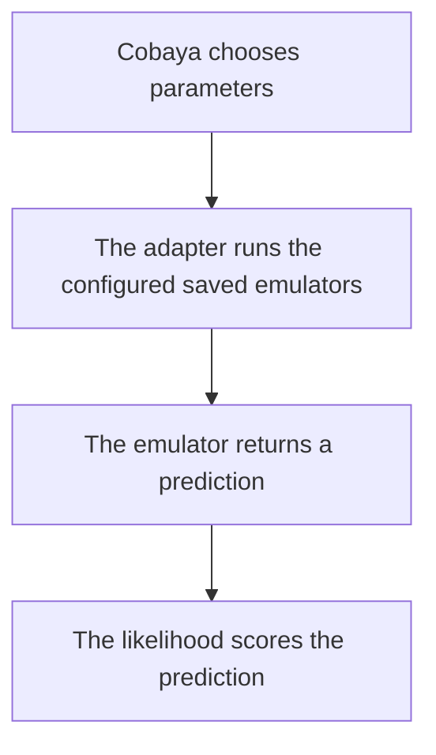

# Use saved emulators in Cobaya

Cobaya is a program that chooses cosmological parameter values, asks a
scientific calculation for predictions, and gives those predictions to a
likelihood. A likelihood compares a prediction with data and assigns it a
score.

This folder connects Cobaya to saved CoCoA SONIC emulators. An **emulator** is
a trained neural network that approximates a slower calculation. An
**adapter** is a small Python class that translates between Cobaya and one type
of saved emulator.

One saved emulator has two matching files: a `.h5` information file and a
`.emul` weights file. Both have the same path before the extension.

This folder does not train emulators or generate training data. Use
[`example_yamls/`](../example_yamls/README.md) to configure training and
[`compute_data_vectors/`](../compute_data_vectors/README.md) to make training
and validation tables.

CoCoA SONIC currently uses NumPy 1.x. Keep the supplied CoCoA environment; do
not upgrade it to NumPy 2.



In words: Cobaya chooses a point, the adapter runs the matching saved files,
and the likelihood scores the returned physical prediction.

## Contents

### Main guide

1. [Prepare CoCoA](#prepare-cocoa)
2. [Choose an adapter and example](#choose-adapter)
3. [Copy the example](#copy-example)
4. [Edit your copy](#edit-copy)
5. [Check the setup](#check-setup)
6. [Run one evaluation](#run-evaluation)

### Common questions raised by developers

- [Appendices about saved emulator files](#appendix-a-files)
  - [Why does one saved emulator have two files?](#faq-a1)
  - [How are saved-emulator paths resolved?](#faq-a2)
  - [How many saved roots does each adapter accept?](#faq-a3)
  - [What does the adapter check when it loads files?](#faq-a4)
  - [Which device should I request?](#faq-a5)
  - [Why must I keep NumPy 1.x?](#faq-a6)
- [Appendices about the Cobaya YAML](#appendix-b-yaml)
  - [What do the main YAML blocks mean?](#faq-b1)
  - [How does Cobaya learn which parameters the network needs?](#faq-b2)
  - [What options may I place under extra_args?](#faq-b3)
  - [How do I write a scalar theory block?](#faq-b4)
  - [How do I write a cosmic-microwave-background theory block?](#faq-b5)
  - [How do I write a background-expansion theory block?](#faq-b6)
  - [How do I write a matter-power theory block?](#faq-b7)
  - [What is the difference between --test, evaluate, and MCMC?](#faq-b8)
  - [May I reuse an output name?](#faq-b9)
- [Appendices about each physical result](#appendix-c-results)
  - [What does emul_cosmic_shear return?](#faq-c1)
  - [How does emul_scalars combine named values?](#faq-c2)
  - [What does emul_cmb return?](#faq-c3)
  - [Why does emul_baosn need two redshift ranges?](#faq-c4)
  - [How does emul_mps form nonlinear matter power?](#faq-c5)
  - [What does the EMUL2 example replace?](#faq-c6)
- [Appendices about checks and errors](#appendix-d-checks)
  - [What does each check establish?](#faq-d1)
  - [What should I do when startup fails?](#faq-d2)
  - [What does a one-point failure leave on disk?](#faq-d3)
  - [When is the file ready for an MCMC?](#faq-d4)
  - [Can I call a saved emulator without Cobaya?](#faq-d5)

---

## 1. Prepare CoCoA <a id="prepare-cocoa"></a>

Install and start CoCoA by following the
[official CoCoA README](https://github.com/CosmoLike/cocoa/blob/main/README.md).
It explains how to activate the supplied environment and run
`start_cocoa.sh`.

That startup process defines `$ROOTDIR`, the path to your CoCoA folder. Run
all commands in this guide from `$ROOTDIR`. The supplied environment uses
NumPy 1.x; do not upgrade it to NumPy 2.

## 2. Choose an adapter and example <a id="choose-adapter"></a>

Choose the row that matches the quantity your likelihood needs.

| Quantity requested by Cobaya | Adapter | Saved emulators required |
| --- | --- | --- |
| Cosmic-shear data vector | `emul_cosmic_shear` | One data-vector emulator for the usual first run |
| Named values such as `H0` or `rdrag` | `emul_scalars` | One or more scalar emulators |
| Cosmic microwave background (CMB) TT, TE, EE, or lensing-potential spectrum | `emul_cmb` | One emulator for each requested spectrum |
| $H(z)$ and cosmological distances | `emul_baosn` | Exactly two: `Hubble` and `D_M` |
| Linear and nonlinear $P(k,z)$ | `emul_mps` | Exactly two: `pklin` and `boost` |

A **data vector** is the ordered list of predicted measurements that a
likelihood compares with its data. A **CMB spectrum** gives sky-fluctuation
power as a function of angular scale. The matter power spectrum $P(k,z)$
describes density fluctuations as a function of wavenumber $k$ and redshift
$z$.

This folder includes two templates with all the main Cobaya sections:

| Example | Use it when |
| --- | --- |
| [`EXAMPLE_EMUL_EVALUATE.yaml`](EXAMPLE_EMUL_EVALUATE.yaml) | You want the shortest first run with one cosmic-shear emulator |
| [`EXAMPLE_EMUL2_EVALUATE.yaml`](EXAMPLE_EMUL2_EVALUATE.yaml) | You already have five saved emulators for the advanced EMUL2 calculation |

They are not ready to run as downloaded. Supply the saved-emulator roots and
use each template inside a configured CoCoA project.

Both examples use Cobaya's `evaluate` sampler. Here, **evaluate** means
calculate the likelihood at one chosen parameter point. A Markov chain Monte
Carlo (MCMC) sampler instead evaluates many related points to estimate a
probability distribution.

EMUL2 is a CosmoLike mode in which five saved emulators provide several theory
quantities. CosmoLike is the likelihood code used by these LSST examples.

Start with `EXAMPLE_EMUL_EVALUATE.yaml` unless you specifically need EMUL2.
The appendices give theory blocks for the other adapters.

## 3. Copy the example <a id="copy-example"></a>

The template is already included at
`external_modules/code/emulators_code_v2/cobaya_theory/EXAMPLE_EMUL_EVALUATE.yaml`.
Using your editor or file manager, manually copy that file to a new name inside
the LSST Y1 project. This guide uses the following destination:

```text
projects/lsst_y1/my_emulator_evaluate.yaml
```

Choose a filename that is not already present. The LSST Y1 project keeps its
Cobaya YAML files directly in `projects/lsst_y1`; do not create a
`projects/lsst_y1/cobaya` subfolder. If you use another project or likelihood,
put the copy directly in that project and change the likelihood block too.

## 4. Edit your copy <a id="edit-copy"></a>

Open `projects/lsst_y1/my_emulator_evaluate.yaml` in a text editor.
Make these changes:

1. Replace `projects/lsst_y1/emulators/<run>/emul_v2` with your saved-emulator
   root.
2. Set `device: cpu` for the first check.
3. Change `output` to a new name that is not used by another run.
4. Check the likelihood `path`, `data_file`, and requested parameters.
5. Check every number under `sampler: evaluate: override:`.

A **saved-emulator root** is the shared path before the two file extensions.
For example, this YAML entry:

```yaml
emulators:
  - projects/lsst_y1/emulators/run_12/emul_v2
```

requires both files below:

```text
projects/lsst_y1/emulators/run_12/emul_v2.h5
projects/lsst_y1/emulators/run_12/emul_v2.emul
```

Do not add either extension to the YAML. Keep the two files from the same
training run together.

After editing, check that the shipped placeholder is gone:

```bash
CONFIG=projects/lsst_y1/my_emulator_evaluate.yaml
if ! test -f "$CONFIG"; then
  printf 'STOP: %s does not exist.\n' "$CONFIG" >&2
elif grep -n '<run>' "$CONFIG"; then
  printf '%s\n' 'STOP: replace <run> before continuing.'
else
  GREP_STATUS=$?
  if test "$GREP_STATUS" -eq 1; then
    printf '%s\n' 'No <run> placeholder remains.'
  else
    printf 'STOP: could not read %s.\n' "$CONFIG" >&2
  fi
fi
```

## 5. Check the setup <a id="check-setup"></a>

First check the YAML indentation and punctuation:

```bash
CONFIG=projects/lsst_y1/my_emulator_evaluate.yaml
python - "$CONFIG" <<'PY'
from pathlib import Path
import sys
from cobaya.input import load_input

path = Path(sys.argv[1])
document = load_input(str(path))
if not isinstance(document, dict):
    raise SystemExit("The YAML top level must contain named blocks.")
print(f"YAML syntax OK: {path}")
PY
```

This check reads Cobaya YAML syntax and refuses duplicate keys. It does not
open the saved emulator or decide whether the cosmology is correct.

Next ask Cobaya to load the likelihood, adapter, saved files, parameters, and
sampler without calculating the likelihood:

```bash
cd "$ROOTDIR"
CONFIG=projects/lsst_y1/my_emulator_evaluate.yaml
cobaya-run --test --no-mpi "$CONFIG"
```

`--test` initializes the model and sampler, then exits. `--no-mpi` tells
Cobaya not to start its MPI parallel-processing layer. A successful setup
ends with `Test initialization successful!`.

The setup check may write `*.input.yaml` and `*.updated.yaml` beside the
configured output prefix. Those files record the input and the defaults Cobaya
added. The setup check does not produce the one-point `*.1.txt` result.

## 6. Run one evaluation <a id="run-evaluation"></a>

Run the copied file without `--test`:

```bash
cd "$ROOTDIR"
CONFIG=projects/lsst_y1/my_emulator_evaluate.yaml
cobaya-run --no-mpi "$CONFIG"
```

This command performs a real likelihood calculation at the values under
`sampler: evaluate: override:`. It may take time because the likelihood still
runs even when an emulator replaces part of its theory calculation.

The terminal should report the reference point, log-prior, log-likelihood, and
log-posterior. The log-prior scores the point before comparing it with data;
the log-likelihood scores the data comparison; the log-posterior combines
both. Cobaya writes a one-row `<output>.1.txt` file plus the
`<output>.input.yaml` and `<output>.updated.yaml` records. The shipped example
sets `print_datavector: false`, so it does not write the named model-vector
file unless you change that setting.

One successful point proves that this parameter point, these saved files, and
this likelihood can run together. It does not prove emulator accuracy across
all allowed parameter ranges. Compare the emulator with **held-out validation
data**—examples that were not used for training—before starting an MCMC.

After the validation comparison passes, follow the
[evaluate-to-MCMC procedure](#faq-b8) below.

---

# Common questions raised by developers <a id="common-questions"></a>

The main guide is enough for the ordinary cosmic-shear check. Use the
appendices when you need another physical quantity, a path explanation, or a
specific error.

# Appendices about saved emulator files <a id="appendix-a-files"></a>

## FAQ A1. Why does one saved emulator have two files? <a id="faq-a1"></a>

The `.h5` file records the model settings needed to rebuild the network,
parameter names, `input_domain` (the parameter region sampled during data
generation), output description, and fixed scientific settings. The `.emul`
file records the learned network weights.

The adapter opens both files when Cobaya starts. Moving one file is allowed
only if you move its matching partner and keep the shared root. Never combine
the `.h5` file from one training run with the `.emul` file from another.

The code cannot always distinguish weights from another run when both networks
have the same shape. Keeping each `.h5` file beside its original `.emul`
partner is therefore part of preparing the run.

## FAQ A2. How are saved-emulator paths resolved? <a id="faq-a2"></a>

A **relative path** starts from another known folder. An **absolute path**
starts at the filesystem root, such as `/Users/name/...` on macOS or Linux.

Each adapter leaves an absolute saved-emulator root unchanged. When
`$ROOTDIR` is set, it joins a relative root to that folder, so this entry:

```yaml
emulators:
  - projects/lsst_y1/emulators/run_12/emul_v2
```

means:

```text
$ROOTDIR/projects/lsst_y1/emulators/run_12/emul_v2
```

Do not write a literal `$ROOTDIR` inside the YAML. YAML does not ask the shell
to expand that variable. Source `start_cocoa.sh` and run from `$ROOTDIR`
instead.

If `$ROOTDIR` is unset, a relative root starts from the folder where
`cobaya-run` was launched. This guide avoids that ambiguity by sourcing
`start_cocoa.sh` first.

`python_path` follows Cobaya's external-class rule. From `$ROOTDIR`, use:

```yaml
python_path: ./external_modules/code/emulators_code_v2/cobaya_theory/
```

Do not replace `python_path` with `path`. In a likelihood block, `path`
can name likelihood data; in these theory blocks, `python_path` selects the
adapter Python file.

## FAQ A3. How many saved roots does each adapter accept? <a id="faq-a3"></a>

| Adapter | Count | Additional rule |
| --- | ---: | --- |
| `emul_cosmic_shear` | One or more | Several vectors are joined in YAML order |
| `emul_scalars` | One or more | No two roots may return the same named value |
| `emul_cmb` | One or more | Use one root for each requested spectrum |
| `emul_baosn` | Exactly two | One `Hubble` root and one `D_M` root |
| `emul_mps` | Exactly two | One `pklin` root and one `boost` root |

The adapter reads the saved output description, so list order does not choose
the meaning of either exactly-two pair. Giving two roots with the same output
name is refused.

## FAQ A4. What does the adapter check when it loads files? <a id="faq-a4"></a>

The adapter checks that every root belongs to its physical family. When several
roots are used together, it also checks that they came from the same generated
dataset and agree on saved scientific settings and parameter coordinates.

After Cobaya has assembled the model, the adapter compares the saved fixed
settings with the active Cobaya settings. A **fixed setting** is a quantity
held constant rather than sampled. A mismatch stops startup.

At each prediction, every network input recorded in a saved file must be named
and inside that file's `input_domain`. This block records one lower and one
upper bound for each parameter sampled by the data generator. Extra values
requested by an adapter, such as `fast_params` or the Syren inputs used by the
matter-power adapter, do not have a saved `input_domain` bound in that adapter.

Cobaya passes parameters by name, so their YAML order does not choose the
network order. Missing saved input names and saved inputs outside their
`input_domain` bounds are refused.

The `input_domain` is not the range of rows that actually trained the network.
Training can remove generated rows with `data.param_cuts` and then retain only
the requested training and validation rows; those later choices do not change
`input_domain`. A point that passes this boundary check may still be far from
the retained rows, so the check does not prove interpolation.

Here, **interpolation** means predicting between nearby examples used to fit
the network. Before an MCMC, inspect the retained-row coverage after cuts and
require held-out validation to meet the analysis accuracy target across the
planned priors.

## FAQ A5. Which device should I request? <a id="faq-a5"></a>

Use `device: cpu` for the first check. It runs the network on the computer's
central processor.

`device: cuda` requests an NVIDIA graphics processor (GPU). If CUDA is
unavailable, the adapter uses Apple's Metal Performance Shaders (MPS) device
when available, otherwise CPU. `device: mps` requests that Apple GPU interface
and falls back to CPU.

This fallback is silent, so the requested value is not evidence that a GPU
was selected. If GPU use matters, check PyTorch's CUDA or MPS availability
before starting the run.

`compile: false` is the default. `compile: true` asks PyTorch to compile the
model only when CUDA is selected and the saved recipe includes a compile mode.
Compilation startup time rarely helps one-point evaluations or MCMC calls that
predict one parameter point at a time, so leave it off unless you have measured
this run.

## FAQ A6. Why must I keep NumPy 1.x? <a id="faq-a6"></a>

CoCoA SONIC currently targets NumPy 1.x. The supplied environment contains the
version used by the repository's present calculations and tests.

Do not upgrade NumPy as part of a Cobaya adapter setup. If another package
changes the environment to NumPy 2, restore the CoCoA environment before
diagnosing the YAML or saved emulator.

# Appendices about the Cobaya YAML <a id="appendix-b-yaml"></a>

## FAQ B1. What do the main YAML blocks mean? <a id="faq-b1"></a>

| Block | Meaning |
| --- | --- |
| `likelihood` | The data comparison that requests a prediction |
| `params` | Sampled, fixed, and calculated parameter names |
| `theory` | The adapter classes that produce physical predictions |
| `sampler` | The rule for choosing parameter points |
| `output` | The path prefix for files written by Cobaya |

A **sampled parameter** is allowed to change during an MCMC. A **derived
parameter** is calculated from other parameters rather than sampled directly.

The shortest cosmic-shear theory block is:

```yaml
theory:
  emul_cosmic_shear:
    python_path: ./external_modules/code/emulators_code_v2/cobaya_theory/
    stop_at_error: true
    extra_args:
      device: cpu
      emulators:
        - projects/lsst_y1/emulators/run_12/emul_v2
```

The class name after `theory:` must match the adapter name in the chooser
table.

## FAQ B2. How does Cobaya learn which parameters the network needs? <a id="faq-b2"></a>

Each saved `.h5` file records the input parameter names in training order.
The adapter reads those names and asks Cobaya for the corresponding values.
Do not type an input order into the theory block.

Every saved input name must be available from `params`, the likelihood, or
another calculation in the Cobaya file. If a saved root expects `As_1e9`,
renaming or dropping that quantity before it reaches the adapter causes a
missing-parameter error.

The matter-power adapter needs extra quantities when it reconstructs a Syren
starting prediction. Syren supplies a matter-power formula that the emulator
corrects. The adapter asks for `As`, `ns`, `H0`, `omegab`, and `omegam`.
When the sampled amplitude is `As_1e9`, define `As` as a derived parameter,
as shown in [`EXAMPLE_EMUL2_EVALUATE.yaml`](EXAMPLE_EMUL2_EVALUATE.yaml).

## FAQ B3. What options may I place under `extra_args`? <a id="faq-b3"></a>

| Adapter | Allowed keys |
| --- | --- |
| `emul_cosmic_shear` | `device`, `emulators`, `fast_params`, `compile`, `dv_return` |
| `emul_scalars` | `device`, `emulators`, `provides`, `compile` |
| `emul_cmb` | `device`, `emulators`, `compile` |
| `emul_baosn` | `device`, `emulators`, `compile` |
| `emul_mps` | `device`, `emulators`, `compile` |

An unknown key stops initialization and prints the allowed list. Most runs need
only `device` and `emulators`.

## FAQ B4. How do I write a scalar theory block? <a id="faq-b4"></a>

```yaml
theory:
  emul_scalars:
    python_path: ./external_modules/code/emulators_code_v2/cobaya_theory/
    stop_at_error: true
    extra_args:
      device: cpu
      emulators:
        - projects/lsst_y1/emulators/rdrag/emul_v2
```

The saved file supplies its input names and output names. An optional
`provides` list only checks that named outputs exist; it does not select or
rename them.

## FAQ B5. How do I write a cosmic-microwave-background theory block? <a id="faq-b5"></a>

```yaml
theory:
  emul_cmb:
    python_path: ./external_modules/code/emulators_code_v2/cobaya_theory/
    stop_at_error: true
    extra_args:
      device: cpu
      emulators:
        - projects/cmb/emulators/tt/emul_v2
        - projects/cmb/emulators/te/emul_v2
        - projects/cmb/emulators/ee/emul_v2
```

Include only the spectra requested by the likelihood, and make sure each saved
range reaches the requested largest multipole.

## FAQ B6. How do I write a background-expansion theory block? <a id="faq-b6"></a>

```yaml
theory:
  emul_baosn:
    python_path: ./external_modules/code/emulators_code_v2/cobaya_theory/
    stop_at_error: true
    extra_args:
      device: cpu
      emulators:
        - projects/lsst_y1/emulators/baosn/hubble_v2
        - projects/lsst_y1/emulators/baosn/dm_v2
```

One saved emulator predicts low-redshift `Hubble`; the other predicts
high-redshift `D_M`. Their stored output descriptions, not their list order,
tell the adapter which is which.

## FAQ B7. How do I write a matter-power theory block? <a id="faq-b7"></a>

```yaml
theory:
  emul_mps:
    python_path: ./external_modules/code/emulators_code_v2/cobaya_theory/
    stop_at_error: true
    extra_args:
      device: cpu
      emulators:
        - projects/lsst_y1/emulators/mps/pklin_v2
        - projects/lsst_y1/emulators/mps/boost_v2
```

The two saved surfaces must have exactly the same stored $z$ and $k$ grids.
Syren supplies starting matter-power formulas that these emulators correct.
The intended EMUL2 pair uses the `syren_linear` formula for `pklin` and
`syren_halofit` for `boost`.

## FAQ B8. What is the difference between `--test`, evaluate, and MCMC? <a id="faq-b8"></a>

| Action | What it does | What it does not prove |
| --- | --- | --- |
| `cobaya-run --test` | Loads the complete setup and initializes the sampler | No likelihood value is calculated |
| `sampler: evaluate` | Calculates one or more chosen points | It does not explore the allowed parameter range |
| MCMC | Chooses many linked points to estimate a probability distribution | A completed chain alone does not validate emulator accuracy |

Run them in that order: setup-only check, one-point evaluation, validation
comparison, then MCMC.

To convert the checked evaluate file into an MCMC file:

1. From `$ROOTDIR`, use an editor or file manager to manually copy the checked
   YAML to a new filename under `$ROOTDIR/projects/<project>/`. For this
   guide, copy `projects/lsst_y1/my_emulator_evaluate.yaml` to
   `projects/lsst_y1/my_emulator_mcmc.yaml`.
2. In the copy, keep the checked `likelihood`, `params`, and `theory` blocks,
   including the saved-emulator roots. Remove the complete `evaluate` entry,
   including its `N` and `override` entries, and make `mcmc` the only child of
   `sampler`. Supply the MCMC settings from a scientifically reviewed Cobaya
   file for this project.
3. Recheck the sampled parameters' priors and proposal settings, which control
   how the MCMC suggests its next moves. MCMC draws points from the `params`
   configuration; it does not use the deleted one-point `override`. Keep the
   planned priors within the retained-row coverage where held-out validation
   meets the target described in [FAQ A4](#faq-a4).
4. Change `output` to a new prefix. Do not add `force: true` or start with
   `--force`, because either can overwrite files from an earlier run.

The repository's
[internal MCMC smoke file](../ai/gates/configs/cobaya-adapter-mcmc.yaml) shows
the verified block shape and the keys `max_samples`, `burn_in`, and
`max_tries`. Its values run only a short connection check with 500 samples and
no burn-in; they are not settings for a scientific chain. If the project has
no reviewed MCMC settings, choose its stopping, burn-in, and proposal policy
with the analysis owners before running.

Check the converted file once, then start the MCMC from `$ROOTDIR`:

```bash
cd "$ROOTDIR"
CONFIG=projects/lsst_y1/my_emulator_mcmc.yaml
cobaya-run --test --no-mpi "$CONFIG"
cobaya-run "$CONFIG"
```

The second command repeatedly evaluates the likelihood and writes the chain
under the new `output` prefix. A completed command still requires the usual
convergence checks and does not replace the held-out emulator validation.

## FAQ B9. May I reuse an output name? <a id="faq-b9"></a>

Use a new `output` prefix for a changed experiment. An old
`<output>.updated.yaml` tells Cobaya that the name has already been used.

Do not begin with `--force`; it authorizes Cobaya to overwrite prior output.
Do not delete an old chain merely to make a new YAML start. Give the new run a
new name so that both records remain available.

# Appendices about each physical result <a id="appendix-c-results"></a>

## FAQ C1. What does `emul_cosmic_shear` return? <a id="faq-c1"></a>

It returns the ordered cosmic-shear vector through Cobaya's
`get_cosmic_shear()` call. With one saved emulator, the result is that
emulator's vector. With several roots, the adapter joins the vectors in YAML
order.

`dv_return: section` is the default and returns only the vector positions for
the saved observable, called its **probe section**. `dv_return: 3x2pt`
returns the full 3x2pt-layout vector. This saved observable's kept entries
appear at their stored positions, and every other position is zero.

`fast_params` adds names that Cobaya must supply but does not feed those
values into the network or apply a correction. Use it only when another part
of the theory calculation handles those parameters.

## FAQ C2. How does `emul_scalars` combine named values? <a id="faq-c2"></a>

Each scalar saved emulator records one or more output names. The adapter returns
the combined set of those named values as Cobaya derived parameters.

Two loaded roots may not provide the same name. The output of one loaded scalar
emulator also may not be an input to another; chained scalar emulators are not
implemented.

## FAQ C3. What does `emul_cmb` return? <a id="faq-c3"></a>

It returns Cobaya's named `Cl` collection with a common integer multipole
$\ell$ axis. A **multipole** labels angular scale on the sky. Each saved
emulator contributes its stored TT, TE, EE, or PP values on its own stored
range.

The adapter returns raw $C_\ell$ values. It does not apply the common
$\ell(\ell+1)/(2\pi)$ plotting factor or convert units. TT, TE, and EE
files loaded together must record the same units; PP is dimensionless.

A likelihood cannot request a missing spectrum or a multipole above the
stored maximum.

## FAQ C4. Why does `emul_baosn` need two redshift ranges? <a id="faq-c4"></a>

The `Hubble` saved emulator covers the low-redshift supernova range and must
store $H(z)$ in km/s/Mpc. The adapter integrates this prediction to obtain
low-redshift distances.

The `D_M` saved emulator covers a separate high-redshift range near
recombination and must store distance in Mpc. The two stored ranges may not
overlap or touch. Requests in the gap or outside both ranges are refused.

`Hubble` queries work only in the low-redshift range. Distance queries may
use the low-redshift range or the stored high-redshift range.

Cobaya's setup-only check can accept a high-redshift `Hubble` request, but the
actual `get_Hubble()` call refuses it. Check that the likelihood requests
`Hubble` only inside the low-redshift range.

This adapter assumes a flat universe. Set `omk: 0` in the full Cobaya model.
The adapter rejects a sampled `omk` input, but a nonzero value fixed elsewhere
can escape that local check; the user must keep the complete run flat.

For two-redshift angular-diameter distances, supply each pair as
$(z_1,z_2)$ with $z_1 \le z_2$. The current calculation assumes this order
and does not check it.

## FAQ C5. How does `emul_mps` form nonlinear matter power? <a id="faq-c5"></a>

The `pklin` saved emulator gives the linear matter-power surface. The
`boost` saved emulator gives the multiplicative nonlinear correction
$B(k,z)$. The adapter forms:

$$
P_{\mathrm{nl}}(k,z) = B(k,z)P_{\mathrm{lin}}(k,z).
$$

For the intended EMUL2 files, Syren supplies starting matter-power formulas
and each network predicts a correction to one of them. The adapter reconstructs
both physical surfaces and applies its built-in low-$k$ blend when `boost`
uses `syren_halofit`. It serves only `delta_tot`–`delta_tot`, Cobaya's
total-matter-density spectrum.

The two saved roots must use identical stored $z$ and $k$ grids. A non-finite,
non-positive linear spectrum or boost rejects that parameter point.

The adapter checks the `pklin` and `boost` quantity names and exact grid
equality. It does not check units or prove that `pklin` uses
`syren_linear` while `boost` uses `syren_halofit`. For EMUL2, verify that
`pklin` stores `Mpc3` with `syren_linear` and that the dimensionless
`boost` uses `syren_halofit`. A `none` formula is also allowed when the
saved emulator learned the raw surface.

The current `sigma8` helper integrates with an 8 Mpc radius, not the usual
8 Mpc/$h$ radius used for the conventional $\sigma_8$ parameter. Obtain
conventional $\sigma_8$ from another checked calculation.

## FAQ C6. What does the EMUL2 example replace? <a id="faq-c6"></a>

EMUL2 is CosmoLike's `use_emulator: 2` mode. The CosmoLike likelihood still
runs, but five saved emulators replace the CAMB quantities it requests:

| Adapter | Saved roots | Returned quantity |
| --- | --- | --- |
| `emul_scalars` | One `rdrag` root | Sound horizon $r_\mathrm{drag}$ |
| `emul_baosn` | One `Hubble` and one `D_M` root | Expansion rate and distances |
| `emul_mps` | One `pklin` and one `boost` root | Linear and nonlinear matter power |

Five roots mean ten saved files because every root needs a matching `.h5`
and `.emul`.

CAMB is a program that calculates cosmological theory quantities. EMUL2 keeps
the likelihood calculation while replacing the listed CAMB work.

[`EXAMPLE_EMUL2_EVALUATE.yaml`](EXAMPLE_EMUL2_EVALUATE.yaml) also defines
calculated parameter names needed by the saved files and Syren formulas. Treat
it as an advanced integration check. Cobaya's setup-only check must accept the
whole copied file before you calculate the point.

The matter-power adapter reports that it can calculate power and `sigma8`,
but a particular likelihood may request parameters in a different form. The full
`cobaya-run --test` result, not the adapter's product list alone, decides
whether that YAML connects all requested quantities.

# Appendices about checks and errors <a id="appendix-d-checks"></a>

## FAQ D1. What does each check establish? <a id="faq-d1"></a>

| Check | A pass means | A pass does not mean |
| --- | --- | --- |
| YAML syntax check | Indentation, YAML punctuation, and keys can be read without duplicates | Paths and physics may still be wrong |
| `cobaya-run --test` | Components and saved files initialize together | The likelihood has not been calculated |
| One-point evaluate | One named point completes the likelihood | Other prior points and accuracy remain unchecked |
| Held-out validation | Errors are measured on rows not used for training | The Cobaya YAML and likelihood may still be wrong |
| MCMC | Cobaya explored many linked points | The emulator is scientifically accepted without the earlier checks |

Keep the setup-only log, one-point output, and validation plots with the run.
They answer different questions.

## FAQ D2. What should I do when startup fails? <a id="faq-d2"></a>

| Message or symptom | Likely meaning | First action |
| --- | --- | --- |
| A `.h5` or `.emul` file is missing | The YAML root is wrong or one partner was moved | Check both files beside the exact root |
| The saved emulator belongs in another adapter | The file predicts another physical family | Return to the chooser table |
| Saved settings do not match the Cobaya model | Files and current fixed cosmology disagree | Use files trained for this model or correct the YAML |
| A parameter is not provided | A saved input name cannot reach the adapter | Compare saved names with `params` and calculated names |
| A value lies outside the sampled generator region | The requested point exceeds the saved `input_domain` bounds | Correct the point or generate data over the needed region, then retrain |
| Requested spectrum or multipole is unavailable | A cosmic-microwave-background file or stored $\ell$ range is missing | Add the correct spectrum or reduce the request |
| Requested redshift is unavailable | The point lies outside the background-expansion windows | Check both saved redshift ranges |
| Matter-power grids differ | The `pklin` and `boost` files use different axes | Use a pair generated on the same grid |
| The GPU appears unused | The requested device may have fallen back silently | Continue on CPU or check PyTorch's GPU availability |
| The output prefix already exists | Another check or run used the name | Choose a new output prefix |

Read the first adapter error before later Cobaya messages. A missing file or
parameter often causes several later messages that are only consequences.

## FAQ D3. What does a one-point failure leave on disk? <a id="faq-d3"></a>

Cobaya can write the `input` and `updated` YAML records before it evaluates
the point. A failed calculation may therefore leave those files without a
complete `.1.txt` row.

Do not read the presence of `updated.yaml` as proof of success. Check that the
command finishes without an error. Then open `.1.txt` and confirm that it
contains one data row.

For the next attempt, choose a new output prefix so the failed and repaired
configurations remain distinguishable.

## FAQ D4. When is the file ready for an MCMC? <a id="faq-d4"></a>

Move to an MCMC only after all of these are true:

- the YAML syntax check and `cobaya-run --test` pass;
- the one-point evaluation finishes with finite prior and likelihood values;
- held-out validation meets the accuracy requirement across the planned
  priors;
- the saved sampled generator region contains the planned priors;
- the training and validation rows retained after `param_cuts` cover the
  planned priors closely enough to test that region;
- units, parameter names, and fixed cosmology agree;
- background-expansion runs are flat and matter-power runs account for the
  `sigma8` definition;
- the MCMC uses a new output prefix.

The conversion steps are in [FAQ B8](#faq-b8). The main README appendices
explain
[scalar outputs](../README.md#14-scalar-derived-parameter-emulators),
[CMB spectra](../README.md#15-emulating-cmb-spectra-tt--te--ee--phi-phi),
[background quantities](../README.md#16-emulating-the-expansion-history-hz-bao-and-sn-distances),
and [matter power](../README.md#17-emulating-the-matter-power-spectrum-hybrid-inference-emul2).

## FAQ D5. Can I call a saved emulator without Cobaya? <a id="faq-d5"></a>

Yes. Use `EmulatorPredictor` for a plot, a check at one parameter point, a
profile scan, or a Python loop over many points. A **profile scan** varies one
parameter while holding the others fixed. The predictor checks that every
requested point lies inside the saved `input_domain`: one lower and one upper
bound for each parameter sampled by the data generator.

This boundary does not record which generated rows later survived
`data.param_cuts` or which rows were retained for training. Passing it does
not prove that the network is interpolating between nearby retained rows or
that its error is acceptable. Inspect the retained-row coverage and held-out
validation before using a direct prediction in a scientific result.

Use the adapters in this folder when Cobaya must choose the points, pass the
prediction to a likelihood, or write MCMC output.

### Load one saved root

A saved **root** is the common path before `.h5` and `.emul`. For example,
the root

```text
$ROOTDIR/projects/lsst_y1/emulators/thetaH0/emul_v2
```

names these two files:

```text
emul_v2.h5
emul_v2.emul
```

Start CoCoA as described in [Prepare CoCoA](#prepare-cocoa). Save the
following script as `$ROOTDIR/direct_emulator_example.py`. Replace
`artifact_root` with the root from your own training run. Replace `point` with
one value for every name printed by `predictor.names`.

```python
import os
import sys

repository_path = os.path.join(
    os.environ["ROOTDIR"],
    "external_modules/code/emulators_code_v2",
)
sys.path.insert(0, repository_path)

from emulator.inference import EmulatorPredictor

artifact_root = os.path.join(
    os.environ["ROOTDIR"],
    "projects/lsst_y1/emulators/thetaH0/emul_v2",
)
predictor = EmulatorPredictor(artifact_root, device="cpu")

print("required inputs:", predictor.names)

# This point fits a scalar emulator whose inputs have these three names.
point = {
    "omegabh2": 0.02238,
    "omegach2": 0.1201,
    "thetastar": 1.04109,
}
result = predictor.predict(point)
print("prediction:", result)
```

Run it from `$ROOTDIR`:

```bash
python direct_emulator_example.py
```

A successful scalar example first prints `required inputs: [...]`, then a
`prediction: {...}` dictionary. The script reads the two saved files and does
not change either one. A missing input name raises an error that names the
missing parameter. A point outside the `input_domain` region sampled by the
data generator is also refused; a point inside it still needs the retained-row
and validation checks above.

`device="cpu"` works without a GPU. Use `device="cuda"` on a machine with a
configured CUDA device. The optional `compile_model` argument is `False` by
default because compilation usually costs more time than it saves for
single-point calls.

### Read the return value

`predictor.predict(point)` returns a different Python object for each physical
family. The axes and quantity names are also available on the predictor.

| Saved family | Return value | How to read it |
| --- | --- | --- |
| Cosmic-shear data vector | One-dimensional NumPy array | The default contains the saved probe section. Construct the predictor with `dv_return="3x2pt"` to place retained entries in the full 3x2pt layout and fill omitted positions with zero. |
| Named scalar outputs | `{name: value}` dictionary of Python floats | `predictor.output_names` lists the returned names. A profile scan reads the needed value from this dictionary at each point. |
| CMB spectrum | One-dimensional NumPy array | `predictor.ell` is the matching multipole grid and `predictor.units` gives the stored units. The saved amplitude law has already been reversed, so the array contains physical $C_\ell$ values. |
| Background function | `{"z": grid, "<quantity>": values}` | `predictor.quantity` names the function and `predictor.units` gives its units. A `Hubble` result is in km/s/Mpc. |
| Matter-power grid | `{"z": grid, "k": grid, "<quantity>": surface}` | The surface has shape `(number of z points, number of k points)`. `predictor.law` states whether it is the raw surface or a stored log-ratio. The direct predictor does not multiply a Syren base back into that surface. |

For a matter-power artifact with `predictor.law == "syren_linear"`, the
returned `pklin` surface is $\log(P/P_{\rm Syren})$. For
`predictor.law == "syren_halofit"`, the returned `boost` surface is the
corresponding stored log-ratio. The `emul_mps` Cobaya adapter performs the
base reconstruction described in [FAQ C5](#faq-c5).

### Use scalar outputs in a profile scan

A scalar emulator returns named values. The common `thetaH0` emulator, for
example, returns `H0` and `omegam`:

```python
output = predictor.predict({
    "omegabh2": 0.02238,
    "omegach2": 0.1201,
    "thetastar": 1.04109,
})
h0 = output["H0"]
omega_m = output["omegam"]
```

Evaluate this block once for each profile point. Keep every point inside the
sampled generator region recorded by the saved emulator; `predict` refuses a
point outside that region. Also keep the scan within the region covered by
rows retained after `param_cuts`, and check held-out errors there.

### Turn a saved Hubble curve into distances

A background emulator returns its function on the stored redshift grid. For a
`Hubble` artifact, the shared helper in `emulator/background.py` integrates
that curve and returns distance functions:

```python
from emulator.background import distance_interpolators

output = predictor.predict(point)
distances = distance_interpolators(
    z_grid=output["z"],
    h_grid=output["Hubble"],
)

luminosity_distance = distances["dl"](1.5)  # Mpc
hubble_at_half = distances["H"](0.5)         # km/s/Mpc
```

Use this block only with a predictor whose `quantity` is `Hubble`. The helper
uses the same flat-universe distance calculation as `emul_baosn`.

### Check the saved-file version

The `.h5` file stores a `schema_version` number that identifies its file
format. The current `EmulatorPredictor` accepts version 3 only. It refuses a
file with no version or a different version instead of guessing which
information the file contains.

Older `.joblib`, `.pt`, and file-format-version-2 files are not inputs to this
predictor. Regenerate the training data so the producer writes its
`.facts.yaml` record, then retrain and save the emulator with the current
code. Such files cannot be upgraded in place because they do not contain the
fixed-cosmology and `input_domain` records that the current reader checks.
