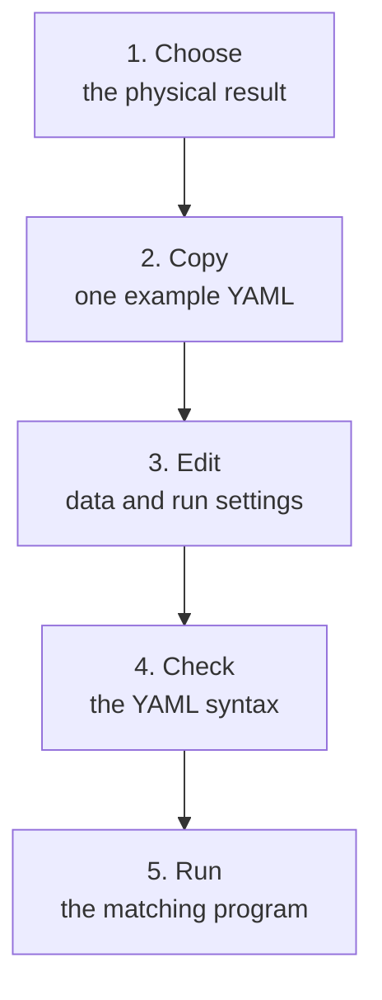

# Choose and edit an example YAML

Use this folder when you need settings for model training or for the CMB
covariance calculation. An emulator is a trained, fast approximation to a
slower physics calculation. YAML is an indented text file that gives a
program its settings. Each file here is a template: copy the closest one into
your CoCoA project, then edit the copy.

The filenames inside these templates are examples. The training arrays,
parameter tables, and saved models are not stored in this folder.



In words: choose the physical quantity first, copy its example, change the
copy, check that Python can read it, and run the program named in the table
below.

## Contents

### Main guide

1. [Choose a starting file](#choose-file)
2. [Copy it into your project](#copy-file)
3. [Change your copy in a fixed order](#edit-file)
4. [Check the YAML syntax](#check-file)
5. [Run the matching program](#run-file)

### Common questions raised by developers

- [Appendices about YAML structure](#appendix-a-yaml)
  - [How do indentation and comments work?](#faq-a1-yaml-basics)
  - [What are the main blocks in a trainer YAML?](#faq-a2-blocks)
  - [Why do two different settings use the word covariance?](#faq-a3-covariance)
  - [Which setting wins when two places set it?](#faq-a4-precedence)
- [Appendices about physical families](#appendix-b-families)
  - [Which part of `data` selects the physical family?](#faq-b1-family-blocks)
  - [How do I make the missing background or matter-power partner?](#faq-b2-partner-files)
- [Appendices about special runs](#appendix-c-special-runs)
  - [What is the difference between a sweep and tuning?](#faq-c1-sweep-tune)
  - [What is the difference between fine-tuning and transfer?](#faq-c2-reuse)
  - [How do I create the CMB covariance file?](#faq-c3-cmb-covariance)
  - [How do I add a polynomial base?](#faq-c4-pce)
- [Appendices about paths and errors](#appendix-d-paths)
  - [Where does each filename point?](#faq-d1-paths)
  - [What should I check when a run stops at startup?](#faq-d2-startup-errors)
- [Appendices about training and model settings](#appendix-e-training)
  - [How are rows selected from the data files?](#faq-e1-data-selection)
  - [Which run controls belong directly under `train_args`?](#faq-e2-run-controls)
  - [How do I choose the loss?](#faq-e3-loss)
  - [How do optimizer, learning rate, and scheduler work together?](#faq-e4-parameter-updates)
  - [What do `trim`, `focus`, and `ema` change?](#faq-e5-trim-focus-ema)
  - [How do I choose the model settings?](#faq-e6-model-settings)
  - [How do I train the trunk before the correction head?](#faq-e7-two-phase-training)

---

## 1. Choose a starting file <a id="choose-file"></a>

A training program is called a *driver* in the code and in the main README.
It reads one YAML, checks the settings it knows, loads the named data, and
starts the requested calculation.

This guide calls each physical output type and its required file layout a
*family*. The five families are cosmic shear, named scalar values, CMB,
background expansion, and matter power.

Choose by the result you want:

| Your goal | Copy this file | Run this program |
| --- | --- | --- |
| Train one cosmic-shear emulator | [`cosmic_shear_train_emulator.yaml`](cosmic_shear_train_emulator.yaml) | `cosmic_shear_train_emulator.py` |
| Predict named values such as `H0` and `omegam` | [`scalar_emulator.yaml`](scalar_emulator.yaml) | `scalar_train_emulator.py` |
| Train one CMB spectrum: TT, TE, EE, or lensing potential | [`cmb_emulator.yaml`](cmb_emulator.yaml) | `cmb_train_emulator.py` |
| Train the supernova-range $H(z)$ model | [`baosn_hubble_emulator.yaml`](baosn_hubble_emulator.yaml) | `baosn_train_emulator.py` |
| Train the nonlinear matter-power boost | [`mps_boost_emulator.yaml`](mps_boost_emulator.yaml) | `mps_train_emulator.py` |
| Try a stated list of values for one cosmic-shear setting | [`cosmic_shear_sweep_hyperparam_emulator.yaml`](cosmic_shear_sweep_hyperparam_emulator.yaml) | `cosmic_shear_sweep_hyperparam_emulator.py` |
| Search several numeric cosmic-shear settings | [`cosmic_shear_tune_emulator.yaml`](cosmic_shear_tune_emulator.yaml) | `cosmic_shear_tune_emulator.py` |
| Continue a saved cosmic-shear model on new data | [`cosmic_shear_finetune_emulator.yaml`](cosmic_shear_finetune_emulator.yaml) | `cosmic_shear_train_emulator.py` |
| Keep a saved cosmic-shear model fixed and learn a correction | [`cosmic_shear_transfer_emulator.yaml`](cosmic_shear_transfer_emulator.yaml) | `cosmic_shear_train_emulator.py` |
| Calculate the covariance used by CMB training | [`cmb_covariance_lcdm.yaml`](cmb_covariance_lcdm.yaml) | `compute_data_vectors/compute_cmb_covariance.py` |

The last row is not emulator training. It produces the `.npz` covariance file
named inside `cmb_emulator.yaml`.

The training-size sweep programs reuse the ordinary YAML for their physical
family. The cosmic-shear comparison of activation functions, the nonlinear
functions used inside the model, also reuses
`cosmic_shear_train_emulator.yaml`. Neither task needs another YAML file.

The $H(z)$ and matter-power examples each cover one member of a two-model
pair. [FAQ B2](#faq-b2-partner-files) explains how to make the other member.

## 2. Copy it into your project <a id="copy-file"></a>

Run the following commands from `$ROOTDIR`, the CoCoA folder set by
`source start_cocoa.sh`. They create a project settings folder and copy the
cosmic-shear example to `my_cosmic_shear.yaml`. They do not change the
repository copy.

```bash
cd "$ROOTDIR"
D=external_modules/code/emulators_code_v2
PROJECT=projects/lsst_y1
CONFIG_DIR=emulators/training_scripts

mkdir -p "$PROJECT/$CONFIG_DIR"
cp "$D/example_yamls/cosmic_shear_train_emulator.yaml" \
  "$PROJECT/$CONFIG_DIR/my_cosmic_shear.yaml"
```

After a successful copy, this file exists:

```text
$ROOTDIR/projects/lsst_y1/emulators/training_scripts/my_cosmic_shear.yaml
```

Replace the source filename and the new filename when you choose another row
from the table. Keep your edited YAML in the folder passed as `--fileroot`.

## 3. Change your copy in a fixed order <a id="edit-file"></a>

Do not read the 470-line cosmic-shear example from top to bottom before
starting. Most of its lines begin with `#`, so they are explanations or
settings that are currently off. The uncommented lines are the active run.

Edit the active settings in this order:

Training rows are examples the program learns from. Validation rows are
separate examples used to check the model while it learns.

| Order | What to change | What it controls |
| --- | --- | --- |
| 1 | The filenames in `data` and the family block such as `cmb`, `grid`, or `grid2d` | Which generated data and physical quantity the run reads |
| 2 | `data.n_train`, `data.n_val`, and `data.split_seed` | How many training and validation rows are selected, and how they are shuffled |
| 3 | `train_args.model` | The learned model's type and size; keep `name: resmlp` for the first run. A fine-tune run omits this block and inherits the saved model. |
| 4 | `train_args.nepochs`, `train_args.bs`, `train_args.loss`, `train_args.lr`, and `train_args.scheduler` | Full passes through the training rows, rows per model update, the error measure, update size, and later learning-rate changes |
| 5 | A special block only when the task needs one | Top-level `sweep`, `pce` (a polynomial base), or `transfer`; or `train_args.finetune`. [FAQ A2](#faq-a2-blocks) shows their locations. |

For your first run, leave the `optimizer`, `trim`, and `focus` blocks
unchanged. They are advanced controls for how the model changes and how the
run treats difficult rows. The training setup reads them even when trimming
and focus are set to zero.

`data.param_cuts` can remove rows outside chosen cosmological-parameter
ranges. `n_train` and `n_val` count rows after those filters. The run stops
when fewer usable rows are available than the requested count.

For cosmic shear, `cosmolike_data_dir` selects a directory under
`$ROOTDIR/external_modules/data`, and `cosmolike_dataset` selects a dataset
inside that directory. The other families have an explicit family block.
[FAQ B1](#faq-b1-family-blocks) lists the selection rules.

Before running CMB, background, or matter-power training, also read
[FAQ D1](#faq-d1-paths). Supporting filenames inside those family blocks are
read from the program's starting folder. The standard CoCoA startup makes the
generated files available there.

## 4. Check the YAML syntax <a id="check-file"></a>

This command checks that the active CoCoA Python environment can read the
file and that its top level is a named group of settings. It does not change
the file. Run it from `$ROOTDIR` after the copy above:

```bash
cd "$ROOTDIR"
PROJECT=projects/lsst_y1
CONFIG_DIR=emulators/training_scripts
YAML_PATH="$PROJECT/$CONFIG_DIR/my_cosmic_shear.yaml"
python - "$YAML_PATH" <<'PY'
from pathlib import Path
import sys
import yaml

path = Path(sys.argv[1])
config = yaml.safe_load(path.read_text())
if not isinstance(config, dict):
    raise TypeError(f"{path}: top level must contain named blocks")
print(f"YAML syntax OK: {path}")
print("top-level blocks:", ", ".join(config))
PY
```

Expected result for the copied training file:

```text
YAML syntax OK: projects/lsst_y1/emulators/training_scripts/my_cosmic_shear.yaml
top-level blocks: data, train_args
```

This check proves only that the YAML syntax can be read. It does not detect a
repeated key, an unsupported setting, a missing data file, or a physical
mismatch between files. PyYAML keeps the last value when one key appears
twice, so remove the old copy of a setting instead of adding a second one.

There is no `--validate-only` or `--check-config` option. The matching program
checks different settings and files while preparing the run. It does not stop
after checking; it proceeds into data loading and training.

## 5. Run the matching program <a id="run-file"></a>

The next command is not a preview. It starts a real training run and may take
a long time. For the copied cosmic-shear YAML, run:

```bash
cd "$ROOTDIR"
D=external_modules/code/emulators_code_v2
PROJECT=projects/lsst_y1
CONFIG_DIR=emulators/training_scripts

python "$D/cosmic_shear_train_emulator.py" \
  --root "$PROJECT" \
  --fileroot "$CONFIG_DIR" \
  --yaml my_cosmic_shear.yaml \
  --save my_cosmic_shear
```

The program prints the selected computer device, model, row counts, and
training settings before the epoch log. Read that startup summary. It shows
the settings the program will use after command-line choices are applied.

The trained model is written as a matching `.emul` and `.h5` pair under
`$ROOTDIR/$PROJECT/chains`. The main README explains the output and optional
diagnostic PDF in [Run and validate](../README.md#start-run).

For another family, keep the same three path options and replace the program
and YAML name with the pair in [the chooser table](#choose-file). For example,
`python "$D/cmb_train_emulator.py" --help` prints the CMB trainer's options.
`--help` does not open or check your YAML.

---

# Common questions raised by developers

# Appendices about YAML structure <a id="appendix-a-yaml"></a>

## FAQ A1. How do indentation and comments work? <a id="faq-a1-yaml-basics"></a>

YAML uses spaces at the start of a line to show which settings belong
together. The examples use two spaces for each level. Do not use tab
characters.

```yaml
train_args:
  model:
    name: resmlp
    mlp:
      width: 128
      n_blocks: 4
```

Here, `model` belongs to `train_args`, and `width` belongs to `mlp`. A name
with no indentation, such as `data` or `train_args`, starts a top-level block.

A line beginning with `#` is a comment and is ignored by the YAML reader.
When you enable a commented block, remove `#` from every needed line while
preserving its indentation.

Use lowercase `true`, `false`, and `null` for switches and an explicit empty
value. Lists put one `-` before each item. Never leave two active copies of
the same key in one block because the later value silently wins.

## FAQ A2. What are the main blocks in a trainer YAML? <a id="faq-a2-blocks"></a>

Every trainer YAML contains these two top-level blocks:

| Block | Meaning |
| --- | --- |
| `data` | Input filenames, requested row counts, shuffle seed, parameter-range filters, and the family-specific output description |
| `train_args` | Epochs, batch size, loss, model, optimizer (the rule used to update it), learning rate, scheduler, trimming, and focus settings |

Some runs add one more block or one block inside `train_args`:

| Setting | Where it goes | Use it for |
| --- | --- | --- |
| `sweep` | Top level | Trying a stated list of values for one setting |
| `pce` | Top level | Fitting a polynomial base before the neural correction |
| `transfer` | Top level | Keeping a saved base model and training a correction |
| `finetune` | Inside `train_args` | Continuing training from a saved model |

The covariance file is different. It uses `theory`, `params`, and `cov_args`
because it runs a CMB calculation rather than emulator training.

The detailed setting reference is in
[Appendices about training and model settings](#appendix-e-training) below.

## FAQ A3. Why do two different settings use the word covariance? <a id="faq-a3-covariance"></a>

`data.train_covmat` is a parameter covariance text file. Its header names and
orders the cosmological input parameters, and its numbers describe their
joint spread.

`data.cmb.covariance` is an `.npz` file for the CMB output spectrum. It holds
the spectrum error information used to scale the training target and measure
prediction error. Create it with the separate covariance program described in
[FAQ C3](#faq-c3-cmb-covariance).

## FAQ A4. Which setting wins when two places set it? <a id="faq-a4-precedence"></a>

The run can receive a setting from the YAML, a command-line option, a
trunk-or-head training block, or a built-in default. The tables below give the
winner rules. The startup summary prints the resolved model and training
settings. Check that summary before waiting for a long run.

### Shared and head activation functions

An activation function is the nonlinear curve between learned layers. The
shared activation is used by the trunk and by a correction head that has no
separate choice. It resolves in this order:

1. an explicit `--activation` command-line option;
2. `train_args.model.activation` in the YAML;
3. `H`, the built-in default.

A CNN or transformer head may pin a different activation under
`model.cnn.activation` or `model.trf.activation`. That head-specific setting
remains in force when `--activation` changes the shared setting.

| `--activation` | `model.activation` | head activation | trunk uses | head uses |
| --- | --- | --- | --- | --- |
| absent | `H` | absent | `H` | shared `H` |
| absent | `H` | `multigate` | `H` | pinned `multigate` |
| `relu` | `H` | `multigate` | `relu` | pinned `multigate`; startup prints a warning |
| `relu` | `H` | absent | `relu` | refused for a CNN or transformer because the shared ReLU would also reach the zero-initialized head |

The command-line option sets the activation type only. `n_gates` still comes
from the corresponding YAML block. A pinned head activation requires a
frozen-trunk head phase: set `trunk_epochs` above zero and leave
`freeze_trunk: true`.

The current safe head families are `H`, `multigate`, and `tanh`. The other
families remain available to an MLP trunk but are refused at a
zero-initialized CNN or transformer head. [FAQ E6](#what-startup-refuses)
explains why.

The alternative spelling `head.activation` selects the same head slot. Do not
use both spellings, and do not put `activation` inside `trunk`.

### Phase blocks and top-level settings

The `trunk` and `head` blocks change settings only for their own training
phase. A phase value beats the matching top-level value under `train_args`.
Different blocks combine in different ways:

| Setting inside `trunk` or `head` | How it combines with the top level |
| --- | --- |
| `lr` | Replaces only the stated `lr_base` or `warmup_epochs`; `bs_base` remains the top-level value and is illegal inside a phase |
| `scheduler` | Replaces the whole scheduler-settings block for that phase; its class remains `ReduceLROnPlateau` |
| `loss` | Replaces the whole loss block |
| `trim` or `focus` | Replaces the whole schedule block and starts at phase epoch 1 |
| `clip` or `rewind` | Replaces the single value |
| `ema` | Replaces the whole moving-average block; `ema: null` turns it off for that phase |
| `activation` | Legal only inside `head`; it is an alias for the head activation described above |

[FAQ E7](#faq-e7-two-phase-training) gives a complete two-phase example.

### What happens to phase settings on `resmlp`

`resmlp` has a trunk but no correction head. If a shared YAML selects this
model, the program resolves phase settings as follows and prints a notice:

| Setting | Result on `resmlp` |
| --- | --- |
| `trunk` | Its values are applied to the single training phase; `lr` overlays while the other blocks replace |
| `head` | Ignored |
| `trunk_epochs` | Ignored |
| `freeze_trunk` | Ignored |

For a correction-head model, the schedule has three legal forms:

| `trunk_epochs` | `freeze_trunk` | Training sequence |
| --- | --- | --- |
| absent or `0` | absent | Trunk and head train together from epoch 1 |
| positive | absent or `true` | Train the trunk first, then freeze it and train only the head |
| positive | `false` | Train the trunk first, then train trunk and head together |

`freeze_trunk` without a positive `trunk_epochs` is an error because it would
have no phase to control.

### Loss spellings

| YAML content | Resolved result |
| --- | --- |
| `loss` absent, or present without `mode` | `mode: sqrt` |
| `mode: berhu` or `mode: berhu_capped` without a knot block | `knot: 0.2` and `cap: 10` |
| knot block named `berhu` | Accepted for either BerHu mode and remains active if a sweep changes the mode |
| knot block named after the active mode | Accepted; for example, `berhu_capped` beside `mode: berhu_capped` |
| both knot-block spellings | Error; remove one copy |

The family spelling is the least surprising choice for an editable YAML:

```yaml
train_args:
  loss:
    mode: berhu_capped
    berhu:
      knot: 0.2
      cap: 10
```

[FAQ E3](#faq-e3-loss) explains what the five modes do.

### Sweeps and tuning searches

| Run type | Winner rule |
| --- | --- |
| One-setting sweep | The current sweep value replaces the named `train_args` value for that run |
| Sweep of `model.activation` | The sweep selects the shared activation; do not also pass `--activation` |
| Sweep of `model.name` or `model.ia` | Refused because either value changes the model class |
| Phase-setting sweep on `resmlp` | Refused because `resmlp` has no correction-head phase |
| Tuning range below `train_args` | The value selected for the trial replaces the range's first value; ordinary training uses the first value |
| Training-size sweep | The size chosen by the program replaces `data.n_train` |
| Top-level `pce` block | Fixed for the study; PCE settings are not sweep or tuning axes |

A sweep tests a list chosen by the user. A tuning run asks Optuna to select
numeric values from ranges. [FAQ C1](#faq-c1-sweep-tune) shows both forms.

### Command-line choices and derived values

| Setting | Winner or fixed rule |
| --- | --- |
| device | An explicit device argument wins; without one the order is CUDA, Apple MPS, then CPU |
| diagnostic thresholds | A value supplied directly by the calling program wins over `DEFAULT_THRESHOLDS` |
| analytic rescaling | Set by the driver's `--rescale` option; there is no YAML key with the same job |
| `ram_frac` | A serial run uses `data.ram_frac`, default `0.7`; tuning workers divide it by worker count, while sweep and bake-off workers stream from the shared files |
| `model.compile_mode` | The YAML wins over the architecture default; `resmlp` defaults to `reduce-overhead`, while CNN and transformer models default to `default` |

Some values are intentionally not configurable:

| Value | Rule |
| --- | --- |
| validation batch size | Derived from `n_val` with a target near 1024 rows; it is independent of training `bs` |
| `bs_base` in a phase | Illegal; `bs_base` is the run-wide learning-rate reference |
| optimizer class | Fixed to `AdamW` |
| scheduler class | Fixed to `ReduceLROnPlateau` |
| transformer token width | Set by the padded physical-bin width because this model has no learned input embedding |
| transformer internal MLP width | Equal to token width; `n_mlp_blocks` changes depth, not width |

The program rejects `pce` together with analytic rescaling, factored
intrinsic alignment, transfer, or fine-tuning. [FAQ C4](#faq-c4-pce)
explains those choices.

# Appendices about physical families <a id="appendix-b-families"></a>

## FAQ B1. Which part of `data` selects the physical family? <a id="faq-b1-family-blocks"></a>

The scalar, CMB, background, and matter-power families each have an explicit
key inside `data`. Cosmic shear is selected when none of those four keys is
present. Do not combine two family keys in one training YAML.

| Family | Selecting key | What one saved model predicts |
| --- | --- | --- |
| Cosmic shear | None of `outputs`, `cmb`, `grid`, or `grid2d`; it then requires `cosmolike_data_dir` and `cosmolike_dataset` | One ordered set of selected CosmoLike observables |
| Named scalar values | `outputs` | The named columns listed there |
| CMB | `cmb` | One of `tt`, `te`, `ee`, or `pp` |
| Background expansion | `grid` | One function on one redshift grid |
| Matter power | `grid2d` | One surface on a $(z,k)$ grid |

The matching program refuses a YAML that names another family's key. The
main README explains the scientific inputs in
[Appendices about physical families](../README.md#appendix-c-families).

For scalar training, every name in `outputs` must be a column in the parameter
table's `.paramnames` companion file. For CMB training, changing `spectrum`
also requires matching training and validation spectrum arrays and a
covariance with the same multipole grid.

## FAQ B2. How do I make the missing background or matter-power partner? <a id="faq-b2-partner-files"></a>

The shipped background file trains $H(z)$ on the supernova redshift range.
A complete background service also needs a second saved model for the
recombination-range distance $D_M$. Copy the file again, point it at the
`D_M` arrays and redshift file, and change these settings:

| `data.grid` setting | $H(z)$ copy | $D_M$ copy |
| --- | --- | --- |
| `quantity` | `Hubble` | `D_M` |
| `units` | `km/s/Mpc` | `Mpc` |
| `law` | `log_offset` | `none` |
| `offset` | Required | Remove it |

The shipped matter-power file trains the nonlinear boost
$P_{\rm nl}/P_{\rm lin}$. A complete matter-power service also needs a second
saved model for linear $P(k,z)$. Copy the file again, point it at the linear
arrays and base files, and change:

| `data.grid2d` setting | Boost copy | Linear-$P$ copy |
| --- | --- | --- |
| `quantity` | `boost` | `pklin` |
| `units` | `dimensionless` | `Mpc3` |
| `law` | `syren_halofit` | `syren_linear` |

The Syren law is an analytic matter-power calculation used as the starting
prediction. Its `train_base` and `val_base` files store that prediction for
the training and validation rows. Change both files to match the chosen
quantity. The full scientific explanation is in the main README's
[background](../README.md#16-emulating-the-expansion-history-hz-bao-and-sn-distances)
and [matter-power](../README.md#17-emulating-the-matter-power-spectrum-hybrid-inference-emul2)
appendices.

# Appendices about special runs <a id="appendix-c-special-runs"></a>

## FAQ C1. What is the difference between a sweep and tuning? <a id="faq-c1-sweep-tune"></a>

A sweep trains once for every value you list for one setting. The `sweep`
block is at the top level, beside `data` and `train_args`:

```yaml
sweep:
  parameter: lr.lr_base
  values:
    - 0.001
    - 0.0025
    - 0.0063
```

The parameter is the nested setting name below `train_args`. For example,
`lr.lr_base` means `train_args` → `lr` → `lr_base`. The sweep program
changes only that setting and holds the others fixed.

Tuning asks Optuna, a search package, to select several numeric settings. A
searched value has four entries: `[default, minimum, maximum, kind]`. `kind`
is `int`, `float`, or `log`.

```yaml
train_args:
  model:
    name: resmlp
    mlp:
      width: [128, 64, 256, int]
  lr:
    lr_base: [0.0025, 0.0001, 0.01, log]
```

The first number is the ordinary training value and the first tuning trial.
A normal training program uses that first number instead of searching.

Only cosmic shear has separate sweep and tuning templates in this folder.
For another family, copy its family file, add one `sweep` block or numeric
ranges, and run the matching `<family>_sweep_hyperparam_emulator.py` or
`<family>_tune_emulator.py` program. Replace `<family>` with `scalar`, `cmb`,
`baosn`, or `mps`. The main README explains
[one-setting sweeps](../README.md#a-one-knob-sweep) and
[multi-setting searches](../README.md#a-hyperparameter-search).

## FAQ C2. What is the difference between fine-tuning and transfer? <a id="faq-c2-reuse"></a>

Both start from a saved `.emul` and `.h5` pair.

Fine-tuning continues changing the numbers learned by the saved model. Its
source goes in `train_args.finetune.from`. Copy the filename root printed by
the completed training command, without the `.emul` or `.h5` extension.
Remove `train_args.model` because the source supplies the model's structure.

Ordinary transfer keeps the saved base fixed and trains another model as a
correction. Its source goes in the top-level `transfer.from` setting. Keep
`train_args.model` because it describes the correction model.

Only cosmic-shear transfer may add a `refine` block. The program first trains
the correction with the base fixed. It then unfreezes the base for `epochs`,
updates the base at `base_lr_scale` times the correction learning rate, and
uses `anchor` to pull the base back toward its saved values. The `anchor` key
is required; `0.0` deliberately removes that pull.

```yaml
transfer:
  from: projects/lsst_y1/chains/emulator_cosmolike-cs-0123456789abcdef0123456789abcdef
  form: gain
  space: physical
  refine:
    epochs: 200
    base_lr_scale: 0.01
    anchor: 0.01
```

CMB, background, and matter-power transfer reject `refine` and always keep the
base fixed. Scalar outputs use fine-tuning instead of transfer.

The source and new run must describe compatible inputs and outputs. Read the
family checks and the full examples before starting either mode. The code
guide explains the rebuild and compatibility checks in
[Reusing a saved model](../emulator/README.md#faq-model-a6-reusing-a-saved-model).

## FAQ C3. How do I create the CMB covariance file? <a id="faq-c3-cmb-covariance"></a>

`cmb_covariance_lcdm.yaml` is input to a physics calculation. It fixes the
fiducial (reference) cosmology, CAMB calculation settings, experiment noise,
beam, sky fraction, and whether to calculate the much slower non-Gaussian
terms.

Run the following from `$ROOTDIR`. The calculation writes
`$ROOTDIR/projects/cmb/chains/cmbcov_lcdm.npz`. It can be expensive when
`cov_args.nongaussian.enabled` is `true`.

```bash
cd "$ROOTDIR"
D=external_modules/code/emulators_code_v2
PROJECT=projects/cmb
CONFIG_DIR=generator

mkdir -p "$PROJECT/$CONFIG_DIR"
cp "$D/example_yamls/cmb_covariance_lcdm.yaml" \
  "$PROJECT/$CONFIG_DIR/cmb_covariance_lcdm.yaml"

python "$D/compute_data_vectors/compute_cmb_covariance.py" \
  --root "$PROJECT" \
  --fileroot "$CONFIG_DIR" \
  --yaml cmb_covariance_lcdm.yaml \
  --output cmbcov_lcdm
```

Make the training YAML name that same result. With the standard CoCoA startup
links, keep the bare filename used by the training example:
`data.cmb.covariance: cmbcov_lcdm.npz`.

The data-generation guide explains the outputs and cost in
[Why is the CMB covariance a separate calculation?](../compute_data_vectors/README.md#faq-a5-cmb-covariance).

## FAQ C4. How do I add a polynomial base? <a id="faq-c4-pce"></a>

Add `pce` beside `data` and `train_args`, not inside either block. PCE means
polynomial chaos expansion. The program first fits a fixed polynomial
approximation to the training rows. It then trains the selected neural model
to correct that approximation.

This is the smallest valid PCE block:

```yaml
pce:
  form: residual
```

`form` is required:

| Form | Prediction |
| --- | --- |
| `residual` | polynomial base + neural correction |
| `ratio` | polynomial base × (1 + neural correction) |

Use `residual` for scalar, CMB, background, and matter-power training. Only
the cosmic-shear family accepts `ratio`. A CMB PCE run also requires
`data.cmb.amplitude_law: none` because the amplitude law and polynomial base
are alternative ways to define the training target.

The optional fit settings and their defaults are:

```yaml
pce:
  form: residual
  p_max: 4
  r_max: 2
  q: 0.5
  k_max: 40
  loo_max: 0.05
  max_terms: 30
  max_fail: 4
```

| Setting | Meaning |
| --- | --- |
| `p_max` | Largest total polynomial degree considered |
| `r_max` | Largest number of input parameters multiplied together in one term |
| `q` | Number in `(0, 1]` that suppresses terms mixing many parameters; a smaller value keeps fewer mixed terms |
| `k_max` | Largest number of leading output patterns the fit will try |
| `loo_max` | Finite positive limit for relative leave-one-out error; this error estimates a fit at each row as though that row had been omitted |
| `max_terms` | Largest number of active polynomial terms tried for one output pattern |
| `max_fail` | Stop after this many consecutive output patterns fail the `loo_max` test |

The comparison is strict: a measured error equal to `loo_max` does not pass.
The program builds the fit with the saved input bounds and checks the
coefficients after converting them to the number format that will be saved. It
then checks all retained output patterns together, in the same matrix shape
used by prediction. An output pattern that fails this joint check is removed,
and the smaller matrix is checked again. The run stops before neural training
and writes no new emulator only if no output pattern remains. Its message shows
`loo_max`, the measured error, and the affected output pattern.

Leave-one-out evidence needs at least one row that was not consumed by the
active polynomial terms. Therefore `max_terms` is an upper limit, not a demand:
the fit may stop earlier when every useful term has been tried or adding
another term would leave too few rows for this check.

The `pce` block cannot be combined with any of these choices:

- the `--rescale` analytic-rescaling option;
- `train_args.model.ia`;
- a top-level `transfer` block; or
- `train_args.finetune`.

Each choice owns the starting prediction or the way the training loss is
assembled, so the program requires one at a time. PCE settings are also not
tuning ranges or one-setting sweep targets. Keep one fixed `pce` block for a
study, then place any numeric tuning ranges below `train_args`.

The chosen neural model remains under `train_args.model`. It is the correction
model, so its MLP, CNN, transformer, activation, normalization, and two-phase
settings still apply. [FAQ E6](#faq-e6-model-settings) describes those blocks.
The model guide explains the polynomial fit, output-pattern split, and
leave-one-out test in
[How the PCE base is fitted](../emulator/README.md#faq-model-a5-pce).

# Appendices about paths and errors <a id="appendix-d-paths"></a>

## FAQ D1. Where does each filename point? <a id="faq-d1-paths"></a>

The training programs treat four groups of paths differently:

| Settings | Where a relative name is read from |
| --- | --- |
| `train_dv`, `train_params`, `train_covmat`, `val_dv`, `val_params` | `$ROOTDIR/<project>/chains`, where `<project>` is the value passed to `--root`; for example, `$ROOTDIR/projects/lsst_y1/chains` |
| `cosmolike_data_dir` | A directory below `$ROOTDIR/external_modules/data` |
| `cosmolike_dataset` | A dataset below the selected `cosmolike_data_dir` |
| Supporting filenames inside `cmb`, `grid`, and `grid2d` | Exactly the path written in the YAML, relative to the folder where the program starts |

The documented commands start in `$ROOTDIR`, and the shipped YAMLs use bare
supporting filenames. `start_cocoa.sh` makes the corresponding files available
there through symbolic links; `stop_cocoa.sh` removes those links. A symbolic
link is a short pointer to a file stored elsewhere. The files remain in their
project `chains` folders, so no supporting data file is copied.

This applies only to supporting data. You should still copy the YAML you want
to edit into your project, as [Step 2](#copy-file) explains.

This rule currently applies to:

- `data.cmb.covariance`;
- `data.grid.z_file`;
- `data.grid2d.z_file` and `data.grid2d.k_file`; and
- `data.grid2d.train_base` and `data.grid2d.val_base`.

A bare supporting name is read as `$ROOTDIR/<name>`, normally through the link
created during startup. A project-relative path starts with `projects/...`;
an absolute path is the full path beginning with `/`. Both are read exactly as
written. Do not put the literal text `$ROOTDIR` in one of these YAML values
because these fields do not expand environment variables.

The five main input filenames in the first row of the table are different. A
bare name there is resolved directly under the selected project's `chains`
folder.

## FAQ D2. What should I check when a run stops at startup? <a id="faq-d2-startup-errors"></a>

| What you see | What it usually means | First action |
| --- | --- | --- |
| `YAML file not found` | `--fileroot` or `--yaml` points to another folder or name | Compare the command with the path created in step 2 |
| A YAML parser or scanner error | Indentation, punctuation, or a tab character broke the YAML syntax | Run the syntax check in step 4 and inspect the named line |
| `config did not parse to a mapping` | The file is empty, or its top level is a list or single value instead of named blocks | Compare its first active lines with the unchanged template |
| `unknown ... key` | A setting is misspelled, placed in the wrong block, or unsupported | Compare it with the unchanged template and the linked main README section |
| The error names another training program | The YAML's family block does not match the program | Use the program paired with that file in the chooser table |
| An input file is missing | A filename uses the wrong base folder or the data has not been generated | Apply FAQ D1, then check that the file exists |
| The startup summary names the wrong model or value | A command-line option overrides the YAML, or the same key appears twice | Remove the override or duplicate, then rerun the syntax and startup checks |

The example files do not create their inputs. To generate training and
validation rows, start with
[`compute_data_vectors/README.md`](../compute_data_vectors/README.md).

# Appendices about training and model settings <a id="appendix-e-training"></a>

## FAQ E1. How are rows selected from the data files? <a id="faq-e1-data-selection"></a>

Training rows and validation rows come from the separate files named in the
`data` block. Within each file, `split_seed` gives a repeatable shuffle. The
program removes rows outside `param_cuts`, then keeps the requested number of
surviving rows.

Add or replace these lines inside the existing `data` block:

```yaml
data:
  param_cuts:
    omegabh2_hi: 0.035
    omegabh2_lo: 0.014
  n_train: 25000
  n_val: 5000
  split_seed: 0
```

`n_train` and `n_val` are counts after the cuts. The program stops if either
file has too few surviving rows. Changing `split_seed` changes which rows are
chosen, but it does not make the training and validation files independent.
Generate those files as separate data sets.

Cosmic-shear training requires `param_cuts` and requires
`omegabh2_hi`. The other four physical families allow the whole block to be
omitted. When the block is present, each listed lower or upper bound removes
rows on that side; omit an optional bound to leave that side open.

The complete list of cut names is annotated in
[`cosmic_shear_train_emulator.yaml`](cosmic_shear_train_emulator.yaml). File
locations are explained in [FAQ D1](#faq-d1-paths).

## FAQ E2. Which run controls belong directly under `train_args`? <a id="faq-e2-run-controls"></a>

The first controls to change are `nepochs` and `bs`. An **epoch** is one pass
through the selected training rows. A **batch** is the smaller group of rows
used for one update. The **optimizer** is the rule that updates the model, and
the **scheduler** is the rule that can lower the learning rate later.

```yaml
train_args:
  nepochs: 1600
  bs: 256
  silent: false
  clip: 1.0
  rewind: true
```

| Setting | What it changes |
| --- | --- |
| `nepochs` | Maximum number of passes through the training rows |
| `bs` | Training rows in one model update |
| `silent` | `true` suppresses the per-epoch progress lines; the default is `false` |
| `clip` | Limits the length of the gradient, the derivatives used to choose one update; omit it or use `0` to turn the limit off |
| `rewind` | `true` restores the best model and optimizer state when the scheduler lowers the learning rate; the reduced rate is kept |
| `trunk_epochs` | Adds a first training phase for a CNN or transformer model; [FAQ E7](#faq-e7-two-phase-training) shows it |
| `freeze_trunk` | Chooses whether the common trunk stays fixed in the second phase; it requires positive `trunk_epochs` |

The larger settings are nested blocks under `train_args`: `model`, `loss`,
`optimizer`, `lr`, `scheduler`, `trim`, `focus`, and optional `ema`. A
two-phase run may also have `trunk` and `head` blocks.

A tuning file may replace a numeric value below `train_args` with
`[default, minimum, maximum, kind]`, where `kind` is `int`, `float`, or
`log`. Search ranges belong only below `train_args`:

```yaml
train_args:
  model:
    name: resmlp
    mlp:
      width: [128, 64, 256, int]
```

Do not put this four-item range under `data`, `pce`, or `sweep`. Ordinary
training uses the first item. [FAQ C1](#faq-c1-sweep-tune) explains when the
tuning program searches the remaining interval.

## FAQ E3. How do I choose the loss? <a id="faq-e3-loss"></a>

For each cosmology, the physical family calculates one non-negative error
called $c$. The loss mode changes how strongly a row with a large $c$
affects training.

| Mode | Value used for one row | Consequence |
| --- | --- | --- |
| `chi2` | $c$ | Large errors contribute most strongly to the update |
| `sqrt` | $\sqrt{c}$ | Large errors have less influence; this is the default |
| `sqrt_dchi2` | $\sqrt{1+2c}-1$ | Smooth near zero and square-root-shaped for large errors |
| `berhu` | $\sqrt{c}$ below `knot`, then a line in $c$ | Restores a stronger contribution above the first knot |
| `berhu_capped` | `berhu` through `cap`, then a square-root-shaped tail | Reduces the influence of errors beyond the second knot |

Select a mode inside `train_args.loss`. The BerHu family accepts positive
`knot` and `cap` values with `knot < cap`:

```yaml
train_args:
  loss:
    mode: berhu_capped
    berhu:
      knot: 0.2
      cap: 10
```

If the `berhu` block is absent, the two values default to `0.2` and `10`.
The tail of `berhu_capped` is not flat: its value continues to grow with a
square-root shape. The code rejects a `berhu` block beside any of the first
three modes.

The equations and the order of trimming, loss transformation, and weighting
are in
[the emulator loss appendix](../emulator/README.md#faq-training-a1-loss-transforms).

## FAQ E4. How do optimizer, learning rate, and scheduler work together? <a id="faq-e4-parameter-updates"></a>

The optimizer changes the fitted model numbers after each batch. The driver
uses AdamW. The shipped examples expose its weight-decay setting:

```yaml
train_args:
  optimizer:
    weight_decay: 0.0
  lr:
    lr_base: 0.0025
    bs_base: 64.0
    warmup_epochs: 10
  scheduler:
    mode: min
    patience: 25
    factor: 0.8
```

The update size is the **learning rate**. The run calculates it from the
chosen batch size:

$$
\mathrm{learning\ rate}=
\mathtt{lr\_base}\sqrt{\mathtt{bs}/\mathtt{bs\_base}}.
$$

`warmup_epochs` raises the learning rate from a smaller starting value to
that result. The **validation median** is the median error across the held-out
validation rows. When it does not improve for `patience` epochs, the
`ReduceLROnPlateau` scheduler multiplies the learning rate by `factor`. Keep
`mode: min` because a smaller validation error is better.

`weight_decay` gently pulls the `.weight` arrays of learned linear and
convolutional layers toward zero during each update; `0.0` turns that effect
off. It does not change biases, normalization settings, or activation
settings.

The optimizer and scheduler classes are fixed by the driver; the YAML holds
their settings. The parameter-update steps are explained in
[the emulator training appendix](../emulator/README.md#faq-training-a2-parameter-updates).

## FAQ E5. What do `trim`, `focus`, and `ema` change? <a id="faq-e5-trim-focus-ema"></a>

`trim` temporarily removes a fraction of the largest row errors from each
training batch. `focus` increases the weight of difficult rows that remain.
Neither operation changes validation rows.

```yaml
train_args:
  trim:
    start: 0.1
    end: 0.025
    hold_epochs: 50
    anneal_epochs: 300
    shape: cosine
  focus:
    start: 0.0
    end: 2.0
    hold_epochs: 50
    anneal_epochs: 300
    shape: linear
    kappa: 0.15
  ema:
    horizon_epochs: 3
```

Each schedule holds `start`, moves toward `end` for `anneal_epochs`, then
stays at `end`. `shape` may be `linear`, `cosine`, `step`, or `const`; a
constant schedule keeps `start`. For row error \(c\), focus uses the smooth
hardness \(c/(c+\mathtt{kappa})\). The hardness equals one half when the error
equals `kappa`.

Keep the `trim` and `focus` blocks even when both features are off. Set both
`start` and `end` to `0` to turn one off. The optional `ema` block keeps an
exponential moving average of model weights over the stated number of
epochs.

The average starts after learning-rate warmup and only when any configured EMA
schedule becomes positive. Linear, cosine, and step schedules can do this
after their hold; a constant zero schedule never starts averaging.

Before EMA starts, validation and saved-model selection use the live weights.
Afterwards they use the averaged weights. The scheduler always uses the
unaveraged validation median. Omit `ema` to turn averaging off.

For the first run, keep the values from the copied family example. The
training sequence is described in
[the emulator schedule appendix](../emulator/README.md#faq-training-a3-schedules).

## FAQ E6. How do I choose the model settings? <a id="faq-e6-model-settings"></a>

Every model has an `mlp` **trunk**, the shared network that makes the first
prediction. `rescnn` adds a correction that scans neighboring positions along
an ordered output. `restrf` adds a correction that compares groups of output
positions. The named-scalar family has no physical output order and accepts
only `resmlp`.

Use this model block for `resmlp`:

```yaml
train_args:
  model:
    name: resmlp
    mlp:
      width: 128
      n_blocks: 4
    activation:
      type: H
      n_gates: 3
    norm: affine
```

For `rescnn`, keep the required `mlp` block and add `cnn`:

```yaml
train_args:
  model:
    name: rescnn
    mlp:
      width: 128
      n_blocks: 4
    activation:
      type: H
      n_gates: 3
    norm: affine
    cnn:
      kernel_size: 11
      n_blocks: 1
      gate_init: 0.1
```

For `restrf`, keep `mlp` and add `trf`:

```yaml
train_args:
  model:
    name: restrf
    mlp:
      width: 128
      n_blocks: 4
    activation:
      type: H
      n_gates: 3
    norm: affine
    trf:
      n_heads: 2
      n_blocks: 1
      n_mlp_blocks: 2
      gate_init: 0.1
```

`width` is the number of hidden values in each trunk block, and `n_blocks`
is the number of repeated blocks. An activation is the nonlinear curve
between fitted layers. Its accepted types are `H`, `power`, `multigate`,
`gated_power`, `relu`, and `tanh`. Normalization changes the scale and offset
of hidden values; its accepted names are `affine`, `per_feature`, and `none`.

The CNN kernel size must be odd. For a transformer, the program calculates the
width of each padded output group and checks that `n_heads` divides that width.
Start with the copied family example's `n_heads` value; startup will stop with
an explanation if the edited value is incompatible. The model diagrams and
the meanings of the two heads are in
[the emulator model appendices](../emulator/README.md#faq-model-a1-residual-trunk).

### What startup refuses

The program first checks values whose meaning does not depend on the training
data. For the selected model, Boolean switches must be the YAML values `true`
or `false`, without quotes. Counts must be unquoted whole numbers. A CNN or
transformer head must have at least one block, and every transformer head must
have at least one attention head and one MLP block.

For example, this is a real Boolean and is accepted:

```yaml
cnn:
  rescale_kernel: false
```

This value is text, not a Boolean, and is refused:

```yaml
cnn:
  rescale_kernel: "false"
```

Nonempty text can otherwise behave as true. For the same reason, startup
refuses text such as `n_blocks: "1"` instead of converting it into a number.
`model.norm` must name `affine`, `per_feature`, or `none`.
`model.compile_mode` must name `reduce-overhead` or `default`, or use YAML
`null` to leave compilation off. Other types and names stop at this same
early check.

A correction head starts by adding exactly zero to the trunk prediction. Its
outer `gate_init` must nevertheless remain nonzero when stored as a 32-bit
number, so both `0` and a value as small as `1e-50` are refused. The activation
after the zero-initialized head layer must also pass a learning signal at zero.
The currently allowed head choices are `H`, `multigate`, and `tanh`.
`relu`, `power`, and `gated_power` remain available in an MLP trunk, but are
currently refused in a CNN or transformer head. A run that needs a ReLU trunk
may pin the head to an allowed activation using the frozen two-phase setup in
[FAQ E7](#faq-e7-two-phase-training).

These exact-value checks happen before the program reads scientific data or
builds learned layers. After the output layout is known, a second check asks
whether `n_heads` divides the actual transformer token width and whether CNN
`groups` matches the physical output divisions. Those questions need the real
output shape, while typing mistakes do not.

## FAQ E7. How do I train the trunk before the correction head? <a id="faq-e7-two-phase-training"></a>

Two-phase training applies to `rescnn` and `restrf`. Their **trunk** is the
shared residual MLP, and their **head** is the CNN or transformer correction.
The first phase bypasses the head and trains only the trunk. The second phase
restores the best trunk result, starts new optimizer and learning-rate
schedules, and enables the head.

Add the following keys to the existing `train_args` block. Keep its ordinary
`model`, `optimizer`, `lr`, `scheduler`, `loss`, `trim`, and `focus` blocks.

```yaml
train_args:
  nepochs: 1600
  trunk_epochs: 1000
  freeze_trunk: true
  trunk:
    lr:
      lr_base: 0.0025
      warmup_epochs: 10
  head:
    lr:
      lr_base: 0.001
      warmup_epochs: 5
```

`trunk_epochs` must be positive and smaller than `nepochs`. With
`freeze_trunk: true`, only the head changes during phase two. With
`freeze_trunk: false`, the trunk and head both change during phase two. Omit
the `trunk` and `head` blocks when both phases should inherit the top-level
settings.

A phase may replace `scheduler`, `loss`, `trim`, `focus`, `clip`, `rewind`,
or `ema`. A phase `lr` block may set only `lr_base` and `warmup_epochs`;
`bs_base` remains in the top-level `lr` block. The model-side sequence is in
[the emulator two-phase appendix](../emulator/README.md#faq-training-a4-two-phase-training).
