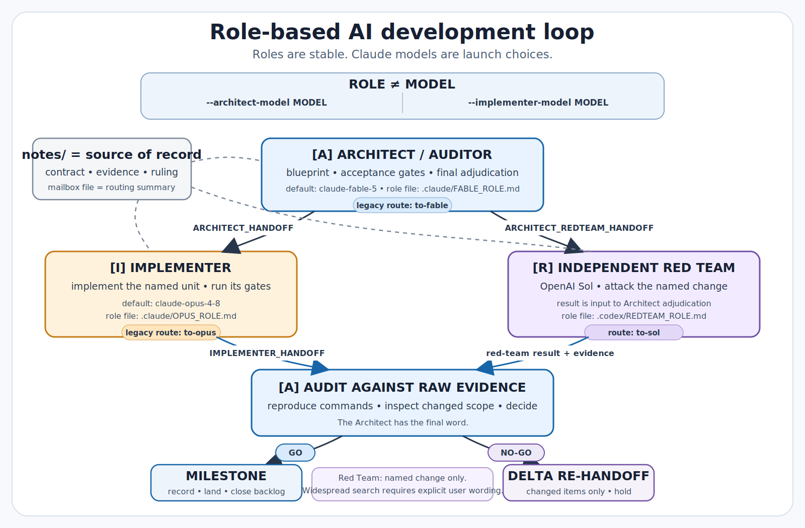
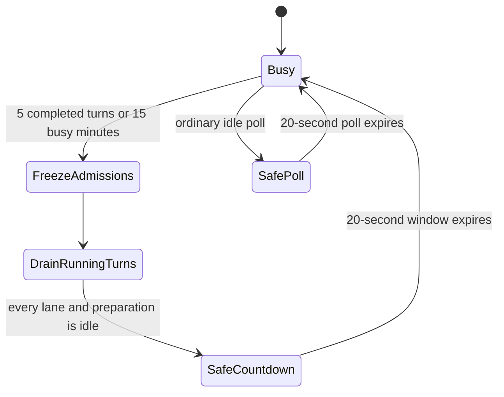
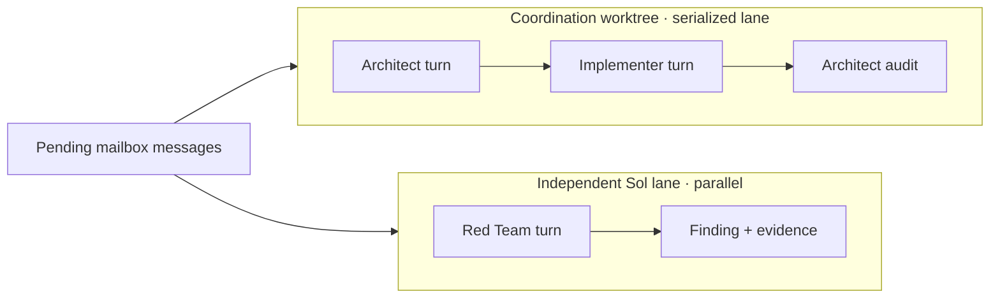

# The role-based AI development loop

This directory documents the development loop: who decides, who implements,
who challenges a change, and how the mailbox carries work between them. The
emulator library itself is documented in the top-level
[`README.md`](../README.md).

Prof. Miranda directs the scientific contracts, model architecture, public
interface, testing requirements, and Python readability conventions.

## Contents

1. [Start here: roles stay stable](#start-here-roles-stay-stable)
2. [Durable records](#durable-records)
3. [From finding to regression](#from-finding-to-regression)
4. [Evidence before approval](#evidence-before-approval)
5. [Mailbox and status tools](#mailbox-and-status-tools)
6. [Command-line options](#command-line-options)
7. [Parallel lanes](#parallel-lanes)
8. [Reproducing the setup](#reproducing-the-setup)

## Start here: roles stay stable

The loop has three permanent jobs. A job is a **role**; the model that fills it
is a launch choice. Changing a Claude model never transfers the role's
authority or changes its mailbox address.



### Role boundaries

| Role | Owns | Runtime binding | Stable route |
| --- | --- | --- | --- |
| **[A] Architect / Auditor** | Blueprint, acceptance gates, evidence audit, final design ruling, and landing | Claude via `--architect-model`; default `claude-fable-5`; `.claude/FABLE_ROLE.md` | `to-fable` |
| **[I] Implementer** | The named implementation unit and its validation output | Claude via `--implementer-model`; default `claude-opus-4-8`; `.claude/OPUS_ROLE.md` | `to-opus` |
| **[R] Independent Red Team** | Adversarial evidence about the named change | OpenAI Sol; `.codex/REDTEAM_ROLE.md` | `to-sol` |

The letters identify roles, not models. The legacy route names remain stable
because existing messages, logs, and tests depend on them.

### Choose Claude models at launch

This watch runs Opus as the Architect and Sonnet as the Implementer:

```bash
python tools/mailbox_daemon.py --watch \
  --architect-model opus \
  --implementer-model sonnet
```

Omit both flags to use the historical Fable-Architect and Opus-Implementer
defaults. Aliases and full Claude model IDs are accepted.

The role files govern behavior whichever model is selected. In particular,
`--architect-model opus` gives Opus the Architect's rules and authority; it
does not turn the Architect into an Implementer.

### Handoffs and decisions

The Architect writes a blueprint and gates to `notes/`, then sends
`ARCHITECT_HANDOFF` to the Implementer and
`ARCHITECT_REDTEAM_HANDOFF` to the Red Team. The Implementer returns an
`IMPLEMENTER_HANDOFF`; the Red Team returns findings and raw evidence.

Only the Architect adjudicates. It records **GO** when the evidence satisfies
the gates and **NO-GO** when a bounded delta must be repaired or held.

The Red Team reviews the named commit or change. It does not expand into a
library-wide attack unless the user explicitly asks, using the words
`Do a widespread search for ...`. A finding is input to the Architect, never a
self-executing ruling.

Using models from two vendors is deliberate. The Red Team does not share the
same weights as the Claude roles whose work it challenges.

> **Demand overload is an explicit exception.** At total open demand 10 or
> higher, Sol can receive build units as a second Implementer. Such a ticket
> must say so explicitly and binds Sol to the Implementer rules and acceptance
> bar. [Parallel lanes](#parallel-lanes) explains the count.

## Durable records

Specifications, findings, verdicts, and repair plans are written under
`notes/` before a mailbox message is sent. The message is a routing summary;
the note is the source of record.

If the two disagree, the note wins. Sessions forget between runs, while the
notes let a later session or a human resume the work.

## From finding to regression

A bug found by the red team follows a fixed path from report to permanent
protection:

1. The finding is filed with the file and line it points to.
2. The architect reproduces the bug independently before any fix is written.
3. The implementer writes the repair within a scope the architect set.
4. The repair ships with a regression test that re-introduces the original
   defect on purpose and shows the check now fails on it. The test proves it
   can catch the bug, rather than merely asserting that it can.
5. The architect re-runs that evidence personally before the change merges.
6. The gates board re-runs every check on every later run, so the protection
   stays live long after everyone has forgotten the original bug.

Two real examples give the shape. A data file written in a units format that
the file parser could not read was caught once a check exercised that parser on
a realistic file. A test that compared the code against a reference was found to
share its numerical integrator with the code under test, so the two agreed for
the wrong reason until the reference was made independent.

## Evidence before approval

Validation gates are run by the machine, not asserted by an agent. The board
(`gates/run_board.py`) and the individual check scripts execute the tests, and
the relay tooling runs them locally and keeps the raw logs. A pass or fail
claim from any session is not accepted without the command output behind it.

## Mailbox and status tools

Two programs provide the loop's status and transport. Both live in `tools/`
and run from a checkout of this repository.

### Status router

The first one answers the question "where does the loop currently stand?". Run
it whenever you are lost:

```bash
python tools/handoff_router.py --status
```

It reads git and the notes, and prints what the main branch and the working
branch each point at, how many commits the working branch is ahead of main,
which review branches are still open and waiting on an audit, the titles of the
most recent audit records in `notes/`, and a numbered list of what to do next.
It changes nothing; it only reports.

### Send and watch

The second one is the mailbox: a directory of message files under
`notes/mailbox/` that the sessions read and write, so that a handoff no longer
depends on a human copying text between windows. Sending a message queues it for
one named session:

```bash
python tools/mailbox_daemon.py --send opus \
  --unit "Add a --version flag to the training script, as described in notes/version-flag.md."
```

Short as that message is, it shows the rule the whole loop rests on: the
message does not carry the work. It is a routing summary that names the notes
entry holding the specification, and the session receiving it opens that entry
first. The message is a pointer; the file under `notes/` is the record.

Leaving the daemon running lets it dispatch each message as it appears:

```bash
python tools/mailbox_daemon.py --watch
```

It polls the mailbox every twenty seconds. For each message it prints the
session it is dispatching to, and then, when that session's turn finishes, the
turn's exit status and the path of the log file that captured the whole run
under `notes/relay/`. A dispatched turn is a child process of this command, so
interrupting the terminal kills the turn that is running.

### Heartbeats and logs

A turn can run for many minutes, and a terminal that says nothing for that long
looks broken. So while a turn is in flight the daemon prints a heartbeat line
once a minute. The path in it is shortened here; the daemon prints it in full.

```
  ... 0046-to-opus.md still running (3 min elapsed, log 12.4 kB; tail -f .../notes/relay/20260714-031840-dispatch-opus.log)
```

The line means the turn is alive and being watched. The elapsed time always
moves, and the log grows whenever the session produces output, so a log that is
getting bigger is a session that is working. The command at the end follows that
log live in another terminal window.

One habit of the tools is worth knowing here: Claude Code prints a turn's
reply only when the turn ends. On an Architect or Implementer dispatch, the log
therefore stays tiny until the finish and the moving clock is the only sign of
life.

The codex CLI narrates its progress as it goes, so a Red Team log grows
steadily throughout.

A heartbeat means only that a turn is alive. It is not permission to stop the
watch. While children are running, a separate status line makes that explicit:

```text
2 turns in flight; not safe to stop.
```

### Safe-stop rendezvous

The watch periodically creates a global safe-stop rendezvous. After five
completed child turns, or after fifteen monotonic minutes of continuously busy
work, whichever happens first, every lane stops releasing new messages. Turns
already running finish normally and undispatched files remain in the mailbox.
Only when every lane and every pre-launch dispatch preparation is idle does the
main watch thread print twenty lines, one per second, counting from 19 to 0:

```text
all lanes idle; safe to Ctrl-C for 19s more; 3 messages waiting.
```

The waiting count is read again for every line, so a message arriving during
the window is shown but cannot launch until the countdown ends. If there was no
work to dispatch, the ordinary twenty-second poll delay is already safe and is
marked without adding another countdown. That line states its own duration:

```text
all lanes idle; safe to Ctrl-C for this 20s poll; no messages waiting.
```



At the end of either kind of safe interval, the main thread flushes the exact
`safe interval ended; not safe to stop.` status before it releases any
dispatch preparation. Each admitted preparation then flushes the exact
`dispatch preparation admitted; not safe to stop.` status before it can claim
a root message. This prevents an expired all-clear from remaining the
terminal's last visible state during the claim-to-launch gap.

Thus the signals answer different questions: the heartbeat says the turn is
alive, the unsafe lines say do not stop, and only an all-lanes-idle line says
stopping is safe. The cadence and countdown live in the named
`RENDEZVOUS_DISPATCH_INTERVAL`, `RENDEZVOUS_MINUTE_INTERVAL`, and
`SAFE_KILL_COUNTDOWN_SECONDS` constants in `tools/mailbox_daemon.py`. They
apply only to `--watch`; finite `--once` and `--dry-run` runs never pause for a
rendezvous.

### Dispatch currency

Every live turn also receives a dispatch-currency banner ahead of the ordinary
prompt. Immediately after atomically claiming the message, the daemon takes one
snapshot of every numbered markdown message anywhere under the mailbox. The
banner names the largest sequence in that store and the number of newer root
messages queued in the same working-directory lane.

The legacy fable/opus routes share that lane; Sol has its own. The counts are a
mechanical hint, not a verdict that the message is stale or superseded.

The receiving turn still reads the mailbox and the cited notes first. A
message body may have been accurate when written, so dispatch-time evidence
lives in the banner rather than rewriting the body.

### Transport ping

To test the transport by itself, without handing anyone real work:

```bash
python tools/mailbox_daemon.py --ping opus
```

The pinged session answers with a reply file addressed back to you, which the
daemon deliberately leaves in place instead of dispatching onward, so a
transport check cannot start a chain of turns.

## Command-line options

The daemon carries its own manual. Run:

```bash
python tools/mailbox_daemon.py --help
```

The live help is authoritative if this document ever drifts. Its exact tested
transcript is kept below for offline reference.

<details>
<summary>Exact current <code>--help</code> transcript</summary>


```
usage: mailbox_daemon.py [-h] [--dry-run] [--once] [--watch]
                         [--fix-only value] [--send AGENT] [--ping AGENT]
                         [--unit UNIT] [--ticket-kind {closure,discovery}]
                         [--architect-model MODEL] [--implementer-model MODEL]
                         [--fable-effort {low,medium,high,xhigh,max}]
                         [--opus-effort {low,medium,high,xhigh,max}]
                         [--sol-effort {none,low,medium,high,xhigh}]
                         [--dispatch-timeout MINUTES]
                         [--claude-context TOKENS] [--sol-context TOKENS]

file mailbox + headless dispatch for the agent loop

options:
  -h, --help            show this help message and exit
  --dry-run             show what would happen and change nothing: pending
                        dispatches are printed, not run, and --send/--ping
                        print the message file they would queue without
                        writing it
  --once                process the current backlog and exit
  --watch               poll the mailbox every 20 seconds
  --fix-only value      with --watch, close existing ledger work only; the
                        value accepts 1, true, or yes in any capitalization
  --send AGENT          queue a message to this agent and exit
  --ping AGENT          queue a transport-confirmation ping to this agent (its
                        reply lands as a -to-user.md file the daemon never
                        dispatches)
  --unit UNIT           the message text for --send (a routing summary
                        pointing at notes/)
  --ticket-kind {closure,discovery}
                        required with --send sol: declare whether the unit
                        closes existing work or seeks new findings
  --architect-model MODEL
                        Claude model alias or full name for the Architect
                        route (legacy fable address; default: claude-fable-5)
  --implementer-model MODEL
                        Claude model alias or full name for the Implementer
                        route (legacy opus address; default: claude-opus-4-8)
  --fable-effort {low,medium,high,xhigh,max}
                        claude CLI reasoning effort for the Architect route
                        (legacy fable address; default: xhigh)
  --opus-effort {low,medium,high,xhigh,max}
                        claude CLI reasoning effort for the Implementer route
                        (legacy opus address; default: max)
  --sol-effort {none,low,medium,high,xhigh}
                        codex CLI reasoning effort for Sol dispatches
                        (default: xhigh)
  --dispatch-timeout MINUTES
                        kill a dispatched turn that runs past this many
                        minutes and park its message in failed/ (default: 60)
  --claude-context TOKENS
                        Architect and Implementer Claude turns compact their
                        context whenever it reaches this many tokens (default:
                        500000)
  --sol-context TOKENS  Sol turns compact their context whenever it reaches
                        this many tokens (default: 500000)
```

</details>

The options fall into two groups. The first group chooses what the daemon does
on this run. The second group tunes how the agents it starts are allowed to
behave.

### Actions

These eight options choose or qualify an action. Each one is described at
length elsewhere in this document, so the table below is only a reminder of
which is which.

| Option | What it does |
| ------ | ------------ |
| `--dry-run` | Prints what would happen and changes nothing on disk. Pending dispatches are shown instead of run, and `--send` or `--ping` print the message file they would write instead of writing it. |
| `--once` | Processes whatever is sitting in the mailbox right now, then exits. |
| `--watch` | Stays alive and looks in the mailbox every 20 seconds, dispatching anything new. This is the mode the loop runs in. |
| `--fix-only value` | Works only with `--watch`. Values `1`, `true`, and `yes`, in any capitalization and with surrounding whitespace ignored, make the watch close existing ledger lines only. Any other supplied value is rejected instead of silently disabling the safety mode. |
| `--send AGENT` | Writes one new message addressed to `fable`, `opus` or `sol`, then exits. The text of the message comes from `--unit`, which is required with `--send`. A Sol unit also requires `--ticket-kind`. The command warns when no live `--watch` loop is polling this checkout's mailbox. |
| `--ping AGENT` | Writes a transport test message to `fable`, `opus` or `sol`. The agent answers with a short file addressed to the human, which confirms the delivery path works without assigning any real work. It uses the same dead-mailbox warning as `--send`. |
| `--unit UNIT` | The body of the message that `--send` queues, normally a short routing summary that points the agent at a note under `notes/`. |
| `--ticket-kind {closure,discovery}` | Required for `--send sol`. A closure retires existing ledger work; discovery seeks new findings. The daemon persists this exact declaration as the message's first line and never guesses it from prose. |

`--once`, `--watch`, `--send`, and `--ping` are mutually exclusive primary
actions. Supplying more than one is an error instead of silently choosing one
by precedence. `--dry-run` remains a modifier for the finite actions.

### Sol ticket classes and fix-only watches

Every Sol unit has a mechanical class. Use `closure` only when the unit works
an existing `- OPEN` line in `notes/backlog.md`; use `discovery` when its
product is a new review finding, sweep result, or probe. For example:

```bash
python tools/mailbox_daemon.py --send sol --ticket-kind closure \
  --unit "Close the existing manifest item described in notes/backlog.md."
```

The queued file begins with the exact line `MAILBOX-TICKET: closure` (or
`MAILBOX-TICKET: discovery`). A missing, misspelled, indented, or later header
is not inferred from the message body and is refused before Sol launches. The
daemon's exact no-work `--ping sol` payload uses the reserved internal line
`MAILBOX-TICKET: transport`; the public `--ticket-kind` option cannot select
it, and a hand-written or altered transport body fails closed.

When queued messages plus open ledger lines already total ten or more before
the candidate is added,
`--send sol --ticket-kind discovery` fails without queueing a file. Its error
tells the coordinator to append the deferred ticket to the end of
`notes/backlog.md` and wait until demand is below the threshold. The daemon
does not edit the ledger itself.

A closure remains dispatchable because it reduces work already owed. Dispatch
rechecks all other current demand but does not count the already-published
candidate against itself. Demand nine can admit the tenth item; demand ten
refuses another discovery.

Starting `--watch --fix-only Yes` makes the whole watch closing-only,
regardless of demand. Its child turns receive a binding banner and environment
marker. The watch also holds an exact per-mailbox `.fix-only.lock`, so a
separate terminal's Sol send sees the active mode and refuses discovery before
writing anything.

The persisted class is checked again before launch. Hand-written or already
queued discoveries cannot bypass the rule; invalid pending Sol messages are
parked in `failed/`. Only declared closures and the exact no-work transport
ping launch.

Omit `--fix-only` for ordinary operation. It is rejected with `--once`,
`--send`, `--ping`, or a dry run. The kernel releases both held locks if the
watch crashes; an unlocked stale mode file does not activate fix-only mode.

### The dead-mailbox warning

Every checkout has its own `notes/mailbox` directory. A message sent from the
main checkout therefore does not reach a watch loop running in a Claude
worktree: the file can be valid and completely published while no process ever
polls the directory that contains it.

After `--send` or `--ping` publishes a
message (or prints the file a dry run would queue), the daemon checks the
current mailbox's existing `.dispatch.lock`. If no live `--watch` process
holds that lock, it prints a warning that names the current mailbox. It also
lists, in sorted order, every other mailbox with a live watcher in the main
checkout or under `.claude/worktrees/`, which makes it clear where the active
loop actually is.

The daemon does not reroute the message. The warning is
advisory, and a real send still publishes atomically to the mailbox selected by
the checkout where the command ran.

A held lock is not enough by itself. Dispatch locks identify their mode as
`watch pid N` or `once pid N`, and only an exact, currently held `watch pid N`
tag proves that a process is polling.

An unlocked stale file, the transient
lock held by `--once`, a legacy bare PID, malformed text, or a symlink is not
accepted as a watcher. Diagnosis opens existing regular lock files read-only,
without following symlinks, and probes them nonblocking; it never creates or
rewrites a lock. This is why `--dry-run --send ...` and `--dry-run --ping ...`
can print the same warning while preserving the dry-run guarantee of zero
filesystem writes.

### Runtime controls

The remaining eight options do not change what the daemon does. They change
the terms under which each dispatched agent runs, and they are the ones worth
understanding before you launch a long watch.

#### Claude models

`--architect-model MODEL` and `--implementer-model MODEL` choose the two
Claude models by job. The value is passed as one argument to Claude Code's
`--model` option and may be an alias such as `fable`, `opus`, or `sonnet`, or a
full model name.

Empty values, whitespace, and NUL are refused before a message can be claimed.
Defaults remain `claude-fable-5` for the Architect and `claude-opus-4-8` for
the Implementer.

The stable `to-fable` and `to-opus` addresses still mean Architect and
Implementer when the selected models are Opus and Sonnet.

#### Reasoning effort

`--fable-effort` and `--opus-effort` are compatibility names for the effort of
the Architect and Implementer routes. They set how hard each Claude turn is
told to think. Both options accept `low`, `medium`, `high`, `xhigh`, and
`max`. The Architect route defaults to `xhigh` and the Implementer route to
`max`, regardless of which model each route launches.

A higher level buys more deliberation but costs more tokens and wall-clock
time. Lower these first when a run is more expensive than its work deserves.

`--sol-effort` is the same dial for Sol, which runs on the codex command line
program rather than on the claude one. Because that is a different program with
a different model behind it, its legal values are its own: `none`, `low`,
`medium`, `high` and `xhigh`. The default is `xhigh`. Handing it a level from
the Claude list, such as `max`, is rejected on the spot, before anything is
dispatched.

#### Timeout and archive truth

`--dispatch-timeout MINUTES` is a safety net, and it defaults to 60 minutes. A
dispatched turn normally finishes on its own, but a command line program can
also hang: it prints nothing further and never exits, and for as long as it
hangs it holds its lane.

Past the timeout, the daemon kills the turn and moves its message to
`failed/`. Moving that file back to the mailbox queues it again.

The default is deliberately generous. Raise it for genuinely long work or
lower it to free a stuck lane sooner. The value must be a positive integer;
invalid thresholds are rejected before mailbox mutation.

A timeout also appends an atomic sidecar under
`notes/mailbox/.dispatch-history/<message-basename>.json`. That history is
timeout-only: a command that exits with status 1 does not create it.

When a failed message is requeued, its next banner says exactly, `this
dispatch previously ran for N minutes and was killed`. The sidecar survives
the move through `failed/`, so a killed turn cannot look like a fresh delivery.

The daemon replaces the sidecar atomically. If the record cannot be secured,
the message stays in `inflight/` instead of becoming a marker-free retry.

A clean child exit is not enough by itself to consume a message. The daemon
moves the claimed file into `done/`, then verifies both that the done archive is
a regular file holding the exact same device-and-inode identity as the claimed
source and that the inflight source path is gone. Only then does the dispatch
report success.

An ambiguous archive stops later work in that lane, and `--once` exits nonzero.
The stop persists across watch passes: exact agent messages under `inflight/`
hold every pending recipient that shares their working directory.

An unresolved Architect turn therefore holds the Implementer route, while the
independent Sol lane may continue. The diagnostic names the blocker and the
number of waiting messages.

Resolving the blocker deliberately reopens the lane. Draining another lane
does not hide it, and an inflight message still makes `--once` fail when the
root queue is otherwise empty.

`--dry-run` takes none of these state transitions: it does not claim a message,
snapshot dispatch currency, create timeout history, or create relay, inflight,
failed, or done state.

#### Context budgets

`--claude-context TOKENS` and `--sol-context TOKENS` are the context budgets,
and both default to 500000 tokens. Context includes the message, files read,
command output, and conversation held by a live turn.

At the budget, the session **compacts**: it summarizes the turn so far,
discards the long original context, and continues from the smaller summary.
Context then grows again and may compact repeatedly.

The dial therefore bounds live context even during a long turn.

The two command-line programs receive the same instruction differently. Claude
Code reads `CLAUDE_CODE_AUTO_COMPACT_WINDOW`, so `--claude-context` governs
both the Architect and Implementer.

Sol's codex CLI instead receives
`-c model_auto_compact_token_limit=<tokens>` from `--sol-context` when it
builds the command line. One setting has no effect on the other; pass both to
change the budget everywhere.

## Parallel lanes

### Terms

| Term | Meaning |
| --- | --- |
| **Turn** | One session processes one message and writes its reply. |
| **Dispatch** | The daemon hands a message to its addressed role and starts that turn. |
| **Lane** | A working-directory queue whose turns must run one after another. |

The daemon drains different lanes concurrently. Within one lane, filenames set
strict sequence order; the next turn waits for the previous one to finish.



### A lane is a working directory

The reason is git. Two sessions committing at the same time inside one working
tree share a single staged index, so they race each other: one session can
sweep the other's unfinished edit into its own commit.

Sessions sharing a worktree must take turns. Sessions in separate directories
can run side by side.

The Architect and Implementer share the coordination checkout, so they are one
serialized lane. The Red Team runs from a different directory in parallel.

### Dispatch ahead

The Architect is the serial coordinator: it writes specifications, audits raw
evidence, and lands accepted units.

Waiting after every send would idle that coordinator. Instead, it queues units
across the available lanes, then audits completed work while other turns run.

The Implementer drains its ordered track. The Red Team challenges work on the
other track. The Architect uses the gaps to adjudicate returned evidence.

### Demand threshold

Dispatching ahead has a limit, and the limit is the implementer lane. That lane
runs its units one after another, so a long queue there is time the loop spends
waiting rather than building.

The daemon therefore watches *total open demand*, not just Implementer
messages. The count is every queued mailbox message plus every `- OPEN` unit in
`notes/backlog.md`.

Unassigned work is still owed work, so it belongs in the count.

The daemon prints this report on every pass that finds work, and again every
time a message is queued with `--send`, so the person adding a unit always sees
the load they are adding to. Queueing one for the implementer prints three
lines:

```
queued .../notes/mailbox/0046-to-opus.md
queue depth: opus=2 sol=2 fable=0 | open backlog (notes/backlog.md): 22 | total demand: 26
  hint: total open demand is at or past 10 units; the red team is now the second implementer: build units flow to it as well as to the primary Implementer route (.claude/FABLE_ROLE.md, Second-Implementer assignments).
```

Read it one piece at a time. The mailbox path is shortened above; the daemon
prints it in full.

| Piece of the report | What it is telling you |
| ------------------- | ---------------------- |
| `queued .../0046-to-opus.md` | The message file was written, and this is where it went. The leading number is its place in the sequence, and the name after `to-` is the session it is addressed to. |
| `queue depth: opus=2 sol=2 fable=0` | How many messages are waiting for each session right now: two for the implementer, two for the red team, none for the architect. |
| `open backlog (notes/backlog.md): 22` | How many unfinished jobs the ledger records, counted as the lines that begin `- OPEN`. These are owed, but they have not been sent to anyone yet. |
| `total demand: 26` | The two numbers added together, here four queued messages plus twenty-two open jobs. This is the number the tripwire watches. |
| the `hint:` line | It appears only when that total reaches ten, and it names what changes when it does. |

Ten is the threshold, and it is set in one place, `SECOND_IMPLEMENTER_THRESHOLD`
in `tools/mailbox_daemon.py`. At or above it, one build track is not enough, so
the Architect may send explicit second-Implementer units to Sol.

For those units, Sol follows the Implementer rules and acceptance bar rather
than the Red Team rules. The assignment must say so plainly.

The printed demand number never switches a role by itself.

### Concurrency example

Queueing two units for two different lanes and then starting the daemon looks
like this:

```bash
python tools/mailbox_daemon.py --send opus \
  --unit "Add a --version flag to the training script, as described in notes/version-flag.md."
python tools/mailbox_daemon.py --send sol --ticket-kind discovery \
  --unit "Try to break the new --version flag, as described in notes/version-flag-attack.md."
python tools/mailbox_daemon.py --watch
```

The first two commands only queue a file each and exit; the third one starts
dispatching. The two messages are addressed to sessions that work in different
directories, so they land in different lanes, and the daemon starts both turns
at once:

```
dispatching 0033-to-opus.md -> opus ...
dispatching 0034-to-sol.md -> sol ...
```

Both lines print back to back, before either turn has produced a result. That
is the visible signature of concurrency: each turn's exit status and log path
arrive later, whenever that turn finishes. Had both messages been addressed to
the same lane, the second `dispatching` line would not have appeared until the
first turn had finished and printed its `rc=` line.

## Reproducing the setup

Standing the same loop up on a different machine needs a clone of this
repository, the two vendors' command line programs installed and logged in, and
exactly one edit to a file. This section is that recipe, start to finish.

### Interactive-session worktrees

A *worktree* is a second working directory
checked out from the same repository, on its own branch, holding its own copy of
every file. Git maintains as many as you ask for, all sharing one repository
underneath, so a worktree is not a second clone and costs almost nothing.

Use a dedicated worktree for independently launched interactive writers.
Concurrent writers that share a tree share its staged index and can sweep up
each other's edits.

The daemon's Architect and Implementer are the deliberate exception: both run
in the coordination worktree, but the daemon serializes them in one lane. They
therefore never write there concurrently.

A Claude Code session creates its own worktree when asked, so on a fresh clone
you ask it, in the first message of the session. This is the sentence to type,
into the architect session and into the implementer session alike:

```
Create and work from your own git worktree for this task.
```

The session makes the worktree under `.claude/worktrees/<generated-name>` and
works there for the rest of its life. The red team runs on the codex CLI, which
is asked for the same thing in its own terms, naming the branch prefix that
marks red team work in this repository:

```
Create your own git worktree, on a branch named codex/<topic>, and work from it.
```

### The coordination worktree

One worktree does double duty: it is the one
whose `notes/mailbox` directory the daemon watches, and this document calls it
the coordination worktree.

You never tell the daemon which worktree that is. Every path it uses, meaning
the mailbox it polls, the `notes/relay/` directory it writes its logs into, and
the working directory it starts each dispatched session in, is derived from the
location of the daemon's own file, which sits at
`<worktree>/tools/mailbox_daemon.py`. The copy you launch is the copy that
decides. So the worktree you launch the watch from *is* the coordination
worktree:

```bash
cd /path/to/emulators_code_v2/.claude/worktrees/<coordination-worktree>
python tools/mailbox_daemon.py --watch
```

Before starting a watch on a new machine, it is worth checking that those
derived paths came out where you expect. The following prints each pending
message, the command it would run, and the working directory that session would
start in, and it runs nothing:

```bash
python tools/mailbox_daemon.py --dry-run
```

Two of the three sessions are started by the daemon inside the coordination
worktree: the architect and the implementer. That is precisely why they share a
lane and take turns, as the previous section described. The red team is
started from the repository root instead, which puts it in a lane of its own and
lets it run alongside them.

### Why the launch directory matters

A running program keeps executing the code
it loaded when it started. A repair to the daemon therefore has no effect on a
watch that is already running, which would go on dispatching with the old code
until a human noticed. To close that hole, the daemon checks the timestamp of
its own file on every poll and exits when it changes, printing a line asking you
to relaunch it.

Launching the watch from the coordination worktree is what arms that check,
because the coordination worktree is where repairs to the daemon are written and
committed. The moment a fix lands there, the running watch retires itself, and
the next start picks the fix up. Launch the watch from a tree where the daemon
is never edited and it will never notice that a fix exists.

### Configure executable paths

The daemon cannot derive where each vendor installed
its command line program, so those commands are written out in a single block,
`build_agent_commands()` in `tools/mailbox_daemon.py`. This is the block it
returns, exactly as it ships:

<details>
<summary>Exact shipped <code>build_agent_commands()</code> block</summary>

```python
    architect_model = validate_model_name(value=architect_model)
    implementer_model = validate_model_name(value=implementer_model)
    commands = {
        # Absolute path: the user's conda shells resolve an OLDER claude
        # binary with a separate (logged-out) credential store; this one
        # is the logged-in v2.1.208 install (diagnosed 2026-07-14).
        "fable": ["/Users/vivianmiranda/.local/bin/claude", "-p",
                  "--model", architect_model,
                  "--effort", fable_effort,
                  "--permission-mode", "acceptEdits"],
        "opus": ["/Users/vivianmiranda/.local/bin/claude", "-p",
                 "--model", implementer_model,
                 "--effort", opus_effort,
                 "--permission-mode", "acceptEdits"],
        # Verified by the red team's read-only probe (codex-cli 0.144.2;
        # the conventions note records the probe): workspace-write sandbox
        # rooted at the repo, which contains every worktree Sol works in.
        # service_tier=standard keeps codex Fast Mode OFF for dispatched
        # turns (USER 2026-07-14): the standard tier is slower in
        # wall-clock time but far cheaper against the token quota, and an
        # unattended mailbox turn never needs the speed. Pinned here
        # because the user's global ~/.codex/config.toml says "priority"
        # -- a dispatch must not inherit that default.
        "sol": ["/Applications/ChatGPT.app/Contents/Resources/codex",
                "exec",
                "--model", "gpt-5.6-sol",
                "-c", "model_reasoning_effort=" + sol_effort,
                "-c", "service_tier=standard",
                "-c", ("model_auto_compact_token_limit="
                       + str(sol_context_budget)),
                "--sandbox", "workspace-write",
                "--cd", REPO_ROOT],
    }
```

</details>

Each entry is one session's headless command: the program to run, the model it
runs, how hard that model is told to think, the point at which a long turn
summarizes itself, and the permissions the turn is granted.

On a new computer, replace only the two program paths. `which claude` and
`which codex` print the installed paths. Everything else is design rather than
machine configuration and stays unchanged.

`REPO_ROOT` is derived from the daemon's location like everything else, so it
needs no attention. `architect_model` and `implementer_model` carry the two
role-based launch choices. The names `fable_effort` and `opus_effort` remain
compatibility route controls; `sol_effort` and `sol_context_budget` carry the
red-team settings described above.

### Effort defaults

Both command line programs let the caller
choose how much reasoning a turn may spend before it answers, and both apply a
default when nobody chooses. The daemon never takes the vendor's default. Every
turn it launches carries an effort level chosen for that session, so how hard a
turn thinks is a property of this repository and cannot drift under the loop
when a vendor changes what its own default means.

| Session | Effort it is dispatched at | Written as |
| ------- | -------------------------- | ---------- |
| Architect route (legacy fable address) | High, one step below the top of the scale | `--effort xhigh` |
| Implementer route (legacy opus address) | The top tier the claude CLI offers | `--effort max` |
| Red team (Sol) | The top reasoning tier the codex CLI offers | `-c model_reasoning_effort=xhigh` |

Those three levels are the defaults, which is what a watch launched with no
effort flags runs at. [Command-line options](#command-line-options)
gives the flags that override them for a single launch, `--fable-effort`,
`--opus-effort` and `--sol-effort`, and the legal values each one takes.

The spelling differs because these are two different vendors' programs. Claude
Code takes a named flag, `--effort`, and accepts the level as its value. The
codex CLI has no such flag. It takes settings as `-c key=value` pairs instead,
each one overriding its configuration file for that single run, which is why the
red team's level is written as a setting rather than as a flag.

The red team's command pins one more setting the same way, `-c
service_tier=standard`, which keeps the codex Fast Mode off for dispatched
turns.

Fast Mode answers sooner but spends far more of the token quota. An unattended
turn can use the cheaper standard tier and take longer.

The command pins this because the local `~/.codex/config.toml` requests the
faster tier; a dispatched turn must not inherit that preference.

### Bootstrap checklist

End to end, on a machine that has never seen this
repository:

1. Clone the repository.
2. Install both command line programs and log each of them in: Claude Code,
   which runs the architect and the implementer, and the codex CLI, which runs
   the red team.
3. Choose the two Claude role models. The historical defaults are Fable as the
   Architect and Opus as the Implementer; a cost-oriented launch can instead
   select Opus and Sonnet. Open the codex CLI as the red team.
4. Ask each session, in its opening message, to create and work from its own git
   worktree, using the sentences given above.
5. Pick one of the two Claude worktrees to be the coordination worktree. Any of
   them will do, provided it is the one where the daemon itself gets repaired.
6. In that worktree, edit the two program paths in `build_agent_commands()` in
   `tools/mailbox_daemon.py` so they match this computer. This is the only edit
   the move requires.
7. From that worktree, run `python tools/mailbox_daemon.py --dry-run` and read
   the working directories it reports back. They should all be inside the clone
   you just made.
8. Start the loop: queue the first unit with `--send`, then leave
   `python tools/mailbox_daemon.py --watch` running in that terminal. Add
   `--architect-model opus --implementer-model sonnet` (or any other Claude
   aliases/full IDs) when those are the role choices for this watch.
